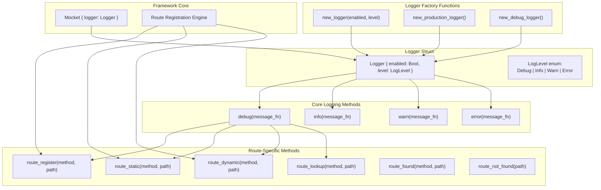
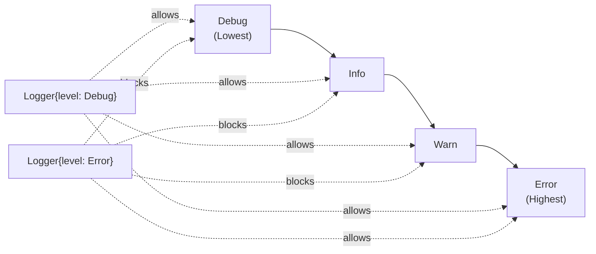
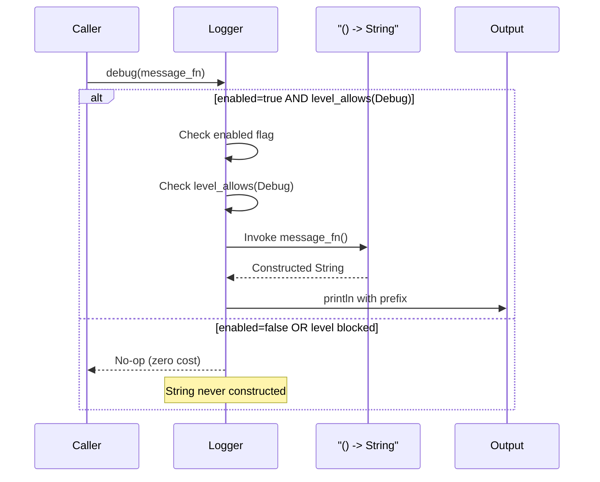
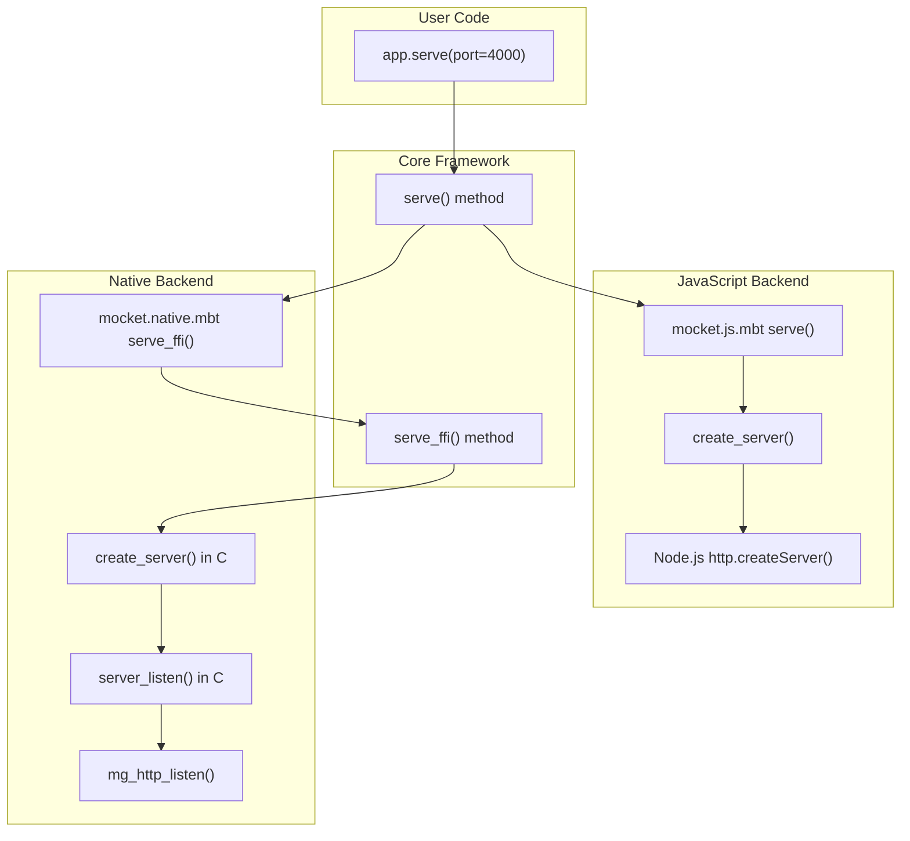
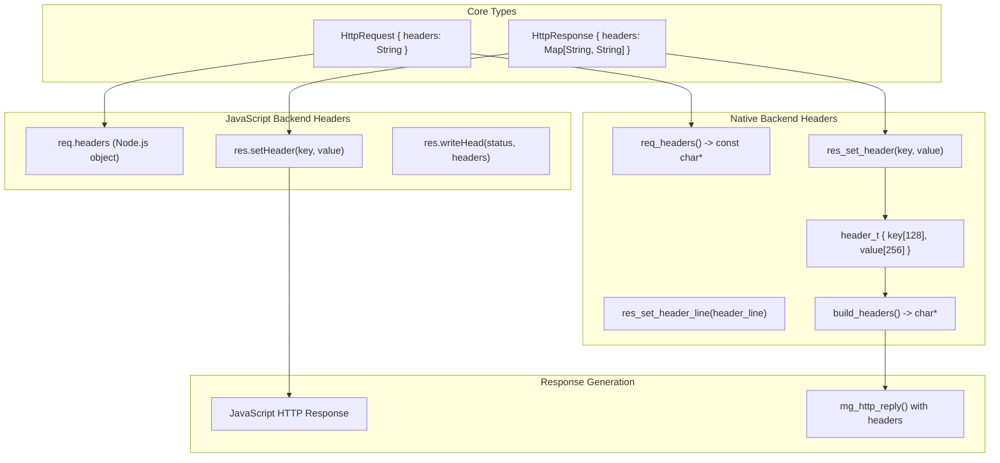

# Advanced Features

This document covers advanced functionality in the Mocket framework beyond basic routing and request handling. The features described here enable production-grade applications with sophisticated logging, server configuration, and header manipulation capabilities.

For information about basic routing concepts, see [Routing System](#2.1). For middleware patterns, see [Middleware System](#2.2). For request/response fundamentals, see [Request and Response Handling](#2.3).

---

## Purpose and Scope

The Advanced Features section covers three primary areas that distinguish production applications from simple examples:

1. **Logging System**: Zero-cost abstraction logging with multiple levels and route-specific observability
2. **Server Configuration**: Backend-specific server initialization and port binding strategies
3. **Header Manipulation**: Cross-backend header reading and writing with platform-specific implementations

These features operate across all backend implementations (JavaScript, Native, WASM stub) while maintaining the framework's backend-agnostic design principles.

Sources: [src/logger.mbt:1-148](), [src/mocket.stub.c:1-354](), [README.md:1-219]()

---

## Logging Architecture Overview



**Diagram: Logger System Architecture and Integration Points**

The logging system provides zero-cost abstractions through lazy evaluation and compile-time optimization. The `Logger` struct at [src/logger.mbt:3-6]() controls both runtime enablement and minimum log level filtering.

Sources: [src/logger.mbt:1-148](), [README.md:114](), [src/example/main.mbt:3]()

---

## Logger Initialization and Configuration

### Factory Functions

The framework provides three logger factory functions optimized for different use cases:

| Function | Purpose | Enabled | Level | Use Case |
|----------|---------|---------|-------|----------|
| `new_logger(enabled?, level?)` | General purpose | Configurable (default: true) | Configurable (default: Debug) | Custom configurations |
| `new_production_logger()` | Production deployment | `false` | `Error` | Zero-overhead production builds |
| `new_debug_logger()` | Development | `true` | `Debug` | Full observability during development |

The production logger at [src/logger.mbt:24-26]() is designed for compile-time optimization: when `enabled: false`, all logging calls become no-ops that the compiler can eliminate entirely.

**Example Usage**:

```moonbit
let app = @mocket.new(logger=@mocket.new_production_logger())
```

From [src/example/main.mbt:3]()

Sources: [src/logger.mbt:18-32](), [src/example/main.mbt:3](), [README.md:114]()

---

## Log Levels and Filtering

### LogLevel Enum

The `LogLevel` enum at [src/logger.mbt:9-14]() defines four severity levels with hierarchical filtering:



**Diagram: Log Level Hierarchy and Filtering Behavior**

The filtering logic at [src/logger.mbt:72-80]() implements hierarchical allowing: a `Debug` level logger allows all messages, while an `Error` level logger only allows error messages.

Sources: [src/logger.mbt:9-14](), [src/logger.mbt:72-80]()

---

## Zero-Cost Logging with Lazy Evaluation

### Core Logging Methods

The framework provides four primary logging methods with zero-cost abstractions:



**Diagram: Lazy Evaluation Flow in Logging Methods**

Each logging method at [src/logger.mbt:36-61]() accepts a function `() -> String` instead of a direct string. This enables lazy evaluation: the expensive string construction only occurs if logging is enabled and the level filter passes.

**Method Signatures**:

- `debug(self: Logger, message_fn: () -> String)`
- `info(self: Logger, message_fn: () -> String)` 
- `warn(self: Logger, message_fn: () -> String)`
- `error(self: Logger, message_fn: () -> String)`

**Convenience Method**: The `debug_str(self: Logger, message: String)` method at [src/logger.mbt:65-69]() accepts a string directly but incurs the construction cost regardless of logging state.

Sources: [src/logger.mbt:36-69](), [src/logger.mbt:34-35]()

---

## Route-Specific Logging Methods

The logger provides specialized methods for route lifecycle observability:

| Method | Purpose | Typical Call Site |
|--------|---------|------------------|
| `route_register(method, path)` | Log route registration | Route registration APIs (`get`, `post`, etc.) |
| `route_static(method, path)` | Log static route optimization | Static route cache insertion |
| `route_dynamic(method, path)` | Log dynamic route pattern | Dynamic route array addition |
| `route_lookup(method, path)` | Log route search start | `find_route()` entry |
| `route_found(method, path)` | Log successful match | Static or dynamic route hit |
| `route_not_found(path)` | Log 404 situation | Route lookup failure |

All route-specific methods at [src/logger.mbt:84-147]() use lazy evaluation and are automatically filtered based on the logger's configuration.

**Example Output with Debug Logger**:

```
🔧 [DEBUG] Registering route: GET /api/users
📌 [DEBUG] Static route: GET /api/users
🔍 [DEBUG] Looking for route: GET /api/users
✅ [DEBUG] Found static route match!
📝 [DEBUG] Request: GET /api/users
```

Sources: [src/logger.mbt:84-147]()

---

## Server Configuration and Initialization

### Backend-Specific Server Creation



**Diagram: Backend-Specific Server Initialization Paths**

The `serve()` method provides a unified interface that delegates to backend-specific implementations. The port binding and event loop initialization differ significantly between JavaScript and Native backends.

Sources: [src/mocket.stub.c:259-285](), [README.md:22-36](), [src/example/main.mbt:83]()

---

## Server Configuration Parameters

### Port Binding

The `serve()` method accepts a single configuration parameter:

**Signature**: `serve(self: Mocket, ~port: Int) -> Unit`

**Default Port**: While not explicitly defined in a constant, the example applications at [src/example/main.mbt:83]() and [README.md:189]() consistently use port `4000`.

**Usage**:
```moonbit
app.serve(port=4000)
```

### Backend-Specific Details

#### JavaScript Backend
- Uses Node.js `http.createServer()` API
- Supports asynchronous request handling via Promises
- Event-driven architecture with non-blocking I/O

#### Native Backend
The C implementation at [src/mocket.stub.c:259-285]() follows this initialization sequence:

1. **Server Creation** ([src/mocket.stub.c:260-267]()):
   - Allocates `server_t` struct
   - Initializes Mongoose manager with `mg_mgr_init()`
   - Disables Mongoose logging with `mg_log_set(MG_LL_NONE)`
   - Stores handler callback

2. **Listening** ([src/mocket.stub.c:270-285]()):
   - Constructs URL string: `"http://0.0.0.0:{port}"`
   - Calls `mg_http_listen()` with event handler
   - Enters infinite event loop with `mg_mgr_poll()`

The polling interval is fixed at 1000ms at [src/mocket.stub.c:283]().

Sources: [src/mocket.stub.c:259-285](), [src/example/main.mbt:83](), [README.md:189]()

---

## Header Manipulation

### Cross-Backend Header Interface



**Diagram: Header Manipulation Across Backend Implementations**

Headers are accessed and manipulated differently in each backend but converge to a unified interface through the core `HttpRequest` and `HttpResponse` types.

Sources: [src/mocket.stub.c:6-10](), [src/mocket.stub.c:44-94](), [src/mocket.stub.c:126-147]()

---

## Reading Request Headers

### JavaScript Backend

Request headers are accessed through the Node.js request object's `headers` property. The framework wraps this in the `HttpRequest` type.

### Native Backend

The native implementation at [src/mocket.stub.c:126-147]() extracts headers from the Mongoose `mg_http_message` structure:

**Implementation Details**:
- Uses `mg_http_get_header()` to extract specific headers
- Currently extracts `Content-Type` as an example
- Constructs a newline-delimited string representation
- Buffer limited to 1024 bytes at [src/mocket.stub.c:131]()

**Function Signature**: `const char* req_headers(request_t* req)`

The implementation demonstrates the pattern but could be extended to extract additional headers by calling `mg_http_get_header()` with different header names.

Sources: [src/mocket.stub.c:126-147]()

---

## Setting Response Headers

### Native Backend Header Management

The native backend uses a `header_t` struct array to accumulate headers before sending:

**Header Storage Structure** ([src/mocket.stub.c:6-10]()):
```c
typedef struct {
  char key[128];
  char value[256];
} header_t;
```

**Maximum Headers**: Limited to 32 headers per response (`MAX_HEADERS` at [src/mocket.stub.c:12]())

**Response Structure** ([src/mocket.stub.c:36-42]()):
```c
struct response {
  struct mg_connection *c;
  int status;
  header_t headers[MAX_HEADERS];
  int header_count;
}
```

### Header Setting Methods

#### Method 1: Direct Key-Value Setting

**Function**: `res_set_header(response_t* res, const char* key, const char* value)`

Implementation at [src/mocket.stub.c:45-53]():
- Appends header to `headers` array
- Checks `header_count < MAX_HEADERS`
- Uses `snprintf` for safe string copying
- Truncates if key/value exceeds buffer sizes

#### Method 2: Header Line Parsing

**Function**: `res_set_header_line(response_t* res, const char* header_line)`

Implementation at [src/mocket.stub.c:169-200]():
- Accepts `"Key: Value"` format strings
- Parses by locating `:` character
- Skips whitespace after colon
- Delegates to array storage

### Header Serialization

The `build_headers()` function at [src/mocket.stub.c:62-72]() serializes the header array into HTTP header format:

**Process**:
1. Iterates through `headers[0..header_count-1]`
2. Concatenates each as `"{key}: {value}\r\n"`
3. Produces string suitable for `mg_http_reply()`

**Buffer**: Uses 2048-byte buffer at [src/mocket.stub.c:77]()

### Response Finalization

Headers are sent when calling either:

**Text Response** (`res_end` at [src/mocket.stub.c:75-83]()):
```c
void res_end(response_t* res, const char* body)
```

**Binary Response** (`res_end_bytes` at [src/mocket.stub.c:86-94]()):
```c
void res_end_bytes(response_t* res, uint8_t* body, size_t body_len)
```

Both functions:
1. Call `build_headers()` to serialize headers
2. Invoke `mg_http_reply()` with status, headers, and body
3. Send complete HTTP response

Sources: [src/mocket.stub.c:6-94](), [src/mocket.stub.c:169-200]()

---

## Production Considerations

### Logger Performance Impact

| Configuration | String Construction | Runtime Overhead | Use Case |
|---------------|---------------------|------------------|----------|
| `new_production_logger()` | Never occurs | Zero (compile-time elimination) | Production deployments |
| `new_debug_logger()` | Occurs on every log call | Moderate (string allocation) | Development/debugging |
| Custom with `level: Error` | Only for error logs | Minimal | Production with error tracking |

The lazy evaluation pattern at [src/logger.mbt:36-40]() ensures that expensive string formatting operations like:

```moonbit
logger.debug(fn() { "Processing request: \{event.req.http_method} \{event.req.url}" })
```

Only execute when both conditions are true:
1. `logger.enabled == true`
2. `logger.level_allows(Debug) == true`

If either check fails, the lambda is never invoked and the string interpolation never occurs.

### Server Configuration Best Practices

**Port Selection**:
- Ports < 1024 require elevated privileges on Unix systems
- Port 4000 (example default) is in the user port range (1024-49151)
- Consider environment variable configuration for deployment flexibility

**Native Backend Polling**:
- The 1000ms polling interval at [src/mocket.stub.c:283]() affects maximum request latency
- Lower values increase CPU usage but reduce response latency
- Current setting balances responsiveness and resource consumption

Sources: [src/logger.mbt:18-40](), [src/mocket.stub.c:283]()

---

## Advanced Header Patterns

### Custom Header Validation

While the framework doesn't provide built-in header validation, the native backend's buffer limits impose constraints:

**Size Limits**:
- Header key: 127 characters (128-byte buffer)
- Header value: 255 characters (256-byte buffer)
- Total header count: 32 headers maximum

Exceeding these limits results in:
- Truncation for individual header strings
- Silent dropping for headers beyond the 32-header limit

### Content-Type Handling

The native backend at [src/mocket.stub.c:135-142]() demonstrates extracting `Content-Type`:

```c
struct mg_str *content_type = mg_http_get_header(req->hm, "Content-Type");
```

This pattern can be extended to extract other standard headers like:
- `Authorization`
- `User-Agent`
- `Accept`
- `Cookie`

### CORS Header Example

To enable Cross-Origin Resource Sharing, set appropriate headers in response handlers:

```moonbit
app.get("/api/data", fn(event) {
  event.res.headers.set("Access-Control-Allow-Origin", "*")
  event.res.headers.set("Access-Control-Allow-Methods", "GET, POST, OPTIONS")
  Json({"status": "ok"})
})
```

Sources: [src/mocket.stub.c:6-12](), [src/mocket.stub.c:135-142]()