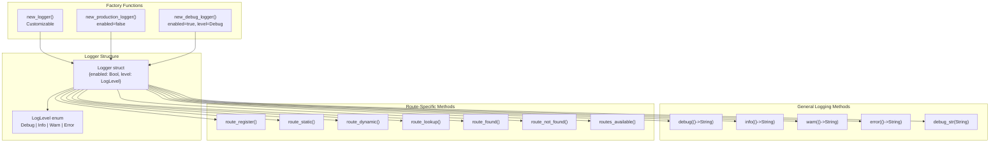
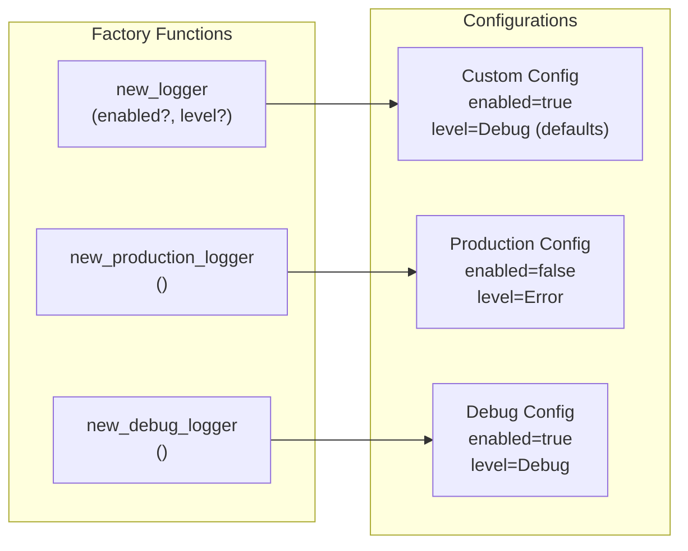
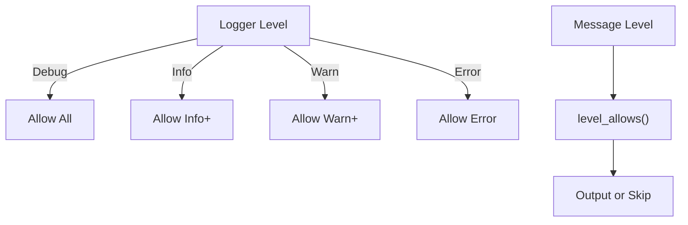
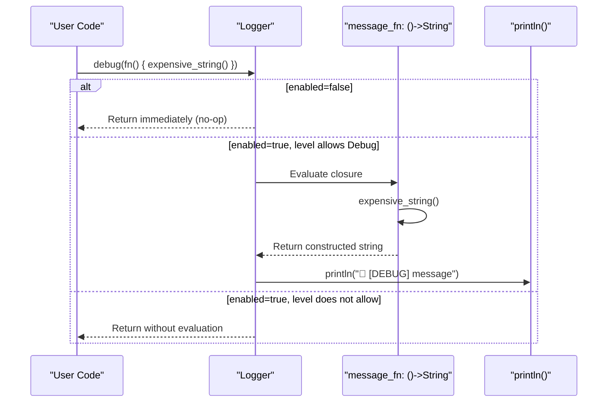
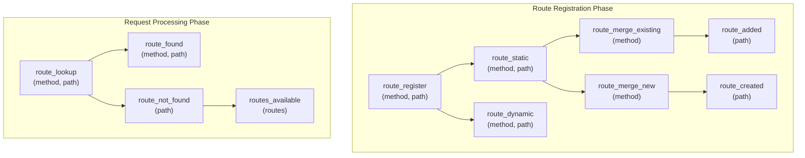
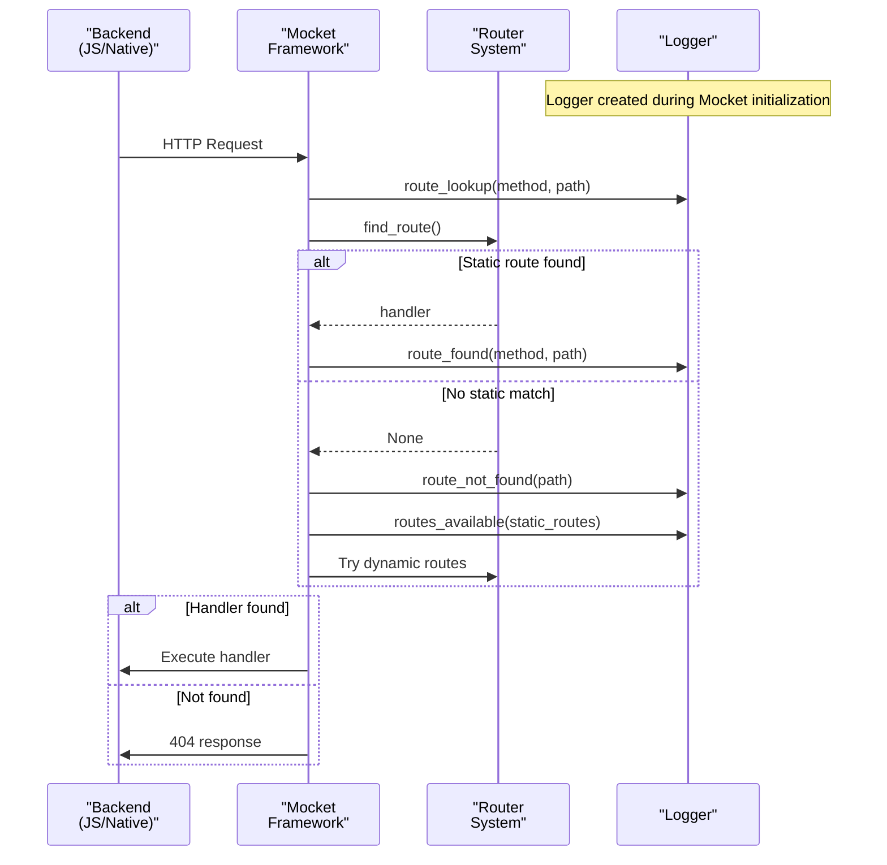
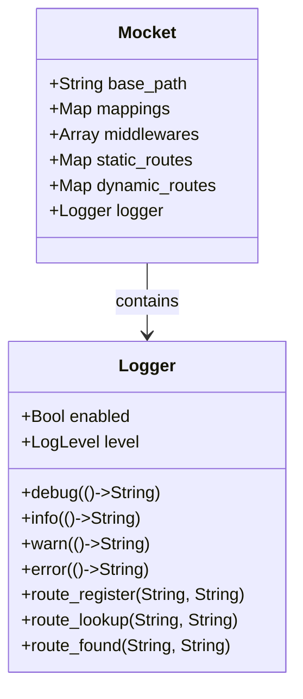

# Logging System

## Purpose and Scope

The Logging System provides structured observability for the Mocket web framework, enabling developers to track request processing, route registration, and application behavior. It implements a zero-cost abstraction pattern using lazy evaluation to minimize performance overhead in production environments.

This document covers the `Logger` struct, log levels, factory functions, and route-specific logging methods. For information about configuring the server itself, see [Server Configuration](#5.2). For details on the request processing pipeline that generates log events, see [Request and Response Handling](#2.3).

Sources: [src/logger.mbt:1-148]()

## Logger Architecture

The logging system consists of three core components: the `Logger` struct that holds configuration, the `LogLevel` enum that defines severity thresholds, and a collection of logging methods optimized for different use cases.



Sources: [src/logger.mbt:1-148](), [src/pkg.generated.mbti:85-111]()

## Logger Structure

The `Logger` struct contains two fields that control logging behavior:

| Field | Type | Purpose |
|-------|------|---------|
| `enabled` | `Bool` | Master switch to enable/disable all logging |
| `level` | `LogLevel` | Minimum severity level for log output |

The `LogLevel` enum defines four severity levels in ascending order:

| Level | Use Case |
|-------|----------|
| `Debug` | Detailed diagnostic information, verbose output |
| `Info` | General informational messages |
| `Warn` | Warning messages for potentially problematic situations |
| `Error` | Error messages for serious problems |

Sources: [src/logger.mbt:3-14](), [src/pkg.generated.mbti:85-95]()

## Logger Creation

Three factory functions provide different logging configurations optimized for specific environments:



### new_logger(enabled?, level?)

Creates a logger with customizable settings. Both parameters are optional with defaults: `enabled=true` and `level=Debug`.

**Location:** [src/logger.mbt:18-20]()

### new_production_logger()

Creates a logger optimized for production environments with `enabled=false` and `level=Error`. When disabled, all logging calls become no-ops, resulting in zero runtime overhead through compiler optimization.

**Location:** [src/logger.mbt:24-26]()

### new_debug_logger()

Creates a logger for development with full verbosity: `enabled=true` and `level=Debug`. All log messages will be output.

**Location:** [src/logger.mbt:30-32]()

Sources: [src/logger.mbt:18-32](), [src/pkg.generated.mbti:12-18]()

## Log Level Filtering

The `level_allows` function implements hierarchical log filtering. A logger configured at a given level will output messages at that level and all higher severity levels:

| Logger Level | Outputs |
|--------------|---------|
| `Debug` | Debug, Info, Warn, Error (all messages) |
| `Info` | Info, Warn, Error |
| `Warn` | Warn, Error |
| `Error` | Error only |

The filtering logic is implemented as a pattern match across level combinations:



Sources: [src/logger.mbt:72-80]()

## General Logging Methods

The logging API provides five methods for outputting messages at different severity levels.

### Lazy Evaluation Methods

Four methods accept a closure `() -> String` to implement zero-cost abstraction:

| Method | Signature | Log Level | Icon |
|--------|-----------|-----------|------|
| `debug` | `debug(self: Logger, message_fn: () -> String)` | Debug | 🐛 |
| `info` | `info(self: Logger, message_fn: () -> String)` | Info | ℹ️ |
| `warn` | `warn(self: Logger, message_fn: () -> String)` | Warn | ⚠️ |
| `error` | `error(self: Logger, message_fn: () -> String)` | Error | ❌ |

The closure is only evaluated if logging is enabled and the message level passes the filter. This prevents expensive string construction operations when logs are disabled.

**Example:**
```moonbit
logger.debug(fn() { "Expensive operation: \{compute_diagnostic()}" })
// compute_diagnostic() only called if debug logging is enabled
```

Sources: [src/logger.mbt:36-61](), [src/pkg.generated.mbti:96-99]()

### Direct String Method

The `debug_str` method accepts a `String` directly for convenience when the message is already constructed:

```moonbit
pub fn debug_str(self: Logger, message: String) -> Unit
```

This method is simpler to use but has slightly worse performance since the string is constructed regardless of logger state.

Sources: [src/logger.mbt:65-69]()

## Zero-Cost Abstraction Pattern

The logging system implements zero-cost abstraction through two mechanisms:



### Mechanism 1: Compile-Time Optimization

When `enabled=false` (as in `new_production_logger()`), the MoonBit compiler can optimize away logging calls entirely, resulting in zero runtime cost.

### Mechanism 2: Lazy Evaluation

When enabled, the closure pattern defers string construction until after level checking. If the message level doesn't meet the threshold, the expensive string construction never occurs.

**Performance Comparison:**

| Pattern | Production Cost | Debug Cost |
|---------|----------------|------------|
| `logger.debug(fn() { "msg: \{x}" })` | Zero (optimized away) | Conditional string construction |
| `logger.debug_str("msg: \{x}")` | Zero (optimized away) | Always constructs string |
| Direct `println()` | Always executes | Always executes |

Sources: [src/logger.mbt:35-40](), [src/logger.mbt:17-26]()

## Route-Specific Logging Methods

The logger provides specialized methods for tracking route registration and request routing, enabling detailed observability of the routing system. These methods are used internally by the Mocket framework during route registration and request processing.



### Route Registration Methods

| Method | Purpose | Typical Output |
|--------|---------|----------------|
| `route_register(method, path)` | Initial route registration | 🔧 Registering route: GET /api/users |
| `route_static(method, path)` | Static route detection | 📌 Static route: GET /api/users |
| `route_dynamic(method, path)` | Dynamic route detection | 🎯 Dynamic route: GET /api/users/:id |
| `route_merge_existing(method)` | Adding to existing method group | 📝 Adding to existing method routes for GET |
| `route_merge_new(method)` | Creating new method group | 🆕 Creating new method routes for POST |
| `route_added(path)` | Route added to existing group | ✅ Added /api/users to existing routes |
| `route_created(path)` | New route group created | ✅ Created new routes and added /api/admin |

Sources: [src/logger.mbt:84-147](), [src/pkg.generated.mbti:100-110]()

### Request Processing Methods

| Method | Purpose | Typical Output |
|--------|---------|----------------|
| `route_lookup(method, path)` | Beginning route lookup | 🔍 Looking for route: GET /api/users |
| `route_found(method, path)` | Static route match found | ✅ Found static route match!<br/>📝 Request: GET /api/users |
| `route_not_found(path)` | No static route match | ❌ No static route match for /api/users/123 |
| `routes_available(routes)` | Display available routes | 📋 Found method routes<br/>🗂️ Available static routes:<br/>  - /api/users<br/>  - /api/admin |

The `route_found` method outputs two lines: a success message and the request details.

Sources: [src/logger.mbt:107-127]()

## Integration with Request Pipeline

The logger is integrated throughout the Mocket request processing pipeline, providing visibility at every stage:



Sources: [src/logger.mbt:1-148](), Diagram 2 from high-level architecture

## Logger Initialization

The logger is passed to the Mocket framework during initialization:

**Using production logger (recommended for production):**
```moonbit
let app = @mocket.new(logger=@mocket.new_production_logger())
```

**Using debug logger (recommended for development):**
```moonbit
let app = @mocket.new(logger=@mocket.new_debug_logger())
```

**Using custom logger:**
```moonbit
let app = @mocket.new(
  logger=@mocket.new_logger(enabled=true, level=Info)
)
```

**Default logger (if not specified):**
If no logger is provided, a default logger is created based on the framework's configuration.

Sources: [src/example/main.mbt:3](), [src/pkg.generated.mbti:12]()

## Accessing the Logger

The logger is stored in the `Mocket` struct and is accessible to internal framework code:



The `Mocket.logger` field is used internally by routing and middleware systems. User code typically doesn't access the logger directly but can implement custom middleware that logs using standard output.

Sources: [src/pkg.generated.mbti:113-120]()

## Usage Examples

### Example 1: Production Configuration

```moonbit
fn main {
  // Create app with production logger (zero overhead)
  let app = @mocket.new(logger=@mocket.new_production_logger())
  
  app.get("/api/status", _ => Json({"status": "ok"}))
  
  // All internal logger calls are optimized away
  app.serve(port=8080)
}
```

### Example 2: Development Configuration

```moonbit
fn main {
  // Create app with debug logger (full visibility)
  let app = @mocket.new(logger=@mocket.new_debug_logger())
  
  // This will output route registration debug logs:
  // 🔧 Registering route: GET /api/users
  // 📌 Static route: GET /api/users
  app.get("/api/users", _ => Json({"users": []}))
  
  // Request processing will output:
  // 🔍 Looking for route: GET /api/users
  // ✅ Found static route match!
  // 📝 Request: GET /api/users
  app.serve(port=8080)
}
```

### Example 3: Custom Log Level

```moonbit
fn main {
  // Only show warnings and errors
  let app = @mocket.new(
    logger=@mocket.new_logger(enabled=true, level=Warn)
  )
  
  app.get("/", _ => Text("Hello"))
  
  // Debug and Info messages will be filtered out
  // Only Warn and Error messages will appear
  app.serve(port=8080)
}
```

Sources: [src/example/main.mbt:1-84]()

## Performance Characteristics

The logging system is designed for zero-cost abstraction:

| Scenario | Runtime Cost | Memory Cost |
|----------|--------------|-------------|
| Production logger (disabled) | Zero (optimized away by compiler) | Minimal (struct allocation only) |
| Enabled logger, message filtered | One boolean check + one enum comparison | None |
| Enabled logger, message output | Closure evaluation + string allocation + println | Temporary string allocation |

**Optimization Tips:**

1. **Always use `new_production_logger()` in production** to eliminate all logging overhead
2. **Prefer lazy evaluation methods** (`debug`, `info`, etc.) over `debug_str` when constructing complex messages
3. **Use appropriate log levels** to minimize unnecessary log output
4. **Avoid logging in hot paths** even with production logger, as surrounding code may prevent optimization

Sources: [src/logger.mbt:17-26](), [src/logger.mbt:35-40]()

## Summary

The Mocket logging system provides:

- **Zero-cost abstraction** through lazy evaluation and compiler optimization
- **Flexible configuration** via factory functions for production and development
- **Hierarchical log levels** with Debug, Info, Warn, and Error
- **Route-specific methods** for tracking route registration and request routing
- **Framework integration** throughout the request processing pipeline

The system balances observability in development with zero overhead in production, following the principle that developers shouldn't pay for features they don't use.

Sources: [src/logger.mbt:1-148](), [src/pkg.generated.mbti:85-111]()