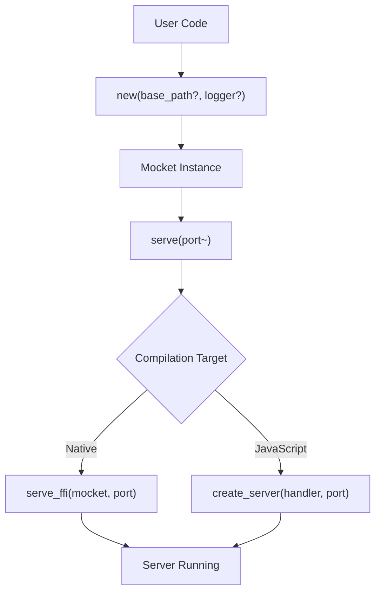
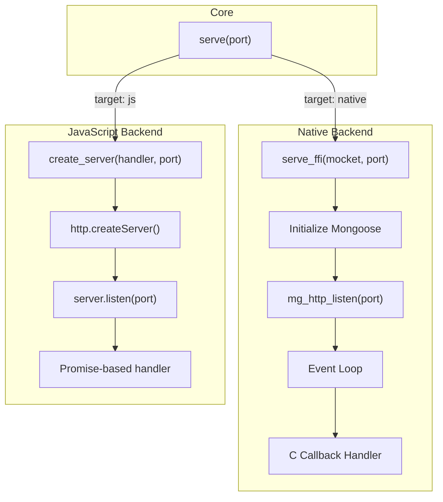
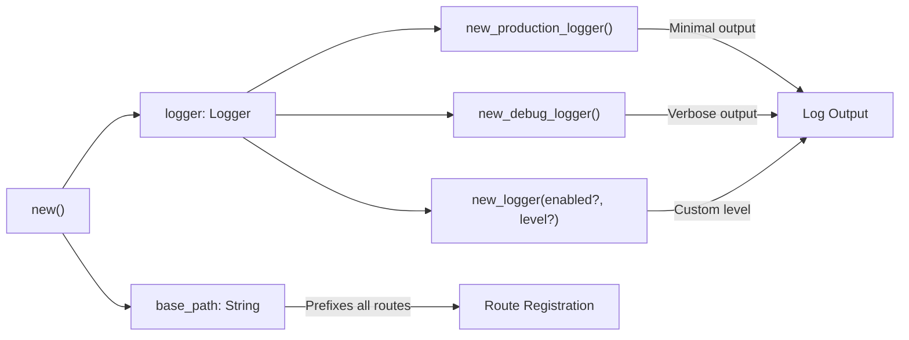

# Server Configuration

This page explains how to initialize and start a Mocket server, including configuration options for base paths, logging, and port binding. It covers the `new` function for creating server instances and the `serve`/`serve_ffi` functions for starting the server across different backends.

For basic usage examples, see [Quick Start Guide](#1.1). For backend-specific implementation details, see [JavaScript Backend](#3.1) and [Native Backend](#3.2). For logger configuration, see [Logging System](#5.1).

---

## Mocket Initialization

A Mocket server instance is created using the `new` function, which accepts optional configuration parameters:

```moonbit
fn new(base_path? : String, logger? : Logger) -> Mocket
```

**Sources:** `src/pkg.generated.mbti:12`

### Configuration Parameters

| Parameter | Type | Default | Purpose |
|-----------|------|---------|---------|
| `base_path` | `String?` | `""` | Common prefix for all routes registered on this instance |
| `logger` | `Logger?` | Production logger | Logger instance for server diagnostics and request tracking |

The `base_path` parameter is particularly useful when organizing routes into groups or mounting sub-applications. When set, all routes registered on this Mocket instance will be prefixed with the specified path.

The `logger` parameter allows you to configure logging behavior. Three factory functions are available:

- `new_production_logger()` - Minimal logging, suitable for production environments
- `new_debug_logger()` - Verbose logging for development
- `new_logger(enabled?, level?)` - Custom logger with fine-grained control

**Sources:** `src/pkg.generated.mbti:12-18`

### Mocket Structure

The initialized `Mocket` struct contains:

```moonbit
pub(all) struct Mocket {
  base_path : String
  mappings : Map[(String, String), async (HttpEvent) -> HttpBody noraise]
  middlewares : Array[(String, async (HttpEvent) -> Unit noraise)]
  static_routes : Map[String, Map[String, async (HttpEvent) -> HttpBody noraise]]
  dynamic_routes : Map[String, Array[(String, async (HttpEvent) -> HttpBody noraise)]]
  logger : Logger
}
```

This structure maintains:
- The configured `base_path` for route prefixing
- A complete route registry in `mappings`
- Optimized lookup caches in `static_routes` and `dynamic_routes`
- Middleware chains in `middlewares`
- A `logger` instance for diagnostic output

**Sources:** `src/pkg.generated.mbti:113-120`

---

## Starting the Server

### Server Initialization Flow



**Sources:** `src/serve.mbt:1-4`, `src/pkg.generated.mbti:10`, `src/pkg.generated.mbti:22`, `src/pkg.generated.mbti:132`

### The serve Method

The primary entry point for starting a server is the `serve` method:

```moonbit
pub fn Mocket::serve(Self, port~ : Int) -> Unit
```

This method:
1. Takes the configured Mocket instance
2. Accepts a named port parameter (`port~`)
3. Delegates to backend-specific implementation via `serve_ffi`

**Implementation:**

```moonbit
pub fn serve(self : Mocket, port~ : Int) -> Unit {
  serve_ffi(self, port~)
}
```

The `serve` method acts as a unified interface that abstracts backend differences. The actual server creation logic is handled by the compilation-target-specific implementation.

**Sources:** `src/serve.mbt:1-4`, `src/pkg.generated.mbti:132`

### Port Binding

The `port` parameter is a named integer argument (`port~`) that specifies which TCP port the server should listen on. Common conventions:

| Port | Usage |
|------|-------|
| `3000` | Development default |
| `8080` | Common HTTP alternate |
| `80` | HTTP standard (requires privileges) |
| `443` | HTTPS standard (requires privileges) |

The port must be available and not already bound by another process. Port numbers below 1024 typically require elevated privileges on Unix-like systems.

**Sources:** `src/serve.mbt:2-3`, `src/pkg.generated.mbti:132`

---

## Backend-Specific Server Creation

Mocket compiles to different backends through conditional compilation. The server creation logic diverges based on the target platform.

### Backend Server Creation Comparison



**Sources:** `src/serve.mbt:1-4`, `src/pkg.generated.mbti:10`, `src/pkg.generated.mbti:22`

### JavaScript Backend: create_server

For JavaScript targets (Node.js), the server is created using `create_server`:

```moonbit
fn create_server(
  (HttpRequestInternal, HttpResponseInternal, () -> Unit) -> Unit,
  Int
) -> Unit
```

This function:
1. Takes a request handler callback that receives:
   - `HttpRequestInternal` - The incoming Node.js request object
   - `HttpResponseInternal` - The Node.js response object
   - `() -> Unit` - A completion callback
2. Takes the port number as an integer
3. Creates a Node.js HTTP server using `http.createServer()`
4. Binds the server to the specified port

The JavaScript backend operates on a Promise-based async model, where each request is processed asynchronously and the response is written when the handler completes.

**Sources:** `src/pkg.generated.mbti:10`

### Native Backend: serve_ffi

For native targets, the server uses FFI to interface with the Mongoose embedded web server:

```moonbit
fn serve_ffi(Mocket, port~ : Int) -> Unit
```

This function:
1. Takes the configured Mocket instance
2. Accepts a named port parameter
3. Initializes the Mongoose C library
4. Sets up C callback handlers using FFI
5. Starts the Mongoose event loop

The native backend uses a callback-based model where C callbacks invoke MoonBit handlers through FFI. Request and response data are passed through C structs (`request_t`, `response_t`) that are converted to the framework's internal types.

The implementation delegates to C code in `mocket.stub.c` which bridges Mongoose to the MoonBit runtime.

**Sources:** `src/pkg.generated.mbti:22`, `src/serve.mbt:3`

---

## Server Configuration Patterns

### Minimal Configuration

```moonbit
let app = @mocket.new()
app.get("/", fn(e) { Text("Hello") })
app.serve(port=3000)
```

This creates a server with default settings: empty base path and production logger.

### Full Configuration

```moonbit
let logger = @mocket.new_debug_logger()
let app = @mocket.new(base_path="/api/v1", logger)
app.get("/users", fn(e) { Json({}) })
app.serve(port=8080)
```

This creates a server with:
- All routes prefixed with `/api/v1`
- Debug logging enabled
- Listening on port 8080

### Configuration Options Summary



**Sources:** `src/pkg.generated.mbti:12-18`, `src/pkg.generated.mbti:113-120`

---

## Internal Server State

When a server is started, the Mocket instance maintains several internal data structures for efficient request routing:

| Structure | Type | Purpose |
|-----------|------|---------|
| `mappings` | `Map[(String, String), Handler]` | Complete registry of all routes |
| `static_routes` | `Map[String, Map[String, Handler]]` | O(1) lookup cache for exact path matches |
| `dynamic_routes` | `Map[String, Array[(String, Handler)]]` | Regex-matched routes with parameters |
| `middlewares` | `Array[(String, Middleware)]` | Ordered middleware chain with base paths |

The `serve`/`serve_ffi` functions do not modify these structures. Route registration must be completed before calling `serve`.

**Sources:** `src/pkg.generated.mbti:113-120`, `src/path_match.mbt:64-131`

---

## Related Functions

Additional functions related to server lifecycle:

- `run(async () -> Unit noraise) -> Unit` - Execute async operations (JS backend)
- `suspend[T, E](...) -> T raise E` - Suspend async operations with error handling
- `HttpRequestInternal::req_method()` - Extract HTTP method from internal request
- `HttpRequestInternal::url()` - Extract URL from internal request
- `HttpResponseInternal::end(@js.Value)` - Complete response (JS backend)

These functions are used internally by the backend implementations during request processing but are not typically called directly by application code.

**Sources:** `src/pkg.generated.mbti:20-24`, `src/pkg.generated.mbti:71-83`