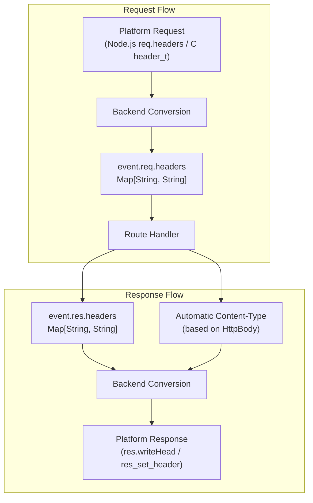
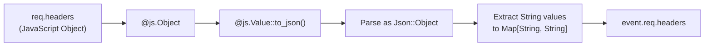
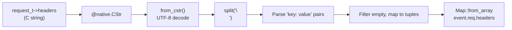
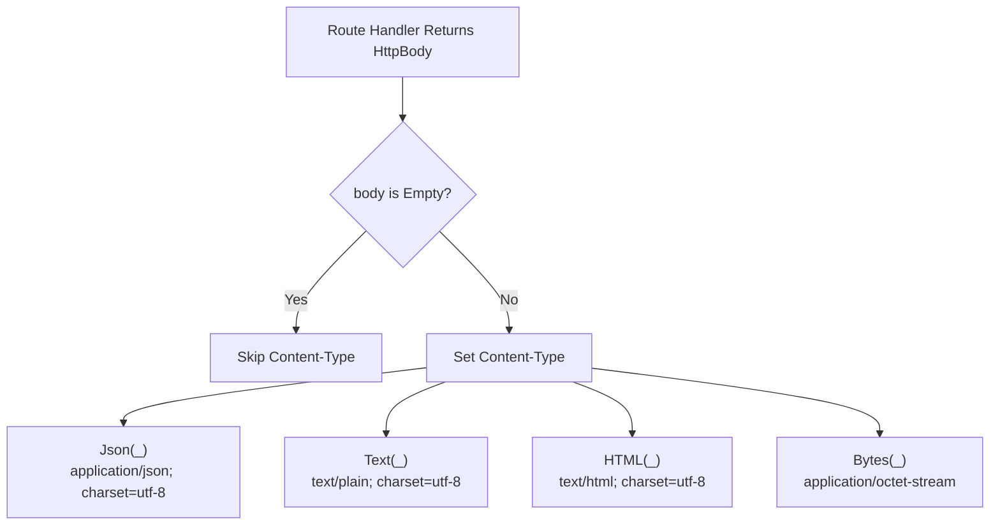
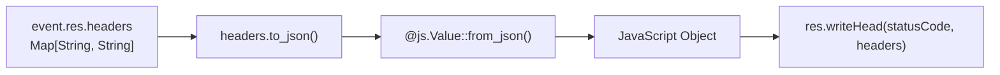
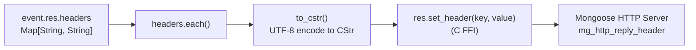
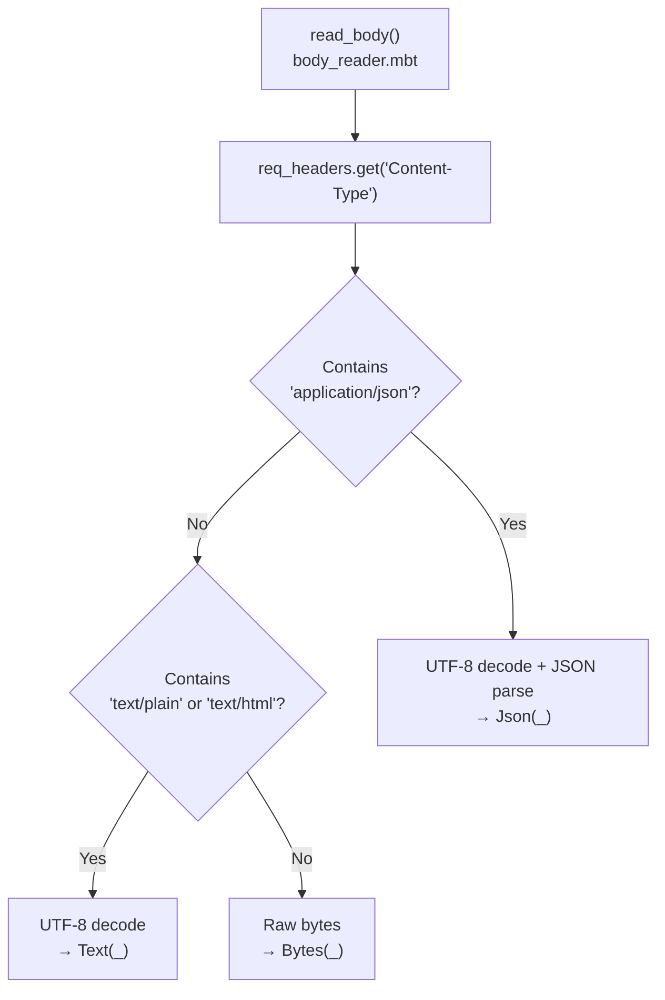

# Header Manipulation

This document explains how to read incoming request headers and set outgoing response headers in the Mocket framework. For general information about request and response handling, see [Request and Response Handling](#2.3). For information about configuring the server itself, see [Server Configuration](#5.2).

## Overview

Mocket provides a unified interface for header manipulation across all backends through the `HttpEvent` type. Request headers are accessed via `event.req.headers`, and response headers are set via `event.res.headers`. Both are represented as `Map[String, String]`, providing a consistent API regardless of the underlying platform.

The framework handles the platform-specific conversions automatically:
- **JavaScript backend**: Converts between Node.js `headers` object and MoonBit `Map`
- **Native backend**: Parses C string format and uses FFI calls to set headers
- **Automatic Content-Type**: The framework sets `Content-Type` based on response body type



**Sources:** [src/mocket.js.mbt:61-149](), [src/mocket.native.mbt:95-207]()

## Reading Request Headers

### Accessing Headers

Request headers are available through the `HttpEvent` parameter passed to route handlers. Headers are stored in a `Map[String, String]` structure at `event.req.headers`:

| Operation | Code | Description |
|-----------|------|-------------|
| Get single header | `event.req.headers.get("Content-Type")` | Returns `Option[String]` |
| Check existence | `event.req.headers.contains("Authorization")` | Returns `Bool` |
| Iterate headers | `event.req.headers.each(fn(key, value) { ... })` | Process all headers |
| Get all keys | `event.req.headers.keys()` | Returns iterator of header names |

**Example Usage:**

```moonbit
mocket.get("/api/data", fn(event) {
  match event.req.headers.get("Authorization") {
    Some(token) => {
      // Process authenticated request
      Json(@json.JsonValue::Object(Map::from_array([("auth", String("valid"))])))
    }
    None => {
      event.res.status_code = 401
      Json(@json.JsonValue::Object(Map::from_array([("error", String("Unauthorized"))])))
    }
  }
})
```

**Sources:** [src/mocket.js.mbt:87-96](), [src/mocket.native.mbt:157-161]()

### JavaScript Backend Header Conversion

The JavaScript backend converts Node.js `headers` object to MoonBit `Map[String, String]`:



The conversion process at [src/mocket.js.mbt:64-77]():
1. Calls `req.headers()` FFI function (line 32-34)
2. Converts to JSON using `to_value().to_json()`
3. Iterates through JSON object entries
4. Filters for `String` values and stores in `Map[String, String]`

**Sources:** [src/mocket.js.mbt:32-34](), [src/mocket.js.mbt:64-77]()

### Native Backend Header Conversion

The native backend receives headers as a C string with newline-delimited key-value pairs:



The conversion process at [src/mocket.native.mbt:136-148]():
1. Calls `req.headers()` FFI function (line 24-26) returning `@native.CStr`
2. Converts C string to MoonBit `String` using `from_cstr()` (line 217-221)
3. Splits by newline character
4. Parses each line as "key: value" format
5. Filters out empty pairs and converts to `Map::from_array`

**Sources:** [src/mocket.native.mbt:24-26](), [src/mocket.native.mbt:136-148](), [src/mocket.native.mbt:217-221]()

## Setting Response Headers

### Manual Header Setting

Response headers are set by modifying `event.res.headers` before returning from the handler:

```moonbit
mocket.get("/api/download", fn(event) {
  event.res.headers.set("Content-Disposition", "attachment; filename=data.json")
  event.res.headers.set("Cache-Control", "no-cache, no-store, must-revalidate")
  event.res.headers.set("X-Custom-Header", "custom-value")
  
  Json(@json.JsonValue::Object(Map::from_array([("status", String("ok"))])))
})
```

Common response headers:

| Header | Purpose | Example Value |
|--------|---------|---------------|
| `Content-Disposition` | Inline or attachment download | `attachment; filename="file.pdf"` |
| `Cache-Control` | Caching directives | `max-age=3600, public` |
| `Access-Control-Allow-Origin` | CORS | `*` or specific origin |
| `X-Custom-Header` | Application-specific | Any custom value |
| `Set-Cookie` | Cookie management | `session=abc123; HttpOnly` |

**Sources:** [src/mocket.js.mbt:87-96](), [src/mocket.native.mbt:157-161]()

### Automatic Content-Type Setting

Mocket automatically sets the `Content-Type` header based on the returned `HttpBody` variant, unless the body is `Empty`:



The automatic setting logic at [src/mocket.js.mbt:118-129]() and [src/mocket.native.mbt:178-189]():

| HttpBody Variant | Content-Type |
|------------------|--------------|
| `Json(_)` | `application/json; charset=utf-8` |
| `Text(_)` | `text/plain; charset=utf-8` |
| `HTML(_)` | `text/html; charset=utf-8` |
| `Bytes(_)` | `application/octet-stream` |
| `Empty` | *(no Content-Type set)* |

To override the automatic `Content-Type`, set it manually before returning:

```moonbit
mocket.get("/api/xml", fn(event) {
  event.res.headers.set("Content-Type", "application/xml; charset=utf-8")
  Text("<root><status>ok</status></root>")
})
```

**Sources:** [src/mocket.js.mbt:118-129](), [src/mocket.native.mbt:178-189]()

## Backend-Specific Implementation

### JavaScript Backend Response Headers

The JavaScript backend converts response headers to a JavaScript object and sends them via `writeHead`:



Implementation at [src/mocket.js.mbt:130-135]():
1. Converts `Map[String, String]` to JSON
2. Converts JSON to `@js.Value`
3. Calls `res.writeHead()` with status code and headers object (FFI at line 48-52)

The `write_head` FFI function signature:
```moonbit
extern "js" fn HttpResponseInternal::write_head(
  self : HttpResponseInternal,
  statusCode : Int,
  headers : @js.Value,
) -> Unit = "(s, statusCode, headers) => s.writeHead(statusCode, headers)"
```

**Sources:** [src/mocket.js.mbt:48-52](), [src/mocket.js.mbt:130-135]()

### Native Backend Response Headers

The native backend sets each header individually using C FFI calls to `res_set_header`:



Implementation at [src/mocket.native.mbt:191-193]():
1. Iterates through each header in `event.res.headers`
2. Converts key and value to `@native.CStr` using `to_cstr()` (line 210-214)
3. Calls `res.set_header()` FFI function for each pair (FFI at line 30-34)

The `set_header` FFI function signature:
```moonbit
extern "c" fn HttpResponseInternal::set_header(
  self : HttpResponseInternal,
  key : @native.CStr,
  value : @native.CStr,
) -> Unit = "res_set_header"
```

The `to_cstr()` helper function encodes UTF-8 strings to C-compatible byte arrays:
```moonbit
fn[T : Show] to_cstr(s : T) -> @native.CStr {
  let bytes = @encoding/utf8.encode(s.to_string())
  let utf8_ptr = @native.unsafe_coerce(bytes)
  utf8_ptr
}
```

**Sources:** [src/mocket.native.mbt:30-34](), [src/mocket.native.mbt:191-193](), [src/mocket.native.mbt:210-214]()

## Common Header Patterns

### CORS Headers

Enable Cross-Origin Resource Sharing by setting appropriate headers:

```moonbit
fn add_cors_headers(event : HttpEvent) -> Unit {
  event.res.headers.set("Access-Control-Allow-Origin", "*")
  event.res.headers.set("Access-Control-Allow-Methods", "GET, POST, PUT, DELETE, OPTIONS")
  event.res.headers.set("Access-Control-Allow-Headers", "Content-Type, Authorization")
}

mocket.get("/api/resource", fn(event) {
  add_cors_headers(event)
  Json(@json.JsonValue::Object(Map::from_array([("data", String("value"))])))
})
```

### Content Negotiation

Use request headers to determine response format:

```moonbit
mocket.get("/api/data", fn(event) {
  let data = Map::from_array([("message", "Hello")])
  
  match event.req.headers.get("Accept") {
    Some([.."application/json", ..]) => {
      Json(@json.JsonValue::Object(data.map(fn(k, v) { (k, String(v)) })))
    }
    Some([.."text/html", ..]) => {
      HTML("<html><body><h1>Hello</h1></body></html>")
    }
    _ => {
      Text("message: Hello")
    }
  }
})
```

### Authentication Headers

Read and validate authentication tokens:

```moonbit
fn require_auth(event : HttpEvent) -> Result[String, String] {
  match event.req.headers.get("Authorization") {
    Some([.."Bearer ", ..] as auth) => {
      let token = auth.substring(7)
      // Validate token
      Ok(token)
    }
    _ => Err("Unauthorized")
  }
}

mocket.get("/api/protected", fn(event) {
  match require_auth(event) {
    Ok(token) => {
      Json(@json.JsonValue::Object(Map::from_array([("token", String(token))])))
    }
    Err(msg) => {
      event.res.status_code = 401
      Json(@json.JsonValue::Object(Map::from_array([("error", String(msg))])))
    }
  }
})
```

### Content-Type Based Body Parsing

The framework uses the `Content-Type` request header to automatically parse request bodies:



Implementation at [src/body_reader.mbt:9-29]():
- `application/json` → UTF-8 decoded and parsed as JSON
- `text/plain` or `text/html` → UTF-8 decoded as text
- All other types → Raw bytes

**Sources:** [src/body_reader.mbt:9-29]()

## Summary

Header manipulation in Mocket follows these principles:

1. **Unified Interface**: Both request and response headers use `Map[String, String]`
2. **Backend Abstraction**: Platform-specific conversions are handled automatically
3. **Automatic Content-Type**: Set based on `HttpBody` variant unless overridden
4. **Type Safety**: Headers are strongly typed and validated at backend boundaries

For middleware-based header manipulation patterns, see [Middleware System](#2.2). For response body type selection, see [Response Types](#2.3.1).

**Sources:** [src/mocket.js.mbt:1-150](), [src/mocket.native.mbt:1-222](), [src/body_reader.mbt:1-30]()