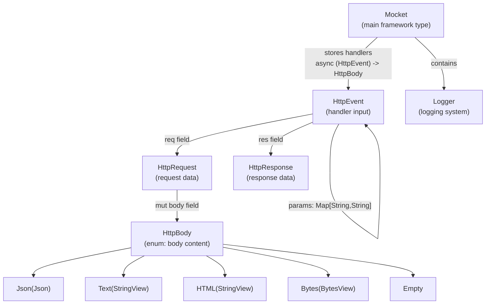
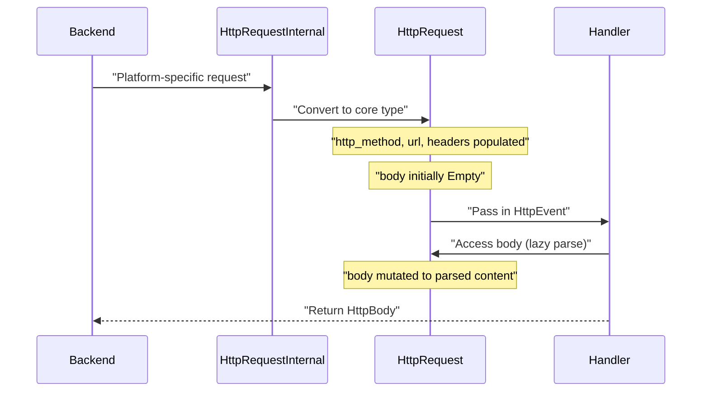
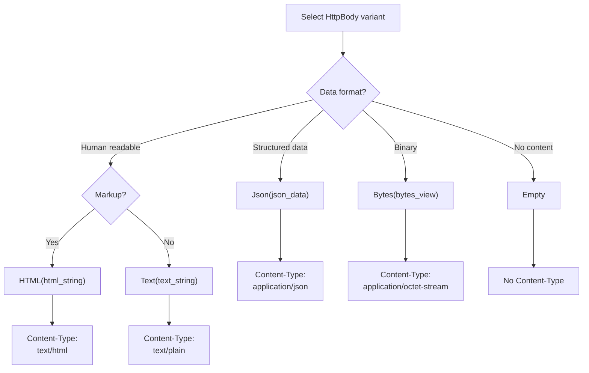
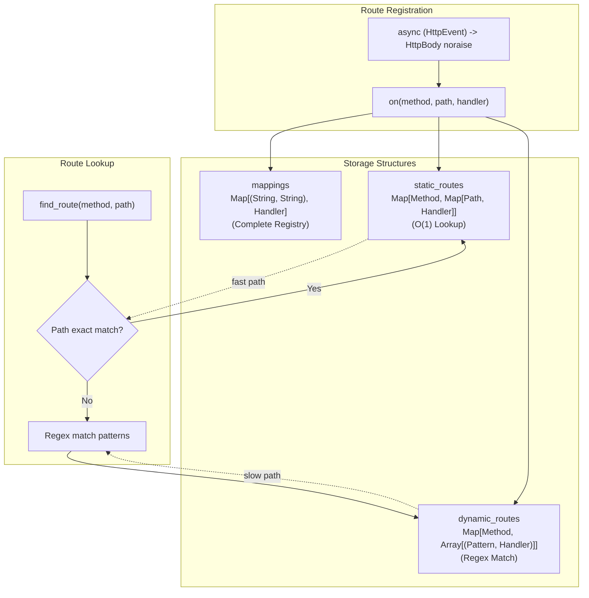
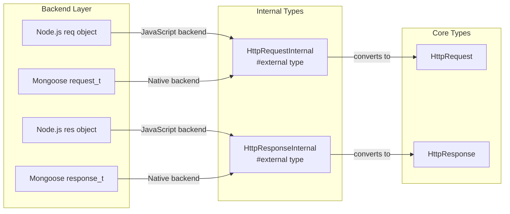
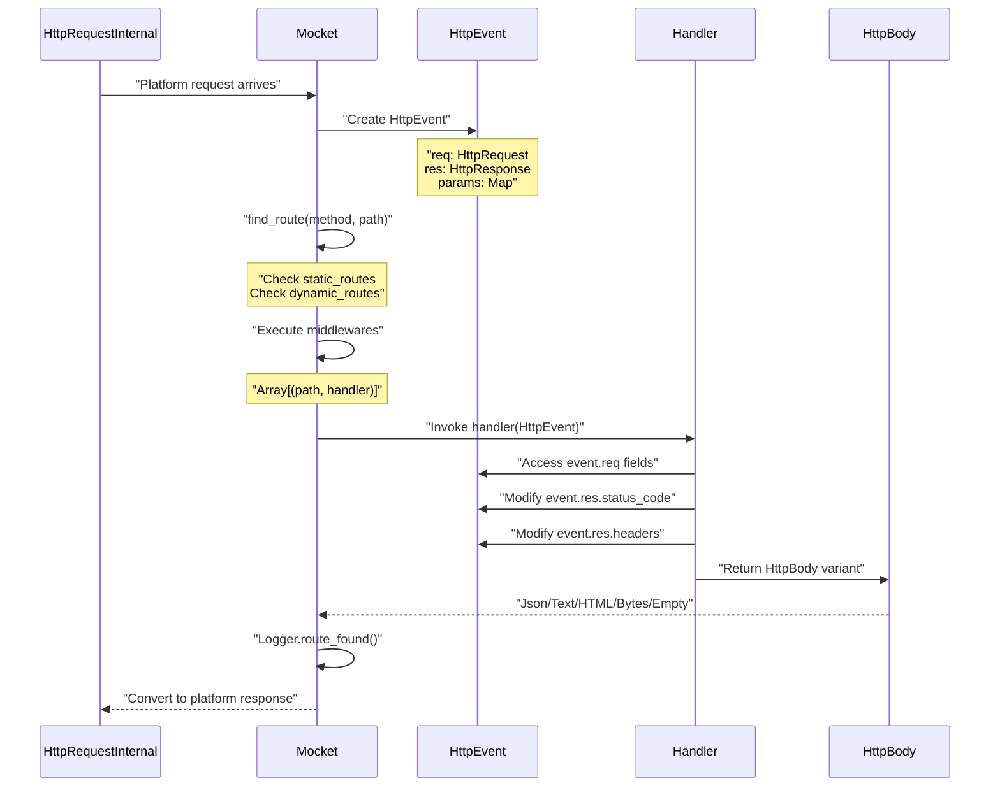

# Core Types

This page documents the fundamental types that form the public API of the Mocket framework. These types define the data structures that applications interact with when handling HTTP requests and responses. The core types are backend-agnostic and provide a unified interface regardless of whether the application runs on JavaScript, Native, or WASM backends.

For information about route registration methods that use these types, see [Route Registration API](#4.2). For details about backend-specific type conversions, see [Multi-Backend Architecture](#3).

## Type Hierarchy Overview

The following diagram shows the relationships between all core types in the Mocket framework:



**Sources:** [src/pkg.generated.mbti:49-120](), [src/event.mbt:2-6]()

## HttpEvent

The `HttpEvent` struct is the primary object passed to route handlers and middleware. It encapsulates all information about the current HTTP transaction.

### Structure

| Field | Type | Description |
|-------|------|-------------|
| `req` | `HttpRequest` | The incoming HTTP request data |
| `res` | `HttpResponse` | The outgoing HTTP response (mutable fields) |
| `params` | `Map[String, String]` | Route parameters extracted from dynamic routes |

### Definition Location

The `HttpEvent` type is defined at [src/event.mbt:2-6]() and declared public in [src/pkg.generated.mbti:57-61]().

### Usage Pattern

Handlers receive an `HttpEvent` and return an `HttpBody`:

```
async fn handler(event : HttpEvent) -> HttpBody noraise
```

The `params` map contains values extracted from dynamic route segments. For example, a route pattern `/users/:id` accessed with `/users/123` would populate `params` with `{"id": "123"}`.

**Sources:** [src/event.mbt:2-6](), [src/pkg.generated.mbti:57-61]()

## HttpRequest

The `HttpRequest` struct contains all data from the incoming HTTP request.

### Structure

| Field | Type | Mutability | Description |
|-------|------|------------|-------------|
| `http_method` | `String` | Immutable | HTTP method (GET, POST, PUT, etc.) |
| `url` | `String` | Immutable | Request URL path |
| `headers` | `Map[String, String]` | Immutable | HTTP request headers |
| `body` | `HttpBody` | **Mutable** | Parsed request body |

### Definition Location

Defined at [src/pkg.generated.mbti:63-68]().

### Body Mutability

The `body` field is explicitly marked as mutable (`mut body : HttpBody`). This allows the request body to be lazily parsed or modified during request processing. The body is populated based on the `Content-Type` header by backend-specific body parsers.

### Request Lifecycle



**Sources:** [src/pkg.generated.mbti:63-68]()

## HttpResponse

The `HttpResponse` struct allows handlers to configure the outgoing HTTP response.

### Structure

| Field | Type | Mutability | Description |
|-------|------|------------|-------------|
| `status_code` | `Int` | **Mutable** | HTTP status code (default varies by backend) |
| `headers` | `Map[StringView, StringView]` | Immutable | Response headers to send |

### Definition Location

Defined at [src/pkg.generated.mbti:75-78]().

### Header Types

Note that response headers use `StringView` for both keys and values, while request headers use `String`. This optimization reduces memory allocations when constructing response headers from string literals.

### Setting Response Properties

Handlers modify the `HttpResponse` through the `HttpEvent.res` field:

```
async fn handler(event : HttpEvent) -> HttpBody {
  event.res.status_code = 201
  event.res.headers.set("X-Custom-Header", "value")
  Json({ "status": "created" })
}
```

**Sources:** [src/pkg.generated.mbti:75-78]()

## HttpBody

The `HttpBody` enum represents different content types that can be sent or received in HTTP messages.

### Variants

| Variant | Payload Type | Use Case |
|---------|--------------|----------|
| `Json(Json)` | `Json` | JSON data (auto Content-Type: application/json) |
| `Text(StringView)` | `StringView` | Plain text (auto Content-Type: text/plain) |
| `HTML(StringView)` | `StringView` | HTML content (auto Content-Type: text/html) |
| `Bytes(BytesView)` | `BytesView` | Binary data (auto Content-Type: application/octet-stream) |
| `Empty` | None | No response body (for 204 No Content, etc.) |

### Definition Location

Defined at [src/pkg.generated.mbti:49-55]().

### Content-Type Handling

The framework automatically sets the appropriate `Content-Type` header based on the returned `HttpBody` variant. Backends convert these variants to platform-specific representations.

### Variant Selection Guide



**Sources:** [src/pkg.generated.mbti:49-55]()

## Mocket

The `Mocket` struct is the main framework instance that holds routing configuration, middleware, and server state.

### Structure

| Field | Type | Description |
|-------|------|-------------|
| `base_path` | `String` | Base path prefix for all routes |
| `mappings` | `Map[(String, String), async (HttpEvent) -> HttpBody noraise]` | Complete registry of all route handlers |
| `middlewares` | `Array[(String, async (HttpEvent) -> Unit noraise)]` | Registered middleware with their base paths |
| `static_routes` | `Map[String, Map[String, async (HttpEvent) -> HttpBody noraise]]` | O(1) lookup cache for static routes |
| `dynamic_routes` | `Map[String, Array[(String, async (HttpEvent) -> HttpBody noraise)]]` | Regex-matched dynamic routes |
| `logger` | `Logger` | Logging system instance |

### Definition Location

Defined at [src/pkg.generated.mbti:113-120]().

### Route Storage Architecture

The `Mocket` type uses a dual-storage strategy for performance optimization:



### Async Handler Signature

All route handlers in Mocket use the signature `async (HttpEvent) -> HttpBody noraise`. The `noraise` annotation indicates these handlers cannot raise exceptions, enforcing error handling through the return value.

**Sources:** [src/pkg.generated.mbti:113-120](), [src/pkg.generated.mbti:121-134]()

## Logger

The `Logger` struct provides observability for the framework's internal operations and application-level logging.

### Structure

| Field | Type | Description |
|-------|------|-------------|
| `enabled` | `Bool` | Whether logging is active |
| `level` | `LogLevel` | Minimum log level to output |

### LogLevel Enum

```
pub enum LogLevel {
  Debug
  Info
  Warn
  Error
}
```

### Definition Location

Defined at [src/pkg.generated.mbti:85-111]().

### Specialized Methods

The `Logger` type provides route-specific logging methods that track routing operations:

| Method | Purpose |
|--------|---------|
| `route_added(path)` | Route added to registry |
| `route_created(path)` | New route definition created |
| `route_dynamic(method, pattern)` | Dynamic route registered |
| `route_found(method, path)` | Route successfully matched |
| `route_lookup(method, path)` | Route lookup initiated |
| `route_merge_existing(path)` | Route merged with existing |
| `route_merge_new(path)` | New route group merged |
| `route_not_found(path)` | No route matched request |
| `route_register(method, path)` | Route registration started |
| `route_static(method, path)` | Static route registered |
| `routes_available(paths)` | List all registered routes |

### Logger Construction

The framework provides three factory functions defined in [src/pkg.generated.mbti:13-18]():

- `new_logger(enabled?: Bool, level?: LogLevel) -> Logger` - Custom configuration
- `new_debug_logger() -> Logger` - All logs enabled at Debug level
- `new_production_logger() -> Logger` - Info level and above

**Sources:** [src/pkg.generated.mbti:85-111](), [src/pkg.generated.mbti:13-18]()

## Internal Types

The framework uses internal types for backend-specific implementations that are not part of the public API but appear in the type system.

### HttpRequestInternal and HttpResponseInternal

These types are marked `#external` and represent platform-specific request/response objects:



### Methods on Internal Types

Defined at [src/pkg.generated.mbti:70-83]():

**HttpRequestInternal:**
- `req_method(Self) -> String` - Extract HTTP method
- `url(Self) -> String` - Extract request URL

**HttpResponseInternal:**
- `end(Self, @js.Value) -> Unit` - Send response (JavaScript-specific)
- `url(Self) -> String` - Get response URL

These methods provide the bridge between platform-specific implementations and the core framework types.

**Sources:** [src/pkg.generated.mbti:70-83]()

## Type Relationships in Request Processing

The following diagram shows how core types interact during a complete request-response cycle:



**Sources:** [src/pkg.generated.mbti:49-120](), [src/event.mbt:2-6]()

## Summary Table

| Type | Purpose | Mutability | Location |
|------|---------|------------|----------|
| `Mocket` | Framework instance with routing and middleware | Contains mutable maps | [src/pkg.generated.mbti:113-120]() |
| `HttpEvent` | Request context passed to handlers | Immutable wrapper | [src/event.mbt:2-6]() |
| `HttpRequest` | Incoming request data | `body` field is mutable | [src/pkg.generated.mbti:63-68]() |
| `HttpResponse` | Outgoing response configuration | `status_code` is mutable | [src/pkg.generated.mbti:75-78]() |
| `HttpBody` | Content type enum | Immutable value | [src/pkg.generated.mbti:49-55]() |
| `Logger` | Logging system | Immutable configuration | [src/pkg.generated.mbti:92-111]() |

**Sources:** [src/pkg.generated.mbti:49-120](), [src/event.mbt:2-6]()