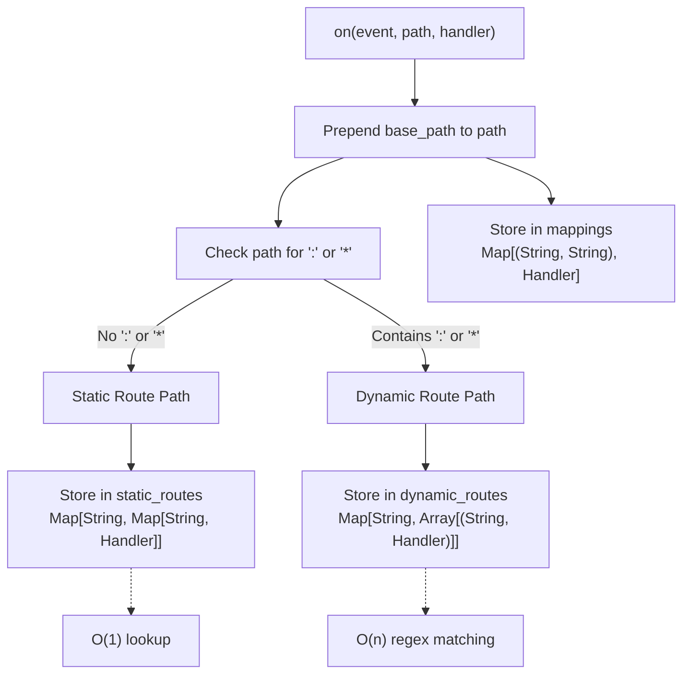
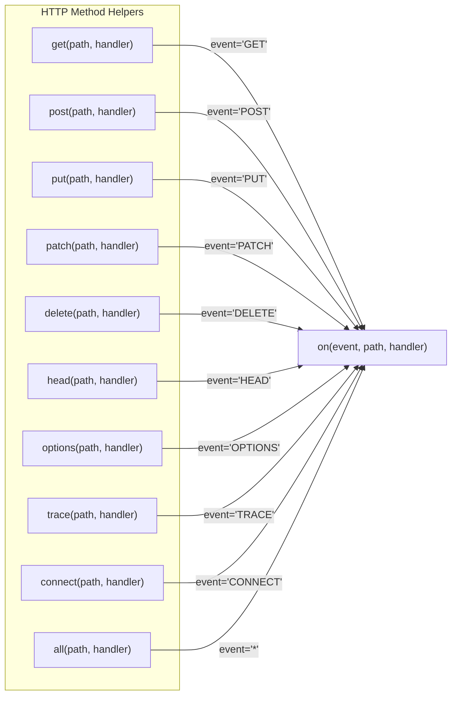
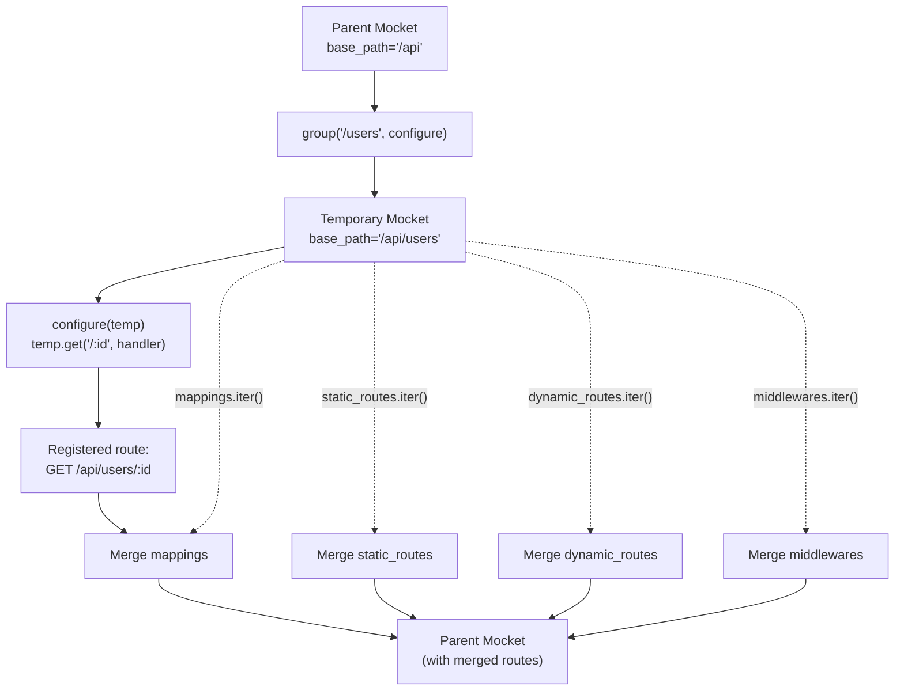
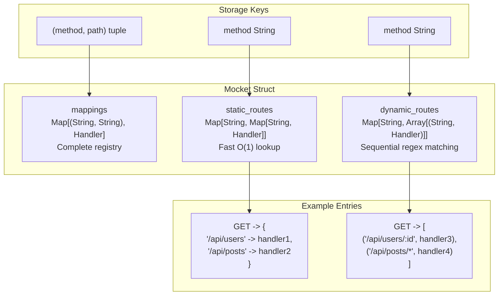

# Route Registration API

This document describes the API for registering HTTP routes in Mocket. It covers the method signatures, parameters, and internal storage mechanisms used to define route handlers. For conceptual information about how routing works (static vs dynamic routes, pattern matching), see [Routing System](#2.1). For information about route groups and middleware, see [Middleware System](#2.2).

## Overview

Mocket provides a fluent API for registering routes that follows Express.js conventions. All route registration methods are defined on the `Mocket` struct and follow a consistent signature pattern. Routes are registered by associating an HTTP method and path pattern with an async handler function that returns an `HttpBody`.

Sources: [src/index.mbt:11-27](), [src/pkg.generated.mbti:113-134]()

## Core Registration Method: `on`

The `on` method is the fundamental route registration function that all other HTTP method helpers delegate to. It registers a handler for a specific HTTP method and path combination.

### Method Signature

```moonbit
pub fn on(
  self : Mocket,
  event : String,
  path : String,
  handler : async (HttpEvent) -> HttpBody noraise,
) -> Unit
```

### Parameters

| Parameter | Type | Description |
|-----------|------|-------------|
| `self` | `Mocket` | The Mocket instance |
| `event` | `String` | The HTTP method (e.g., "GET", "POST") or "*" for all methods |
| `path` | `String` | The route path pattern (supports `:param` and `*`/`**` wildcards) |
| `handler` | `async (HttpEvent) -> HttpBody noraise` | Async function that processes the request and returns a response body |

### Internal Behavior

The `on` method performs three key operations:

1. **Path Normalization**: Prepends the instance's `base_path` to the provided path
2. **Route Storage**: Stores the handler in the `mappings` Map with key `(event, path)`
3. **Route Caching**: Categorizes and caches the route for optimized lookup

**Route Categorization Diagram**



Sources: [src/index.mbt:89-128]()

The method optimizes route lookup by storing static routes (exact path matches) in a nested Map structure for O(1) access, while dynamic routes (containing parameters or wildcards) are stored in Arrays that require sequential regex matching at lookup time [src/index.mbt:99-127]().

## HTTP Method Convenience Methods

Mocket provides dedicated methods for all standard HTTP methods. Each method is a thin wrapper around `on` that hard-codes the HTTP method parameter.

### Available Methods

| Method | HTTP Verb | Typical Use Case |
|--------|-----------|------------------|
| `get` | GET | Retrieve resources |
| `post` | POST | Create resources |
| `put` | PUT | Update/replace resources |
| `patch` | PATCH | Partial resource updates |
| `delete` | DELETE | Remove resources |
| `head` | HEAD | Retrieve headers only |
| `options` | OPTIONS | CORS preflight requests |
| `trace` | TRACE | Diagnostic loopback |
| `connect` | CONNECT | Establish tunnels |
| `all` | * | Match any HTTP method |

### Method Signatures

All HTTP method helpers follow the same signature pattern:

```moonbit
pub fn get(
  self : Mocket,
  path : String,
  handler : async (HttpEvent) -> HttpBody noraise,
) -> Unit

pub fn post(
  self : Mocket,
  path : String,
  handler : async (HttpEvent) -> HttpBody noraise,
) -> Unit

// ... similar signatures for put, patch, delete, head, options, trace, connect
```

**Method Delegation Diagram**



Sources: [src/index.mbt:131-218]()

### Implementation Details

Each convenience method is implemented as a single-line delegation:

- `get`: delegates to `on("GET", path, handler)` [src/index.mbt:131-137]()
- `post`: delegates to `on("POST", path, handler)` [src/index.mbt:140-146]()
- `patch`: delegates to `on("PATCH", path, handler)` [src/index.mbt:149-155]()
- `connect`: delegates to `on("CONNECT", path, handler)` [src/index.mbt:158-164]()
- `put`: delegates to `on("PUT", path, handler)` [src/index.mbt:167-173]()
- `delete`: delegates to `on("DELETE", path, handler)` [src/index.mbt:176-182]()
- `head`: delegates to `on("HEAD", path, handler)` [src/index.mbt:185-191]()
- `options`: delegates to `on("OPTIONS", path, handler)` [src/index.mbt:194-200]()
- `trace`: delegates to `on("TRACE", path, handler)` [src/index.mbt:203-209]()

### The `all` Method

The `all` method is unique in that it registers a handler for all HTTP methods by using the wildcard event `"*"`:

```moonbit
pub fn all(
  self : Mocket,
  path : String,
  handler : async (HttpEvent) -> HttpBody noraise,
) -> Unit {
  self.on("*", path, handler)
}
```

This is useful for implementing catch-all handlers or routes that should respond identically regardless of the HTTP method used.

Sources: [src/index.mbt:212-218]()

## Route Groups

The `group` method creates a logical grouping of routes under a common path prefix. This is essential for organizing complex APIs and applying shared middleware to related routes.

### Method Signature

```moonbit
pub fn group(
  self : Mocket,
  base_path : String,
  configure : (Mocket) -> Unit,
) -> Unit
```

### Parameters

| Parameter | Type | Description |
|-----------|------|-------------|
| `base_path` | `String` | Path prefix to prepend to all routes in the group |
| `configure` | `(Mocket) -> Unit` | Callback function that receives a new Mocket instance for route registration |

### Group Merging Process

The `group` method creates a temporary `Mocket` instance with a combined `base_path` and then merges all registered routes and middleware back into the parent instance.

**Route Group Merging Diagram**



Sources: [src/index.mbt:222-255]()

### Merge Operations

The group method performs four distinct merge operations:

1. **Mappings Merge** [src/index.mbt:230](): All entries from `group.mappings` are set into `self.mappings`
2. **Static Routes Merge** [src/index.mbt:231-241](): For each HTTP method in `group.static_routes`, either merge into existing method map or create new entry
3. **Dynamic Routes Merge** [src/index.mbt:242-252](): For each HTTP method in `group.dynamic_routes`, append routes to existing array or create new array
4. **Middleware Merge** [src/index.mbt:254](): All middleware from `group.middlewares` are pushed to `self.middlewares`

## Handler Function Signature

All route registration methods require a handler function with this signature:

```moonbit
async (HttpEvent) -> HttpBody noraise
```

### Handler Components

| Component | Description |
|-----------|-------------|
| `async` | The handler is asynchronous and may perform async operations |
| `HttpEvent` | Input parameter containing request, response, and extracted path parameters |
| `HttpBody` | Return type representing the response body (Json, Text, HTML, Bytes, or Empty) |
| `noraise` | The handler must not raise errors (errors should be handled internally) |

The `HttpEvent` type provides access to:
- `req : HttpRequest` - The incoming HTTP request
- `res : HttpResponse` - The response object for setting status codes and headers
- `params : Map[String, String]` - Extracted path parameters from dynamic routes

Sources: [src/pkg.generated.mbti:49-61]()

## Internal Storage Structure

Routes are stored in three internal data structures within the `Mocket` struct:

**Route Storage Architecture**



Sources: [src/index.mbt:11-27]()

### Storage Fields

| Field | Type | Purpose |
|-------|------|---------|
| `mappings` | `Map[(String, String), Handler]` | Complete route registry with (method, path) keys |
| `static_routes` | `Map[String, Map[String, Handler]]` | Two-level map for static routes: method → path → handler |
| `dynamic_routes` | `Map[String, Array[(String, Handler)]]` | Arrays of dynamic routes per method: method → [(path, handler)] |

The dual caching strategy in `static_routes` and `dynamic_routes` optimizes route lookup performance by separating routes that can be matched with exact string comparison from those requiring regex pattern matching. See [Static Routes](#2.1.1) and [Dynamic Routes and Parameters](#2.1.2) for details on the lookup process.

Sources: [src/index.mbt:11-27](), [src/index.mbt:99-127]()