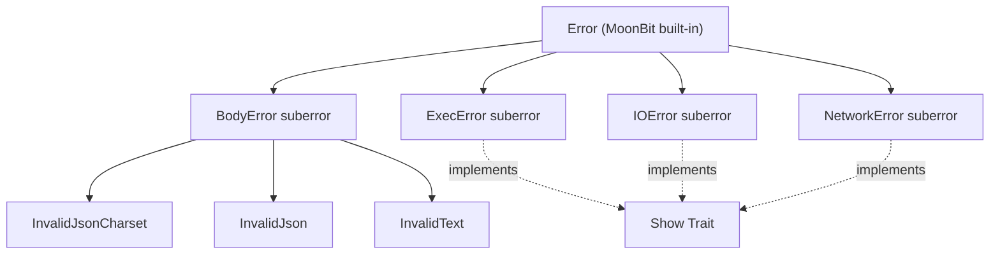
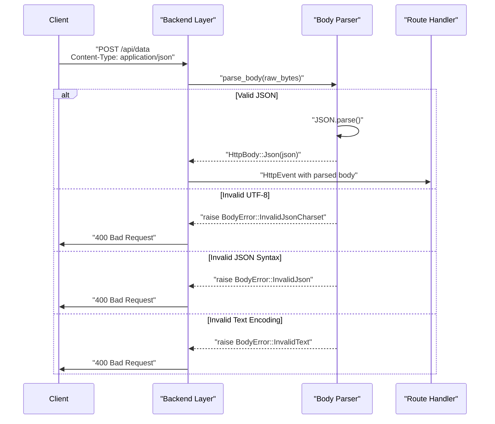
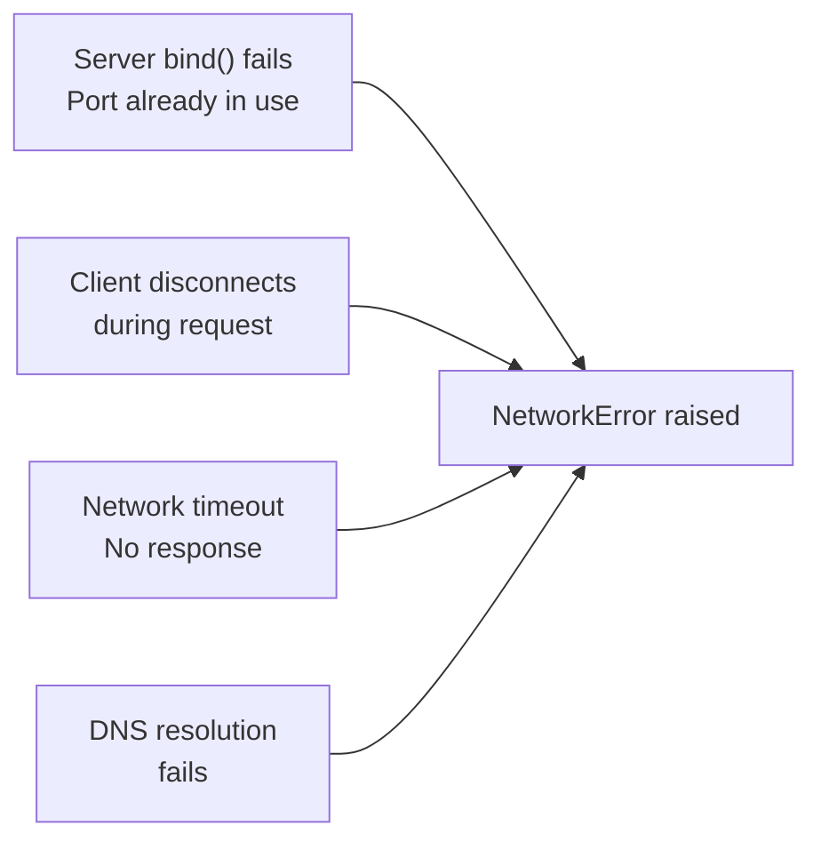
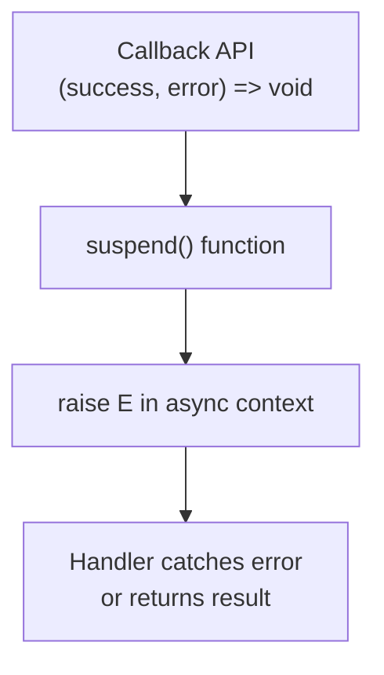
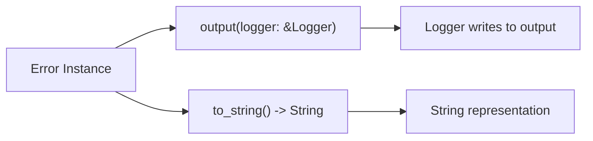

# Error Types

## Purpose and Scope

This document provides a comprehensive reference for all error types defined in the Mocket framework and their error handling patterns. Mocket defines four distinct error subtypes used throughout the framework: `BodyError` for request body parsing failures, `ExecError` for execution-related errors, `IOError` for input/output operations, and `NetworkError` for network-related failures.

For information about how these errors are used in request/response processing, see [Request and Response Handling](#2.3). For backend-specific error handling implementations, see [JavaScript Backend](#3.1) and [Native Backend](#3.2).

---

## Error Type Hierarchy

Mocket's error types follow MoonBit's suberror mechanism, where each error type is declared as a `suberror` that can be raised and caught independently. All error types implement the `Show` trait for string representation and logging.



**Diagram: Error Type Hierarchy and Trait Implementation**

The error hierarchy is flat, with each error type being an independent suberror. Only `BodyError` defines specific error variants, while `ExecError`, `IOError`, and `NetworkError` are opaque error types whose internal structure is backend-specific.

**Sources:** `src/pkg.generated.mbti:27-46`

---

## BodyError

`BodyError` is used when parsing request body content fails. It is the only error type in Mocket that exposes specific error variants.

| Error Variant | Description | When Raised |
|--------------|-------------|-------------|
| `InvalidJsonCharset` | JSON content has invalid character encoding | Request body declares JSON Content-Type but contains non-UTF-8 bytes |
| `InvalidJson` | JSON parsing failed | Request body is valid UTF-8 but not valid JSON syntax |
| `InvalidText` | Text parsing failed | Request body declares text Content-Type but contains invalid UTF-8 |

### Usage in Request Pipeline



**Diagram: BodyError Propagation in Request Processing**

The body parser raises specific `BodyError` variants based on the failure mode. Backends catch these errors and convert them to appropriate HTTP error responses (typically 400 Bad Request).

**Sources:** `src/pkg.generated.mbti:27-31`

---

## ExecError

`ExecError` represents execution-related failures in the framework. This is an opaque error type whose internal structure depends on the backend implementation.

### Type Signature and Methods

```
pub suberror ExecError

// Show trait implementation
fn ExecError::output(Self, &@builtin.Logger) -> Unit
fn ExecError::to_string(Self) -> String
impl Show for ExecError
```

The `ExecError` type implements the `Show` trait, providing two methods:
- `output(logger)`: Writes the error description to a logger
- `to_string()`: Converts the error to a string representation

### Common Causes

While the specific error variants are not exposed, `ExecError` typically occurs in these scenarios:
- Handler execution failures in the routing system
- Middleware execution errors
- Internal framework state corruption

**Sources:** `src/pkg.generated.mbti:33-36`

---

## IOError

`IOError` represents input/output operation failures, primarily used in file operations and stream processing.

### Type Signature and Methods

```
pub suberror IOError

// Show trait implementation
fn IOError::output(Self, &@builtin.Logger) -> Unit
fn IOError::to_string(Self) -> String
impl Show for IOError
```

Like `ExecError`, `IOError` is an opaque type that implements the `Show` trait for error display.

### Backend-Specific Usage

The `IOError` type is used differently across backends:

| Backend | Primary Usage |
|---------|--------------|
| JavaScript | Reading request body streams from Node.js `req` object |
| Native | Reading from C file descriptors via FFI bindings |
| WASM | Currently unimplemented |

**Sources:** `src/pkg.generated.mbti:38-41`

---

## NetworkError

`NetworkError` represents network-level failures during HTTP operations.

### Type Signature and Methods

```
pub suberror NetworkError

// Show trait implementation
fn NetworkError::output(Self, &@builtin.Logger) -> Unit
fn NetworkError::to_string(Self) -> String
impl Show for NetworkError
```

This error type implements the `Show` trait for logging and display purposes.

### Common Network Failure Scenarios



**Diagram: Common NetworkError Causes**

Network errors can occur at various stages:
- Server initialization (port binding failures)
- Request processing (client disconnections)
- Response transmission (network timeouts)
- DNS resolution (backend-dependent)

**Sources:** `src/pkg.generated.mbti:43-46`

---

## Error Handling Patterns

### The suspend Function

The framework provides a `suspend` function for converting callback-based error handling to MoonBit's `raise` mechanism:

```
async fn[T, E : Error] suspend(
  ((T) -> Unit, (E) -> Unit) -> Unit
) -> T raise E
```

This function bridges callback-style error handling (common in JavaScript) with MoonBit's type-safe error handling.

**Usage Pattern:**



**Diagram: suspend() Function Error Conversion**

The `suspend` function enables async functions to use `raise` syntax while working with callback-based APIs. When the error callback is invoked, `suspend` raises the error in the async context.

**Sources:** `src/pkg.generated.mbti:24`

### Error Propagation in Handlers

Route handlers in Mocket use the `noraise` annotation, indicating they do not propagate errors to callers:

```
async (HttpEvent) -> HttpBody noraise
```

This design means:
- Handlers must catch and handle all errors internally
- Errors are converted to appropriate HTTP responses (4xx/5xx status codes)
- The framework guarantees that handlers never crash the server

### Error-to-Response Conversion Table

| Error Type | Typical HTTP Status | Response Body |
|-----------|-------------------|---------------|
| `BodyError::InvalidJsonCharset` | 400 Bad Request | "Invalid character encoding in JSON" |
| `BodyError::InvalidJson` | 400 Bad Request | "Invalid JSON syntax" |
| `BodyError::InvalidText` | 400 Bad Request | "Invalid text encoding" |
| `ExecError` | 500 Internal Server Error | "Handler execution failed" |
| `IOError` | 500 Internal Server Error | "I/O operation failed" |
| `NetworkError` | 503 Service Unavailable | "Network error occurred" |

These conversions are handled by backend-specific code and may vary slightly between implementations.

**Sources:** `src/pkg.generated.mbti:115`

---

## Show Trait Implementation

Three of the four error types implement the `Show` trait, which provides standardized string conversion and logging capabilities.

### Show Trait Methods



**Diagram: Show Trait Method Flow**

The `output` method is used for logging errors during request processing, while `to_string` is used when errors need to be included in HTTP response bodies or error messages.

**Sources:** `src/pkg.generated.mbti:34-36,39-41,44-46`

### Integration with Logger System

The framework's `Logger` type (see [Logging System](#5.1)) uses the `Show` trait implementation to format error messages:

```
// Example error logging (conceptual)
logger.error(() => error.to_string())
```

This integration ensures that all errors have consistent formatting in logs, making debugging and monitoring easier.

---

## Complete Error Handling Flow

The following diagram shows how errors flow through the entire request processing pipeline:


**Diagram: Complete Error Handling Flow Through Request Pipeline**

This sequence shows:
1. **Body parsing errors** are caught at the backend layer and converted to 400 responses
2. **Routing errors** result in 500 responses when internal execution fails
3. **Handler errors** are caught by handlers themselves (noraise guarantee) and converted to appropriate error responses
4. **All errors** are logged using the `Show` trait's `to_string()` method

**Sources:** `src/pkg.generated.mbti:27-46,115-134`