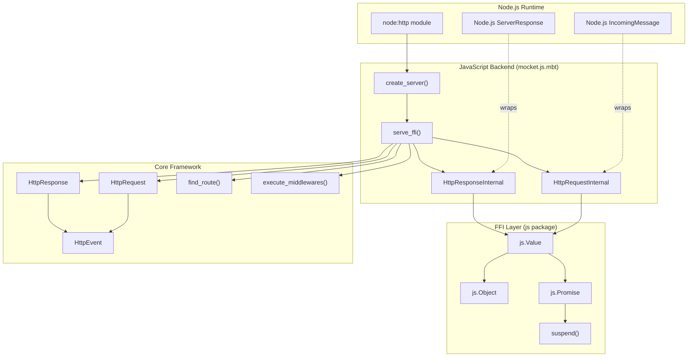
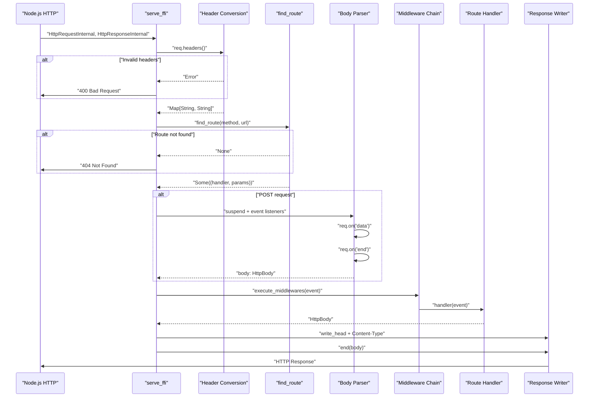
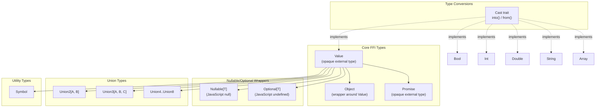

# JavaScript Backend

The JavaScript backend provides Node.js runtime support for the Mocket framework. It handles the conversion between Node.js HTTP primitives and Mocket's platform-agnostic core types, manages asynchronous operations through JavaScript Promises, and exposes foreign function interface (FFI) bindings for JavaScript interoperability.

For asynchronous operation details, see [Asynchronous Operations](#3.1.1). For the JavaScript FFI layer specifics, see [JavaScript FFI Layer](#3.1.2). For comparison with other backend implementations, see [Native Backend](#3.2) and [WASM Backend](#3.3).

## Architecture Overview

The JavaScript backend operates as a translation layer between Node.js's HTTP server and Mocket's core framework. It consists of three main components: internal platform-specific types that wrap Node.js objects, FFI bindings that enable JavaScript interop, and the server creation logic that orchestrates request handling.



**Sources:** [src/mocket.js.mbt:1-150](), [src/js/pkg.generated.mbti:1-213]()

## Platform-Specific Internal Types

The JavaScript backend defines two opaque external types that wrap Node.js request and response objects. These types are never exposed to user code and exist solely to bridge the gap between Node.js and Mocket's type system.

### HttpRequestInternal

The `HttpRequestInternal` type [src/mocket.js.mbt:3]() wraps Node.js's `IncomingMessage` object. It provides FFI methods to extract request properties:

| Method | Purpose | FFI Binding |
|--------|---------|-------------|
| `url()` | Extract request URL | [src/mocket.js.mbt:15-17]() |
| `req_method()` | Extract HTTP method | [src/mocket.js.mbt:20-22]() |
| `headers()` | Access request headers | [src/mocket.js.mbt:32-34]() |
| `on()` | Register event listeners | [src/mocket.js.mbt:25-29]() |

The `on()` method is critical for handling POST request bodies, as it allows subscribing to Node.js stream events like `"data"` and `"end"`.

### HttpResponseInternal

The `HttpResponseInternal` type [src/mocket.js.mbt:7]() wraps Node.js's `ServerResponse` object. It provides methods for sending responses:

| Method | Purpose | FFI Binding |
|--------|---------|-------------|
| `write_head()` | Set status code and headers | [src/mocket.js.mbt:48-52]() |
| `end()` | Send response body and close | [src/mocket.js.mbt:42-45]() |

**Sources:** [src/mocket.js.mbt:3-52]()

## Server Creation and Binding

### create_server Function

The `create_server` function [src/mocket.js.mbt:55-58]() creates a Node.js HTTP server and binds it to the specified port:

```
create_server(
  handler : (HttpRequestInternal, HttpResponseInternal, () -> Unit) -> Unit,
  port : Int
) -> Unit
```

This function uses inline JavaScript FFI to invoke `require('node:http').createServer(handler).listen(port)`. The handler receives three parameters: the request object, response object, and a continuation callback (currently unused).

**Sources:** [src/mocket.js.mbt:55-58]()

## Request Processing Pipeline

The `serve_ffi` function [src/mocket.js.mbt:61-149]() implements the complete request processing pipeline. It orchestrates header conversion, route matching, body parsing, middleware execution, and response generation.



**Sources:** [src/mocket.js.mbt:61-149]()

### Header Conversion

Headers are converted from Node.js's header object to Mocket's `Map[String, String]` representation [src/mocket.js.mbt:64-77]():

1. Extract headers using `req.headers()` which returns a `js.Object`
2. Convert to JSON representation using `to_value().to_json()`
3. Validate that the result is a JSON object
4. Iterate over each key-value pair, filtering for string values
5. Store in a MoonBit `Map[String, String]`

If header conversion fails, a 400 response is immediately returned without further processing.

**Sources:** [src/mocket.js.mbt:64-77]()

### Route Resolution

After header conversion, the request is passed to the core routing system [src/mocket.js.mbt:78-86]():

```
match mocket.find_route(req.req_method(), req.url()) {
  Some((h, p)) => (p, h)
  _ => {
    res.write_head(404, @js.Object::new().to_value())
    res.end(@js.Value::cast_from("Not Found"))
    return
  }
}
```

If no matching route is found, a 404 response is sent immediately. Otherwise, the handler function and extracted parameters are obtained.

**Sources:** [src/mocket.js.mbt:78-86]()

### HttpEvent Construction

An `HttpEvent` is constructed [src/mocket.js.mbt:87-96]() with:

- **req**: Contains HTTP method, URL, empty body (initially), and converted headers
- **res**: Contains default status code 200 and empty headers map
- **params**: Route parameters extracted by the pattern matcher

**Sources:** [src/mocket.js.mbt:87-96]()

### Asynchronous Body Parsing

For POST requests, the body is parsed asynchronously [src/mocket.js.mbt:99-113]() using the `suspend` function from the async module:

1. Create a buffer to accumulate incoming data
2. Use `suspend` to convert Node.js callback-based events to async/await
3. Register `"data"` event listener to append chunks to the buffer
4. Register `"end"` event listener to signal completion
5. Call `read_body` with headers and buffer bytes to parse based on Content-Type
6. On error, return 400 Bad Request

The `suspend` function [src/js/async.mbt:2-4]() is the core primitive enabling this callback-to-Promise conversion.

**Sources:** [src/mocket.js.mbt:99-113](), [src/js/async.mbt:2-4]()

### Response Generation

After middleware and handler execution, the response is generated [src/mocket.js.mbt:118-144]():

1. Set Content-Type header based on `HttpBody` variant:
   - `Bytes(_)`: "application/octet-stream"
   - `HTML(_)`: "text/html; charset=utf-8"
   - `Text(_)`: "text/plain; charset=utf-8"
   - `Json(_)`: "application/json; charset=utf-8"
   - `Empty`: no Content-Type

2. Convert response headers map to JavaScript object using JSON serialization
3. Call `write_head` with status code and headers
4. Call `end` with serialized body content

Each `HttpBody` variant is converted to the appropriate JavaScript representation using `js.Value::cast_from`.

**Sources:** [src/mocket.js.mbt:118-144]()

## JavaScript FFI Type System

The JavaScript FFI layer provides a comprehensive type system for JavaScript interoperability, defined in the `js` package. These types enable safe interaction between MoonBit and JavaScript runtime.



**Sources:** [src/js/pkg.generated.mbti:1-213]()

### Value Type

The `Value` type [src/js/pkg.generated.mbti:166]() is the fundamental JavaScript interop type. It represents any JavaScript value and provides extensive methods for manipulation:

| Category | Methods |
|----------|---------|
| Property access | `get_with_string`, `get_with_index`, `get_with_symbol` |
| Property mutation | `set_with_string`, `set_with_index`, `set_with_symbol` |
| Function invocation | `apply`, `apply_with_string`, `apply_with_index`, `apply_with_symbol` |
| Constructor invocation | `new`, `new_with_string`, `new_with_index`, `new_with_symbol` |
| Type checking | `is_bool`, `is_null`, `is_number`, `is_object`, `is_string`, `is_symbol`, `is_undefined` |
| Conversions | `cast`, `cast_from`, `to_json`, `from_json`, `to_string` |

These methods enable complete interaction with JavaScript objects, allowing MoonBit code to call JavaScript functions, access properties, and construct objects.

**Sources:** [src/js/pkg.generated.mbti:166-197]()

### Object Type

The `Object` type [src/js/pkg.generated.mbti:45]() wraps a `Value` and provides dictionary-like operations:

- `new()`: Create empty JavaScript object
- `op_get[K, V]`: Access properties with type-safe getters
- `op_set[K, V]`: Set properties with type-safe setters
- `from_iter` / `from_iter2`: Construct from MoonBit iterators
- `extend_object`: Merge two objects

The `Object` type is used extensively in `serve_ffi` for header manipulation [src/mocket.js.mbt:67, 82, 108, 132]().

**Sources:** [src/js/pkg.generated.mbti:45-58](), [src/mocket.js.mbt:67]()

### Nullable and Optional

`Nullable[T]` [src/js/pkg.generated.mbti:36]() represents JavaScript `null`, while `Optional[T]` [src/js/pkg.generated.mbti:60]() represents JavaScript `undefined`:

| Type | JavaScript Value | Methods |
|------|------------------|---------|
| `Nullable[T]` | `null` | `null()`, `is_null()`, `from_option()`, `to_option()`, `unwrap()` |
| `Optional[T]` | `undefined` | `undefined()`, `is_undefined()`, `from_option()`, `to_option()`, `unwrap()` |

These types enable safe handling of JavaScript's dual null-ness concepts.

**Sources:** [src/js/pkg.generated.mbti:36-67]()

### Union Types

The FFI layer provides `Union2` through `Union8` [src/js/pkg.generated.mbti:81-163]() for TypeScript-style union types:

```
Union2[A, B]    // A | B
Union3[A, B, C] // A | B | C
...
Union8[A, B, C, D, E, F, G, H] // A | B | C | D | E | F | G | H
```

Each union provides:
- `from0`, `from1`, ... constructors for each variant
- `to0`, `to1`, ... extractors returning `Option[T]`

These enable interaction with JavaScript APIs that accept or return multiple types.

**Sources:** [src/js/pkg.generated.mbti:81-163]()

### Cast Trait

The `Cast` trait [src/js/pkg.generated.mbti:203-212]() defines bidirectional conversions between MoonBit and JavaScript types:

```
trait Cast {
  into(Value) -> Self?
  from(Self) -> Value
}
```

Implementations exist for:
- `Bool`
- `Int`
- `Double`
- `String`
- `Array[A : Cast]`

This trait enables the `Value::cast` and `Value::cast_from` methods used throughout the JavaScript backend for type conversions.

**Sources:** [src/js/pkg.generated.mbti:203-212]()

## Global Functions and Utilities

The FFI layer provides several global utility functions:

| Function | Purpose | Source |
|----------|---------|--------|
| `require(String, keys? : Array[String])` | Import Node.js modules | [src/js/pkg.generated.mbti:21]() |
| `async_run(async () -> Unit noraise)` | Execute async function | [src/js/pkg.generated.mbti:13]() |
| `async_all[T](Array[async () -> T])` | Concurrent execution | [src/js/pkg.generated.mbti:9]() |
| `spawn_detach[T, E]` | Fire-and-forget async | [src/js/pkg.generated.mbti:23]() |
| `globalThis` | Access global object | [src/js/pkg.generated.mbti:17]() |

The `require` function is used in `create_server` to import the `node:http` module [src/mocket.js.mbt:58]().

**Sources:** [src/js/pkg.generated.mbti:9-23](), [src/mocket.js.mbt:58]()

## Error Handling

JavaScript errors are represented as the `Error_` suberror [src/js/pkg.generated.mbti:28](), which wraps a JavaScript `Value`. It provides:

- `cause()`: Extract the underlying JavaScript error object
- `wrap()`: Execute JavaScript code and convert exceptions to MoonBit errors
- `Show` trait implementation for error display

In `serve_ffi`, errors from body parsing are caught and result in 400 Bad Request responses [src/mocket.js.mbt:106-112]().

**Sources:** [src/js/pkg.generated.mbti:28-33](), [src/mocket.js.mbt:106-112]()