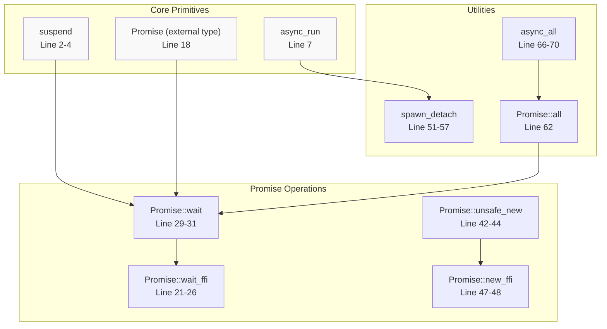
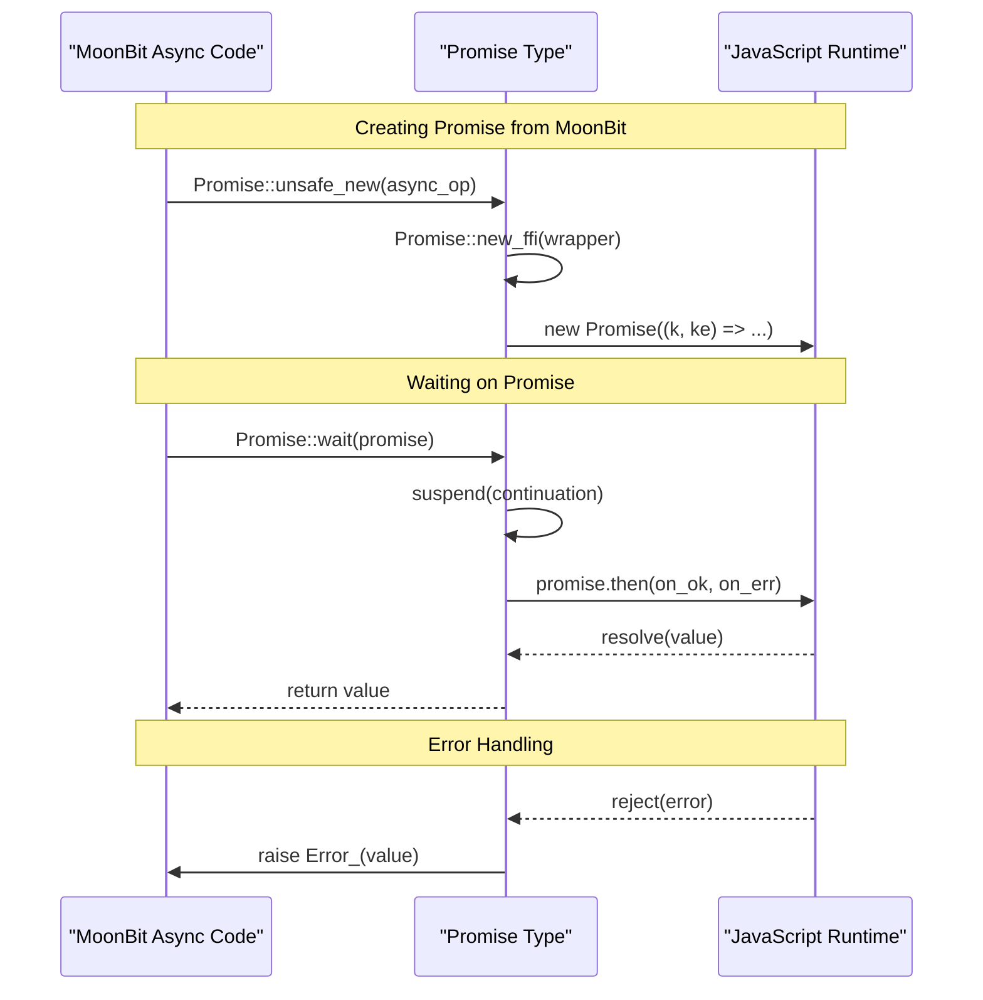
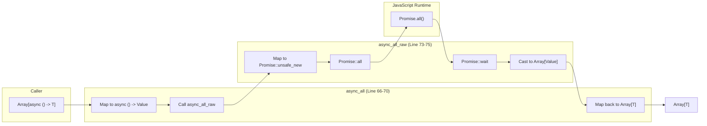
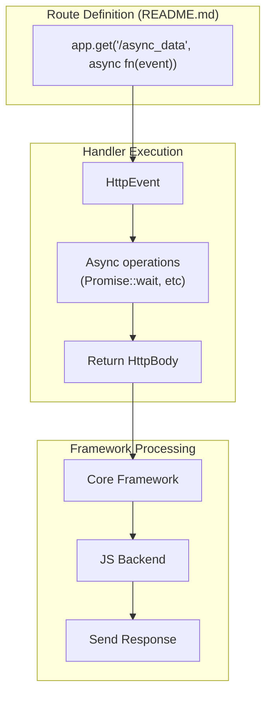

# Asynchronous Operations

This document explains the asynchronous programming model used in Mocket's JavaScript backend. It covers the core async primitives, Promise integration with JavaScript's native Promise API, concurrent execution patterns, and error handling mechanisms.

This page is specific to the JavaScript backend (see [JavaScript Backend](#3.1) for general backend information). The native backend uses a different concurrency model based on Mongoose's callback system (see [Native Backend](#3.2)).

## Purpose and Scope

The JavaScript backend implements asynchronous operations using MoonBit's async/await syntax with direct integration to JavaScript's Promise API. This enables non-blocking I/O operations while maintaining type safety and error handling guarantees. The implementation provides three key capabilities:

1. **Suspend/resume primitives** for converting callback-based JavaScript APIs into async MoonBit code
2. **Promise wrapping** for interoperability with JavaScript promise-returning functions
3. **Concurrent execution** for running multiple async operations in parallel

Sources: [src/js/async.mbt:1-88](), [README.md:73-84]()

## Core Async Primitives

The async system is built on three fundamental operations defined in [src/js/async.mbt]():



**Diagram: Async Primitive Dependency Graph**

Sources: [src/js/async.mbt:1-88]()

### suspend Function

The `suspend` function [src/js/async.mbt:2-4]() is the foundational primitive that converts callback-based JavaScript APIs into MoonBit's async/await model:

```moonbit
pub async fn[T, E : Error] suspend(
  f : ((T) -> Unit, (E) -> Unit) -> Unit,
) -> T raise E
```

This function takes a callback-accepting function `f` that receives two callbacks: one for success (`(T) -> Unit`) and one for errors (`(E) -> Unit`). The `suspend` primitive pauses execution until one of these callbacks is invoked, then resumes with the provided value or raises the error.

The implementation uses the MoonBit compiler intrinsic `"%async.suspend"` which interfaces with the JavaScript runtime's microtask queue.

Sources: [src/js/async.mbt:2-4]()

### async_run Function

The `async_run` function [src/js/async.mbt:7]() executes an async function in a fire-and-forget manner:

```moonbit
pub fn async_run(f : async () -> Unit noraise) -> Unit
```

This function schedules the async operation to run but does not wait for its completion. It requires the operation to be `noraise`, meaning any errors must be handled within the async function itself.

Sources: [src/js/async.mbt:7]()

## Promise Integration

The JavaScript backend provides bidirectional integration between MoonBit's async model and JavaScript's Promise API through the `Promise` type and its associated operations.



**Diagram: Promise Integration Flow**

Sources: [src/js/async.mbt:18-48]()

### Promise Type

The `Promise` type [src/js/async.mbt:18]() is an external type that directly represents JavaScript Promise objects. It is marked as `#external` to indicate it wraps a JavaScript value without MoonBit-side representation.

### Promise::wait

The `Promise::wait` function [src/js/async.mbt:29-31]() converts a JavaScript Promise into a MoonBit async operation:

```moonbit
pub async fn Promise::wait(self : Promise) -> Value {
  suspend(fn(k, ke) { Promise::wait_ffi(self, k, fn(e) { ke(Error_(e)) }) })
}
```

This function:
1. Uses `suspend` to pause execution
2. Calls `Promise::wait_ffi` which attaches `.then()` handlers to the JavaScript Promise [src/js/async.mbt:21-26]()
3. Resumes with the resolved value or raises an `Error_` exception if the Promise rejects

Sources: [src/js/async.mbt:29-31](), [src/js/async.mbt:21-26]()

### Promise::unsafe_new

The `Promise::unsafe_new` function [src/js/async.mbt:42-44]() creates a JavaScript Promise from a MoonBit async operation:

```moonbit
pub fn[T] Promise::unsafe_new(op : async () -> T) -> Promise {
  Promise::new_ffi(fn() { Value::cast_from(op()) })
}
```

This function wraps the async operation in a JavaScript Promise constructor via `Promise::new_ffi` [src/js/async.mbt:47-48](), which uses the FFI:

```javascript
(op) => new Promise((k, ke) => op(k, ke))
```

The "unsafe" prefix indicates that the caller must ensure proper error handling by calling `Promise::wait` on the result or passing it to external JavaScript code that will handle errors.

Sources: [src/js/async.mbt:42-48]()

## Concurrent Execution

The framework provides `async_all` for executing multiple async operations concurrently and waiting for all of them to complete.



**Diagram: Concurrent Execution Flow with async_all**

Sources: [src/js/async.mbt:66-75]()

### async_all Function

The `async_all` function [src/js/async.mbt:66-70]() executes multiple async operations concurrently:

```moonbit
pub async fn[T] async_all(ops : Array[async () -> T]) -> Array[T] {
  async_all_raw(ops.map(fn(op) { async fn() { Value::cast_from(op()) } })).map(
    Value::cast,
  )
}
```

The implementation:
1. Wraps each operation to return `Value` type
2. Delegates to `async_all_raw` [src/js/async.mbt:73-75]()
3. Casts the results back to the original type `T`

### async_all_raw Implementation

The `async_all_raw` function [src/js/async.mbt:73-75]() implements the core logic:

```moonbit
async fn async_all_raw(ops : Array[async () -> Value]) -> Array[Value] {
  Promise::all(ops.map(Promise::unsafe_new)).wait().cast()
}
```

This function:
1. Converts each async operation to a Promise using `Promise::unsafe_new`
2. Passes the Promise array to JavaScript's `Promise.all()` [src/js/async.mbt:62]()
3. Waits for the resulting Promise to resolve
4. Casts the JavaScript array result back to MoonBit `Array[Value]`

Sources: [src/js/async.mbt:73-75](), [src/js/async.mbt:62]()

## Error Handling

The async system provides structured error propagation through MoonBit's `raise` mechanism integrated with JavaScript's Promise rejection.

| Scenario | Mechanism | Code Reference |
|----------|-----------|----------------|
| Promise rejection | Wrapped in `Error_` and raised | [src/js/async.mbt:30]() |
| Async function error | Propagated through `suspend` | [src/js/async.mbt:2-4]() |
| Detached spawn error | Caught with try/catch, then ignored | [src/js/async.mbt:51-57]() |
| Test errors | Printed and panicked | [src/js/async.mbt:78-87]() |

### Error Propagation in suspend

When a JavaScript Promise rejects, the error is converted to a MoonBit error through the error callback in `suspend`:

```moonbit
suspend(fn(k, ke) { Promise::wait_ffi(self, k, fn(e) { ke(Error_(e)) }) })
```

The error callback `ke` receives an `Error_(e)` which wraps the JavaScript error value, allowing it to propagate through MoonBit's error handling system.

Sources: [src/js/async.mbt:30]()

### spawn_detach Error Handling

The `spawn_detach` function [src/js/async.mbt:51-57]() handles errors from fire-and-forget operations:

```moonbit
pub fn[T, E : Error] spawn_detach(op : async () -> T raise E) -> Unit {
  async_run(fn() {
    try op() |> ignore catch {
      _ => ()
    }
  })
}
```

This function wraps the operation in a try/catch block that silently ignores all errors. This is appropriate for detached operations where the caller cannot handle errors, but it means errors will not be reported unless the operation itself logs them.

Sources: [src/js/async.mbt:51-57]()

## Usage in Route Handlers

Async operations integrate seamlessly with Mocket's route handler system. Route handlers can be declared as async functions and use `await` syntax.



**Diagram: Async Route Handler Flow**

Sources: [README.md:81-84](), [README.md:148-150]()

### Example from README

The README demonstrates async route handlers [README.md:81-84]():

```moonbit
// async json data example
app.get("/async_data", async fn(event) {
  Json({ "name": "John Doe", "age": 30, "city": "New York" })
})
```

And the more complete example [README.md:148-150]():

```moonbit
..get("/async_data", async fn(_event) noraise {
  Json({ "name": "John Doe", "age": 30, "city": "New York" })
})
```

The handler is marked as `async fn`, allowing it to use `await` on Promise operations. The framework's JavaScript backend handles the async execution and waits for the handler to complete before sending the response.

Sources: [README.md:81-84](), [README.md:148-150]()

## Safety Considerations

The async module includes several safety notes in comments that developers must understand:

### Promise::wait Safety

From [src/js/async.mbt:10-16]():

> You should always `Promise::wait` on any `Promise` you own to attach exception handlers, as long as you are responsible for the control flow (i.e. this `Promise` is not handled by an external JavaScript API). This makes sure that when the operation in the this `Promise` errs out, the error is caught by the MoonBit runtime.

This means:
- Always call `Promise::wait` on promises you create
- Ensures errors are caught by MoonBit's error handling
- Exception: If passing the promise to JavaScript code that will handle it

### Promise::unsafe_new Safety

From [src/js/async.mbt:34-42]():

> You should always `Promise::wait` on the result of this function to attach exception handlers, as long as you are responsible for the control flow (i.e. the resulting `Promise` is not handled by an external JavaScript API). This makes sure that when `op` errs out, the error is caught by the MoonBit runtime.
>
> If you don't care about the result of the operation, you can use `spawn_detach` instead.

Key implications:
- `Promise::unsafe_new` requires manual error handling via `Promise::wait`
- Use `spawn_detach` [src/js/async.mbt:51-57]() for fire-and-forget operations
- Failure to wait on promises can result in unhandled rejections in JavaScript

Sources: [src/js/async.mbt:10-16](), [src/js/async.mbt:34-42]()

## Comparison with moonbitlang/async

As noted in the README [README.md:210-212]():

> moonbitlang/async is a great library, but it is not supported by the js backend.

Mocket's custom async implementation exists because the standard `moonbitlang/async` library does not support JavaScript compilation. This custom implementation provides:

1. Direct integration with JavaScript's Promise API
2. Support for both Node.js and browser JavaScript runtimes
3. Type-safe async/await syntax specific to the JavaScript backend

For code that needs to work across multiple backends, async operations must be backend-specific and cannot be shared between JavaScript and native backends (which use different concurrency models).

Sources: [README.md:210-212]()