# JavaScript FFI Layer

The JavaScript FFI (Foreign Function Interface) Layer provides type-safe interoperability between MoonBit code and JavaScript runtimes (Node.js and browser environments). This layer enables the JavaScript backend to call JavaScript APIs, manipulate JavaScript objects, handle promises, and convert between MoonBit and JavaScript types.

For information about how this FFI layer is used in the JavaScript backend's HTTP server implementation, see [JavaScript Backend](#3.1). For details on Promise-based async operations, see [Asynchronous Operations](#3.1.1).

## Core Type System

The FFI layer is built around a small set of fundamental types that bridge MoonBit's type system with JavaScript's dynamic typing model.

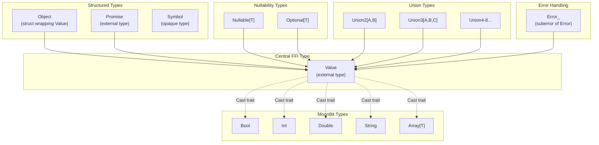

**Type System Overview**

Sources: `src/js/pkg.generated.mbti:165-198`, `src/js/pkg.generated.mbti:203-211`

### The Value Type

`Value` is the central FFI type representing any JavaScript value. It is marked as `#external`, meaning its internal representation is opaque to MoonBit code and managed by the JavaScript runtime.

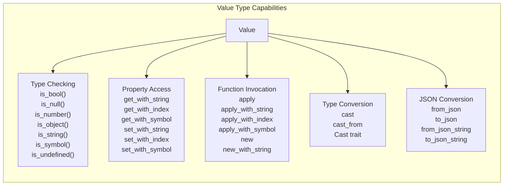

**Value Type Method Categories**

Sources: `src/js/pkg.generated.mbti:165-198`

| Method Category | Methods | Purpose |
|-----------------|---------|---------|
| Type Checking | `is_bool()`, `is_null()`, `is_number()`, `is_object()`, `is_string()`, `is_symbol()`, `is_undefined()` | Runtime type inspection |
| Property Access | `get_with_stringT`, `get_with_indexT`, `get_with_symbolT` | Read properties from JavaScript objects |
| Property Mutation | `set_with_stringT`, `set_with_indexT`, `set_with_symbolT` | Write properties to JavaScript objects |
| Function Invocation | `applyArg, Result`, `apply_with_stringArg, Result` | Call JavaScript functions |
| Constructor Invocation | `newArg, Result`, `new_with_stringArg, Result` | Create new JavaScript objects |
| Type Conversion | `castT`, `cast_fromT` | Convert between MoonBit and JavaScript types |
| JSON Interop | `from_json()`, `to_json()`, `from_json_string()`, `to_json_string()` | Parse and serialize JSON |
| Utilities | `extends()`, `to_string()` | Object manipulation and string conversion |

Sources: `src/js/pkg.generated.mbti:167-196`

### The Cast Trait

The `Cast` trait defines the protocol for type-safe conversion between MoonBit types and JavaScript values.

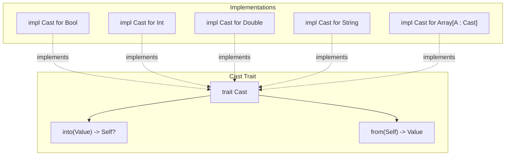

**Cast Trait and Implementations**

The `Cast` trait provides two methods:
- `into(Value) -> Self?`: Attempts to convert a JavaScript value to a MoonBit type, returning `None` if the conversion fails
- `from(Self) -> Value`: Converts a MoonBit type to a JavaScript value (always succeeds)

Sources: `src/js/pkg.generated.mbti:203-211`

## JavaScript Object Interop

The `Object` type provides a high-level wrapper around `Value` specifically for working with JavaScript objects.

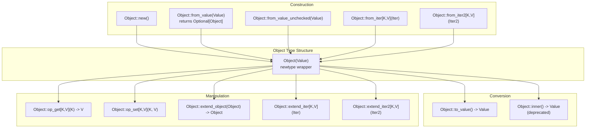

**Object Type API**

Sources: `src/js/pkg.generated.mbti:45-58`

### Property Access Pattern

The `Object` type supports indexing operations through `op_get` and `op_set` methods. These are generic methods that work with any key and value types that implement the `Cast` trait.

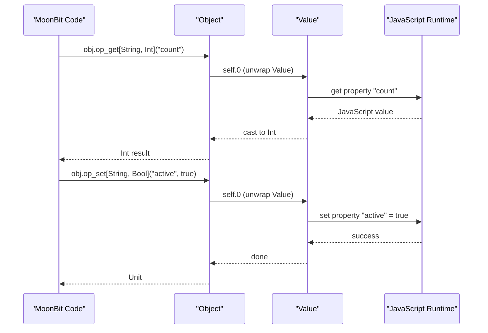

**Object Property Access Flow**

Sources: `src/js/pkg.generated.mbti:56-57`

### Object Extension Example

The `extend_object` method merges two JavaScript objects, with the second object's properties overwriting the first's.

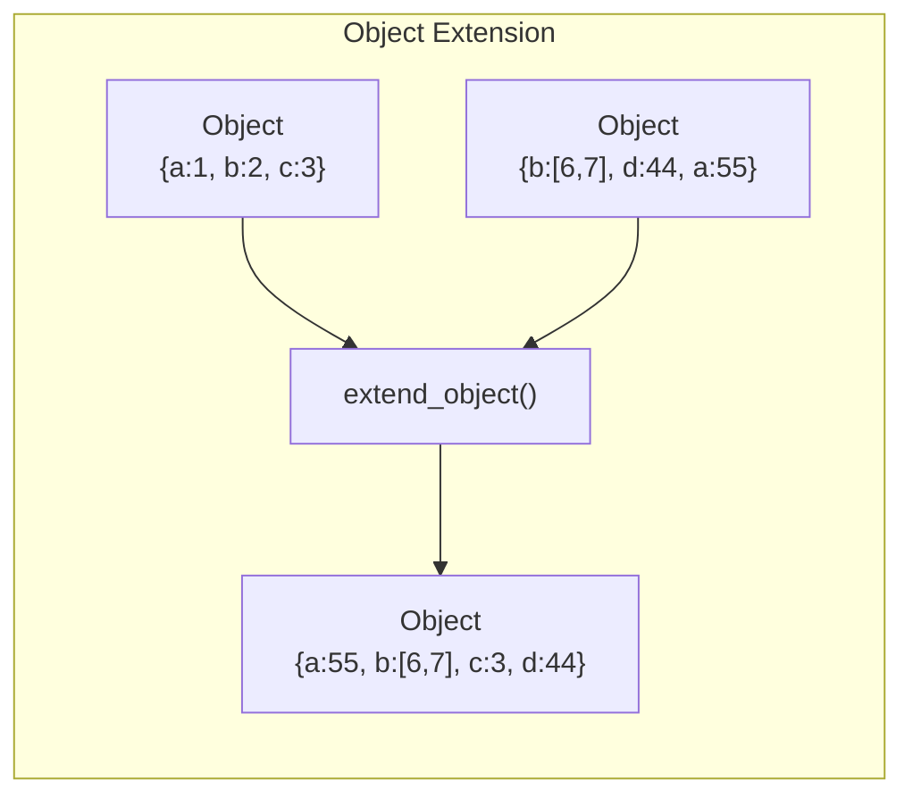

**Object Extension Operation**

This pattern is demonstrated in `src/js/object_test.mbt:2-15`, where objects are created from JSON and then merged.

Sources: `src/js/pkg.generated.mbti:48`, `src/js/object_test.mbt:2-15`

## Nullability and Optional Values

JavaScript has two "absent value" types: `null` and `undefined`. The FFI layer provides distinct types to handle each.

| Type | JavaScript Equivalent | MoonBit Conversion | Use Case |
|------|----------------------|-------------------|----------|
| `Nullable[T]` | `null` | `from_option()`, `to_option()` | API that uses `null` for absent values |
| `Optional[T]` | `undefined` | `from_option()`, `to_option()` | API that uses `undefined` for absent values |

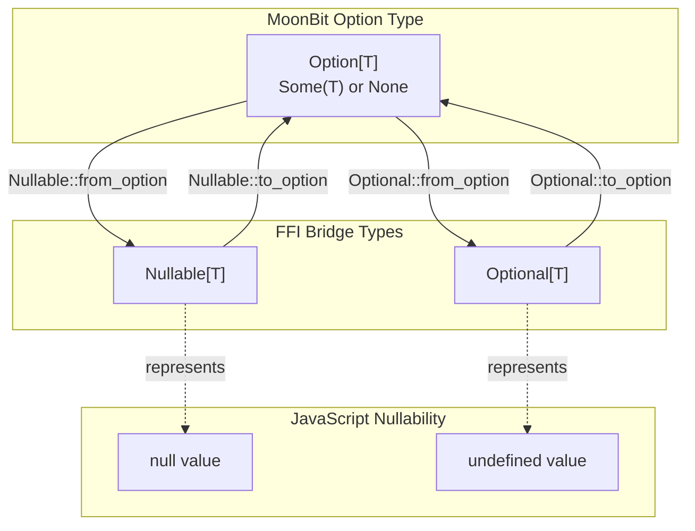

**Nullability Type Conversions**

Sources: `src/js/pkg.generated.mbti:36-67`

### Nullable[T] API

| Method | Signature | Description |
|--------|-----------|-------------|
| `null()` | `() -> Nullable[T]` | Creates a `null` value |
| `is_null()` | `(Nullable[T]) -> Bool` | Checks if value is `null` |
| `from_option()` | `(T?) -> Nullable[T]` | Converts `Some(v)` to value, `None` to `null` |
| `to_option()` | `(Nullable[T]) -> T?` | Converts value to `Some(v)`, `null` to `None` |
| `unwrap()` | `(Nullable[T]) -> T` | Extracts value, panics if `null` |

Sources: `src/js/pkg.generated.mbti:36-43`

### Optional[T] API

| Method | Signature | Description |
|--------|-----------|-------------|
| `undefined()` | `() -> Optional[T]` | Creates an `undefined` value |
| `is_undefined()` | `(Optional[T]) -> Bool` | Checks if value is `undefined` |
| `from_option()` | `(T?) -> Optional[T]` | Converts `Some(v)` to value, `None` to `undefined` |
| `to_option()` | `(Optional[T]) -> T?` | Converts value to `Some(v)`, `undefined` to `None` |
| `unwrap()` | `(Optional[T]) -> T` | Extracts value, panics if `undefined` |

Sources: `src/js/pkg.generated.mbti:60-67`

## Union Types

The FFI layer provides `Union2` through `Union8` types for TypeScript-style union types, enabling type-safe handling of JavaScript APIs that can return multiple distinct types.

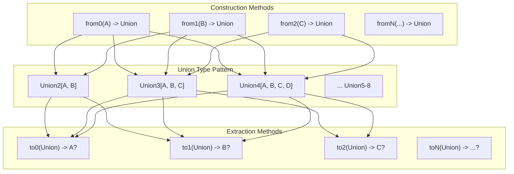

**Union Type Construction and Extraction Pattern**

Sources: `src/js/pkg.generated.mbti:81-163`

### Union Type Usage Pattern

Each union type provides:
- **Construction methods** `from0` through `fromN`: Create a union from one of its variant types
- **Extraction methods** `to0` through `toN`: Attempt to extract a specific variant, returning `Some(value)` on success or `None` if the union holds a different variant

All variant types must implement the `Cast` trait for type-safe conversion with JavaScript values.

Example type signatures:
```
Union2[A : Cast, B : Cast]
  from0(A) -> Union2[A, B]
  from1(B) -> Union2[A, B]
  to0(Union2[A, B]) -> A?
  to1(Union2[A, B]) -> B?
```

Sources: `src/js/pkg.generated.mbti:81-93`

## Symbol Type

The `Symbol` type represents JavaScript's `Symbol` primitive for creating unique property keys.

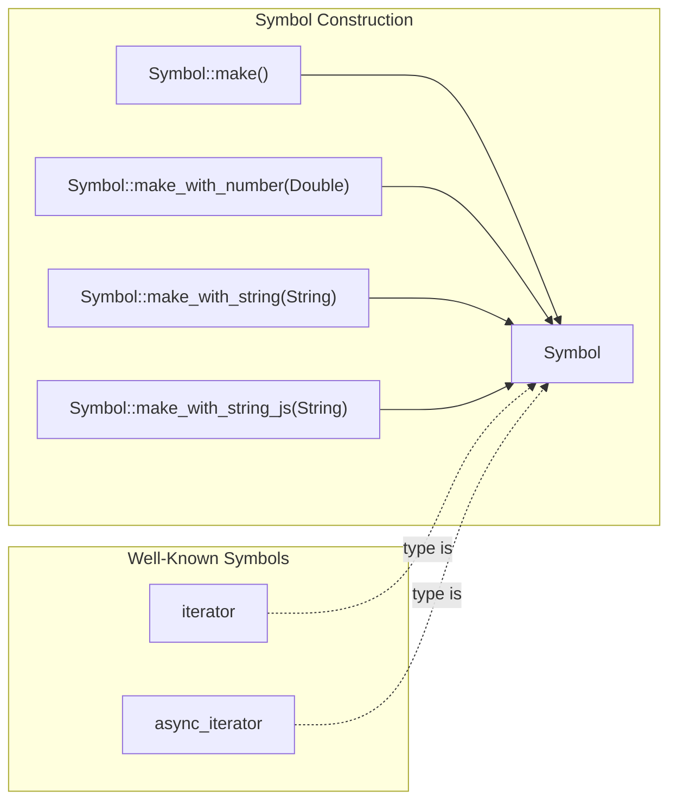

**Symbol Construction Methods**

The FFI layer exposes two well-known symbols as global constants:
- `iterator`: The `Symbol.iterator` well-known symbol
- `async_iterator`: The `Symbol.asyncIterator` well-known symbol

Sources: `src/js/pkg.generated.mbti:11-12`, `src/js/pkg.generated.mbti:19`, `src/js/pkg.generated.mbti:75-79`

## Error Handling

The `Error_` type represents JavaScript errors as a MoonBit error variant.

```mermaid
graph TB
    subgraph "Error Hierarchy"
        Error["Error trait"]
        Error_ ["Error_<br/>(suberror Value)"]
        
        Error_ -.->|"suberror of"| Error
    end
    
    subgraph "Error_ Methods"
        Cause["cause() -> Value?"]
        Output["output(&Logger)"]
        ToString["to_string() -> String"]
        Wrap["wrap[T](<br/>  () -> Value,<br/>  map_ok? : (Value) -> T<br/>) -> T raise Error_"]
    end
    
    Error_ --> Cause
    Error_ --> Output
    Error_ --> ToString
    Error_ --> Wrap
    
    subgraph "JavaScript Error"
        JSError["JavaScript Error object"]
    end
    
    JSError -.->|wraps| Error_
```

**Error_ Type and Methods**

The `Error_` type wraps a JavaScript error as a MoonBit `Error` subtype. It provides:
- `cause()`: Retrieves the underlying error cause
- `wrap()`: Executes a function that returns a JavaScript value, converting errors to `Error_`

Sources: `src/js/pkg.generated.mbti:28-33`

## Promise Integration

The `Promise` type enables async operations with JavaScript promises. For comprehensive documentation on async patterns, see [Asynchronous Operations](#3.1.1).

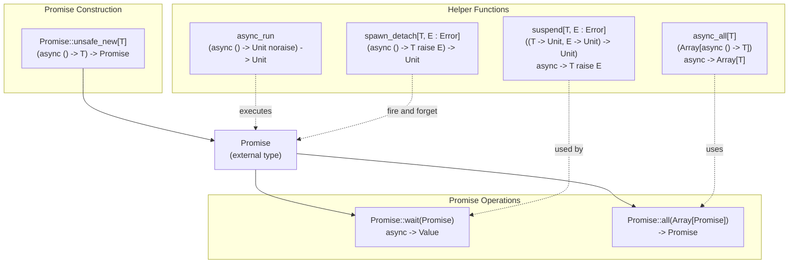

**Promise Type and Async Helper Functions**

Sources: `src/js/pkg.generated.mbti:69-74`, `src/js/async.mbt:1-76`

### Key Async Functions

| Function | Signature | Purpose |
|----------|-----------|---------|
| `suspend` | `async ((T) -> Unit, (E) -> Unit) -> Unit) -> T raise E` | Converts callback-based async to async/await |
| `async_run` | `(async () -> Unit noraise) -> Unit` | Executes async function in JavaScript event loop |
| `spawn_detach` | `(async () -> T raise E) -> Unit` | Starts async operation without waiting for result |
| `async_all` | `(Array[async () -> T]) -> Array[T]` | Executes multiple async operations concurrently |

Sources: `src/js/pkg.generated.mbti:9-25`, `src/js/async.mbt:2-75`

## Common FFI Patterns

### Pattern 1: JavaScript Function Invocation

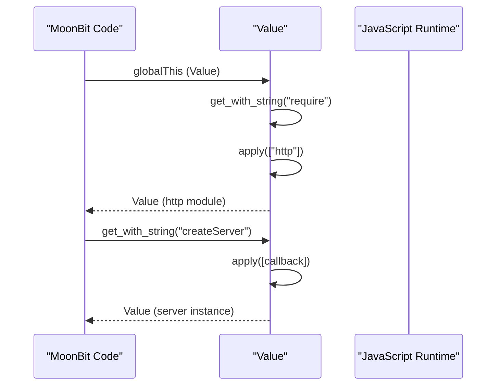

**Calling JavaScript Functions from MoonBit**

This pattern is used throughout the JavaScript backend to call Node.js APIs. The `require` function at `src/js/pkg.generated.mbti:21` demonstrates this pattern for loading JavaScript modules.

Sources: `src/js/pkg.generated.mbti:21`, `src/js/pkg.generated.mbti:169`

### Pattern 2: Callback-Based to Async/Await

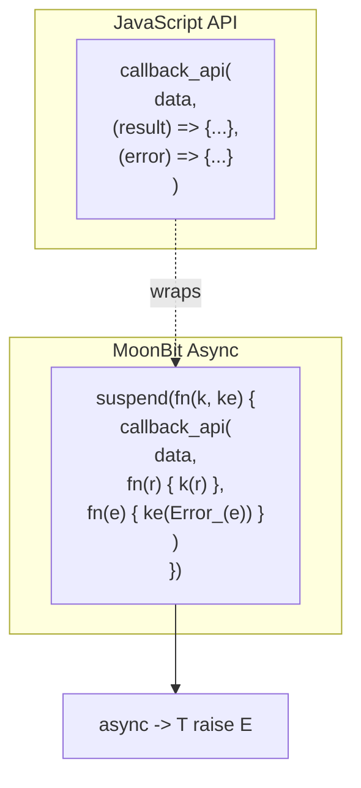

**Converting Callback-Based APIs to Async/Await**

The `suspend` function at `src/js/async.mbt:2-4` enables conversion of callback-based JavaScript APIs to MoonBit's async/await syntax. This pattern is used in `Promise::wait` at `src/js/async.mbt:29-31`.

Sources: `src/js/async.mbt:2-4`, `src/js/async.mbt:29-31`

### Pattern 3: Type-Safe Property Access

```mermaid
graph LR
    subgraph "Untyped Access"
        GetGeneric["value.get_with_string[Value](key)"]
    end
    
    subgraph "Type-Safe Access"
        Cast"Value::cast[TargetType"]
        GetTyped["value.get_with_string[TargetType](key)"]
    end
    
    subgraph "Object Wrapper"
        ObjGet["obj.op_get[String, TargetType](key)"]
    end
    
    GetGeneric --> Cast
    Cast --> Result["TargetType"]
    GetTyped --> Result
    ObjGet --> Result
```

**Type-Safe Property Access Patterns**

Sources: `src/js/pkg.generated.mbti:176-178`, `src/js/pkg.generated.mbti:56-57`

### Pattern 4: JSON Interop

The FFI layer provides bidirectional JSON conversion for seamless data exchange between MoonBit and JavaScript.

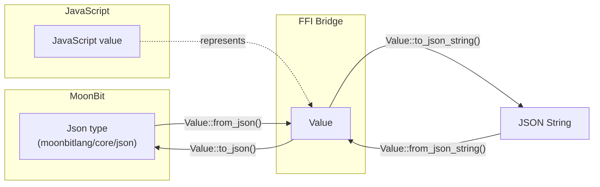

**JSON Conversion Flow**

The example at `src/js/object_test.mbt:4` demonstrates creating an Object from JSON using `@json.from_json()` followed by `Object::from_value_unchecked()`.

Sources: `src/js/pkg.generated.mbti:174-175`, `src/js/pkg.generated.mbti:194-195`, `src/js/object_test.mbt:3-8`