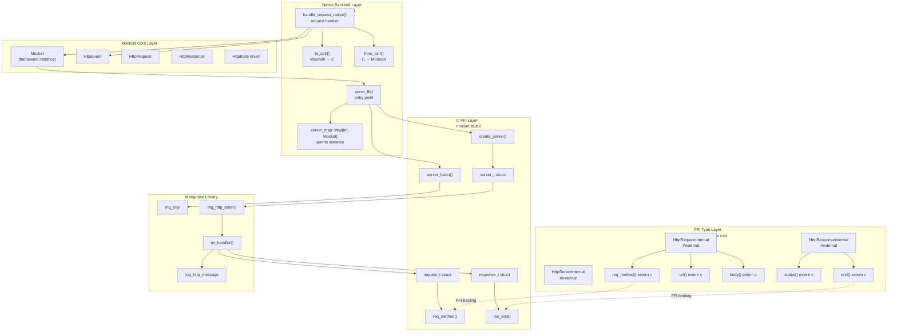
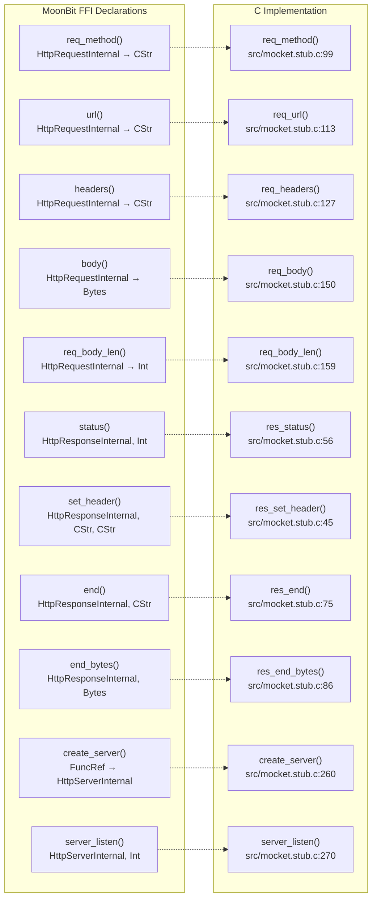
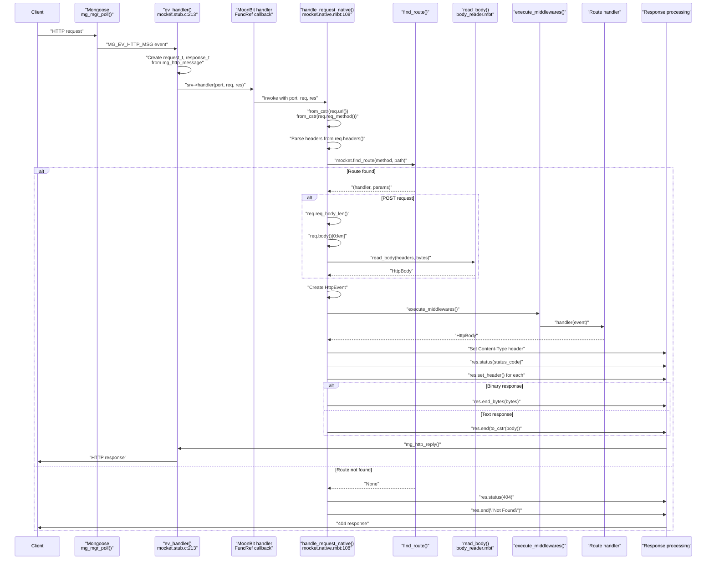
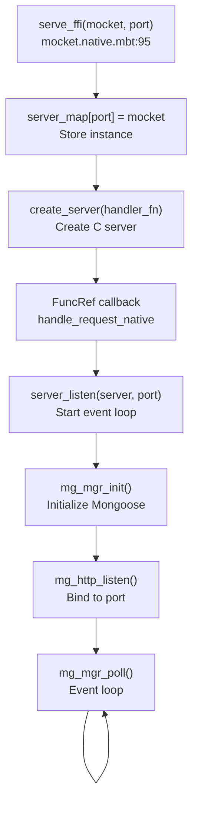
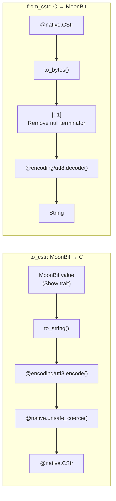
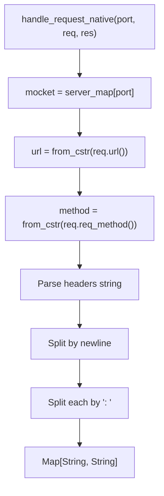
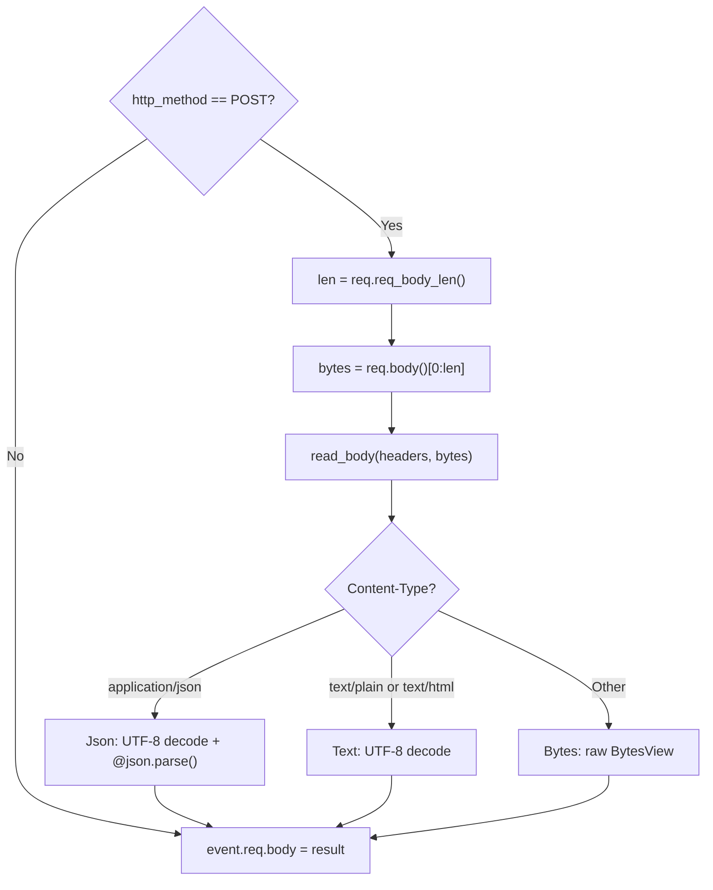
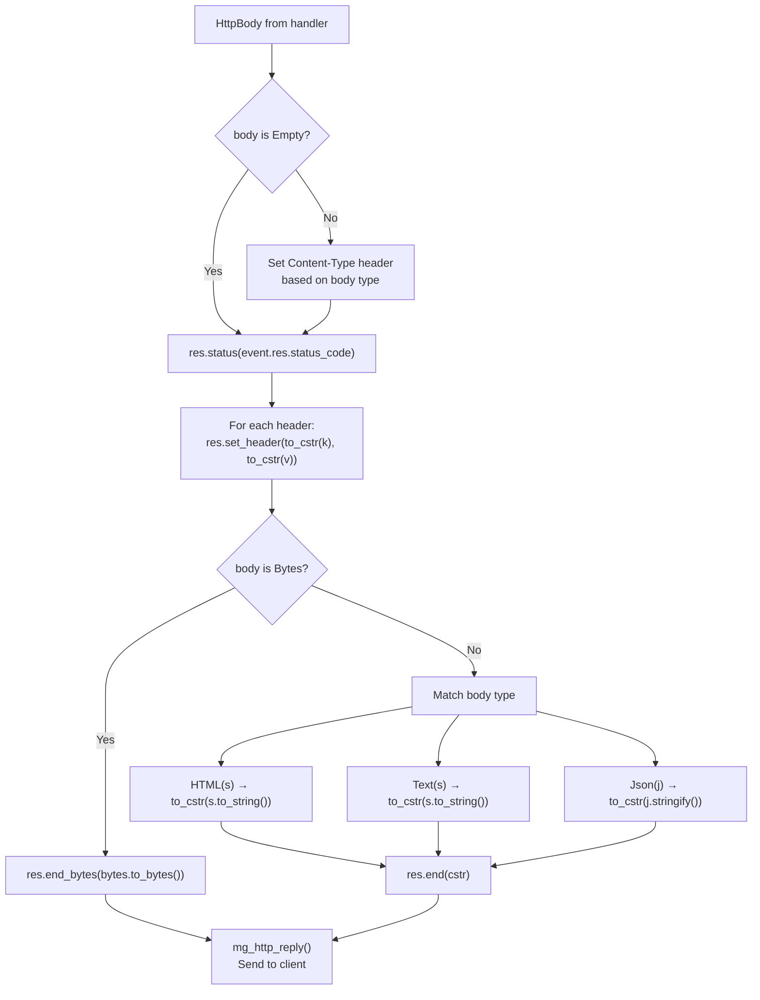
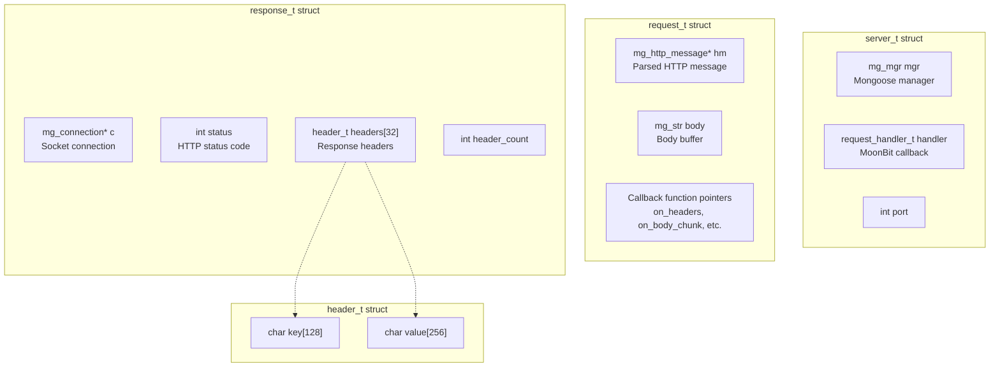

# Native Backend

## Purpose and Scope

The Native Backend provides HTTP server functionality by integrating with the Mongoose embedded web server library through C Foreign Function Interface (FFI). This backend compiles MoonBit code to native executables, offering direct system integration and performance characteristics suited for production deployments.

This page covers the native backend implementation, FFI bindings, and integration with Mongoose. For the JavaScript backend, see [JavaScript Backend](#3.1). For general backend concepts, see [Multi-Backend Architecture](#3). For Mongoose-specific integration details, see [Mongoose Integration](#3.2.1).

---

## Architecture Overview

The native backend uses a three-layer architecture: MoonBit application code communicates with backend-agnostic types, which are converted to/from platform-specific types, which interface with C code through FFI bindings.

### Native Backend Layered Architecture



**Sources:** `src/mocket.native.mbt:1-222`, `src/mocket.stub.c:1-354`

---

## FFI Type System

The native backend defines three external types that represent opaque C pointers. These types are never instantiated in MoonBit; they are passed to and from C functions.

### External Type Definitions

| MoonBit Type | C Equivalent | Purpose |
|--------------|--------------|---------|
| `HttpServerInternal` | `server_t*` | Server instance handle |
| `HttpRequestInternal` | `request_t*` | Incoming HTTP request |
| `HttpResponseInternal` | `response_t*` | Outgoing HTTP response |

**Sources:** `src/mocket.native.mbt:2-11`

### FFI Function Bindings

All FFI functions are declared with `extern "c"` and map MoonBit function calls to C implementations:



**Sources:** `src/mocket.native.mbt:14-89`, `src/mocket.stub.c:45-285`

Key characteristics:
- `#owned` annotation indicates the C side takes ownership of parameters
- `FuncRef` types enable callback from C to MoonBit
- `@native.CStr` is used for C string interoperability

---

## Request Processing Pipeline

The request processing flow starts when Mongoose receives an HTTP request and invokes the registered handler callback.

### Request Flow Sequence



**Sources:** `src/mocket.stub.c:213-257`, `src/mocket.native.mbt:108-207`

### Entry Point: serve_ffi

The `serve_ffi()` function is the entry point for starting a native HTTP server:



**Sources:** `src/mocket.native.mbt:95-105`, `src/mocket.stub.c:260-285`

The `server_map` global variable (`src/mocket.native.mbt:92`) maps port numbers to `Mocket` instances, allowing the single C callback to dispatch to multiple application instances.

---

## Type Conversion Layer

The native backend requires conversion between MoonBit's UTF-8 strings and C's null-terminated strings (`CStr`).

### String Conversion Functions

| Function | Direction | Implementation |
|----------|-----------|----------------|
| `to_cstr()` | MoonBit → C | Encodes UTF-8 string, returns unsafe-coerced pointer |
| `from_cstr()` | C → MoonBit | Decodes bytes (minus null terminator) to UTF-8 string |

**Implementation details:**



**Sources:** `src/mocket.native.mbt:210-221`

**Key observations:**
- `to_cstr()` uses `unsafe_coerce()` to convert `Bytes` to `CStr` without copying
- `from_cstr()` removes the trailing null byte (`[:-1]`) before UTF-8 decoding
- Both functions assume valid UTF-8; `from_cstr()` panics on invalid input

---

## Request Handling

The `handle_request_native()` function (`src/mocket.native.mbt:108-207`) orchestrates the complete request lifecycle.

### Request Data Extraction



**Sources:** `src/mocket.native.mbt:113-148`

Header parsing logic (`src/mocket.native.mbt:136-148`):
1. Get headers as single string from `req.headers()`
2. Split by newlines
3. Split each line by `": "` to get key-value pairs
4. Filter empty pairs
5. Convert to `Map[String, String]`

### Request Body Parsing

For POST requests, the body is read and parsed based on `Content-Type`:



**Sources:** `src/mocket.native.mbt:162-173`, `src/body_reader.mbt:9-29`

The `read_body()` function (`src/body_reader.mbt:9-29`) returns different `HttpBody` variants:
- `Json`: For `application/json` Content-Type
- `Text`: For `text/plain` or `text/html`
- `Bytes`: For all other types or missing Content-Type

---

## Response Handling

After route handler execution, the response is serialized and sent via Mongoose.

### Response Serialization Flow



**Sources:** `src/mocket.native.mbt:174-206`

### Content-Type Mapping

| HttpBody Variant | Content-Type Header |
|------------------|---------------------|
| `Bytes(_)` | `application/octet-stream` |
| `HTML(_)` | `text/html; charset=utf-8` |
| `Text(_)` | `text/plain; charset=utf-8` |
| `Json(_)` | `application/json; charset=utf-8` |
| `Empty` | (no header set) |

**Sources:** `src/mocket.native.mbt:181-187`

Response functions use different C endpoints:
- `res.end_bytes()` for binary data (`src/mocket.native.mbt:194-195`)
- `res.end()` for text data (`src/mocket.native.mbt:197-204`)

---

## C Layer Implementation Details

The C stub (`src/mocket.stub.c`) provides the glue between Mongoose and MoonBit.

### Core C Structures



**Sources:** `src/mocket.stub.c:6-42`

### Event Handler

The `ev_handler()` function (`src/mocket.stub.c:213-257`) is registered as Mongoose's event callback:

```mermaid
graph TB
    EvHandler["ev_handler(conn, event, ev_data)"]
    CheckEvent{"event == MG_EV_HTTP_MSG?"}
    GetServer["srv = (server_t*)c->fn_data"]
    CastMessage["hm = (mg_http_message*)ev_data"]
    InitReq["Initialize request_t"]
    InitRes["Initialize response_t<br/>status=200"]
    CheckHandler{"srv->handler exists?"}
    CallHandler["srv->handler(port, &req, &res)"]
    Invoke404["mg_http_reply(c, 404, ..., \"Not Found\")"]
    
    EvHandler --> CheckEvent
    CheckEvent -->|Yes| GetServer
    CheckEvent -->|No| Return["Return"]
    GetServer --> CastMessage
    CastMessage --> InitReq
    InitReq --> InitRes
    InitRes --> CheckHandler
    CheckHandler -->|Yes| CallHandler
    CheckHandler -->|No| Invoke404
```

**Sources:** `src/mocket.stub.c:213-257`

Key points:
- Mongoose calls `ev_handler()` for all connection events
- Only `MG_EV_HTTP_MSG` events (complete HTTP requests) are processed
- `server_t` is retrieved from `c->fn_data` (set during `mg_http_listen()`)
- Request/response structs are stack-allocated and passed to the MoonBit handler

---

## Performance Characteristics

The native backend offers distinct performance properties:

### Performance Profile

| Aspect | Characteristic | Reason |
|--------|----------------|--------|
| **Startup** | Fast | Native binary, no runtime initialization |
| **Memory** | Low overhead | Direct C interop, no JavaScript VM |
| **Request latency** | Low | No async/await overhead, single-threaded event loop |
| **Static routes** | O(1) lookup | Hash map in MoonBit layer |
| **Dynamic routes** | O(n) regex | Regex matching per request |
| **String conversion** | Minimal copies | `unsafe_coerce` for MoonBit→C, single copy for C→MoonBit |
| **Binary responses** | Zero-copy | `end_bytes()` passes pointer directly |

**Sources:** `src/mocket.native.mbt:210-221`, `src/mocket.stub.c:86-94`

### Comparison with JavaScript Backend

| Feature | Native Backend | JavaScript Backend |
|---------|----------------|-------------------|
| Async support | No (event loop only) | Yes (Promise-based) |
| Type conversion | UTF-8 encoding required | Direct JS value interop |
| Response streaming | Callback-based (unimplemented) | Stream-based |
| Deployment | Single binary | Node.js required |
| Memory safety | FFI unsafe operations | Safe JS interop |

---

## Error Handling

The native backend uses MoonBit's exception system for error propagation.

### Error Flow

```mermaid
graph TB
    ReadBody["read_body() raise BodyError"]
    CatchBlock["catch block"]
    SetStatus404["res.status(400)"]
    ResEnd["res.end(\"Invalid body\")"]
    Return["return"]
    
    ReadBody -->|"Error raised"| CatchBlock
    CatchBlock --> SetStatus404
    SetStatus404 --> ResEnd
    ResEnd --> Return
```

**Sources:** `src/mocket.native.mbt:165-171`, `src/body_reader.mbt:2-6`

Error types defined in `body_reader.mbt`:
- `InvalidJsonCharset`: UTF-8 decoding failed
- `InvalidJson`: JSON parsing failed  
- `InvalidText`: Text UTF-8 decoding failed

The native backend returns HTTP 400 for body parsing errors and HTTP 404 for route not found.

---

## Limitations and Future Work

Current limitations:
1. **No async support**: Cannot use `async` functions in route handlers (JavaScript backend only)
2. **Callback staging incomplete**: `on_headers`, `on_body_chunk` callbacks defined but not utilized
3. **Single-threaded**: Mongoose event loop runs on one thread
4. **Static header buffer**: Maximum 32 headers, 128-byte keys, 256-byte values (`src/mocket.stub.c:12`)
5. **Static string buffers**: URL limited to 512 bytes, method to 16 bytes (`src/mocket.stub.c:103-108`)

Future enhancements:
- Request/response streaming via staged callbacks
- Multi-threaded Mongoose configuration
- WebSocket support through Mongoose
- SSL/TLS configuration exposure

**Sources:** `src/mocket.stub.c:18-33`, `src/mocket.stub.c:99-124`