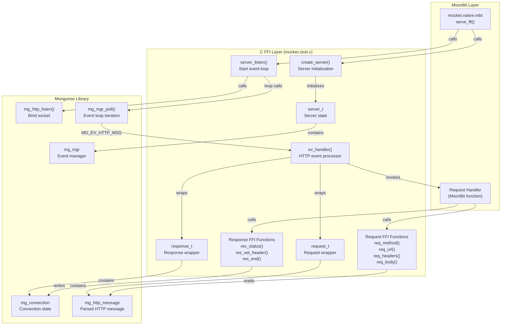
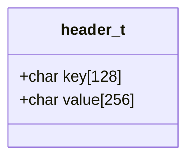
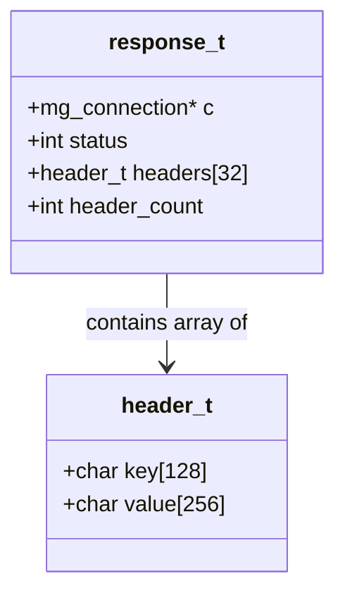
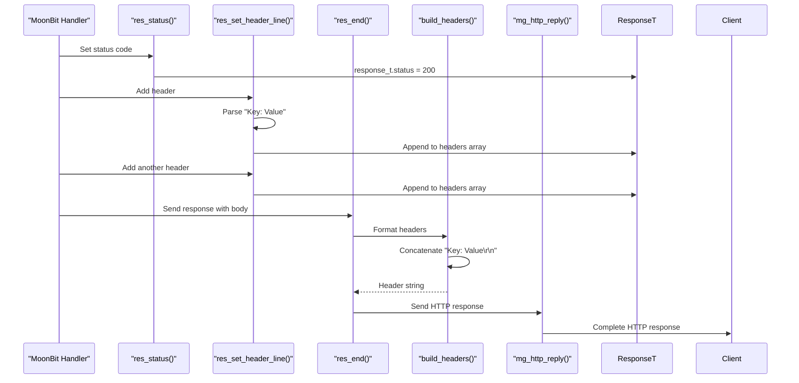
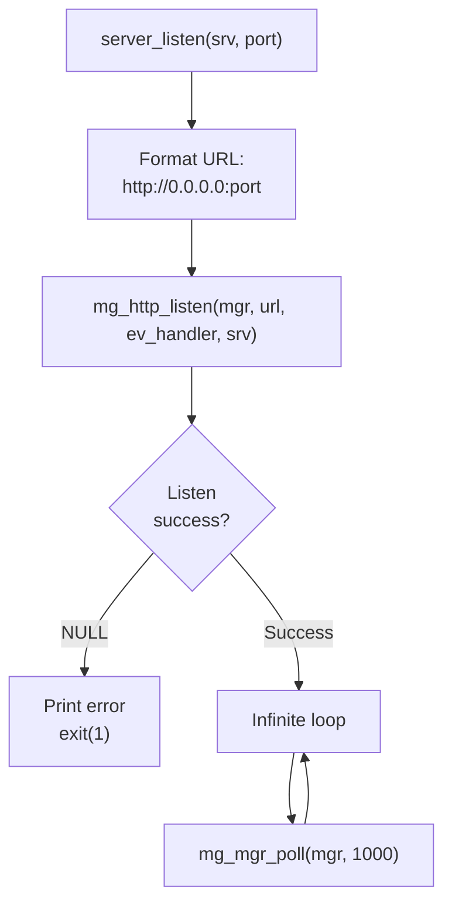
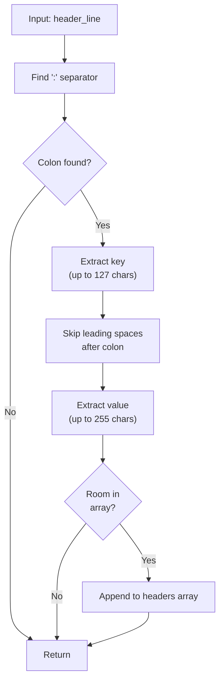

# Mongoose Integration

## Purpose and Scope

This document explains how the Mocket native backend integrates with the Mongoose embedded web server library through C FFI (Foreign Function Interface). It covers the C struct definitions, FFI function interfaces, event handling mechanisms, and data conversion patterns that bridge Mongoose's C API with MoonBit's type system.

For the higher-level native backend architecture and how it fits into Mocket's multi-target design, see [Native Backend](#3.2). For general FFI patterns and best practices used throughout the native backend, see [Native FFI Patterns](#3.2.2).

## Mongoose Library Overview

The native backend uses [Mongoose](https://mongoose.ws/), a lightweight embedded web server library written in C. Mongoose provides a single-threaded, event-driven HTTP server with minimal dependencies, making it suitable for integration with MoonBit's native compilation target.

**Key Characteristics:**
- **Lightweight**: Single C file (~7000 lines), minimal memory footprint
- **Event-driven**: Non-blocking I/O with callback-based request handling
- **HTTP/1.1 compliant**: Full HTTP parsing and response generation
- **Platform-independent**: Works across Unix, Windows, and embedded systems

The integration is implemented entirely in [src/mocket.stub.c](), which contains all C code that interfaces between Mongoose and MoonBit's FFI layer.

Sources: [src/mocket.stub.c:1-4]()

## Architecture Overview

The following diagram shows how Mongoose integrates into the Mocket native backend architecture:



Sources: [src/mocket.stub.c:6-286]()

## C Struct Definitions

The FFI layer defines four primary C structures that represent server state and HTTP messages:

### header_t Structure

The `header_t` structure represents a single HTTP header as a key-value pair:



This fixed-size structure is used in both request and response header storage. Each response can hold up to `MAX_HEADERS` (32) headers, as defined at [src/mocket.stub.c:12]().

Sources: [src/mocket.stub.c:6-10]()

### request_t Structure

The `request_t` structure wraps Mongoose's parsed HTTP message and provides callback hooks for staged processing:

| Field | Type | Purpose |
|-------|------|---------|
| `hm` | `mg_http_message*` | Pointer to Mongoose's parsed HTTP message |
| `body` | `mg_str` | Current body buffer (for streaming support) |
| `on_headers` | `on_headers_cb` | Callback invoked when headers are parsed |
| `on_body_chunk` | `on_body_chunk_cb` | Callback invoked for each body chunk |
| `on_complete` | `on_complete_cb` | Callback invoked when request is complete |
| `on_error` | `on_error_cb` | Callback invoked on errors |

The staged callback design allows for streaming request processing, though Mocket currently uses synchronous request handling. The callbacks are defined but not actively used in the current implementation.

Sources: [src/mocket.stub.c:15-34]()

### response_t Structure

The `response_t` structure accumulates response data before sending:



| Field | Type | Purpose |
|-------|------|---------|
| `c` | `mg_connection*` | Pointer to Mongoose connection for sending response |
| `status` | `int` | HTTP status code (default: 200) |
| `headers` | `header_t[32]` | Array of response headers |
| `header_count` | `int` | Number of headers currently set |

The response struct accumulates headers through `res_set_header()` calls and sends everything atomically when `res_end()` is called.

Sources: [src/mocket.stub.c:36-42]()

### server_t Structure

The `server_t` structure represents the HTTP server instance:

| Field | Type | Purpose |
|-------|------|---------|
| `mgr` | `mg_mgr` | Mongoose event manager |
| `handler` | `request_handler_t` | Function pointer to request handler callback |
| `port` | `int` | Port number server is listening on |

The `request_handler_t` type is a function pointer with signature: `void (*)(int port, request_t *req, response_t *res)`.

Sources: [src/mocket.stub.c:204-211]()

## FFI Function Interface

The C stub provides FFI functions that MoonBit code calls to interact with HTTP requests and responses. These functions bridge between C's pointer-based API and MoonBit's type system.

### Request Accessor Functions

**req_method()**

```c
const char *req_method(request_t *req)
```

Returns the HTTP method (GET, POST, etc.) as a null-terminated C string. The function copies up to 15 bytes from the Mongoose `mg_str` into a static buffer, ensuring null termination. Returns "GET" as default if request is null.

Sources: [src/mocket.stub.c:98-110]()

**req_url()**

```c
const char *req_url(request_t *req)
```

Returns the request URI path as a null-terminated C string. Copies up to 511 bytes from the Mongoose URI field into a static buffer. Returns "/" as default if request is null.

Sources: [src/mocket.stub.c:112-124]()

**req_headers()**

```c
const char *req_headers(request_t *req)
```

Returns a simplified string representation of request headers. Currently only extracts the `Content-Type` header using Mongoose's `mg_http_get_header()` function. The implementation is simplified; comprehensive header access would require iterating all headers in the `mg_http_message` structure.

Sources: [src/mocket.stub.c:126-147]()

**req_body() and req_body_len()**

```c
uint8_t *req_body(request_t *req)
size_t req_body_len(request_t *req)
```

Return the raw request body as a byte buffer and its length. Returns `NULL` and `0` respectively if no body exists. The body pointer refers directly to Mongoose's internal buffer (zero-copy).

Sources: [src/mocket.stub.c:149-166]()

### Response Writer Functions

The following diagram shows the response building flow:



**res_status()**

```c
void res_status(response_t *res, int status_code)
```

Sets the HTTP status code for the response. This must be called before `res_end()`.

Sources: [src/mocket.stub.c:56-59]()

**res_set_header_line()**

```c
void res_set_header_line(response_t *res, const char *header_line)
```

Parses a header string in "Key: Value" format and adds it to the response headers array. The function:
1. Finds the colon separator
2. Extracts the key (up to 127 bytes)
3. Extracts the value (up to 255 bytes), skipping leading spaces
4. Appends to the `headers` array if space available

Sources: [src/mocket.stub.c:169-200]()

**res_set_header()**

```c
void res_set_header(response_t *res, const char *key, const char *value)
```

Alternative interface that takes separate key and value strings. Used internally but can also be called directly.

Sources: [src/mocket.stub.c:45-53]()

**build_headers()**

```c
static void build_headers(response_t *res, char *header_buf, size_t buf_size)
```

Internal helper that concatenates all headers into a single string formatted as:
```
Key1: Value1\r\n
Key2: Value2\r\n
```

This string is passed directly to Mongoose's `mg_http_reply()`.

Sources: [src/mocket.stub.c:62-72]()

**res_end()**

```c
void res_end(response_t *res, const char *body)
```

Sends the complete HTTP response. Calls `build_headers()` to format headers, then invokes Mongoose's `mg_http_reply()` with the status code, headers, and body. This function finalizes the response and sends it to the client.

Sources: [src/mocket.stub.c:75-83]()

**res_end_bytes()**

```c
void res_end_bytes(response_t *res, uint8_t *body, size_t body_len)
```

Similar to `res_end()` but accepts a binary body buffer instead of a null-terminated string. Uses `mg_http_reply()` with the `%.*s` format specifier to send exactly `body_len` bytes.

Sources: [src/mocket.stub.c:86-94]()

## Event Processing Model

Mongoose uses an event-driven architecture where the event loop calls registered event handlers for various connection events. The following diagram illustrates the request processing flow:

```mermaid
sequenceDiagram
    participant Loop as "Event Loop<br/>mg_mgr_poll()"
    participant EvHandler as "ev_handler()"
    participant Req as "request_t"
    participant Res as "response_t"
    participant Handler as "MoonBit Handler<br/>(srv->handler)"
    participant MgReply as "mg_http_reply()"
    
    Loop->>EvHandler: MG_EV_HTTP_MSG event
    EvHandler->>EvHandler: Cast ev_data to mg_http_message*
    EvHandler->>Req: Initialize request_t{hm, body, ...}
    EvHandler->>Res: Initialize response_t{c, 200, [], 0}
    
    alt Handler exists
        EvHandler->>Handler: on_headers callback (if set)
        EvHandler->>Handler: on_body_chunk callback (if set)
        EvHandler->>Handler: srv->handler(port, &req, &res)
        Handler->>Req: Call req_method(), req_url(), etc.
        Handler->>Res: Call res_status(), res_set_header()
        Handler->>Res: Call res_end(body)
        Res->>MgReply: Send response
        EvHandler->>Handler: on_complete callback (if set)
    else Handler is NULL
        EvHandler->>Handler: on_error callback (if set)
        EvHandler->>MgReply: Send 404 Not Found
    end
```

### Event Handler Implementation

The `ev_handler()` function is the core event processor registered with Mongoose:

**Key Steps:**
1. **Event Filtering**: Only processes `MG_EV_HTTP_MSG` events (line 217)
2. **Context Retrieval**: Casts `c->fn_data` to `server_t*` to access server state (line 215)
3. **Request Wrapping**: Creates `request_t` struct wrapping the `mg_http_message` (line 222)
4. **Response Initialization**: Creates `response_t` with default 200 status (line 223)
5. **Callback Invocation**: Calls registered callbacks for headers, body chunks, and completion (lines 228-245)
6. **Handler Delegation**: Invokes the MoonBit handler function via function pointer (line 239)
7. **Error Handling**: Returns 404 if handler is not found (line 254)

Sources: [src/mocket.stub.c:213-257]()

### Callback Mechanisms

The integration defines four callback stages (though currently only the main handler is actively used):

| Callback | Type | Purpose | Usage Status |
|----------|------|---------|--------------|
| `on_headers` | `on_headers_cb` | Called when headers are fully parsed | Defined but unused |
| `on_body_chunk` | `on_body_chunk_cb` | Called for each body data chunk | Defined but unused |
| `on_complete` | `on_complete_cb` | Called when request processing completes | Defined but unused |
| `on_error` | `on_error_cb` | Called on error conditions | Used for 404 responses |

These callbacks provide hooks for future streaming implementation. Currently, Mocket processes requests synchronously within the main handler.

Sources: [src/mocket.stub.c:19-22](), [src/mocket.stub.c:228-245]()

## Server Lifecycle

### Server Initialization

**create_server()**

```c
server_t *create_server(request_handler_t handler)
```

Initializes a new server instance:
1. Allocates `server_t` structure
2. Disables Mongoose logging with `mg_log_set(MG_LL_NONE)` for zero-overhead operation
3. Initializes the Mongoose event manager with `mg_mgr_init()`
4. Stores the handler function pointer
5. Returns the server pointer

Sources: [src/mocket.stub.c:260-267]()

### Server Startup and Event Loop

**server_listen()**

```c
void server_listen(server_t *srv, int port)
```

Starts the HTTP server and enters the event loop:



**Event Loop Details:**
- **Timeout**: 1000 milliseconds per poll iteration
- **Blocking**: The function never returns; it runs the event loop indefinitely
- **Error Handling**: Exits with code 1 if binding fails
- **Event Processing**: Each `mg_mgr_poll()` call processes all pending I/O events and invokes registered handlers

Sources: [src/mocket.stub.c:270-285]()

### Callback Registration Functions

The following functions allow setting request-stage callbacks (currently unused):

```c
void set_on_headers(request_t *req, on_headers_cb cb)
void set_on_body_chunk(request_t *req, on_body_chunk_cb cb)
void set_on_complete(request_t *req, on_complete_cb cb)
void set_on_error(request_t *req, on_error_cb cb)
```

These simply assign the callback function pointer to the corresponding `request_t` field.

Sources: [src/mocket.stub.c:288-321]()

## Data Conversion Patterns

The FFI layer implements several patterns for converting between C and MoonBit representations:

### String Conversion Pattern

All string accessors follow this pattern:
1. **Static Buffer**: Use static char arrays to avoid allocation overhead
2. **Bounds Checking**: Limit copy size to buffer capacity minus 1
3. **Null Termination**: Explicitly add `\0` terminator
4. **Safe Default**: Return safe default value if input is null

Example from `req_method()`:
```c
static char http_methodbuf[16];
size_t len = req->hm->method.len < 15 ? req->hm->method.len : 15;
strncpy(http_methodbuf, req->hm->method.buf, len);
http_methodbuf[len] = '\0';
return http_methodbuf;
```

**Limitation**: Static buffers mean the returned pointers are only valid until the next call to the same function. MoonBit code must copy strings immediately if they need persistence.

Sources: [src/mocket.stub.c:99-110](), [src/mocket.stub.c:113-124]()

### Header Parsing Pattern

The header parsing in `res_set_header_line()` demonstrates defensive string manipulation:



This pattern provides safety against malformed headers while maintaining fixed-size buffers.

Sources: [src/mocket.stub.c:169-200]()

### Binary Data Pattern

For binary request bodies, the implementation uses zero-copy access:
- `req_body()` returns a pointer directly into Mongoose's internal buffer
- No copying occurs unless MoonBit code explicitly copies the data
- `req_body_len()` provides the byte count for safe buffer access

This pattern is critical for performance when handling large uploads or binary payloads.

Sources: [src/mocket.stub.c:149-166]()

### Header Accumulation Pattern

Response headers use accumulation:
1. Headers are stored in fixed-size array (`MAX_HEADERS` = 32)
2. Each `res_set_header()` call appends to the array
3. `build_headers()` concatenates all headers before sending
4. Atomic send via single `mg_http_reply()` call

This pattern ensures headers and body are sent together, preventing partial responses.

Sources: [src/mocket.stub.c:44-94]()

## Memory Management

The integration uses three memory allocation strategies:

| Strategy | Used For | Rationale |
|----------|----------|-----------|
| **Stack Allocation** | `request_t`, `response_t` in event handler | Short-lived per-request data |
| **Static Buffers** | String conversion results | Avoid malloc overhead for FFI |
| **Heap Allocation** | `server_t` only | Long-lived server state |

Notably, Mongoose itself manages all connection and buffer memory internally. The FFI layer never directly frees Mongoose-managed memory.

Sources: [src/mocket.stub.c:213-257](), [src/mocket.stub.c:260-267]()