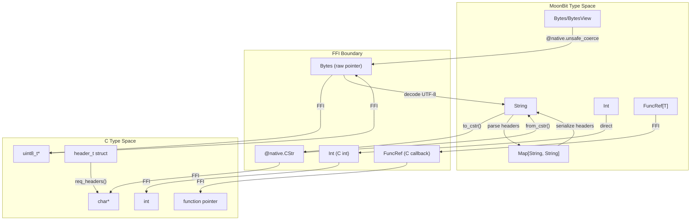
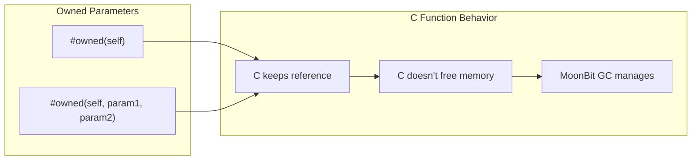
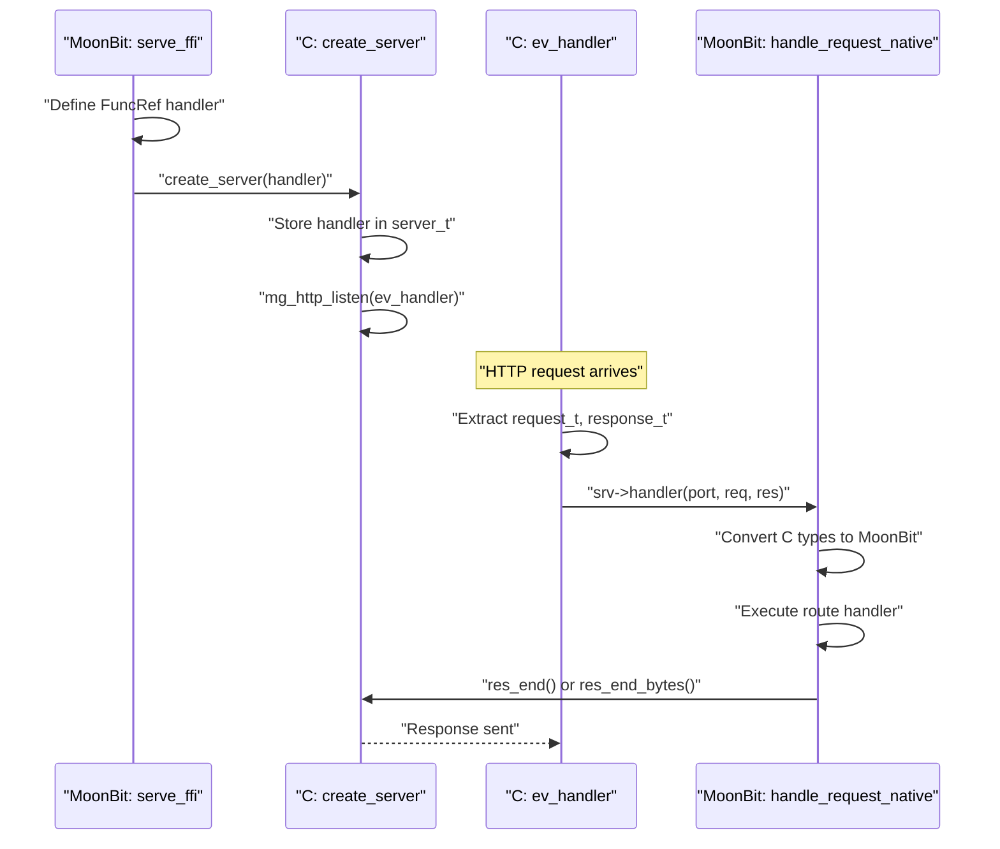
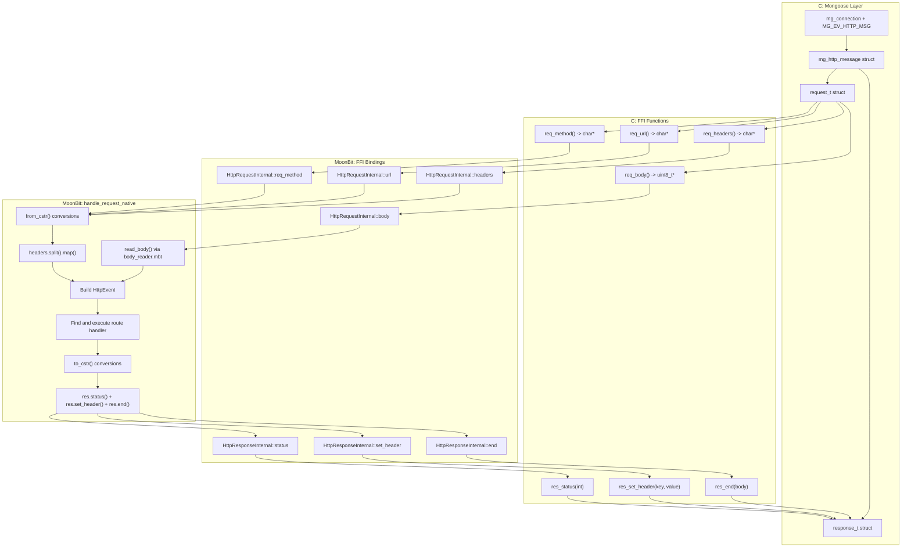
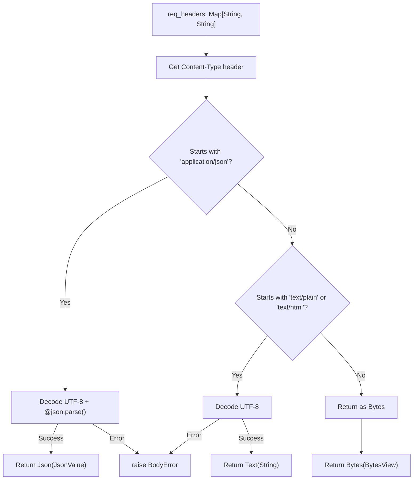

# Native FFI Patterns

This document describes the Foreign Function Interface (FFI) patterns used in Mocket's native backend to bridge MoonBit code with C implementations. These patterns enable type-safe, memory-safe interoperability between MoonBit's high-level abstractions and low-level C libraries like Mongoose.

For information about how Mongoose itself is integrated, see [Mongoose Integration](#3.2.1). For general native backend architecture, see [Native Backend](#3.2).

## FFI Declaration Patterns

The native backend uses MoonBit's `extern "c"` declarations to expose C functions to MoonBit code. These declarations specify the C function signature, parameter ownership, and return types.

### External Type Declarations

The FFI boundary defines opaque types that represent C pointers without exposing their internal structure:

`src/mocket.native.mbt:2-11`

```
#external
pub type HttpServerInternal

#external
pub type HttpRequestInternal

#external
pub type HttpResponseInternal
```

These types act as handles to C structures defined in `src/mocket.stub.c:15-42`, such as `request_t`, `response_t`, and `server_t`. MoonBit code cannot directly access the fields of these structures, ensuring encapsulation.

### Function Binding Syntax

FFI functions follow this pattern:

```
extern "c" fn <Type>::<method>(<parameters>) -> <return_type> = "<c_function_name>"
```

Examples from `src/mocket.native.mbt:14-21`:

- `HttpRequestInternal::req_method` maps to C function `req_method`
- `HttpRequestInternal::url` maps to C function `req_url`
- `HttpRequestInternal::headers` maps to C function `req_headers`

**Sources:** `src/mocket.native.mbt:2-21`, `src/mocket.stub.c:15-42`

## Type Conversion Architecture



This diagram shows the bidirectional conversion between MoonBit types, FFI bridge types, and C types. The critical conversions are implemented in helper functions.

**Sources:** `src/mocket.native.mbt:210-221`, `src/mocket.stub.c:99-166`

## String Conversion Pattern

The `CStr` conversion pattern is fundamental to all string data exchange across the FFI boundary.

### MoonBit to C: `to_cstr`

`src/mocket.native.mbt:210-214`

```moonbit
fn[T : Show] to_cstr(s : T) -> @native.CStr {
  let bytes = @encoding/utf8.encode(s.to_string())
  let utf8_ptr = @native.unsafe_coerce(bytes)
  utf8_ptr
}
```

This pattern:
1. Converts the MoonBit value to a `String` using `.to_string()`
2. Encodes the string as UTF-8 bytes using `@encoding/utf8.encode`
3. Coerces the bytes to a `@native.CStr` pointer using `@native.unsafe_coerce`

The function is generic over any type `T : Show`, allowing it to convert strings, numbers, JSON objects, etc.

### C to MoonBit: `from_cstr`

`src/mocket.native.mbt:217-221`

```moonbit
fn from_cstr(cstr : @native.CStr) -> String {
  let bytes = cstr.to_bytes()[:-1]  // Remove null terminator
  let utf8 = @encoding/utf8.decode(bytes) catch { _ => panic() }
  utf8
}
```

This pattern:
1. Converts `CStr` to `Bytes` using `.to_bytes()`
2. Removes the C null terminator using slice syntax `[:-1]`
3. Decodes UTF-8 bytes back to a MoonBit `String`
4. Panics if decoding fails (invalid UTF-8)

### C-Side String Handling

The C side uses static buffers to return string data `src/mocket.stub.c:99-124`:

```c
const char *req_method(request_t *req) {
  static char http_methodbuf[16];
  size_t len = req->hm->method.len < 15 ? req->hm->method.len : 15;
  strncpy(http_methodbuf, req->hm->method.buf, len);
  http_methodbuf[len] = '\0';
  return http_methodbuf;
}
```

Static buffers avoid dynamic allocation but require careful size management. Each function maintains its own static buffer to prevent data races in single-threaded event loop.

**Sources:** `src/mocket.native.mbt:210-221`, `src/mocket.stub.c:99-124`

## Memory Ownership Annotations

The `#owned` directive specifies which function parameters are owned by the called function, affecting memory management and lifetime semantics.

### Ownership Patterns



### Examples from the Codebase

#### Single Ownership
`src/mocket.native.mbt:51-52`
```moonbit
#owned(self)
extern "c" fn HttpRequestInternal::body(self : HttpRequestInternal) -> Bytes
```
The C function receives the request pointer and returns bytes without taking ownership of memory.

#### Multiple Ownership
`src/mocket.native.mbt:29-34`
```moonbit
#owned(self, key, value)
extern "c" fn HttpResponseInternal::set_header(
  self : HttpResponseInternal,
  key : @native.CStr,
  value : @native.CStr,
) -> Unit
```
The C function stores references to `key` and `value` strings in the response structure `src/mocket.stub.c:45-53`. The `#owned` annotation tells MoonBit's GC that these values must remain valid for the lifetime of the response object.

#### Callback Ownership
`src/mocket.native.mbt:37-41`
```moonbit
#owned(self, cb)
pub extern "c" fn HttpRequestInternal::on_headers(
  self : HttpRequestInternal,
  cb : FuncRef[(@native.CStr) -> Unit],
) -> Unit
```
The callback function reference is stored in the C structure and may be invoked later, so MoonBit must keep it alive.

**Sources:** `src/mocket.native.mbt:29-52`, `src/mocket.stub.c:45-53`

## Callback Pattern

The native backend uses callbacks to enable staged request processing and to pass MoonBit handler functions to C event loops.

### Request Handler Callback



### Implementation Details

The handler is defined as a `FuncRef` and passed to C `src/mocket.native.mbt:95-105`:

```moonbit
pub fn serve_ffi(mocket : Mocket, port~ : Int) -> Unit {
  server_map[port] = mocket
  let server = create_server(fn(
    port : Int,
    req : HttpRequestInternal,
    res : HttpResponseInternal,
  ) {
    handle_request_native(port, req, res)
  })
  server_listen(server, port)
}
```

The C side stores and invokes this callback `src/mocket.stub.c:213-246`:

```c
static void ev_handler(struct mg_connection *c, int ev, void *ev_data) {
  server_t *srv = (server_t *)c->fn_data;
  
  if (ev == MG_EV_HTTP_MSG) {
    struct mg_http_message *hm = (struct mg_http_message *)ev_data;
    request_t req = {hm, hm->body, NULL, NULL, NULL, NULL};
    response_t res = {c, 200, "", 0};
    
    if (srv->handler) {
      srv->handler(srv->port, &req, &res);  // Invoke MoonBit callback
    }
  }
}
```

### Staged Processing Callbacks (Unused)

The C code defines callback hooks for staged processing `src/mocket.stub.c:19-22`:

```c
typedef void (*on_headers_cb)(request_t *req);
typedef void (*on_body_chunk_cb)(request_t *req, struct mg_str chunk);
typedef void (*on_complete_cb)(request_t *req);
typedef void (*on_error_cb)(request_t *req, const char *error_msg);
```

These allow streaming request body processing, but the current implementation processes requests atomically `src/mocket.stub.c:217-246`.

**Sources:** `src/mocket.native.mbt:95-105`, `src/mocket.stub.c:19-33, 213-257`

## Request/Response Data Flow



This diagram illustrates the complete data flow from Mongoose HTTP events through FFI conversions to MoonBit request handling and back.

**Sources:** `src/mocket.native.mbt:108-207`, `src/mocket.stub.c:99-166, 213-257`

## Binary Data Handling

Binary data requires special handling to avoid string conversion issues.

### Request Body as Bytes

`src/mocket.native.mbt:51-58`

```moonbit
#owned(self)
extern "c" fn HttpRequestInternal::body(self : HttpRequestInternal) -> Bytes

#owned(self)
extern "c" fn HttpRequestInternal::req_body_len(
  self : HttpRequestInternal,
) -> Int
```

The pattern uses two functions:
1. `body()` returns a `Bytes` pointer to the raw request body
2. `req_body_len()` returns the actual length of the body

Usage `src/mocket.native.mbt:163-164`:
```moonbit
let req_body_len = req.req_body_len()
let body_bytes = req.body()[0:req_body_len]
```

The slice operation `[0:req_body_len]` creates a `BytesView` with the correct length, since the `Bytes` object may have a larger capacity than the actual data.

### Response Body as Bytes

`src/mocket.native.mbt:68-72`

```moonbit
#owned(self, body)
extern "c" fn HttpResponseInternal::end_bytes(
  self : HttpResponseInternal,
  body : Bytes,
) -> Unit
```

For binary responses, `end_bytes` is used instead of `end` `src/mocket.native.mbt:194-196`:

```moonbit
if body is Bytes(bytes) {
  res.end_bytes(bytes.to_bytes())
}
```

The C implementation `src/mocket.stub.c:86-94` uses `mg_http_reply` with explicit length:

```c
void res_end_bytes(response_t *res, uint8_t *body, size_t body_len) {
  char header_buf[2048];
  build_headers(res, header_buf, sizeof(header_buf));
  
  mg_http_reply(res->c, res->status,
                strlen(header_buf) > 0 ? header_buf : "",
                "%.*s", (int)body_len, body ? (char *)body : "");
}
```

**Sources:** `src/mocket.native.mbt:51-72, 163-164, 194-196`, `src/mocket.stub.c:86-94, 150-166`

## Header Parsing Pattern

Headers are passed as a single newline-delimited string and parsed into a `Map[String, String]`.

### C-Side Header Extraction

`src/mocket.stub.c:127-147`

```c
const char *req_headers(request_t *req) {
  static char headers_buf[1024];
  headers_buf[0] = '\0';
  
  struct mg_str *content_type = mg_http_get_header(req->hm, "Content-Type");
  if (content_type) {
    strncat(headers_buf, "Content-Type: ", ...);
    strncat(headers_buf, content_type->buf, ...);
    strncat(headers_buf, "\r\n", ...);
  }
  
  return headers_buf;
}
```

Currently only extracts `Content-Type` header due to static buffer size limitations.

### MoonBit-Side Header Parsing

`src/mocket.native.mbt:136-148`

```moonbit
let headers_str = from_cstr(req.headers())
let req_headers = headers_str
  .split("\n")
  .map(fn(pair) {
    if pair.length() > 0 && pair.split(": ").to_array() is [key, value] {
      (key.to_string(), value.to_string())
    } else {
      ("", "")
    }
  })
  .filter(fn(pair) { pair.0.length() > 0 })
  .to_array()
  |> Map::from_array
```

This pattern:
1. Splits on newlines to get individual header lines
2. Splits each line on `": "` to extract key-value pairs
3. Filters out empty entries
4. Converts to a `Map[String, String]`

The pattern matcher `is [key, value]` ensures only valid pairs are processed.

**Sources:** `src/mocket.native.mbt:136-148`, `src/mocket.stub.c:127-147`

## Body Content-Type Parsing

Request body parsing uses content-type detection implemented in `src/body_reader.mbt:9-29`.

### Content-Type Detection Pattern



### Implementation

`src/body_reader.mbt:9-29`

The function uses pattern matching on strings:

```moonbit
match content_type {
  Some([.. "application/json", ..]) => {
    let json = @encoding/utf8.decode(body_bytes) catch { _ => raise InvalidJsonCharset }
    Json(@json.parse(json) catch { _ => raise InvalidJson })
  }
  Some([.. "text/plain", ..] | [.. "text/html", ..]) =>
    Text(@encoding/utf8.decode(body_bytes) catch { _ => raise InvalidText })
  _ => Bytes(body_bytes)
}
```

The spread pattern `[.. "application/json", ..]` matches any string containing that substring, allowing for additional parameters like charset specifications.

### Integration with Native Handler

`src/mocket.native.mbt:162-173`

```moonbit
if http_method == "POST" {
  let req_body_len = req.req_body_len()
  let body_bytes = req.body()[0:req_body_len]
  let body = read_body(req_headers, body_bytes) catch {
    _ => {
      res.status(400)
      res.end(to_cstr("Invalid body"))
      return
    }
  }
  event.req.body = body
}
```

The error handling pattern converts raised `BodyError` exceptions into 400 Bad Request responses.

**Sources:** `src/body_reader.mbt:9-29`, `src/mocket.native.mbt:162-173`

## Error Handling Patterns

### C-Side Error Handling

C functions use defensive programming with null checks `src/mocket.stub.c:99-110`:

```c
const char *req_method(request_t *req) {
  if (req && req->hm) {
    // ... extract method
    return http_methodbuf;
  }
  return "GET";  // Safe default
}
```

Most functions return safe defaults rather than null pointers to prevent crashes.

### MoonBit-Side Error Handling

MoonBit uses exceptions for parsing errors `src/mocket.native.mbt:165-171`:

```moonbit
let body = read_body(req_headers, body_bytes) catch {
  _ => {
    res.status(400)
    res.end(to_cstr("Invalid body"))
    return
  }
}
```

The `catch` block converts exceptions into HTTP error responses. The underscore pattern `_` matches any error variant.

### Panic on Critical Failures

UTF-8 decoding failures in `from_cstr` cause panics `src/mocket.native.mbt:217-221`:

```moonbit
fn from_cstr(cstr : @native.CStr) -> String {
  let utf8 = @encoding/utf8.decode(bytes) catch { _ => panic() }
  utf8
}
```

This is appropriate because invalid UTF-8 in URLs or headers indicates corrupted data that cannot be recovered.

**Sources:** `src/mocket.native.mbt:165-171, 217-221`, `src/mocket.stub.c:99-110`

## Performance Considerations

| Pattern | Performance Impact | Trade-off |
|---------|-------------------|-----------|
| Static buffers in C | Fast, no allocation | Limited size, non-reentrant |
| `from_cstr` / `to_cstr` | UTF-8 encode/decode overhead | Type safety and memory safety |
| Header parsing with split/map | Allocates intermediate arrays | Simple, maintainable code |
| Single request handler callback | Minimal overhead | Atomic request processing only |
| Binary body handling | Zero-copy with slicing | Requires length tracking |

The native backend prioritizes correctness and simplicity over maximum performance. The single-threaded event loop model ensures static buffers don't cause data races.

**Sources:** `src/mocket.native.mbt:108-207`, `src/mocket.stub.c:99-147, 213-285`