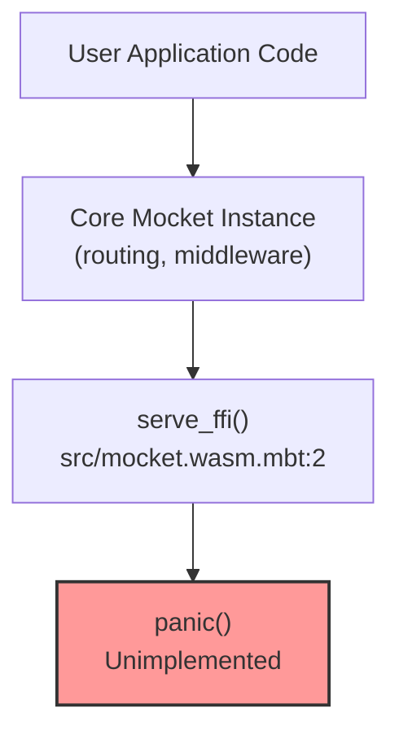
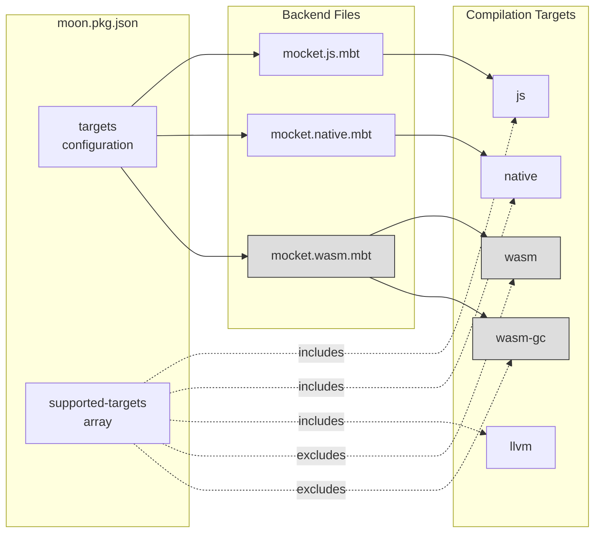
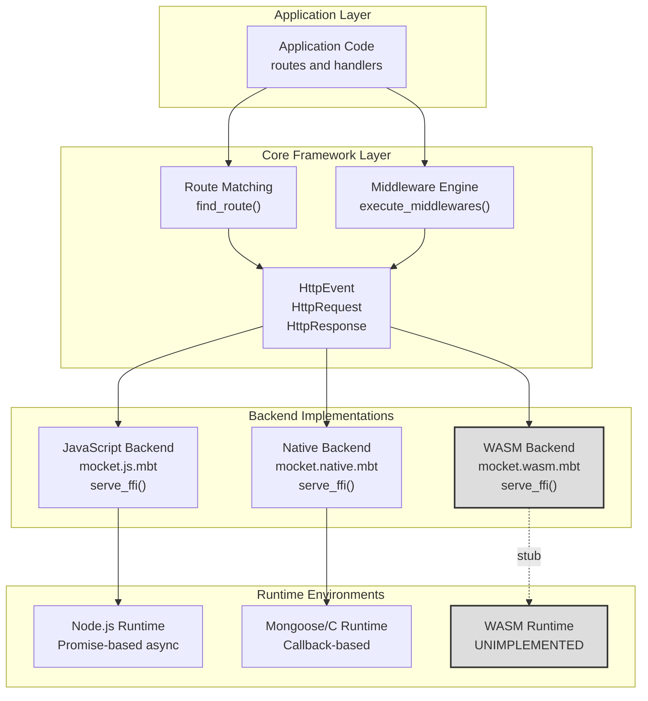
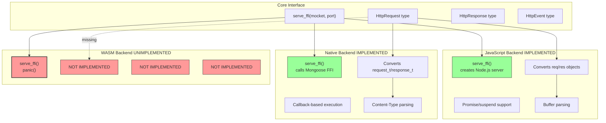
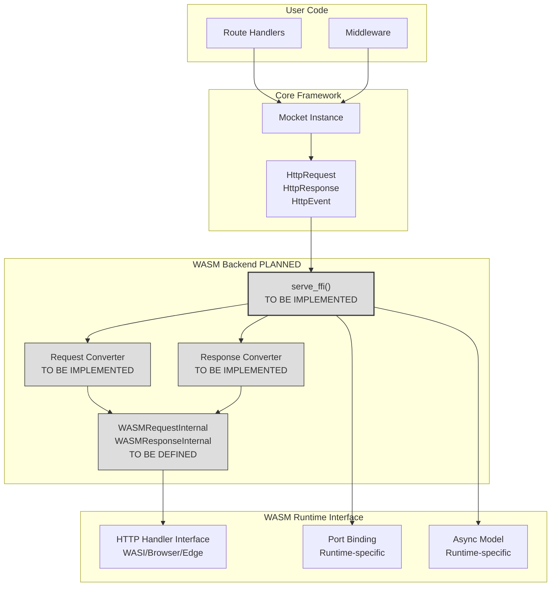

# WASM Backend

## Purpose and Scope

This document describes the WebAssembly (WASM) backend for the Mocket framework, which targets both standard WASM and WASM-GC (garbage-collected WebAssembly) compilation targets. Currently, this backend exists as an unimplemented stub in the codebase. For information about working backend implementations, see [JavaScript Backend](#3.1) and [Native Backend](#3.2). For overall multi-backend architecture concepts, see [Multi-Backend Architecture](#3).

---

## Current Implementation Status

The WASM backend is currently unimplemented and serves as a placeholder for future development. The entire implementation consists of a single function that immediately panics when called.

### Stub Implementation

The WASM backend is defined in `src/mocket.wasm.mbt:1-5` and contains only the following:

```
pub fn serve_ffi(mocket : Mocket, port~ : Int) -> Unit {
  // Unimplemented
  panic()
}
```

This `serve_ffi` function follows the same signature pattern as the native backend's server initialization function but provides no actual functionality. Any attempt to use the WASM backend will result in a runtime panic.

**Key Characteristics:**
- **Function**: `serve_ffi` - public entry point for server initialization
- **Parameters**: Takes a `Mocket` instance and port number (with named argument syntax `port~`)
- **Behavior**: Immediately calls `panic()` to terminate execution
- **Status**: Placeholder awaiting implementation

**Diagram: WASM Backend Current State**


**Sources:** `src/mocket.wasm.mbt:1-5`

---

## Target Configuration

The WASM backend is configured to support both standard WebAssembly and WebAssembly with garbage collection (WASM-GC), which are distinct compilation targets with different runtime characteristics.

### Build System Configuration

The target configuration is specified in `src/moon.pkg.json:18-29`:

| Configuration Key | Value | Purpose |
|------------------|-------|---------|
| `targets.mocket.wasm.mbt` | `["wasm", "wasm-gc"]` | Associates the WASM backend file with both WASM targets |
| `supported-targets` | `["js", "native", "llvm"]` | Lists generally supported targets (WASM not yet supported) |

**Note:** While the `targets` section includes WASM and WASM-GC mappings, these targets are **not** listed in the `supported-targets` array `src/moon.pkg.json:8-12`, indicating they are not yet fully supported by the framework.

**Diagram: Backend Target Configuration**


**Sources:** `src/moon.pkg.json:8-12`, `src/moon.pkg.json:18-29`

---

## Architecture Position

Despite being unimplemented, the WASM backend follows the same architectural pattern as the functional JavaScript and Native backends. Understanding this position helps clarify what would need to be implemented.

### Backend Abstraction Pattern

The Mocket framework uses a backend abstraction strategy where:

1. **Core Layer** - Backend-agnostic routing, middleware, and request/response types
2. **Backend Layer** - Platform-specific server implementation and HTTP protocol handling
3. **Runtime Layer** - Underlying execution environment (Node.js, C/Mongoose, or WASM runtime)

The WASM backend would fit into this pattern by providing a WASM-compatible server implementation that converts between WebAssembly's execution model and Mocket's core types (`HttpRequest`, `HttpResponse`, `HttpEvent`).

**Diagram: Architectural Position of WASM Backend**


**Sources:** `src/mocket.wasm.mbt:1-5`, `src/moon.pkg.json:18-29`

---

## Comparison with Implemented Backends

Understanding the implemented backends provides insight into what the WASM backend would need to accomplish.

### Backend Implementation Requirements

Each backend must implement the `serve_ffi` function signature and handle:

| Requirement | JavaScript Backend | Native Backend | WASM Backend (Planned) |
|------------|-------------------|----------------|----------------------|
| **Server initialization** | Node.js `http.createServer()` | Mongoose `mg_http_listen()` | WASM HTTP interface |
| **Request object conversion** | `HttpRequestInternal` from Node.js `req` | `HttpRequestInternal` from `request_t` struct | TBD |
| **Response object conversion** | `HttpResponseInternal` from Node.js `res` | `HttpResponseInternal` from `response_t` struct | TBD |
| **Async/concurrency model** | Promise-based with `suspend`/`resume` | Callback-based with staged execution | TBD |
| **Body parsing** | Event-driven buffer accumulation | Content-Type based parsing | TBD |
| **Port binding** | Node.js `.listen(port)` | Mongoose bind to port | TBD |

### Missing Components

The WASM backend currently lacks:

1. **HTTP Protocol Handler** - No mechanism to receive HTTP requests in WASM
2. **Request/Response Conversion** - No code to convert WASM-specific HTTP structures to `HttpRequest`/`HttpResponse`
3. **Runtime Integration** - No integration with WASM runtime environment (browser, WASI, or custom)
4. **Async Model** - No defined concurrency/async pattern for WASM context
5. **FFI Layer** - No foreign function interface defined (if needed for WASM host integration)

**Diagram: Backend Implementation Completeness**


**Sources:** `src/mocket.wasm.mbt:1-5`, `src/moon.pkg.json:18-29`

---

## Future Implementation Considerations

When the WASM backend is eventually implemented, several technical decisions will need to be made regarding runtime environment and integration strategy.

### WASM vs WASM-GC Targets

The configuration specifies both `wasm` and `wasm-gc` targets `src/moon.pkg.json:25-28`:

- **`wasm`** - Standard WebAssembly without garbage collection, requires manual memory management
- **`wasm-gc`** - WebAssembly with garbage collection proposal, allows high-level language GC integration

MoonBit's native garbage collection would make `wasm-gc` the more natural target, as it would allow the runtime's GC to manage memory rather than requiring manual allocation/deallocation patterns.

### Potential Runtime Environments

The WASM backend could target several different execution environments:

1. **Browser Environment** - Run Mocket as a service worker or WebAssembly module handling HTTP-like requests
2. **WASI (WebAssembly System Interface)** - Standard system interface for WebAssembly, including network sockets
3. **Edge Computing Platforms** - Cloudflare Workers, Fastly Compute@Edge, or similar WASM-based edge platforms
4. **Standalone WASM Runtime** - Wasmtime, Wasmer, or other standalone runtimes with HTTP capabilities

Each environment would require different FFI bindings and HTTP handling approaches.

### Required Implementation Components

A complete WASM backend implementation would require:

| Component | Description | Complexity |
|-----------|-------------|-----------|
| **HTTP Server Binding** | Interface to WASM runtime's HTTP capabilities | High |
| **Request Parser** | Convert runtime-specific request format to `HttpRequest` | Medium |
| **Response Writer** | Convert `HttpResponse` to runtime-specific format | Medium |
| **Port Binding** | Implement server listen/bind for WASM context | Medium |
| **Async/Await Model** | Define concurrency pattern suitable for WASM | High |
| **Error Handling** | Map WASM errors to framework error types | Low |
| **Body Streaming** | Handle request/response body streaming | Medium |

**Diagram: Planned WASM Backend Architecture**


**Sources:** `src/mocket.wasm.mbt:1-5`, `src/moon.pkg.json:18-29`

---

## Developer Guidance

### Using the WASM Backend (Not Recommended)

Attempting to compile and run Mocket with the WASM backend will result in a runtime panic. The backend is not functional and should not be used in any capacity until implemented.

### Contributing to WASM Backend Implementation

Developers interested in implementing the WASM backend should:

1. **Define target runtime** - Choose between WASI, browser, edge platforms, or multiple
2. **Design FFI strategy** - Determine how to interface with the chosen runtime's HTTP capabilities
3. **Implement `serve_ffi`** - Replace the panic with actual server initialization
4. **Create conversion layer** - Build `HttpRequestInternal` and `HttpResponseInternal` types for WASM
5. **Handle async patterns** - Define how async operations work in the WASM context
6. **Add to supported targets** - Update `src/moon.pkg.json:8-12` to include `wasm` and/or `wasm-gc`

### Testing Strategy

Once implemented, the WASM backend should be tested against the same behavioral contracts as the JavaScript and Native backends to ensure consistent routing, middleware, and response handling across all platforms.

**Sources:** `src/mocket.wasm.mbt:1-5`, `src/moon.pkg.json:8-12`, `src/moon.pkg.json:18-29`