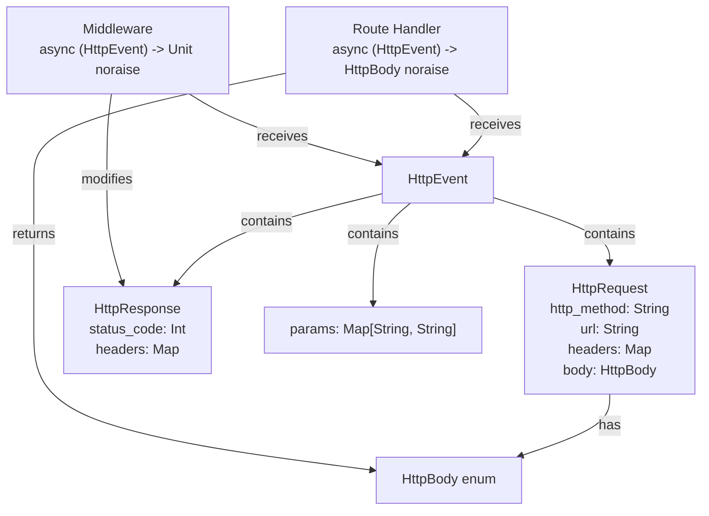
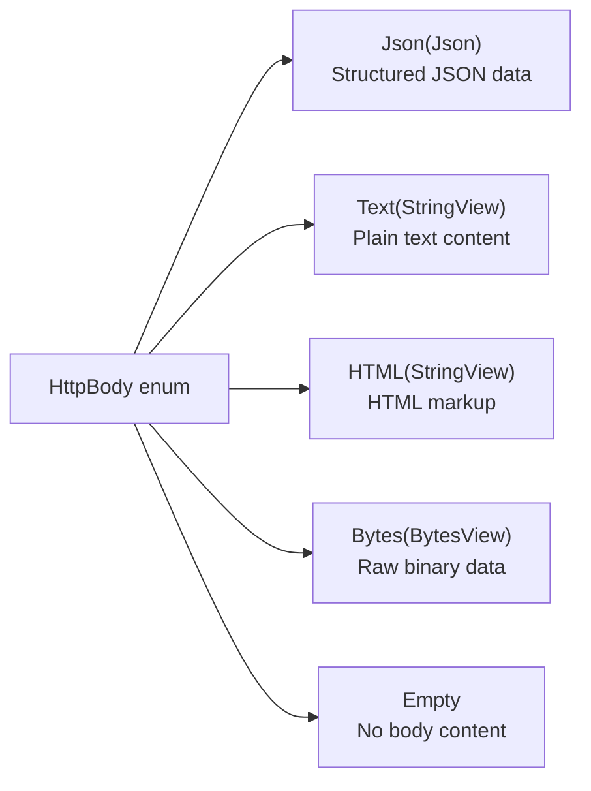
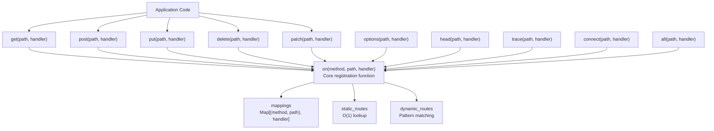
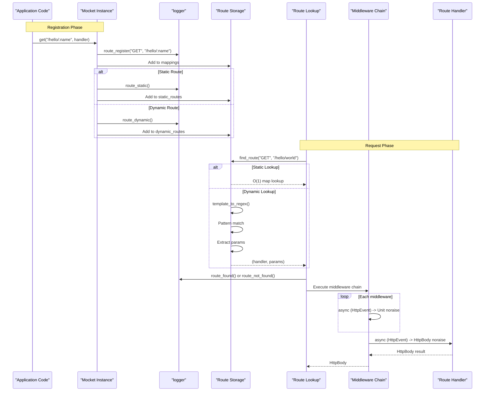
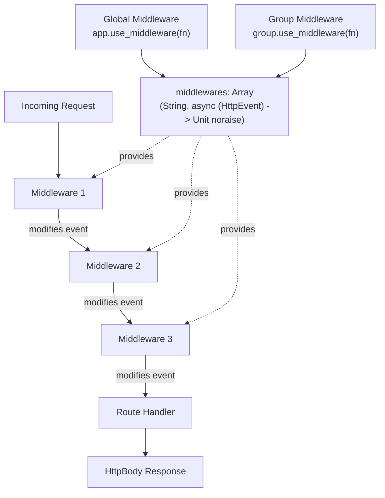
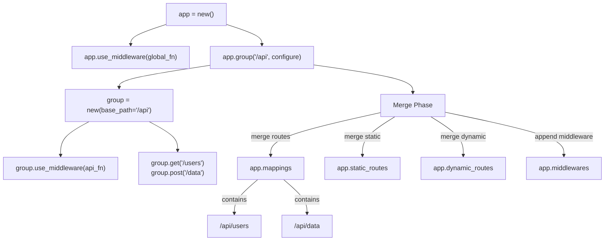
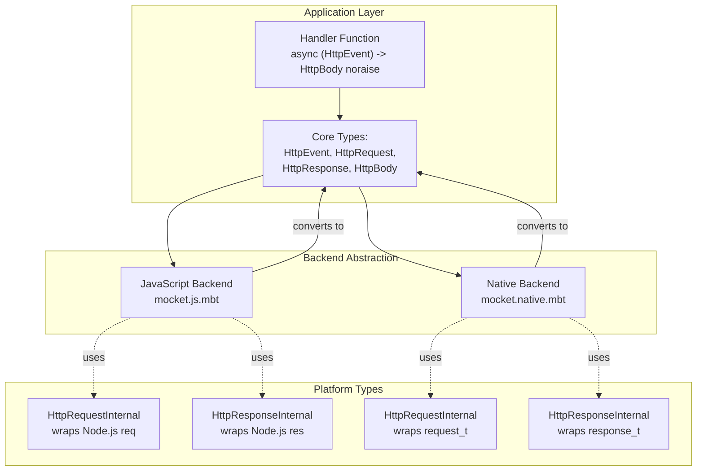

# Core Concepts

This document explains the fundamental concepts required to build applications with Mocket. It covers the core type system, routing fundamentals, middleware execution model, and route organization patterns. For detailed information on specific topics, see:
- Routing implementation details: [Routing System](#2.1)
- Middleware patterns and examples: [Middleware System](#2.2)
- Request body parsing and response construction: [Request and Response Handling](#2.3)

## Core Type System

Mocket's type system is built around four primary types that represent the HTTP request-response lifecycle:

### The Mocket Application Object

The `Mocket` struct `src/index.mbt:11-27` is the main application object that holds all routes, middleware, and configuration:

| Field | Type | Purpose |
|-------|------|---------|
| `base_path` | `String` | Prefix applied to all routes in the application |
| `mappings` | `Map[(String, String), async (HttpEvent) -> HttpBody noraise]` | Complete registry of all routes (method + path) |
| `static_routes` | `Map[String, Map[String, ...]]` | O(1) lookup cache for exact path matches |
| `dynamic_routes` | `Map[String, Array[...]]` | Registry of routes containing parameters or wildcards |
| `middlewares` | `Array[(String, async (HttpEvent) -> Unit noraise)]` | Ordered list of middleware functions |
| `logger` | `Logger` | Logging system for route registration and request handling |

The dual-storage strategy (`static_routes` and `dynamic_routes`) optimizes route lookup performance by separating exact matches from pattern-based matches.

### HTTP Request-Response Lifecycle Types



**HttpEvent** encapsulates the complete request context:
- `req`: The incoming `HttpRequest` `src/index.mbt:48-53`
- `res`: The outgoing `HttpResponse` `src/index.mbt:56-60`
- `params`: Extracted route parameters from dynamic path segments

**HttpRequest** `src/index.mbt:48-53` contains:
- `http_method`: HTTP verb (GET, POST, etc.)
- `url`: Request path
- `headers`: Request headers as key-value map
- `body`: Parsed request body as `HttpBody`

**HttpResponse** `src/index.mbt:56-60` contains:
- `status_code`: HTTP status code (mutable)
- `headers`: Response headers (mutable map)

**Sources:** `src/index.mbt:11-60`, `README.md:42-208`

### HttpBody Type Variants

The `HttpBody` enum `src/index.mbt:2-8` represents both request and response body content:



| Variant | Use Case | Content-Type |
|---------|----------|--------------|
| `Json(Json)` | API responses, structured data | `application/json` |
| `Text(StringView)` | Plain text responses | `text/plain` |
| `HTML(StringView)` | Web pages, HTML content | `text/html` |
| `Bytes(BytesView)` | Binary files, images | `application/octet-stream` |
| `Empty` | 204 No Content, HEAD responses | None |

**Sources:** `src/index.mbt:2-8`, `README.md:122-186`

## Routing Fundamentals

### Route Registration API

Mocket provides HTTP method-specific functions that delegate to a core `on` function `src/index.mbt:89-128`:



Each method function `src/index.mbt:131-218` follows this signature:
```moonbit
pub fn METHOD(
  self : Mocket,
  path : String,
  handler : async (HttpEvent) -> HttpBody noraise,
) -> Unit
```

**Sources:** `src/index.mbt:89-218`, `README.md:114-189`

### Static vs Dynamic Route Classification

When a route is registered via `on()`, it is classified as either static or dynamic based on path analysis `src/index.mbt:100-127`:

**Static Routes** - Exact path matches with no special characters:
- Path contains neither `:` parameter markers nor `*` wildcards
- Stored in `static_routes` map for O(1) lookup
- Example: `/api/users`, `/hello`, `/`

**Dynamic Routes** - Paths with parameters or wildcards:
- Path contains `:param` named parameters
- Path contains `*` (single segment) or `**` (multi-segment) wildcards
- Stored in `dynamic_routes` array, requires regex matching
- Example: `/hello/:name`, `/files/*`, `/api/**`

The `template_to_regex` function `src/index.mbt:64-86` converts dynamic path templates to regex patterns:

| Template Segment | Regex Pattern | Matches |
|-----------------|---------------|---------|
| `:param` | `([^/]+)` | Single path segment |
| `*` | `([^/]+)` | Single path segment (stored as `_` param) |
| `**` | `(.*)` | Multiple path segments (stored as `_` param) |
| literal | `literal` | Exact match |

**Sources:** `src/index.mbt:64-127`, `README.md:44-71`, `README.md:197-207`

## Request Processing Flow

The following diagram shows how a request flows through Mocket from registration to response:



**Sources:** `src/index.mbt:89-128`

## Middleware Execution Model

Middleware functions have the signature `async (HttpEvent) -> Unit noraise` `src/index.mbt:14` and can modify the `HttpEvent` before it reaches route handlers.

### Middleware Storage and Execution



Middleware execution characteristics:
- **Global middleware**: Applied to all routes via `app.use_middleware()`
- **Group middleware**: Applied only to routes within a specific group
- **Execution order**: Sequential, in the order registered
- **Mutation**: Can modify `event.res.status_code` and `event.res.headers`
- **Access**: Has read access to `event.req` and `event.params`

Common middleware use cases:
- Request logging `README.md:116-120`
- Header manipulation
- Authentication/authorization
- CORS handling
- Request timing

**Sources:** `src/index.mbt:14`, `README.md:86-109`, `README.md:116-120`

## Route Groups

Route groups allow organizing routes under a common base path with shared middleware `src/index.mbt:222-255`:



Group functionality `src/index.mbt:222-255`:
1. Creates a new `Mocket` instance with combined `base_path`
2. Applies configuration function to populate routes and middleware
3. Merges group's `mappings`, `static_routes`, `dynamic_routes` into parent
4. Appends group's middleware to parent's middleware array

Example from README `README.md:86-109`:
```moonbit
app.group("/api", group => {
  group.use_middleware(event => println("API middleware"))
  group.get("/hello", _ => Text("Hello from API!"))
  group.get("/users", _ => Json({ "users": ["Alice", "Bob"] }))
})
```

This creates routes at `/api/hello` and `/api/users`, both executing the group middleware plus any global middleware.

**Sources:** `src/index.mbt:222-255`, `README.md:86-109`, `README.md:127-138`

## Type System Integration Across Backends

The core types are backend-agnostic, allowing the same application code to run on JavaScript and Native backends:



This abstraction enables:
- **Write once, run anywhere**: Same handler code compiles for both targets
- **Backend selection at build time**: Choose target via `moon run --target js|native`
- **Consistent API**: `HttpEvent`, `HttpRequest`, `HttpResponse` behave identically across backends

See [Multi-Backend Architecture](#3) for platform-specific implementation details.

**Sources:** `src/index.mbt:1-256`, `README.md:12-35`