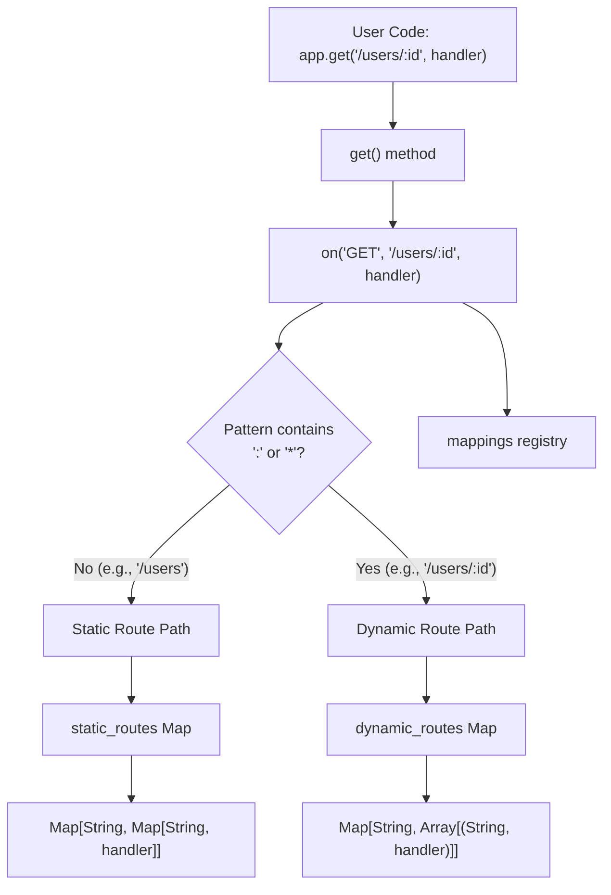
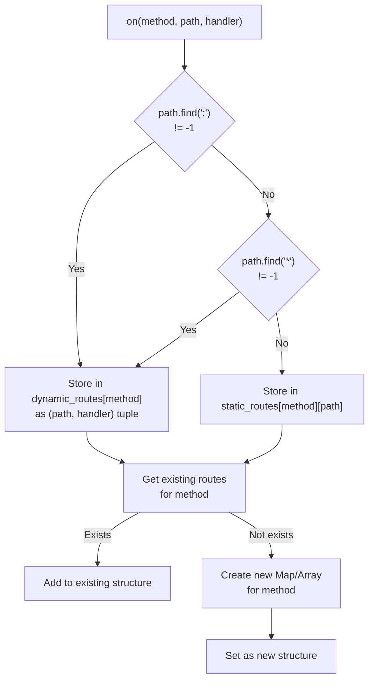
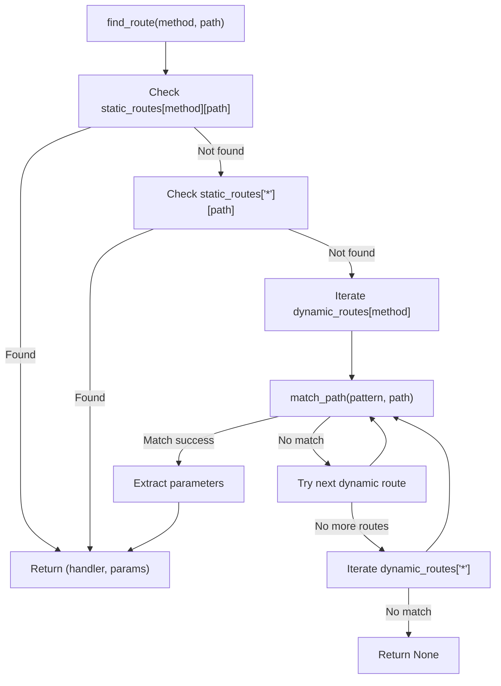
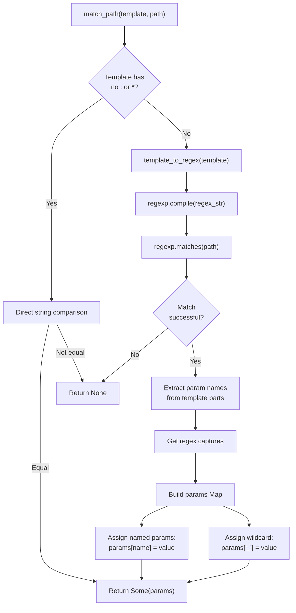
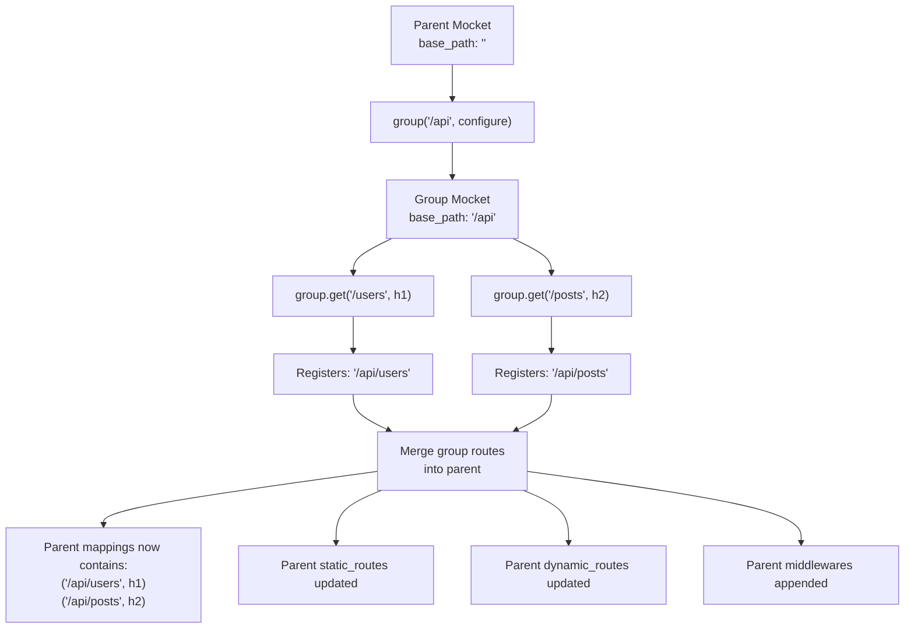

# Routing System

The routing system is responsible for mapping incoming HTTP requests to their corresponding handler functions. This document explains the route registration API, the dual-storage optimization strategy for route lookup, pattern matching syntax, and performance characteristics. For information about middleware execution around routes, see [Middleware System](#2.2). For details on the request/response types used in handlers, see [Request and Response Handling](#2.3).

## Route Registration

### Core Registration Method

All routes are registered through the `on()` method `src/index.mbt:89-128`, which serves as the foundation for route registration. This method accepts an HTTP method, a path pattern, and an async handler function:

```moonbit
fn on(
  self : Mocket,
  event : String,        // HTTP method (GET, POST, etc.)
  path : String,         // Path pattern (e.g., "/users/:id")
  handler : async (HttpEvent) -> HttpBody noraise
) -> Unit
```

The `on()` method performs three critical operations:

1. **Records the route** in the `mappings` map `src/index.mbt:97` for a complete registry
2. **Classifies the route** as static or dynamic based on pattern syntax `src/index.mbt:100`
3. **Stores the route** in optimized data structures for fast lookup `src/index.mbt:103-127`

### HTTP Method Convenience Functions

The framework provides convenience methods for each standard HTTP method, all of which delegate to `on()`:

| Method Function | HTTP Method | Line Reference |
|----------------|-------------|----------------|
| `get()` | GET | `src/index.mbt:131-137` |
| `post()` | POST | `src/index.mbt:139-146` |
| `put()` | PUT | `src/index.mbt:167-173` |
| `patch()` | PATCH | `src/index.mbt:149-155` |
| `delete()` | DELETE | `src/index.mbt:175-182` |
| `head()` | HEAD | `src/index.mbt:184-191` |
| `options()` | OPTIONS | `src/index.mbt:193-200` |
| `trace()` | TRACE | `src/index.mbt:202-209` |
| `connect()` | CONNECT | `src/index.mbt:157-164` |
| `all()` | * (wildcard) | `src/index.mbt:211-218` |

**Route Registration Flow**



Sources: `src/index.mbt:89-128`, `src/index.mbt:131-218`

## Dual-Storage Optimization Strategy

The routing system uses two separate data structures to optimize lookup performance based on route type `src/index.mbt:11-27`:

### Static Routes Storage

Static routes (paths without parameters or wildcards) are stored in `static_routes`:

```moonbit
static_routes : Map[
  String,                                         // HTTP method
  Map[String, async (HttpEvent) -> HttpBody noraise]  // path -> handler
]
```

This two-level map structure enables **O(1) lookup** for exact path matches `src/index.mbt:100-116`. The classification logic checks if the path contains `:` or `*` characters `src/index.mbt:100`.

### Dynamic Routes Storage

Dynamic routes (paths with `:param`, `*`, or `**` patterns) are stored in `dynamic_routes`:

```moonbit
dynamic_routes : Map[
  String,                                              // HTTP method
  Array[(String, async (HttpEvent) -> HttpBody noraise)]  // (pattern, handler) pairs
]
```

Dynamic routes require sequential scanning and regex matching `src/index.mbt:118-127`, resulting in **O(n) lookup** where n is the number of dynamic routes for that HTTP method.

**Storage Decision Flow**



Sources: `src/index.mbt:16-24`, `src/index.mbt:100-127`

## Route Pattern Syntax

The routing system supports three types of path patterns, each with specific matching behavior:

### Static Paths

Static paths contain no special characters and match exactly:

```moonbit
app.get("/users", handler)          // Matches only "/users"
app.get("/api/v1/posts", handler)   // Matches only "/api/v1/posts"
```

### Named Parameters

Named parameters are prefixed with `:` and match a single path segment `README.md:46-52`:

```moonbit
app.get("/users/:id", handler)              // Matches "/users/123"
app.get("/users/:id/posts/:postId", handler) // Matches "/users/123/posts/456"
```

Parameters are extracted and stored in `event.params` with the parameter name as the key `src/path_match.mbt:53-54`.

### Wildcard Patterns

The system supports two wildcard types:

- **Single wildcard (`*`)**: Matches exactly one path segment `README.md:60-64`
- **Double wildcard (`**`)**: Matches one or more path segments `README.md:66-71`

Both wildcard types store the matched value in `event.params` with the key `"_"` `src/path_match.mbt:46-51`.

**Pattern Matching Examples**

| Route Pattern | Request Path | Match | Extracted Parameters |
|--------------|--------------|-------|---------------------|
| `/hello/:name` | `/hello/world` | ✓ | `{name: "world"}` |
| `/hello/:name` | `/hello/world/foo` | ✗ | - |
| `/hello/*` | `/hello/world` | ✓ | `{_: "world"}` |
| `/hello/*` | `/hello/world/foo` | ✗ | - |
| `/hello/**` | `/hello/world` | ✓ | `{_: "world"}` |
| `/hello/**` | `/hello/world/foo` | ✓ | `{_: "world/foo"}` |
| `/users/:id/posts/:postId` | `/users/123/posts/456` | ✓ | `{id: "123", postId: "456"}` |

Sources: `README.md:46-71`, `README.md:197-207`

## Route Matching Algorithm

The route matching process implements a two-tier lookup strategy that prioritizes performance for common cases `src/path_match.mbt:64-131`.

### Lookup Priority

The `find_route()` function `src/path_match.mbt:64-131` follows this priority order:

1. **Static routes for the requested HTTP method** `src/path_match.mbt:71-91`
2. **Static routes for wildcard method (`*`)** `src/path_match.mbt:94-101`
3. **Dynamic routes for the requested HTTP method** `src/path_match.mbt:104-115`
4. **Dynamic routes for wildcard method (`*`)** `src/path_match.mbt:118-129`

**Route Lookup Algorithm**



Sources: `src/path_match.mbt:64-131`

### Pattern to Regex Conversion

For dynamic routes, the `template_to_regex()` function `src/index.mbt:64-86` converts path patterns into regular expressions:

| Pattern Component | Regex Equivalent | Description |
|------------------|------------------|-------------|
| `:param` | `([^/]+)` | Matches one or more non-slash characters |
| `*` | `([^/]+)` | Matches one or more non-slash characters |
| `**` | `(.*)` | Matches zero or more characters (any) |
| literal text | escaped literal | Matches exact text |

The function optimizes by detecting static routes early `src/index.mbt:66-69` and avoiding regex construction when unnecessary.

### Parameter Extraction

The `match_path()` function `src/path_match.mbt:3-60` performs parameter extraction:

1. **Quick rejection** for static paths `src/path_match.mbt:5-12`
2. **Regex compilation** from the template `src/path_match.mbt:15-16`
3. **Capture extraction** from match results `src/path_match.mbt:40`
4. **Parameter mapping** based on position and name `src/path_match.mbt:39-58`

**Parameter Extraction Flow**



Sources: `src/path_match.mbt:3-60`, `src/index.mbt:64-86`

## Route Groups

The `group()` function `src/index.mbt:222-255` enables hierarchical route organization with shared path prefixes and middleware.

### Group Registration

Route groups create a new `Mocket` instance with an extended `base_path` `src/index.mbt:227`:

```moonbit
app.group("/api", fn(group) {
  group.get("/users", handler)    // Registers "/api/users"
  group.post("/posts", handler)   // Registers "/api/posts"
})
```

The group's `base_path` is prepended to all routes registered within it `src/index.mbt:95`.

### Route Merging

After the configure function executes, the group merges its routes back into the parent `Mocket` `src/index.mbt:230-254`:

1. **Route mappings** are merged `src/index.mbt:230`
2. **Static routes** are merged by HTTP method `src/index.mbt:231-241`
3. **Dynamic routes** are appended `src/index.mbt:242-252`
4. **Middlewares** are appended to the parent's middleware list `src/index.mbt:254`

**Route Group Structure**



Sources: `src/index.mbt:222-255`, `README.md:86-109`

### Nested Groups

Groups can be nested by calling `group()` within a group's configure function:

```moonbit
app.group("/api", fn(api) {
  api.group("/v1", fn(v1) {
    v1.get("/users", handler)  // Registers "/api/v1/users"
  })
})
```

Each nested group accumulates the `base_path` from its parent `src/index.mbt:227`.

## Performance Characteristics

The routing system's performance depends on the route type and lookup path:

| Operation | Static Route | Dynamic Route | Complexity |
|-----------|-------------|---------------|------------|
| Registration | 2× map lookup/insert | 1× array append | O(1) amortized |
| Lookup (hit) | 2× map lookup | Linear scan + regex | O(1) / O(n×m) |
| Lookup (miss) | 2× map lookup + linear scan | Full scan | O(1) + O(n×m) |
| Parameter extraction | None | Regex capture | O(m) |

Where:
- **n** = number of dynamic routes for the HTTP method
- **m** = average path length

### Optimization Strategies

The implementation includes several performance optimizations:

1. **Early static path detection** `src/index.mbt:66-69` avoids string processing when unnecessary
2. **Two-level map structure** for static routes minimizes hash collisions `src/index.mbt:16-19`
3. **Lazy regex compilation** occurs only during route matching, not registration `src/path_match.mbt:15-16`
4. **Static route priority** ensures common cases (exact matches) are checked first `src/path_match.mbt:71-91`

### Logging and Debugging

The routing system integrates with the `Logger` interface `src/index.mbt:26` to provide visibility into route operations:

- `route_register()`: Logs route registration `src/index.mbt:96`
- `route_static()` / `route_dynamic()`: Logs route classification `src/index.mbt:102, 119`
- `route_lookup()`: Logs route lookup attempts `src/path_match.mbt:69`
- `route_found()` / `route_not_found()`: Logs lookup results `src/path_match.mbt:78, 82`

For more information on logging configuration, see [Logging System](#5.1).

Sources: `src/index.mbt:11-27`, `src/index.mbt:64-128`, `src/path_match.mbt:64-131`