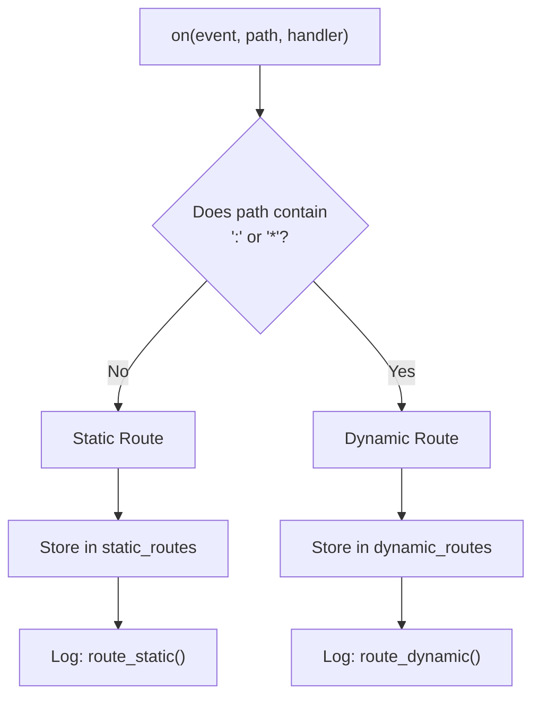
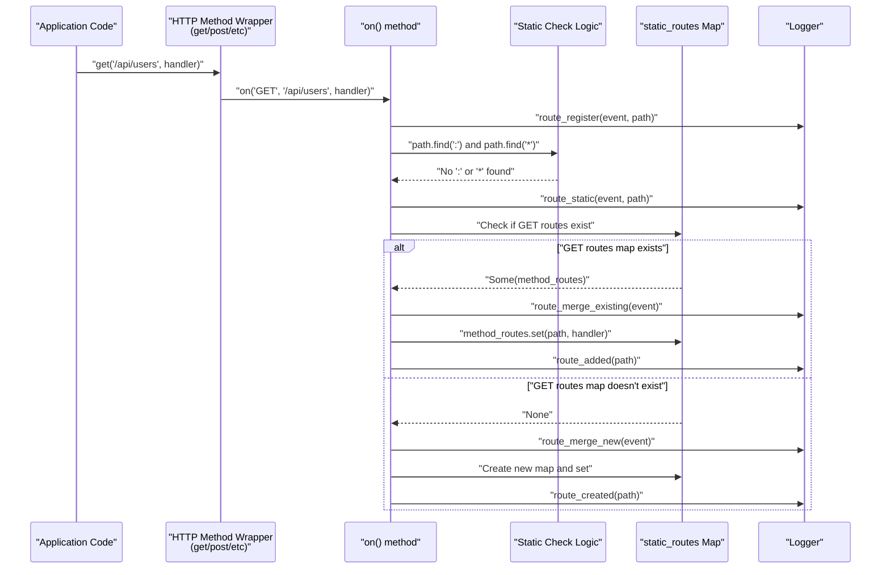
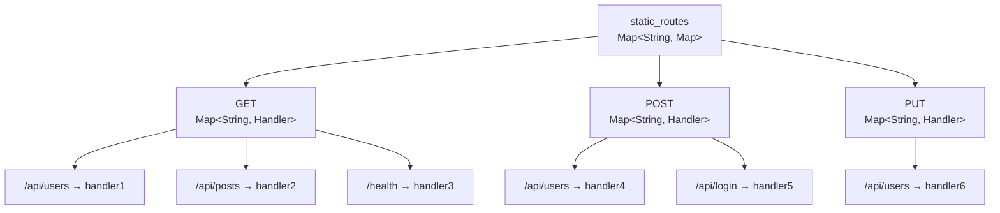
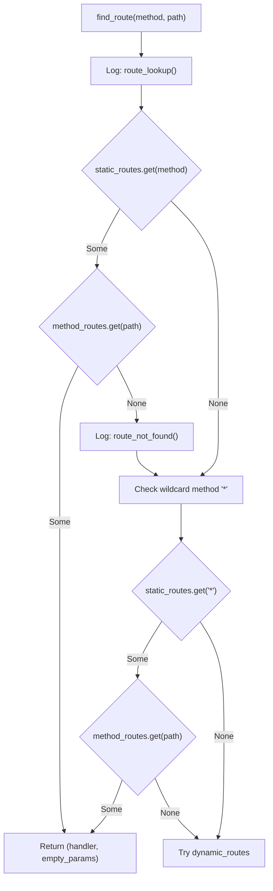

# Static Routes

## Purpose and Scope

This document explains static route registration and optimization in the Mocket framework. Static routes are exact path matches (e.g., `/api/users`, `/about`) that do not contain path parameters or wildcards. They are optimized for O(1) lookup performance through a dedicated caching mechanism.

For information about routes with path parameters (`:param`) or wildcards (`*`, `**`), see [Dynamic Routes and Parameters](#2.1.2). For organizing routes under common prefixes, see [Route Groups](#2.1.3).

## What Are Static Routes?

A static route is any route path that contains neither parameter placeholders (`:param`) nor wildcards (`*`, `**`). These routes match URLs exactly as specified.

**Examples of static routes:**
- `/`
- `/api/users`
- `/about/contact`
- `/v1/health`

**Examples that are NOT static routes:**
- `/users/:id` (contains `:id` parameter)
- `/files/*` (contains wildcard)
- `/api/**/resource` (contains double wildcard)

The framework automatically detects whether a route is static during registration by checking if the path contains `:` or `*` characters [src/index.mbt:100-101]().

Sources: [src/index.mbt:64-86](), [src/index.mbt:100-116]()

## Route Detection Logic



Sources: [src/index.mbt:89-128]()

## Registration Process

All routes are registered through the `on` method or its HTTP method convenience wrappers. The framework determines route type during registration.

### HTTP Method Wrappers

| Method | Function | Line Reference |
|--------|----------|----------------|
| GET | `get(path, handler)` | [src/index.mbt:131-137]() |
| POST | `post(path, handler)` | [src/index.mbt:140-146]() |
| PUT | `put(path, handler)` | [src/index.mbt:167-173]() |
| DELETE | `delete(path, handler)` | [src/index.mbt:176-182]() |
| PATCH | `patch(path, handler)` | [src/index.mbt:149-155]() |
| HEAD | `head(path, handler)` | [src/index.mbt:185-191]() |
| OPTIONS | `options(path, handler)` | [src/index.mbt:194-200]() |
| TRACE | `trace(path, handler)` | [src/index.mbt:203-209]() |
| CONNECT | `connect(path, handler)` | [src/index.mbt:158-164]() |
| ALL | `all(path, handler)` | [src/index.mbt:212-218]() |

All these methods delegate to `on(event, path, handler)` [src/index.mbt:89-128](), which performs the static vs. dynamic classification.

### Registration Flow for Static Routes



Sources: [src/index.mbt:89-128](), [src/index.mbt:131-137]()

## Storage Architecture

Static routes are stored in a two-level nested `Map` structure for optimal lookup performance:

```
static_routes: Map[String, Map[String, async (HttpEvent) -> HttpBody noraise]]
               ↓              ↓             ↓
            HTTP Method    Path        Handler Function
```

### Data Structure Definition

The `static_routes` field is defined in the `Mocket` struct [src/index.mbt:16-19]():

```
static_routes : Map[
  String,
  Map[String, async (HttpEvent) -> HttpBody noraise],
]
```

### Two-Level Map Organization



**First Level (Outer Map):** HTTP method string (`"GET"`, `"POST"`, etc.)
**Second Level (Inner Map):** Exact path string to handler function

This structure allows O(1) lookup complexity: one map lookup for the HTTP method, then one map lookup for the path.

Sources: [src/index.mbt:16-19](), [src/index.mbt:103-116]()

## Storage Logic

When a static route is registered [src/index.mbt:100-116]():

1. **Check if the HTTP method map exists** in `static_routes` [src/index.mbt:103]()
2. **If it exists:** Add the path and handler to the existing inner map [src/index.mbt:104-108]()
3. **If it doesn't exist:** Create a new inner map, add the route, and store it in `static_routes` [src/index.mbt:109-116]()

This lazy initialization ensures that only used HTTP methods consume memory.

Sources: [src/index.mbt:100-116]()

## Lookup Mechanism

Static route lookup occurs in the `find_route` function and follows a fast-path optimization strategy.

### Lookup Algorithm



### Lookup Steps

1. **Primary static lookup** [src/path_match.mbt:71-86]():
   - Get the inner map for the requested HTTP method
   - Attempt exact path match in the inner map
   - If found, return handler with empty parameters map
   
2. **Wildcard method fallback** [src/path_match.mbt:93-101]():
   - Check if any routes are registered for the wildcard method `"*"`
   - Attempt exact path match in the wildcard method's routes
   
3. **Dynamic route fallback** [src/path_match.mbt:103-130]():
   - If no static route matches, proceed to dynamic route matching (see [Dynamic Routes and Parameters](#2.1.2))

Sources: [src/path_match.mbt:64-131]()

## Code Entity Mapping

The following table maps system concepts to their code representations:

| Concept | Type/Function | File Location |
|---------|---------------|---------------|
| Static route storage | `static_routes` field in `Mocket` struct | [src/index.mbt:16-19]() |
| Route registration entry point | `on()` method | [src/index.mbt:89-128]() |
| Static detection logic | Path string checks in `on()` | [src/index.mbt:100]() |
| Static route caching | Inner map insertion logic | [src/index.mbt:103-116]() |
| Route lookup entry point | `find_route()` function | [src/path_match.mbt:64-131]() |
| Static lookup fast path | Map access in `find_route()` | [src/path_match.mbt:71-86]() |
| HTTP method wrappers | `get()`, `post()`, etc. | [src/index.mbt:131-218]() |

Sources: [src/index.mbt:11-27](), [src/index.mbt:89-218](), [src/path_match.mbt:64-131]()

## Performance Characteristics

Static routes are designed for optimal performance:

### Time Complexity

| Operation | Complexity | Description |
|-----------|------------|-------------|
| **Registration** | O(1) | Direct map insertion [src/index.mbt:106]() or [src/index.mbt:112]() |
| **Lookup** | O(1) | Two nested map lookups [src/path_match.mbt:71-79]() |
| **Wildcard fallback** | O(1) | Additional map lookups if primary fails [src/path_match.mbt:94-100]() |

### Space Complexity

- **Per HTTP method:** O(n) where n is the number of unique static paths for that method
- **Overall:** O(m × n) where m is the number of HTTP methods used and n is average paths per method

### Why Static Routes Are Optimized

Static routes receive special optimization because:

1. **Common case:** Most API endpoints are static paths (e.g., `/api/users`, `/api/posts`, `/health`)
2. **Predictable matching:** No regex compilation or pattern matching needed
3. **Frequent access:** Popular routes benefit significantly from O(1) lookup
4. **Memory efficient:** Exact string keys are more efficient than storing regex patterns

The framework prioritizes static route lookup over dynamic route matching [src/path_match.mbt:70-91](), ensuring the fast path is tried first for every request.

Sources: [src/index.mbt:100-116](), [src/path_match.mbt:69-91]()

## Relationship to Other Route Types


Static routes and dynamic routes are stored and processed separately. During route lookup, static routes are checked first [src/path_match.mbt:71-91](), and only if no static match is found does the system fall back to dynamic route matching [src/path_match.mbt:103-130]().

This separation ensures that the most common case (exact path matches) is handled with maximum efficiency, while still supporting the flexibility of parameterized routes when needed.

Sources: [src/index.mbt:89-128](), [src/path_match.mbt:64-131]()