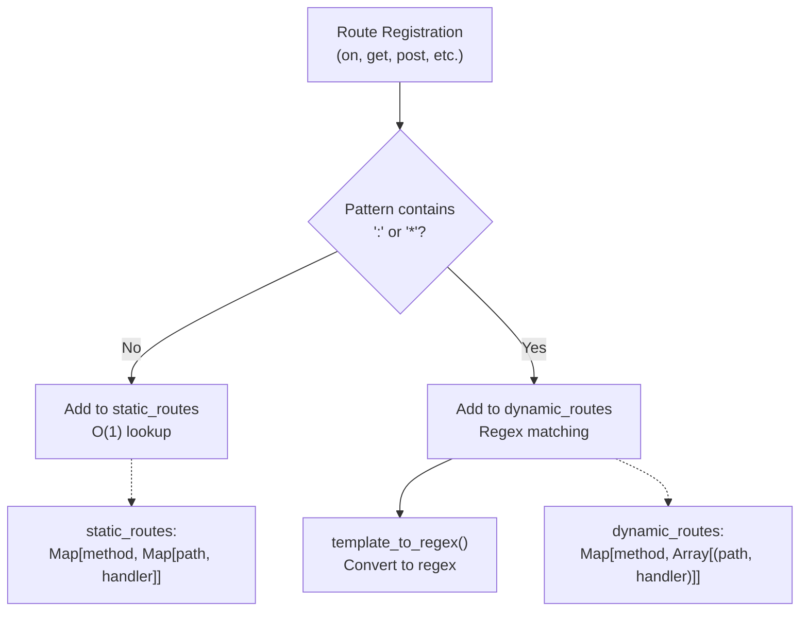
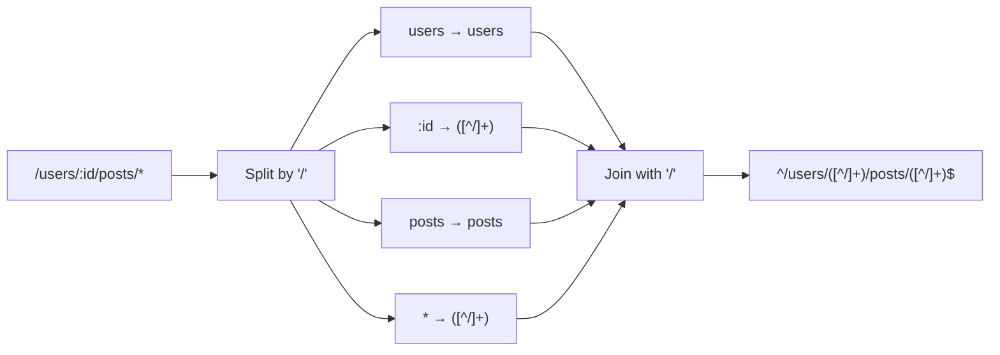
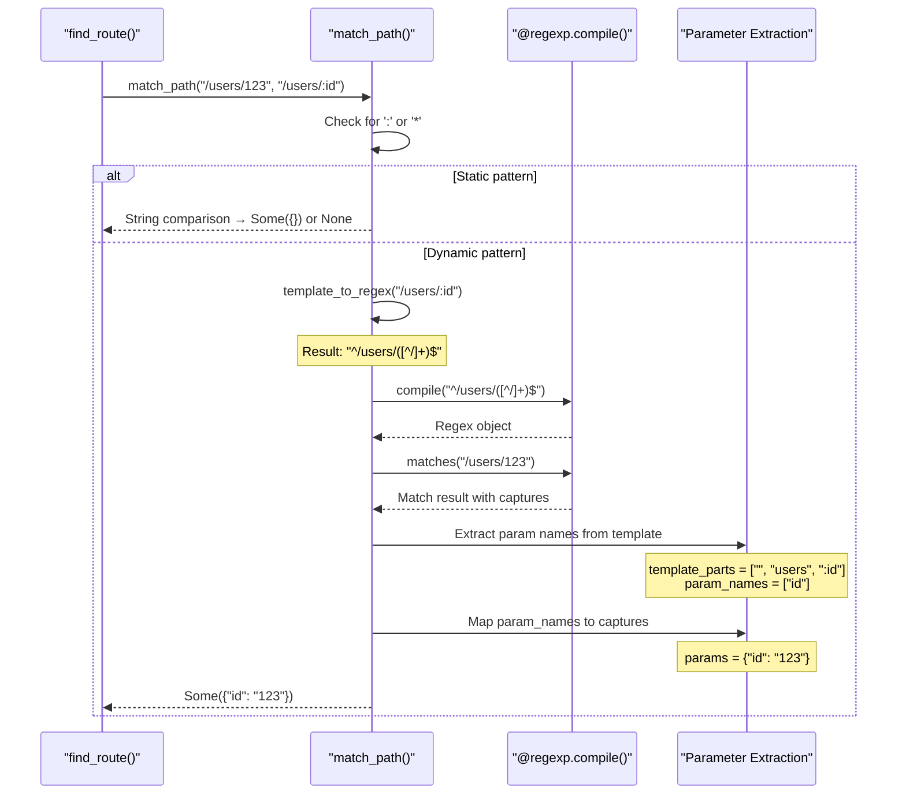
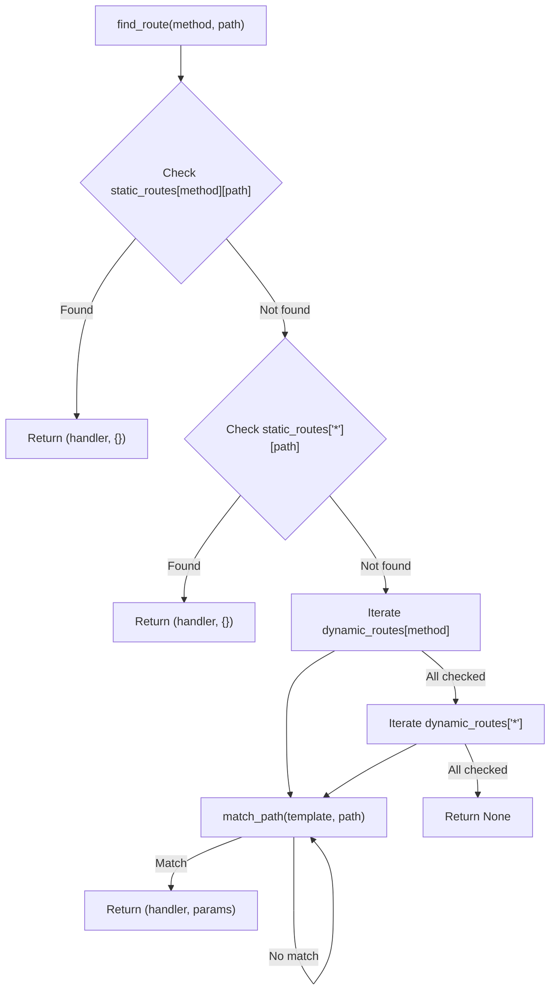

# Dynamic Routes and Parameters

## Purpose and Scope

This document explains how Mocket handles dynamic routes with parameters, including named parameters (`:param`), single wildcards (`*`), and double wildcards (`**`). It covers the pattern syntax, regex compilation process, parameter extraction mechanism, and route lookup strategy. For information about static routes with exact path matching, see [Static Routes](#2.1.1). For organizing routes under common prefixes, see [Route Groups](#2.1.3).

Sources: [README.md:44-71](), [src/index.mbt:11-27](), [src/path_match.mbt:1-131]()

## Route Pattern Syntax

Mocket supports three types of dynamic route patterns that allow matching variable path segments and extracting them as parameters.

### Named Parameters

Named parameters use the `:param` syntax to capture a single path segment and bind it to a parameter name. The parameter value is accessible via `event.params.get("name")`.

**Pattern**: `/hello/:name`  
**Matches**: `/hello/world`, `/hello/alice`  
**Does not match**: `/hello/world/extra`, `/hello` (missing segment)  

```moonbit
app.get("/hello/:name", fn(event) {
  let name = event.params.get("name").or("World")
  Text("Hello, \{name}!")
})
```

Multiple named parameters can appear in a single route pattern:

**Pattern**: `/users/:id/posts/:postId`  
**Matches**: `/users/123/posts/456`  
**Parameters**: `id: "123"`, `postId: "456"`

Sources: [README.md:46-53](), [README.md:204](), [src/path_match.mbt:28-29](), [src/path_match.mbt:53-54]()

### Single Wildcard (`*`)

The single wildcard `*` matches exactly one path segment. The captured value is stored in the special parameter key `"_"`.

**Pattern**: `/hello/*`  
**Matches**: `/hello/world`, `/hello/alice`  
**Does not match**: `/hello/foo/bar` (too many segments)  
**Parameter**: `_: "world"` or `_: "alice"`

```moonbit
app.get("/hello/*", fn(event) {
  let name = event.params.get("_").or("World")
  Text("Hello, \{name}!")
})
```

Sources: [README.md:57-64](), [README.md:202](), [src/path_match.mbt:46-48]()

### Double Wildcard (`**`)

The double wildcard `**` matches one or more path segments, including slashes. This is useful for catch-all routes or file paths.

**Pattern**: `/hello/**`  
**Matches**: `/hello/world`, `/hello/foo/bar`, `/hello/a/b/c/d`  
**Parameter**: `_: "world"` or `_: "foo/bar"` or `_: "a/b/c/d"`

```moonbit
app.get("/hello/**", fn(event) {
  let path = event.params.get("_").or("")
  Text("Hello, \{path}!")
})
```

**Pattern**: `/api/**`  
**Matches**: `/api/v1/users/123`  
**Parameter**: `_: "v1/users/123"`

Sources: [README.md:66-70](), [README.md:205](), [src/path_match.mbt:49-51]()

## Route Pattern Compilation

### Pattern to Regex Conversion

When a route is registered via `on()`, `get()`, `post()`, or other HTTP method functions, Mocket determines whether the route is static or dynamic by checking for the presence of `:` or `*` characters. Dynamic routes are compiled into regular expressions using the `template_to_regex` function.

**Diagram: Route Registration and Classification**



Sources: [src/index.mbt:89-128]()

### Regex Pattern Generation

The `template_to_regex` function at [src/index.mbt:64-86]() converts route patterns into regular expressions:

| Input Pattern | Regex Output | Explanation |
|---------------|--------------|-------------|
| `/api/users` | `^/api/users$` | Exact match (optimization skips regex) |
| `/hello/:name` | `^/hello/([^/]+)$` | Named param becomes `([^/]+)` |
| `/hello/*` | `^/hello/([^/]+)$` | Single wildcard becomes `([^/]+)` |
| `/hello/**` | `^/hello/(.*)$` | Double wildcard becomes `(.*)` |
| `/users/:id/posts/:postId` | `^/users/([^/]+)/posts/([^/]+)$` | Multiple captures |

The function splits the path by `/` and processes each segment:
- Segments starting with `:` → `([^/]+)` (match anything except slash)
- Segments equal to `*` → `([^/]+)` (match one segment)
- Segments equal to `**` → `(.*)` (match everything)
- Literal segments → unchanged

**Diagram: template_to_regex Pattern Transformation**



Sources: [src/index.mbt:64-86]()

## Parameter Extraction

### match_path Function

The `match_path` function at [src/path_match.mbt:3-60]() performs two operations:
1. Determine if a URL path matches a route template
2. Extract parameter values from the matched path

**Diagram: Parameter Extraction Process**



Sources: [src/path_match.mbt:3-60]()

### Parameter Naming Rules

The `match_path` function builds a parameter map by analyzing the template parts:

1. **Named parameters** (`:param`): The substring after `:` becomes the key
   - Template: `/users/:id` → Key: `"id"`
   
2. **Single wildcard** (`*`): Always uses key `"_"`
   - Template: `/hello/*` → Key: `"_"`

3. **Double wildcard** (`**`): Always uses key `"_"`
   - Template: `/api/**` → Key: `"_"`

4. **Multiple wildcards**: The last wildcard value overwrites earlier ones
   - Not recommended; use named parameters instead

**Example Parameter Extraction**:

```moonbit
// Template: "/users/:userId/posts/:postId"
// URL: "/users/alice/posts/42"

// Step 1: Split template
// ["", "users", ":userId", "posts", ":postId"]

// Step 2: Extract param names
// ["userId", "postId"]

// Step 3: Regex match captures
// ["/users/alice/posts/42", "alice", "42"]

// Step 4: Build map
// {"userId": "alice", "postId": "42"}
```

Sources: [src/path_match.mbt:22-58]()

## Route Lookup Strategy

### Two-Tier Lookup System

The `find_route` function at [src/path_match.mbt:64-131]() implements a performance-optimized two-tier lookup strategy:

1. **Static route lookup**: O(1) hash map lookup in `static_routes`
2. **Dynamic route matching**: O(n) iteration through `dynamic_routes` with regex matching

**Diagram: find_route Lookup Flow**



Sources: [src/path_match.mbt:64-131]()

### Lookup Order

The route matching proceeds in this order:

1. `static_routes[method][path]` - Exact match for the HTTP method
2. `static_routes["*"][path]` - Exact match for wildcard method
3. `dynamic_routes[method]` - Pattern match for the HTTP method (first match wins)
4. `dynamic_routes["*"]` - Pattern match for wildcard method (first match wins)

This means static routes always take precedence over dynamic routes, even if both could match:

```moonbit
app.get("/users/123", _ => Text("Static"))
app.get("/users/:id", _ => Text("Dynamic"))

// GET /users/123 → Returns "Static" (static route matched first)
// GET /users/456 → Returns "Dynamic" (only dynamic route matches)
```

Sources: [src/path_match.mbt:69-131]()

## Performance Characteristics

### Storage Strategy

Routes are stored in two different data structures based on whether they contain parameters:

| Route Type | Data Structure | Lookup Complexity | Storage Location |
|------------|----------------|-------------------|------------------|
| Static | `Map[String, Map[String, handler]]` | O(1) | `static_routes` field |
| Dynamic | `Map[String, Array[(String, handler)]]` | O(n × regex) | `dynamic_routes` field |

The classification happens at registration time in the `on` function at [src/index.mbt:100-127]():

```moonbit
// Check if path contains ':' or '*'
if path.find(":").unwrap_or(-1) == -1 && path.find("*").unwrap_or(-1) == -1 {
  // Static route - add to static_routes
  self.logger.route_static(event, path)
  // ... O(1) map insertion
} else {
  // Dynamic route - add to dynamic_routes
  self.logger.route_dynamic(event, path)
  // ... array append
}
```

Sources: [src/index.mbt:15-24](), [src/index.mbt:100-127]()

### Regex Compilation

Regex patterns are compiled on-demand during route matching at [src/path_match.mbt:16]():

```moonbit
let regex_str = template_to_regex(template)
guard (try? @regexp.compile(regex_str)) is Ok(regexp) else { return None }
```

Each dynamic route match requires:
1. Template-to-regex conversion (string operations)
2. Regex compilation (using external `yj-qin/regexp` package)
3. Pattern matching against the URL path
4. Capture group extraction

This means dynamic route performance degrades linearly with the number of dynamic routes registered for a given HTTP method.

Sources: [src/path_match.mbt:15-17]()

## Common Patterns and Examples

### REST API Resource Routing

```moonbit
// Single resource by ID
app.get("/api/users/:id", fn(event) {
  let id = event.params.get("id").unwrap_or("")
  Json({"userId": id})
})

// Nested resource
app.get("/api/users/:userId/posts/:postId", fn(event) {
  let user_id = event.params.get("userId").unwrap_or("")
  let post_id = event.params.get("postId").unwrap_or("")
  Json({"userId": user_id, "postId": post_id})
})
```

### File Path Routing

```moonbit
// Serve files from a directory
app.get("/files/**", fn(event) {
  let file_path = event.params.get("_").unwrap_or("")
  // file_path might be "docs/api/reference.html"
  Text("Serving file: \{file_path}")
})
```

### API Versioning

```moonbit
// Version in path
app.get("/api/:version/users", fn(event) {
  let version = event.params.get("version").unwrap_or("v1")
  Json({"version": version, "users": []})
})
```

### Catch-All Routes

```moonbit
// Single wildcard for 404 handler (one segment)
app.get("/404/*", fn(event) {
  let page = event.params.get("_").unwrap_or("unknown")
  event.res.status_code = 404
  Text("Page not found: \{page}")
})

// Double wildcard for SPA routing (any path)
app.get("/**", fn(event) {
  let path = event.params.get("_").unwrap_or("")
  // Serve index.html for client-side routing
  HTML("<!-- SPA for \{path} -->")
})
```

Sources: [README.md:197-207]()

### Route Matching Precedence Table

| Order | Route Pattern | Request Path | Match Result | Handler Called |
|-------|---------------|--------------|--------------|----------------|
| 1 | `/users/list` (static) | `/users/list` | ✓ Exact static | Static handler |
| 2 | `/users/:id` (dynamic) | `/users/list` | ✗ Already matched | - |
| 3 | `/users/:id` (dynamic) | `/users/123` | ✓ Pattern match | Dynamic handler |
| 4 | `/users/*` (wildcard) | `/users/123` | ✗ Already matched | - |

This demonstrates that:
- Static routes are checked before dynamic routes
- First registered dynamic route wins if multiple patterns match
- Later routes are never checked if an earlier route matches

Sources: [src/path_match.mbt:69-131](), [src/index.mbt:89-128]()