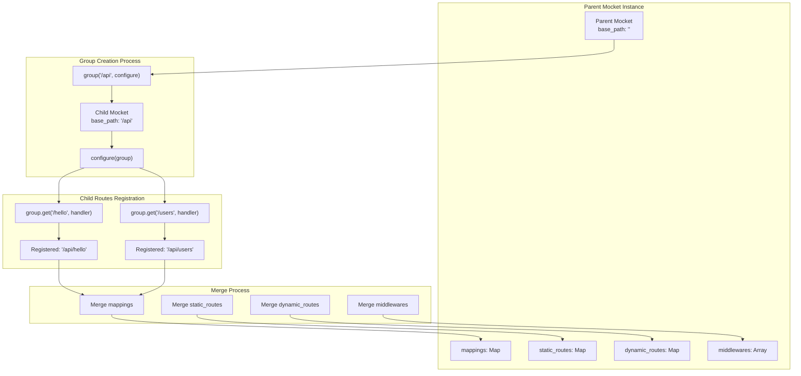
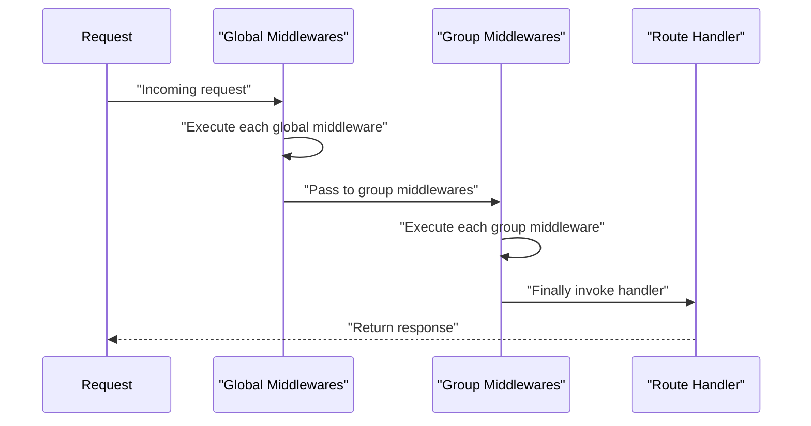
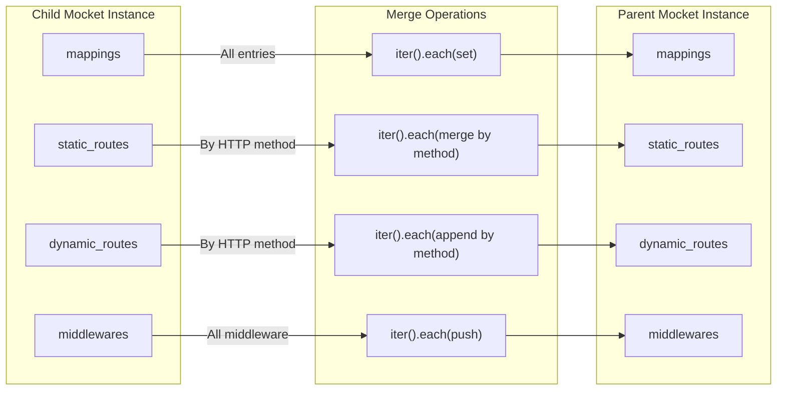

# Route Groups

Route groups provide a mechanism for organizing related routes under a common path prefix while optionally applying shared middleware. This feature enables hierarchical route organization and modular middleware application without code duplication.

For information about route matching mechanics, see [Dynamic Routes and Parameters](#2.1.2). For middleware execution details, see [Middleware System](#2.2).

---

## Purpose and Organization

Route groups solve the common problem of defining multiple routes that share a common base path (e.g., `/api/*`, `/admin/*`) and require the same middleware (e.g., authentication, logging). Rather than repeating the prefix and middleware registration for each route, groups allow you to define them once and apply them to all child routes.

Sources: [README.md:86-109](), [src/index.mbt:222-255]()

---

## Basic Usage Pattern

The `group` function creates a scoped routing context with a specified prefix. All routes registered within the group configuration function are automatically prefixed.

```moonbit
app.group("/api", group => {
  group.get("/hello", _ => Text("Hello from API!"))
  group.get("/users", _ => Json({ "users": ["Alice", "Bob"] }))
  group.post("/data", e => e.req.body)
})
```

This creates the following routes:
- `GET /api/hello`
- `GET /api/users`
- `POST /api/data`

Sources: [README.md:91-102]()

### Function Signature

The `group` function signature is defined as:

```moonbit
pub fn group(
  self : Mocket,
  base_path : String,
  configure : (Mocket) -> Unit,
) -> Unit
```

| Parameter | Type | Description |
|-----------|------|-------------|
| `self` | `Mocket` | The parent router instance |
| `base_path` | `String` | The path prefix to apply to all routes in the group |
| `configure` | `(Mocket) -> Unit` | Callback function that receives the group router for configuration |

Sources: [src/index.mbt:222-226]()

---

## Route Group Architecture

The following diagram illustrates how route groups create child router instances and merge them back into the parent.



**Diagram: Route Group Creation and Merging Flow**

The group function creates a new `Mocket` instance with a modified `base_path` that combines the parent's base path with the group prefix. When routes are registered on this child instance, the full prefixed path is automatically constructed. After configuration completes, all routes and middleware from the child are merged back into the parent instance.

Sources: [src/index.mbt:227-255]()

---

## Path Prefix Composition

The group's base path is composed by concatenating the parent's `base_path` with the group's prefix:

```moonbit
let group = new(base_path=self.base_path + base_path, logger=self.logger)
```

This allows for nested groups, where each level adds its prefix to the accumulated path.

### Path Composition Examples

| Parent base_path | Group prefix | Route path | Final route |
|------------------|--------------|------------|-------------|
| `""` | `"/api"` | `"/hello"` | `"/api/hello"` |
| `"/api"` | `"/v1"` | `"/users"` | `"/api/v1/users"` |
| `""` | `"/admin"` | `"/:id"` | `"/admin/:id"` |
| `"/api"` | `"/auth"` | `"/*"` | `"/api/auth/*"` |

Sources: [src/index.mbt:227](), [src/index.mbt:95]()

---

## Group-Level Middleware

Route groups support their own middleware that applies only to routes within that group. This middleware executes in addition to any global middleware registered on the parent router.

```moonbit
app.group("/api", group => {
  // Group-level middleware
  group.use_middleware(event => println(
    "🔒 API Group Middleware: \{event.req.http_method} \{event.req.url}"
  ))
  
  group.get("/hello", _ => Text("Hello from API!"))
})
```

### Middleware Execution Order



**Diagram: Middleware Execution Order with Route Groups**

Global middleware registered on the parent `Mocket` instance executes first, followed by group-specific middleware, and finally the route handler. This ordering is enforced by the merge process which appends group middlewares to the parent's middleware array.

Sources: [README.md:93-95](), [src/index.mbt:254]()

---

## Route Merging Implementation

After the configuration callback completes, the group function merges all routes and middleware from the child instance back into the parent using three separate merge operations.

### Mappings Merge

All route handlers from the child's `mappings` map are copied to the parent:

```moonbit
group.mappings.iter().each(i => self.mappings.set(i.0, i.1))
```

This merges the complete route definitions including their fully-qualified paths.

Sources: [src/index.mbt:230]()

### Static Routes Merge

Static routes (those without parameters or wildcards) are merged into the parent's `static_routes` cache for O(1) lookup performance:

```moonbit
group.static_routes.iter().each(i => {
  let http_method = i.0
  let group_routes = i.1
  match self.static_routes.get(http_method) {
    Some(existing_routes) =>
      group_routes.iter().each(route => existing_routes.set(route.0, route.1))
    None => self.static_routes.set(http_method, group_routes)
  }
})
```

If the parent already has static routes for a given HTTP method, the group's routes are added to that map. Otherwise, a new map is created for that method.

Sources: [src/index.mbt:231-241]()

### Dynamic Routes Merge

Dynamic routes (containing `:param`, `*`, or `**` patterns) are merged into the parent's `dynamic_routes` arrays:

```moonbit
group.dynamic_routes.iter().each(i => {
  let event = i.0
  let routes = i.1
  if self.dynamic_routes.get(event) is Some(existing_routes) {
    existing_routes.append(routes)
  } else {
    self.dynamic_routes.set(event, routes)
  }
})
```

If the parent already has dynamic routes for a given HTTP method, the group's routes are appended to that array. This maintains the order in which routes were registered.

Sources: [src/index.mbt:242-252]()

### Middleware Merge

Group middleware is appended to the parent's middleware array:

```moonbit
group.middlewares.iter().each(self.middlewares.push(_))
```

This ensures group middleware executes after global middleware but before route handlers.

Sources: [src/index.mbt:254]()

---

## Merge Process Data Flow



**Diagram: Route Group Merge Operations**

The merge process copies all data structures from the child group instance to the parent. The `mappings` are directly copied. The `static_routes` and `dynamic_routes` are merged by HTTP method to maintain separation between different request types. Middleware is simply appended to preserve execution order.

Sources: [src/index.mbt:229-254]()

---

## Nested Groups

Groups can be nested by calling `group` on a group instance. Each level adds its prefix to the accumulated path:

```moonbit
app.group("/api", api_group => {
  api_group.group("/v1", v1_group => {
    v1_group.get("/users", _ => Json({ "version": "v1" }))
  })
})
// Creates route: GET /api/v1/users
```

Since each group creates a `Mocket` instance with the accumulated `base_path`, nested groups naturally compose their prefixes through the `self.base_path + base_path` concatenation at each level.

Sources: [src/index.mbt:227]()

---

## Route Group Internal Structure

The `Mocket` struct contains the fields necessary to support route grouping:

| Field | Type | Purpose |
|-------|------|---------|
| `base_path` | `String` | Accumulated prefix path for the group |
| `mappings` | `Map[(String, String), handler]` | Complete route registry |
| `static_routes` | `Map[String, Map[String, handler]]` | O(1) lookup cache for static routes |
| `dynamic_routes` | `Map[String, Array[(String, handler)]]` | Regex-matched dynamic routes |
| `middlewares` | `Array[(String, middleware)]` | Middleware stack |
| `logger` | `Logger` | Shared logger instance |

When a group is created, it receives a new `Mocket` instance with a modified `base_path` but shares the same `logger` reference with the parent. After configuration, the group's route data structures are merged back into the parent.

Sources: [src/index.mbt:11-27]()

---

## Complete Example with Multiple Groups

```moonbit
let app = @mocket.new(logger=@mocket.new_debug_logger())

app.use_middleware(event => println("Global: \{event.req.http_method} \{event.req.url}"))

app.group("/api", group => {
  group.use_middleware(event => println("API Group: \{event.req.url}"))
  
  group.get("/hello", _ => Text("Hello world!"))
  group.get("/json", _ => Json({ "name": "John Doe", "age": 30, "city": "New York" }))
})

// Resulting routes:
// GET /api/hello
// GET /api/json
```

This example demonstrates:
1. Global middleware that applies to all routes
2. A route group with its own middleware
3. Multiple routes within the group
4. Automatic path prefixing

Sources: [README.md:127-138]()

---

## Route Group Registration Examples

| Code | Resulting Route | Type |
|------|----------------|------|
| `group("/api", ...).get("/hello")` | `GET /api/hello` | Static |
| `group("/users", ...).get("/:id")` | `GET /users/:id` | Dynamic |
| `group("/api", ...).post("/data")` | `POST /api/data` | Static |
| `group("/files", ...).get("/**")` | `GET /files/**` | Dynamic (wildcard) |

Sources: [README.md:206-207]()