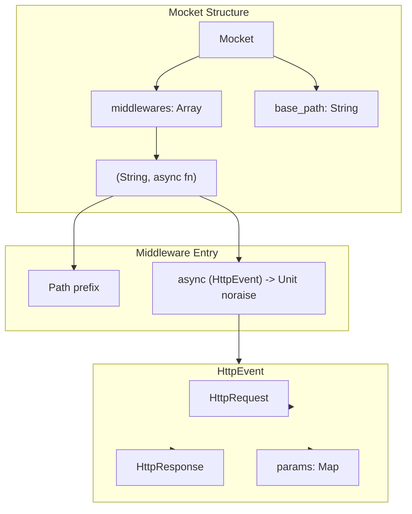
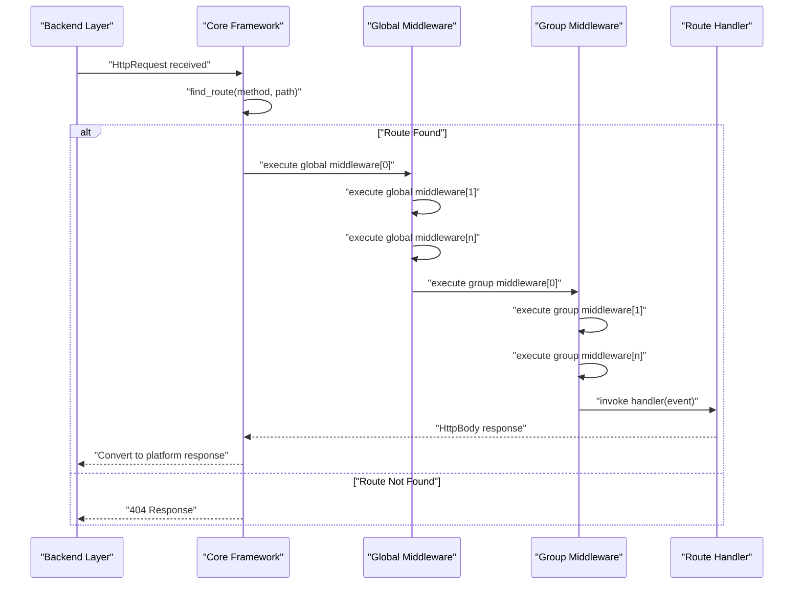
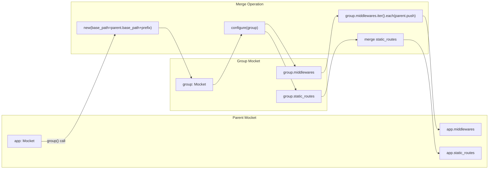

# Middleware System

## Purpose and Scope

This document explains how middleware works in the Mocket framework, including registration, execution order, and practical usage patterns. Middleware functions allow you to intercept and process HTTP requests before they reach route handlers, enabling cross-cutting concerns like logging, authentication, and request modification.

For information about route handling and parameter extraction, see [Routing System](#2.1). For details on the HttpEvent object that middleware receives, see [Request and Response Handling](#2.3).

## Overview

Middleware in Mocket are async functions that execute before route handlers. They receive an `HttpEvent` object containing request and response data, allowing them to inspect requests, modify responses, perform logging, or implement authentication logic. Middleware can be registered at two levels: globally (affecting all routes) or per-group (affecting only routes within a specific group).

Sources: `src/index.mbt:11-27`, `src/example/main.mbt:7-20`, `README.md:91-109`

## Middleware Storage Architecture



**Middleware Data Structure**

The `Mocket` struct stores middleware as an array of tuples, where each tuple contains a path prefix (String) and an async function. This design allows middleware to be associated with specific route groups while maintaining a unified storage mechanism.

Sources: `src/index.mbt:11-27`

## Middleware Registration

### Global Middleware

Global middleware executes for all routes in the application. Register global middleware by calling `use_middleware` on the main `Mocket` instance:

```moonbit
let app = @mocket.new(logger=@mocket.new_debug_logger())

app.use_middleware(event => println(
  "📝 Request: \{event.req.http_method} \{event.req.url}"
))
```

Global middleware is particularly useful for:
- Request logging
- Performance monitoring
- CORS headers
- Global authentication checks
- Request/response transformation

Sources: `src/example/main.mbt:6-9`, `README.md:116-120`

### Group Middleware

Group middleware executes only for routes within a specific route group. Register group middleware by calling `use_middleware` on the group instance inside the `group` callback:

```moonbit
app.group("/api", group => {
  // Group-level middleware - only affects /api/* routes
  group.use_middleware(event => println(
    "🔒 API Group Middleware: \{event.req.http_method} \{event.req.url}"
  ))
  
  // Routes in this group
  group.get("/hello", _ => Text("Hello from API!"))
  group.get("/users", _ => Json({ "users": ["Alice", "Bob"] }))
})
```

When route groups are created, their middleware is merged into the parent application's middleware array during group finalization.

Sources: `src/example/main.mbt:16-27`, `README.md:91-109`, `src/index.mbt:253-254`

## Execution Flow



**Middleware Execution Pipeline**

The middleware execution follows a specific order:
1. All global middleware executes first, in registration order
2. Group-specific middleware executes next (if the route is in a group)
3. Finally, the route handler executes

Each middleware function receives the same `HttpEvent` object, allowing cumulative modifications to flow through the pipeline.

Sources: `src/index.mbt:253-254`, `README.md:109`

## Middleware Function Signature

Middleware functions must conform to the following signature:

| Component | Type | Description |
|-----------|------|-------------|
| Parameter | `HttpEvent` | Contains request, response, and route parameters |
| Return Type | `Unit` | Middleware performs side effects only |
| Async Modifier | `async ... noraise` | Supports asynchronous operations without raising errors |

The `HttpEvent` parameter provides access to:
- `event.req` - The `HttpRequest` object with method, URL, headers, and body
- `event.res` - The `HttpResponse` object for setting status codes and headers
- `event.params` - A `Map[String, String]` containing route parameters

Sources: `src/index.mbt:14`, `src/index.mbt:48-60`

## Practical Middleware Patterns

### Request Logging Middleware

```moonbit
app.use_middleware(event => {
  println("[\{event.req.http_method}] \{event.req.url}")
})
```

This pattern logs all incoming requests with their HTTP method and URL.

### Authentication Middleware

```moonbit
app.group("/protected", group => {
  group.use_middleware(event => {
    match event.req.headers.get("Authorization") {
      Some(token) => {
        // Validate token
        if not validate_token(token) {
          event.res.status_code = 401
        }
      }
      None => event.res.status_code = 401
    }
  })
  
  group.get("/data", _ => Json({ "secret": "data" }))
})
```

Group middleware can enforce authentication for all routes within the group.

### Response Header Middleware

```moonbit
app.use_middleware(event => {
  event.res.headers.set("X-Powered-By", "Mocket")
  event.res.headers.set("X-Content-Type-Options", "nosniff")
})
```

Add common security or informational headers to all responses.

Sources: `src/example/main.mbt:7-9`, `src/example/main.mbt:18-20`, `README.md:93-95`

## Route Group Middleware Merging



**Group Middleware Merging Process**

When a route group is created:
1. A new `Mocket` instance is created with the combined base path
2. The `configure` callback populates the group's routes and middleware
3. After configuration, all group middleware is appended to the parent's middleware array
4. Routes and static/dynamic route caches are also merged into the parent

This ensures that group middleware executes in the correct order while maintaining the group's path prefix context.

Sources: `src/index.mbt:222-255`

## Middleware and Async Operations

All middleware functions are async and support the `noraise` modifier, meaning they can perform asynchronous operations but cannot raise catchable errors. This design keeps the middleware execution model simple and predictable.

```moonbit
app.use_middleware(async fn(event) noraise {
  // Async operations are supported
  let start_time = get_current_time()
  
  // Middleware logic executes asynchronously
  println("Request started at: \{start_time}")
})
```

For backend-specific async capabilities, see [Asynchronous Operations](#3.1.1) for the JavaScript backend and [Native FFI Patterns](#3.2.2) for the native backend.

Sources: `src/index.mbt:14`, `src/index.mbt:93`

## Summary Table: Middleware Characteristics

| Feature | Global Middleware | Group Middleware |
|---------|------------------|------------------|
| Registration | `app.use_middleware(fn)` | `group.use_middleware(fn)` |
| Scope | All routes | Routes within group only |
| Execution Order | First | After global, before handler |
| Path Context | No prefix | Group base_path prefix |
| Use Cases | Logging, CORS, global auth | API versioning, section-specific auth |
| Storage | `app.middlewares` array | Merged into `app.middlewares` on group creation |

Sources: `src/index.mbt:14`, `src/index.mbt:253-254`, `README.md:91-109`