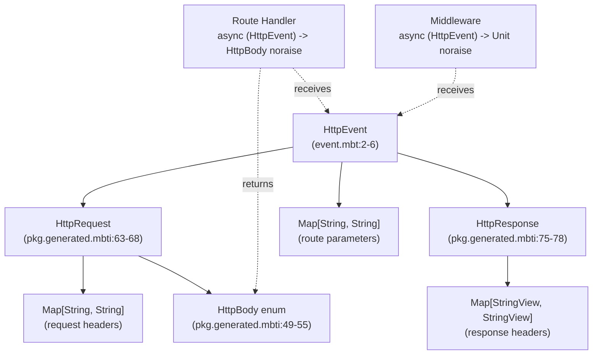
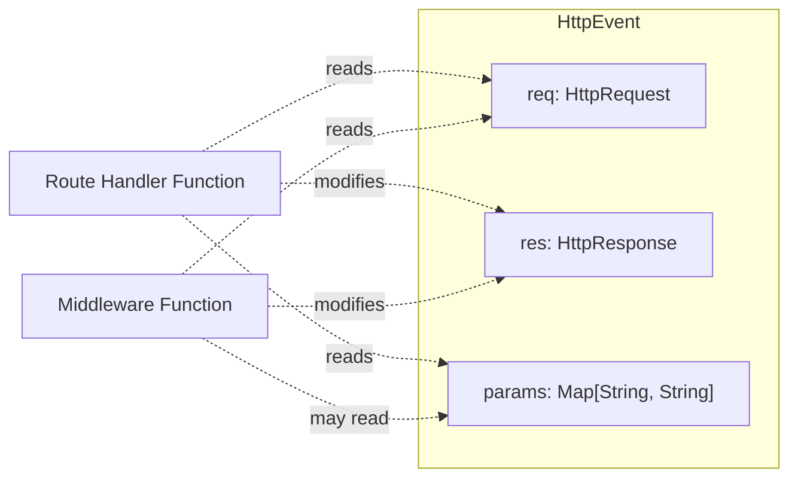
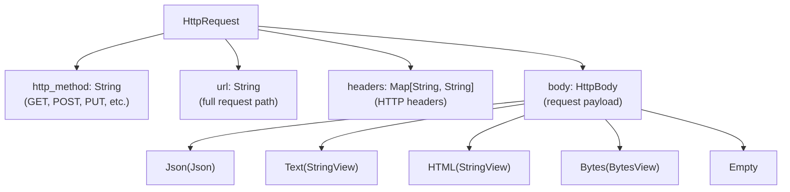
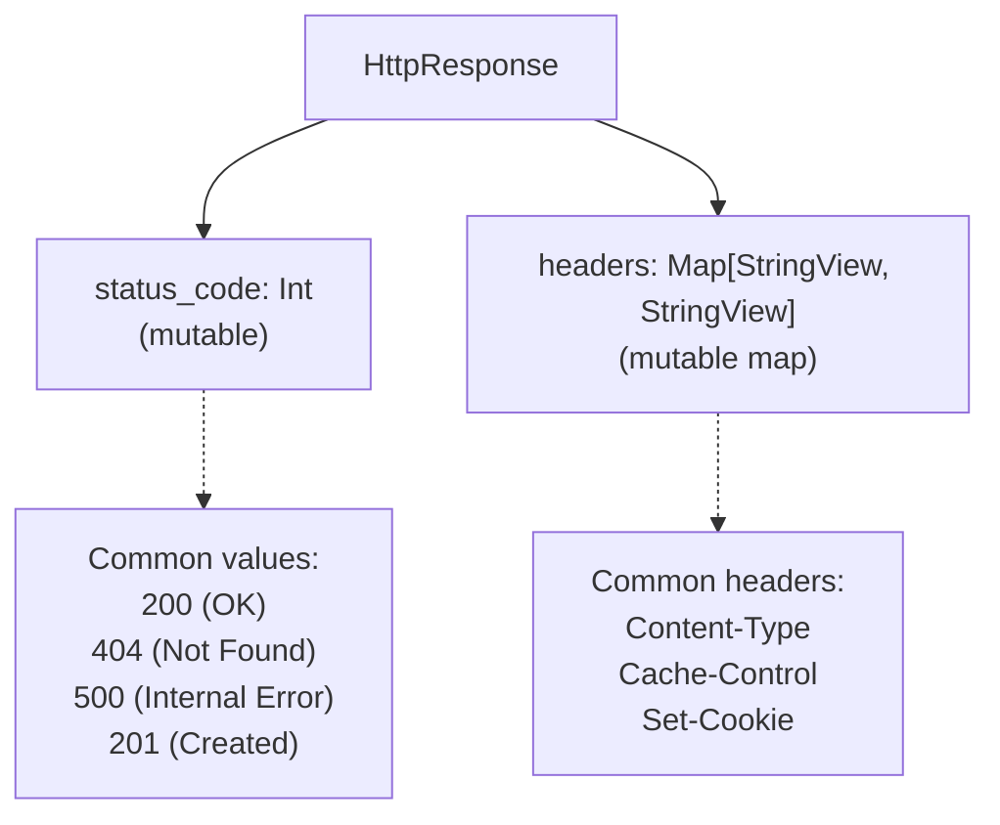
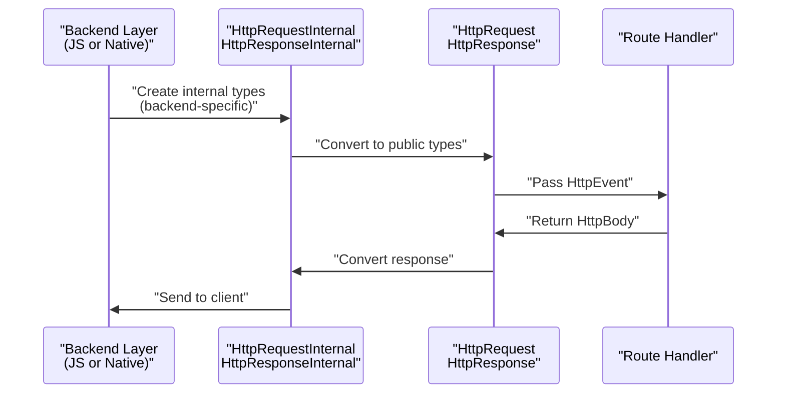

# Request and Response Handling

This document explains the core types used for handling HTTP requests and responses in Mocket: `HttpEvent`, `HttpRequest`, and `HttpResponse`. These types form the primary interface between route handlers and the underlying HTTP server implementation. Understanding these types is essential for writing route handlers and middleware.

For information about the different response body types (Json, Text, HTML, etc.), see [Response Types](#2.3.1). For details on parsing request bodies based on Content-Type headers, see [Request Body Parsing](#2.3.2).

## Core Type System

Mocket defines a unified type system for HTTP request/response handling that abstracts away backend-specific implementations. All route handlers work with these types regardless of whether the application runs on the JavaScript or native backend.

### Type Hierarchy



**Sources:** `src/event.mbt:1-7`, `src/pkg.generated.mbti:49-78`

The type system consists of three primary public types:

| Type | Purpose | Mutability |
|------|---------|------------|
| `HttpEvent` | Container holding request, response, and route parameters | Immutable container, mutable contents |
| `HttpRequest` | Represents incoming HTTP request data | Mutable `body` field only |
| `HttpResponse` | Represents outgoing HTTP response configuration | Mutable `status_code` and `headers` |
| `HttpBody` | Enum representing different response body types | Immutable |

**Sources:** `src/pkg.generated.mbti:49-78`

## HttpEvent: The Central Interface

`HttpEvent` is the primary type passed to all route handlers and middleware. It encapsulates the complete context of an HTTP transaction.



The `HttpEvent` struct contains three fields `src/event.mbt:2-6`:

- **`req`**: The incoming HTTP request, providing access to method, URL, headers, and body
- **`res`**: The outgoing HTTP response, allowing modification of status code and headers
- **`params`**: Extracted route parameters from dynamic routes (e.g., `:name` patterns)

### Accessing Event Data in Handlers

Route handlers receive an `HttpEvent` parameter, typically named `event` or `e`:

```moonbit
// From README.md examples
app.get("/hello/:name", fn(event) {
  let name = event.params.get("name").or("World")
  Text("Hello, \{name}!")
})

app.post("/echo", e => e.req.body)

app.get("/404", e => {
  e.res.status_code = 404
  HTML("...")
})
```

**Sources:** `README.md:49-52, 172, 175-186`, `src/event.mbt:2-6`

## HttpRequest: Reading Request Data

`HttpRequest` provides access to all incoming HTTP request data through four fields `src/pkg.generated.mbti:63-68`:



### Request Fields

| Field | Type | Purpose | Example Access |
|-------|------|---------|----------------|
| `http_method` | `String` | HTTP verb | `event.req.http_method` → `"GET"` |
| `url` | `String` | Request path | `event.req.url` → `"/api/users/123"` |
| `headers` | `Map[String, String]` | HTTP headers | `event.req.headers.get("Content-Type")` |
| `body` | `HttpBody` | Request payload | `event.req.body` → `Json(...)` or `Text(...)` |

**Sources:** `src/pkg.generated.mbti:63-68`

### Request Method Usage

The `http_method` field contains the HTTP verb used in the request. This is primarily used internally by the routing system but is accessible for conditional logic:

```moonbit
// Typical usage in middleware or logging
app.use_middleware(event => println(
  "Request: \{event.req.http_method} \{event.req.url}"
))
```

**Sources:** `README.md:118-120`

### URL and Path Information

The `url` field contains the full request path including query parameters. Route parameters extracted from dynamic routes are available in `event.params`, not parsed from the URL directly.

**Sources:** `src/pkg.generated.mbti:65`

### Request Body

The `body` field is mutable and contains the parsed request payload. Its type depends on the Content-Type header provided by the client. See [Request Body Parsing](#2.3.2) for details on how bodies are parsed by different backends.

**Sources:** `src/pkg.generated.mbti:67`

## HttpResponse: Controlling Response Behavior

`HttpResponse` allows route handlers and middleware to configure the outgoing HTTP response `src/pkg.generated.mbti:75-78`:



### Response Fields

| Field | Type | Mutability | Default | Purpose |
|-------|------|------------|---------|---------|
| `status_code` | `Int` | Mutable | 200 | HTTP status code |
| `headers` | `Map[StringView, StringView]` | Mutable map | Empty | Response headers |

**Sources:** `src/pkg.generated.mbti:75-78`

### Setting Status Codes

The `status_code` field can be directly assigned to control the HTTP response status:

```moonbit
// Example from README showing 404 page
app.get("/404", e => {
  e.res.status_code = 404
  HTML("<html>...</html>")
})
```

Common status codes:
- `200`: OK (default)
- `201`: Created
- `204`: No Content
- `400`: Bad Request
- `404`: Not Found
- `500`: Internal Server Error

**Sources:** `README.md:175-186`

### Response Headers

Response headers can be added or modified through the `headers` map. This is useful for setting Content-Type, caching directives, cookies, and other HTTP headers. The framework automatically handles Content-Type based on the returned `HttpBody` variant, but can be overridden.

**Sources:** `src/pkg.generated.mbti:77`

## Backend Type Conversion

Mocket abstracts backend-specific HTTP types into the unified `HttpRequest` and `HttpResponse` types. Each backend defines internal types that are converted during request processing.



### Internal Backend Types

The framework defines two external types that serve as bridges to backend implementations `src/pkg.generated.mbti:70-83`:

**HttpRequestInternal**
- External type defined per-backend
- Methods:
  - `req_method()`: Returns HTTP method
  - `url()`: Returns request URL

**HttpResponseInternal**  
- External type defined per-backend
- Methods:
  - `end(@js.Value)`: Finalizes response (JS backend)
  - `url()`: Returns URL for logging

These internal types are used by the `create_server` function `src/pkg.generated.mbti:10` which accepts a callback that receives internal types and converts them to public types for handler invocation.

**Sources:** `src/pkg.generated.mbti:70-83, 10`

### Backend Implementations

| Backend | Request Type | Response Type | Conversion Location |
|---------|--------------|---------------|---------------------|
| JavaScript | Node.js `req` object | Node.js `res` object | `mocket.js.mbt` |
| Native | `request_t` C struct | `response_t` C struct | `mocket.native.mbt` |
| WASM | Stub | Stub | `mocket.wasm.mbt` (unimplemented) |

Each backend is responsible for:
1. Receiving platform-specific HTTP requests
2. Converting to `HttpRequest` 
3. Invoking the routing system
4. Converting returned `HttpBody` to platform response
5. Sending response via `HttpResponseInternal`

For detailed information on backend implementations, see [JavaScript Backend](#3.1) and [Native Backend](#3.2).

**Sources:** `src/pkg.generated.mbti:70-83`

## Common Usage Patterns

### Pattern 1: Reading Route Parameters

Dynamic routes extract parameters into `event.params`:

```moonbit
// Pattern: /hello/:name
app.get("/hello/:name", fn(event) {
  let name = event.params.get("name").or("World")
  Text("Hello, \{name}!")
})

// Pattern: /users/:id/posts/:postId  
app.get("/users/:id/posts/:postId", fn(event) {
  let user_id = event.params.get("id").unwrap_or("")
  let post_id = event.params.get("postId").unwrap_or("")
  Json({"user": user_id, "post": post_id})
})
```

Wildcard routes use `"_"` as the parameter name:

```moonbit
// Single wildcard: /hello/*
app.get("/hello/*", fn(event) {
  let name = event.params.get("_").or("World")
  Text("Hello, \{name}!")
})

// Double wildcard: /hello/**
app.get("/hello/**", fn(event) {
  let path = event.params.get("_").or("")
  Text("Path: \{path}")
})
```

**Sources:** `README.md:49-71, 154-169, 199-207`

### Pattern 2: Echo Server (Request Body Passthrough)

The simplest pattern returns the request body directly:

```moonbit
app.post("/echo", e => e.req.body)
```

This works because route handlers return `HttpBody`, which is the same type as `event.req.body`.

**Sources:** `README.md:172`

### Pattern 3: Custom Status Codes

Modify the response status before returning the body:

```moonbit
app.get("/404", e => {
  e.res.status_code = 404
  HTML("<html><body><h1>404</h1></body></html>")
})

app.post("/create", e => {
  e.res.status_code = 201
  Json({"created": true})
})
```

**Sources:** `README.md:175-186`

### Pattern 4: Middleware Request Inspection

Middleware receives the same `HttpEvent` but returns `Unit` instead of `HttpBody`:

```moonbit
app.use_middleware(event => println(
  "Request: \{event.req.http_method} \{event.req.url}"
))

// Group middleware
app.group("/api", group => {
  group.use_middleware(event => println(
    "API: \{event.req.http_method} \{event.req.url}"
  ))
  group.get("/hello", _ => Text("Hello"))
})
```

**Sources:** `README.md:118-120, 127-132`

### Pattern 5: Conditional Response Based on Request

```moonbit
app.get("/api/data", fn(event) {
  // Check request headers
  match event.req.headers.get("Accept") {
    Some("application/json") => Json({"format": "json"})
    _ => Text("Plain text response")
  }
})
```

**Sources:** `src/pkg.generated.mbti:63-68`

## Handler Signatures

All route handlers and middleware must conform to specific function signatures defined in the `Mocket` type `src/pkg.generated.mbti:113-134`:

| Component | Signature | Returns |
|-----------|-----------|---------|
| Route Handler | `async (HttpEvent) -> HttpBody noraise` | Response body |
| Middleware | `async (HttpEvent) -> Unit noraise` | Nothing |

Both are async functions marked `noraise`, meaning they cannot propagate errors. Error handling must be performed within the handler by returning appropriate `HttpBody` variants or status codes.

**Sources:** `src/pkg.generated.mbti:115-116, 121-133`