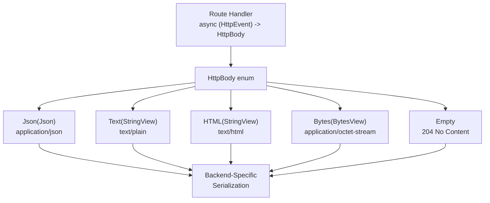
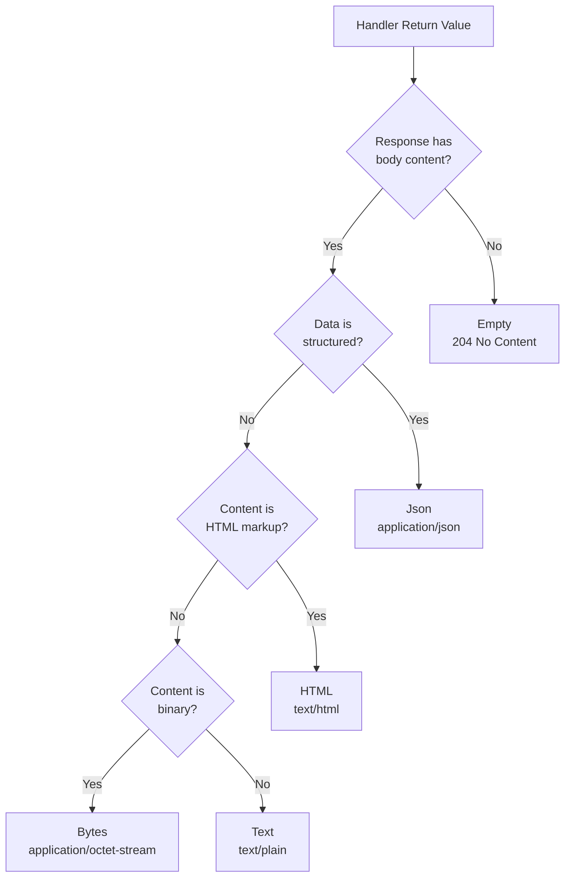
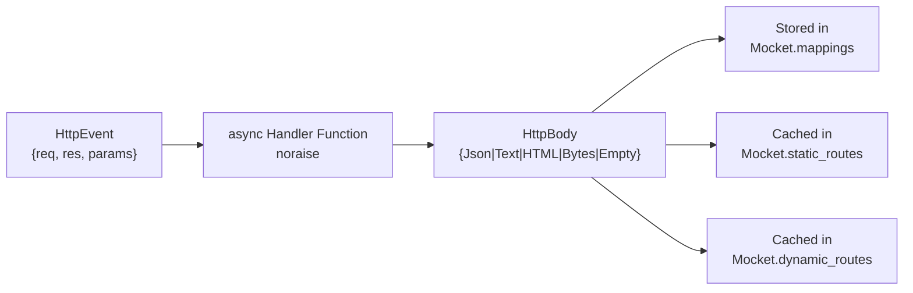
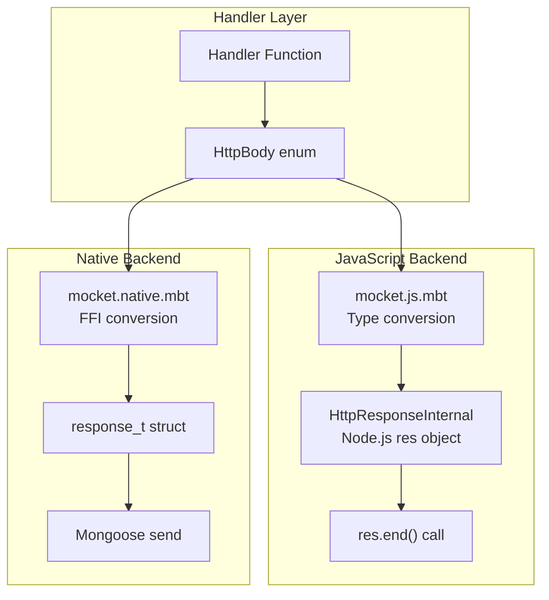

# Response Types

## Purpose and Scope

This document explains the `HttpBody` enum and its five variants that define the types of responses Mocket handlers can return. Each variant represents a different content type that can be sent to clients.

For information about request body parsing, see [Request Body Parsing](#2.3.2). For general request and response handling concepts, see [Request and Response Handling](#2.3).

## HttpBody Enum Overview

The `HttpBody` enum is the return type for all route handlers in Mocket. It provides five variants that cover common HTTP response scenarios:



**Sources:** [src/pkg.generated.mbti:49-55]()

The enum is defined as:

| Variant | Inner Type | Content-Type | Use Case |
|---------|-----------|--------------|----------|
| `Json(Json)` | `Json` | `application/json` | Structured data, REST APIs |
| `Text(StringView)` | `StringView` | `text/plain` | Plain text responses |
| `HTML(StringView)` | `StringView` | `text/html` | HTML pages |
| `Bytes(BytesView)` | `BytesView` | `application/octet-stream` | Binary data, files |
| `Empty` | - | - | No content (204 status) |

**Sources:** [src/pkg.generated.mbti:49-55]()

## Response Type Details

### Json Variant

The `Json` variant wraps a `Json` type for structured data responses. This is the primary response type for REST APIs and AJAX endpoints.


**Usage Example:**

```moonbit
app.get("/api/user", fn(event) {
  Json({ 
    "name": "John Doe", 
    "age": 30, 
    "city": "New York" 
  })
})
```

The backend automatically:
- Sets `Content-Type: application/json`
- Serializes the JSON structure to a string
- Sends the response with appropriate headers

**Sources:** [README.md:141-145](), [README.md:133-137](), [src/pkg.generated.mbti:50]()

### Text Variant

The `Text` variant wraps a `StringView` for plain text responses. Use this for simple string content that should be rendered as-is without interpretation.

**Usage Example:**

```moonbit
app.get("/", fn(event) {
  Text("⚡️ Tadaa!")
})

app.get("/hello/:name", fn(event) {
  let name = event.params.get("name").unwrap_or("World")
  Text("Hello, \{name}!")
})
```

The backend automatically:
- Sets `Content-Type: text/plain; charset=utf-8`
- Sends the string content directly
- No additional processing or escaping

**Sources:** [README.md:123](), [README.md:155-157](), [README.md:126](), [src/pkg.generated.mbti:51]()

### HTML Variant

The `HTML` variant wraps a `StringView` containing HTML markup. Use this for server-rendered web pages and HTML fragments.

**Usage Example:**

```moonbit
app.get("/404", fn(event) {
  event.res.status_code = 404
  HTML((
    #|<html>
    #|<body>
    #|  <h1>404</h1>
    #|</body>
    #|</html>
  ))
})
```

The backend automatically:
- Sets `Content-Type: text/html; charset=utf-8`
- Sends the HTML content for browser rendering
- No HTML escaping or validation is performed

**Sources:** [README.md:177-185](), [src/pkg.generated.mbti:52]()

### Bytes Variant

The `Bytes` variant wraps a `BytesView` for binary data responses. Use this for serving files, images, or any non-text content.

**Key Characteristics:**

| Property | Value |
|----------|-------|
| Content-Type | `application/octet-stream` (default) |
| Use Cases | File downloads, binary protocols, image data |
| Encoding | Raw byte transfer, no text encoding |

The `Bytes` variant is useful for:
- File downloads and uploads
- Binary API responses
- Image/media serving
- Protocol buffers or other binary formats

**Sources:** [src/pkg.generated.mbti:53]()

### Empty Variant

The `Empty` variant represents a response with no body content. This typically results in a 204 No Content status code, though the status can be customized via `event.res.status_code`.

**Usage Example:**

```moonbit
app.delete("/api/resource/:id", fn(event) {
  // Delete the resource
  event.res.status_code = 204
  Empty
})

app.options("/api/endpoint", fn(event) {
  // Set CORS headers
  event.res.headers.set("Access-Control-Allow-Methods", "GET, POST")
  Empty
})
```

**Common Scenarios:**

| Status Code | Use Case | Example |
|-------------|----------|---------|
| 204 | Successful DELETE | Resource deleted successfully |
| 304 | Not Modified | Cached resource still valid |
| 200 | Success with no content | OPTIONS preflight response |

**Sources:** [src/pkg.generated.mbti:54]()

## Response Type Selection Guide



**Decision Matrix:**

| Content Type | Has Body? | Structured? | Human-Readable? | Variant |
|--------------|-----------|-------------|-----------------|---------|
| REST API response | Yes | Yes | Yes (JSON) | `Json` |
| Plain message | Yes | No | Yes | `Text` |
| Web page | Yes | No | Yes (HTML) | `HTML` |
| File download | Yes | No | No | `Bytes` |
| Successful DELETE | No | - | - | `Empty` |
| OPTIONS preflight | No | - | - | `Empty` |

**Sources:** [README.md:122-189](), [src/pkg.generated.mbti:49-55]()

## Handler Return Type Signature

All route handlers in Mocket must return an `HttpBody` value. The complete handler signature is:

```
async (HttpEvent) -> HttpBody noraise
```



**Type Definitions:**

From [src/pkg.generated.mbti:115-119]():
- `Mocket.mappings`: `Map[(String, String), async (HttpEvent) -> HttpBody noraise]`
- `Mocket.static_routes`: `Map[String, Map[String, async (HttpEvent) -> HttpBody noraise]]`
- `Mocket.dynamic_routes`: `Map[String, Array[(String, async (HttpEvent) -> HttpBody noraise)]]`

All three storage mechanisms use the same handler signature that returns `HttpBody`.

**Sources:** [src/pkg.generated.mbti:115-119](), [src/pkg.generated.mbti:49-55](), [src/pkg.generated.mbti:57-61]()

## Backend-Specific Serialization

Each backend implements its own serialization logic to convert `HttpBody` variants into HTTP responses:



**Backend Responsibilities:**

| Backend | Response Type Handling | Content-Type Setting | Serialization Location |
|---------|----------------------|---------------------|----------------------|
| JavaScript | `HttpResponseInternal.end()` | Automatic header set | [mocket.js.mbt]() |
| Native | `response_t` struct via FFI | Via Mongoose API | [mocket.native.mbt]() |
| WASM | Not implemented | - | [mocket.wasm.mbt]() (stub) |

Both backends handle all five `HttpBody` variants transparently, converting them to the appropriate platform-specific response format with correct Content-Type headers.

**Sources:** [src/pkg.generated.mbti:80-83](), [src/pkg.generated.mbti:49-55]()

## Response Body in Request Context

While this page focuses on response types, note that `HttpRequest` also contains a `body` field of type `HttpBody`. This allows handlers to access parsed request bodies:

```moonbit
app.post("/echo", fn(event) {
  event.req.body  // Returns HttpBody from request
})
```

The request body is parsed based on the `Content-Type` header. For details on how incoming bodies are parsed, see [Request Body Parsing](#2.3.2).

**Sources:** [README.md:172](), [src/pkg.generated.mbti:63-68]()