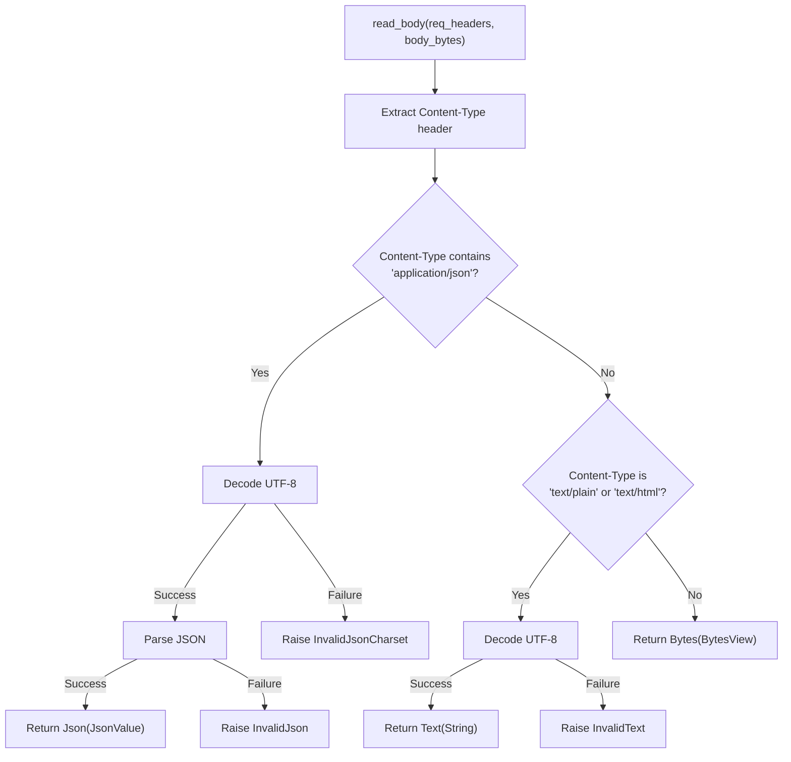
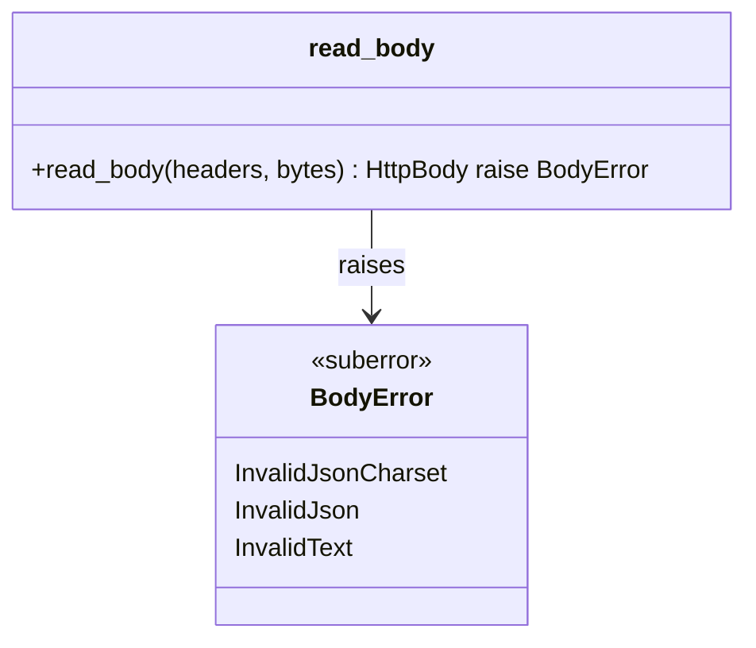
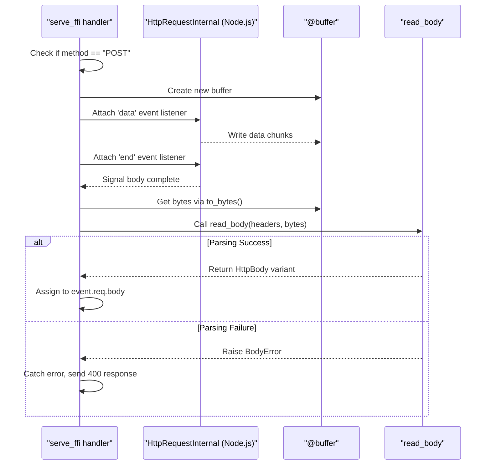
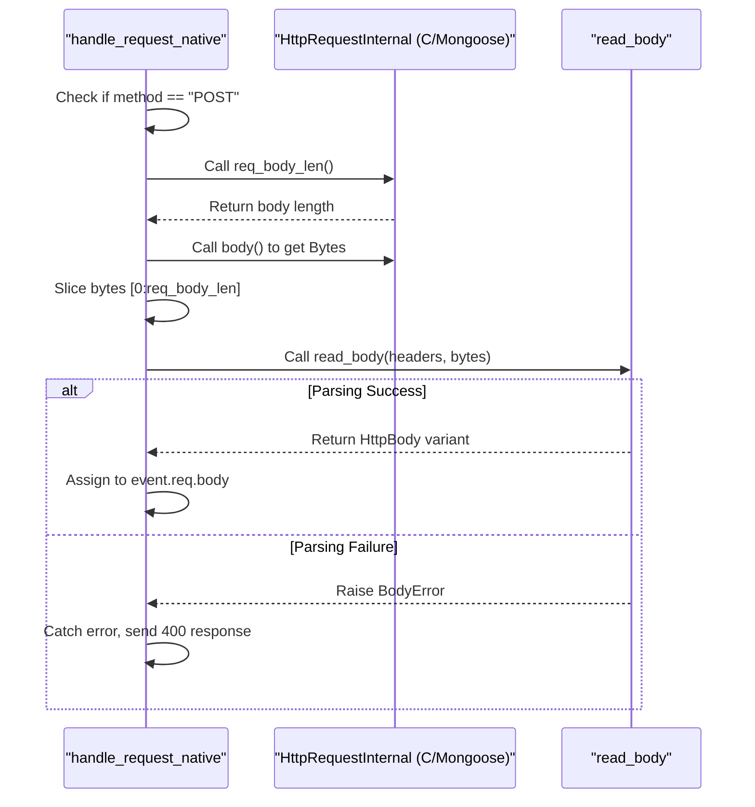

# Request Body Parsing

## Purpose

This document explains how Mocket parses incoming HTTP request bodies based on the `Content-Type` header. The parsing logic automatically converts raw byte streams into typed `HttpBody` variants (`Json`, `Text`, or `Bytes`) that handlers can work with safely.

For information about the `HttpBody` type and response body handling, see [Response Types](#2.3.1). For general request/response handling concepts, see [Request and Response Handling](#2.3).

## The read_body Function

Request body parsing is centralized in the `read_body` function defined in `src/body_reader.mbt:9-29`. This function takes two parameters:
- `req_headers`: A `Map[String, String]` containing HTTP headers
- `body_bytes`: A `BytesView` containing the raw request body

The function returns an `HttpBody` enum value or raises a `BodyError` if parsing fails.

**Sources:** `src/body_reader.mbt:9-29`

## Parsing Decision Flow

The parsing logic examines the `Content-Type` header to determine how to interpret the request body:



**Sources:** `src/body_reader.mbt:9-29`

## Supported Content Types

The following table shows how different `Content-Type` header values are handled:

| Content-Type Pattern | HttpBody Variant | Decoding | Validation |
|---------------------|------------------|----------|------------|
| `application/json` (contains) | `Json(@json.JsonValue)` | UTF-8 required | JSON parsing via `@json.parse` |
| `text/plain` (contains) | `Text(String)` | UTF-8 required | None |
| `text/html` (contains) | `Text(String)` | UTF-8 required | None |
| Any other or missing | `Bytes(BytesView)` | None | None |

Note that the Content-Type matching uses substring matching (`[.. "application/json", ..]` syntax), which means headers like `application/json; charset=utf-8` will correctly match the JSON parser.

**Sources:** `src/body_reader.mbt:14-28`

## Error Handling

The `BodyError` suberror type defines three parsing error variants:



| Error Variant | Raised When | Common Cause |
|--------------|-------------|--------------|
| `InvalidJsonCharset` | UTF-8 decoding fails for JSON content | Non-UTF-8 bytes in JSON body |
| `InvalidJson` | JSON parsing fails after successful UTF-8 decode | Malformed JSON syntax |
| `InvalidText` | UTF-8 decoding fails for text content | Non-UTF-8 bytes in text body |

The `Bytes` variant never raises errors because it returns the raw `BytesView` without any decoding or validation.

**Sources:** `src/body_reader.mbt:2-6`, `src/body_reader.mbt:16-19`, `src/body_reader.mbt:22-25`

## Backend Integration

Both the JavaScript and Native backends invoke `read_body` during POST request processing, but they differ in how they collect the request body bytes.

### JavaScript Backend POST Handling



In the JavaScript backend `src/mocket.js.mbt:99-112`, the body is collected asynchronously:
1. A `@buffer` is created to accumulate incoming data chunks
2. The `data` event listener writes each chunk to the buffer
3. The `end` event signals completion via `suspend`/`resume` pattern
4. `read_body` is called with the complete buffered bytes
5. If parsing fails, a 400 response is sent with "Invalid body" message

**Sources:** `src/mocket.js.mbt:99-112`

### Native Backend POST Handling



In the Native backend `src/mocket.native.mbt:162-173`, the body is available synchronously:
1. The body length is retrieved via FFI call `req_body_len()`
2. The body bytes are retrieved via FFI call `body()` and sliced to the correct length
3. `read_body` is called immediately with the complete bytes
4. If parsing fails, a 400 response is sent with "Invalid body" message

**Sources:** `src/mocket.native.mbt:162-173`

## Usage in Request Handlers

Once parsed, the request body is available in the `HttpEvent.req.body` field as an `HttpBody` enum. Handlers can pattern match on the body type:

```
// Example handler accessing parsed JSON body
fn(event: HttpEvent) -> HttpBody {
  match event.req.body {
    Json(json_value) => {
      // Work with @json.JsonValue
      Json(json_value)
    }
    Text(text) => {
      // Work with String
      Text(text)
    }
    Bytes(bytes) => {
      // Work with BytesView
      Bytes(bytes)
    }
    Empty => Empty
  }
}
```

The body is set to `Empty` initially `src/mocket.js.mbt:91`, `src/mocket.native.mbt:158` and only populated with parsed content for POST requests (or other methods that include a body).

**Sources:** `src/mocket.js.mbt:91`, `src/mocket.native.mbt:158`