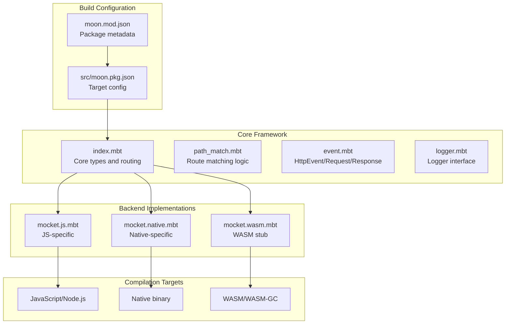
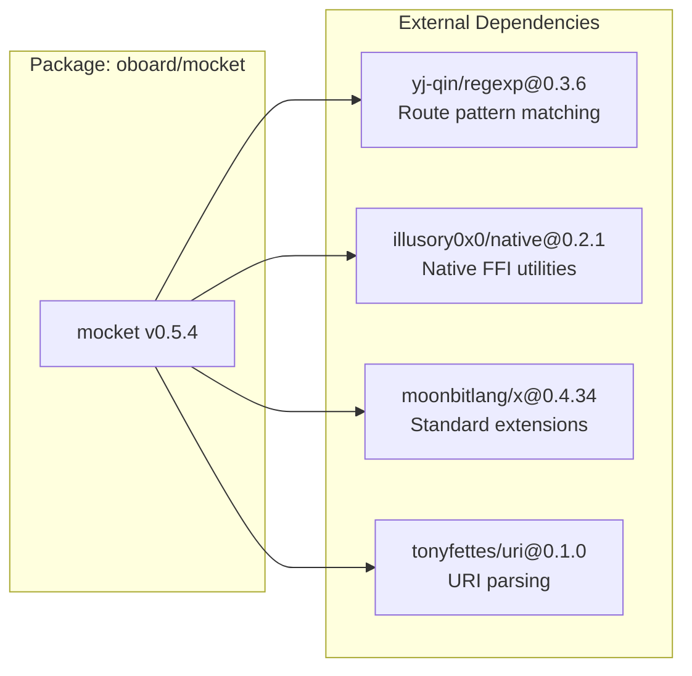
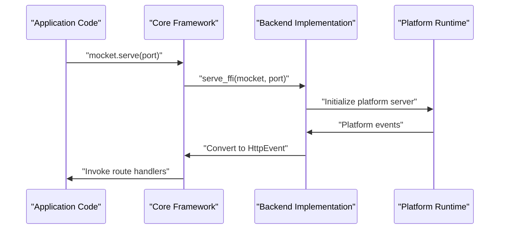
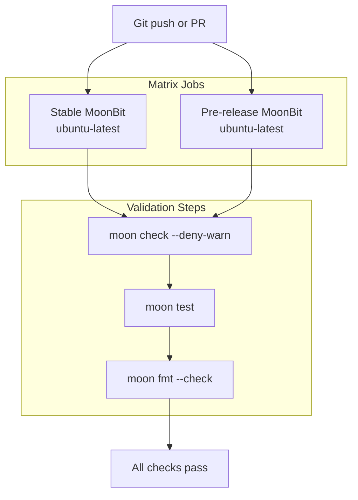

# Development Guide

This guide is intended for developers who want to contribute to Mocket or build extensions on top of the framework. It covers the development workflow, build system, target-specific compilation, and contribution practices.

For detailed information about the project structure, see [Project Structure](#6.1). For building and testing procedures, see [Building and Testing](#6.2). For deployment strategies, see [Deployment](#6.3).

## Purpose and Scope

This document explains how to work with the Mocket codebase, including:

- Understanding the multi-target build system
- Working with platform-specific backend implementations
- Contributing code that maintains cross-platform compatibility
- Using the CI/CD pipeline to validate changes

## Multi-Target Development Model

Mocket uses MoonBit's multi-target compilation feature to support JavaScript, Native, and WASM backends from a single codebase. The framework maintains a clear separation between platform-agnostic core logic and platform-specific implementations.

### Target Architecture Diagram



**Sources:** [moon.mod.json:1-20](), [src/moon.pkg.json:1-30]()

### Target Specification

The build system uses conditional compilation to include only the relevant backend for each target. This is configured in [src/moon.pkg.json:18-29]():

| Target | File | Status | Purpose |
|--------|------|--------|---------|
| `js` | `mocket.js.mbt` | Active | Node.js and browser environments |
| `native` | `mocket.native.mbt` | Active | Native binary via C/Mongoose |
| `wasm` | `mocket.wasm.mbt` | Stub | WASM and WASM-GC (unimplemented) |
| `wasm-gc` | `mocket.wasm.mbt` | Stub | WASM-GC specific optimizations |
| `llvm` | Platform-agnostic | Active | LLVM-based compilation |

**Sources:** [src/moon.pkg.json:18-29]()

## Package Configuration

### Package Metadata

The root `moon.mod.json` defines the package identity and dependencies:



**Sources:** [moon.mod.json:1-20]()

Key metadata fields in [moon.mod.json:1-20]():

- **name**: `oboard/mocket` - Package identifier
- **version**: `0.5.4` - Semantic version
- **preferred-target**: `native` - Default compilation target
- **source**: `src` - Source directory location
- **repository**: GitHub URL for the project
- **license**: Apache-2.0

### Build Package Configuration

The `src/moon.pkg.json` file controls compilation behavior:

| Configuration | Value | Purpose |
|--------------|-------|---------|
| `supported-targets` | `["js", "native", "llvm"]` | Valid compilation targets |
| `warn-list` | `"-15-29"` | Suppress specific warning ranges |
| `native-stub` | `["mocket.stub.c", "mongoose.c"]` | C FFI sources for native backend |
| `import` | Various packages | Import dependencies |

**Sources:** [src/moon.pkg.json:1-30]()

## Working with Backend Implementations

### Backend Implementation Pattern

Each backend must implement the `serve_ffi` function that bridges the platform runtime to the core framework:



**Sources:** [src/mocket.wasm.mbt:1-5]()

### Backend Requirements

When implementing a new backend or modifying an existing one, ensure:

1. **Type Conversion**: Implement bidirectional conversion between platform types and `HttpRequest`/`HttpResponse`/`HttpEvent`
2. **Body Handling**: Parse request bodies according to `Content-Type` headers
3. **Error Handling**: Convert platform errors to framework error types
4. **Async Support**: Handle asynchronous operations appropriate to the platform
5. **Header Management**: Support reading and writing HTTP headers

### WASM Backend Status

The WASM backend is currently a stub [src/mocket.wasm.mbt:1-5]():

```moonbit
pub fn serve_ffi(mocket : Mocket, port~ : Int) -> Unit {
  // Unimplemented
  panic()
}
```

Contributors interested in implementing WASM support should:
- Follow the pattern established by JS and Native backends
- Determine appropriate WASM HTTP server integration strategy
- Implement `HttpRequestInternal` and `HttpResponseInternal` types
- Add WASM-specific FFI bindings if needed

**Sources:** [src/mocket.wasm.mbt:1-5]()

## Development Workflow

### Setting Up the Environment

1. **Install MoonBit**: Ensure you have the MoonBit compiler installed
2. **Clone Repository**: `git clone https://github.com/oboard/mocket`
3. **Review Dependencies**: Check [moon.mod.json:4-9]() for required packages
4. **Select Target**: Choose your development target (native recommended as per [moon.mod.json:19]())

### Build Commands

The MoonBit toolchain provides these commands:

| Command | Purpose |
|---------|---------|
| `moon check` | Type-check code without compilation |
| `moon build` | Compile for default target |
| `moon test` | Run test suite |
| `moon fmt` | Format code to standard style |
| `moon build --target js` | Build for specific target |

### Target-Specific Files

When modifying the codebase:

- **Core changes**: Edit `index.mbt`, `path_match.mbt`, `event.mbt`, `logger.mbt`
- **JS backend**: Edit `mocket.js.mbt` and `js/async.mbt`
- **Native backend**: Edit `mocket.native.mbt` and `mocket.stub.c`
- **WASM backend**: Edit `mocket.wasm.mbt`

Ensure core framework changes remain platform-agnostic and do not depend on target-specific features.

**Sources:** [src/moon.pkg.json:18-29]()

## CI/CD Integration

The project uses GitHub Actions for continuous integration. The workflow validates:

- **Zero-warning builds**: Flag `--deny-warn` ensures all warnings are treated as errors
- **Multi-version testing**: Tests against both stable and pre-release MoonBit versions
- **Format compliance**: Enforces consistent code style
- **Test coverage**: All tests must pass

### CI Pipeline Structure



**Sources:** Based on architecture diagram CI/CD section

### Pre-Commit Checklist

Before submitting changes:

1. Run `moon check --deny-warn` - No warnings allowed
2. Run `moon test` - All tests pass
3. Run `moon fmt` - Code is properly formatted
4. Test on multiple targets if modifying core framework
5. Update documentation for API changes

## Contributing Guidelines

### Code Organization Principles

The codebase follows these organizational principles:

1. **Backend Agnosticism**: Core framework code must not import or depend on backend-specific modules
2. **Type Safety**: Use MoonBit's type system to enforce invariants at compile time
3. **Performance**: Static routes use O(1) lookup; dynamic routes minimize regex overhead
4. **Minimal Dependencies**: Only essential external packages are included

### Adding New Features

When adding features:

1. **Core API Changes**: Modify `index.mbt` and related core files
2. **Backend Implementation**: Implement in all active backends (JS, Native)
3. **Type Definitions**: Update `event.mbt` if new types are needed
4. **Documentation**: Update relevant wiki pages
5. **Tests**: Add test coverage for new functionality
6. **Example**: Consider adding to `example/main.mbt`

### Warning Configuration

The project suppresses warnings `-15-29` in [src/moon.pkg.json:13]() for specific reasons. Contributors should:

- Understand what these warnings represent
- Not add new warning suppressions without justification
- Document any necessary suppressions in code comments

**Sources:** [src/moon.pkg.json:13]()

## Native Backend Development

The native backend requires C FFI knowledge. Key files:

- **mocket.native.mbt**: MoonBit side of native implementation
- **mocket.stub.c**: C FFI bindings
- **mongoose.c**: Embedded HTTP server library

When modifying native backend:

1. Update C structures in `mocket.stub.c` if changing FFI types
2. Ensure memory management is correct (no leaks)
3. Test on Linux (primary platform as per CI: ubuntu-latest)
4. Verify callback mechanisms work correctly

**Sources:** [src/moon.pkg.json:14-16]()

## Version Management

The package version [moon.mod.json:3]() follows semantic versioning:

- **Major**: Breaking API changes
- **Minor**: New features, backward compatible
- **Patch**: Bug fixes, backward compatible

Before releasing:

1. Update version in `moon.mod.json`
2. Update CHANGELOG (if present)
3. Tag release in Git
4. Ensure CI passes on tag

**Sources:** [moon.mod.json:3]()