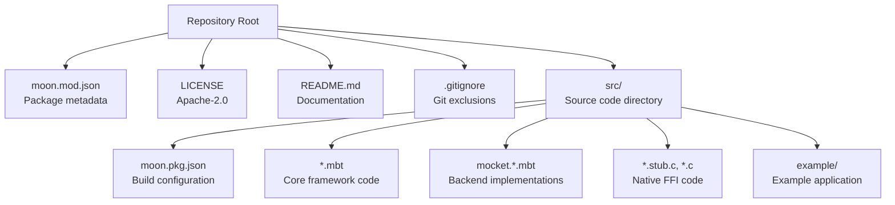
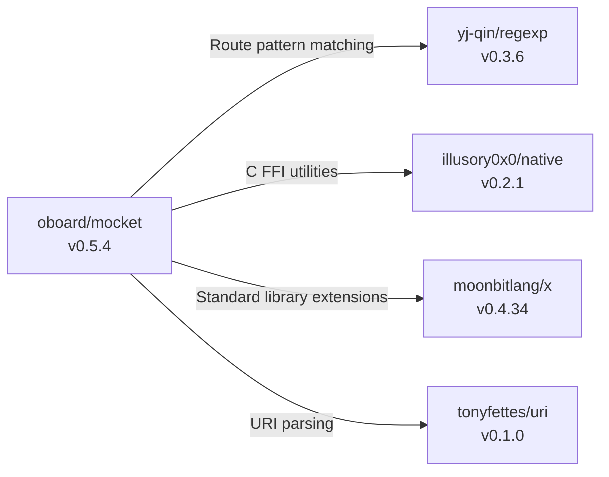
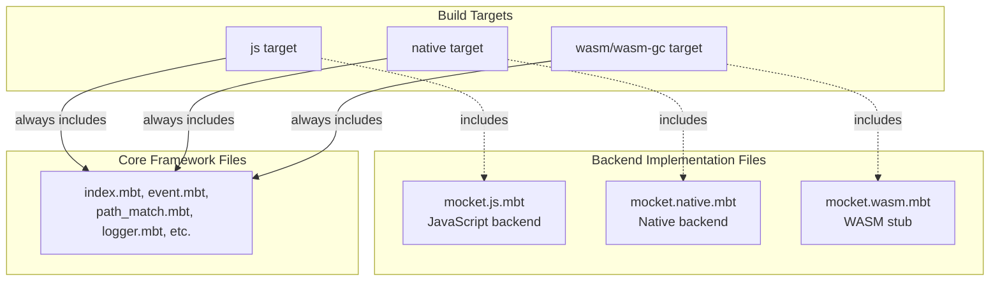
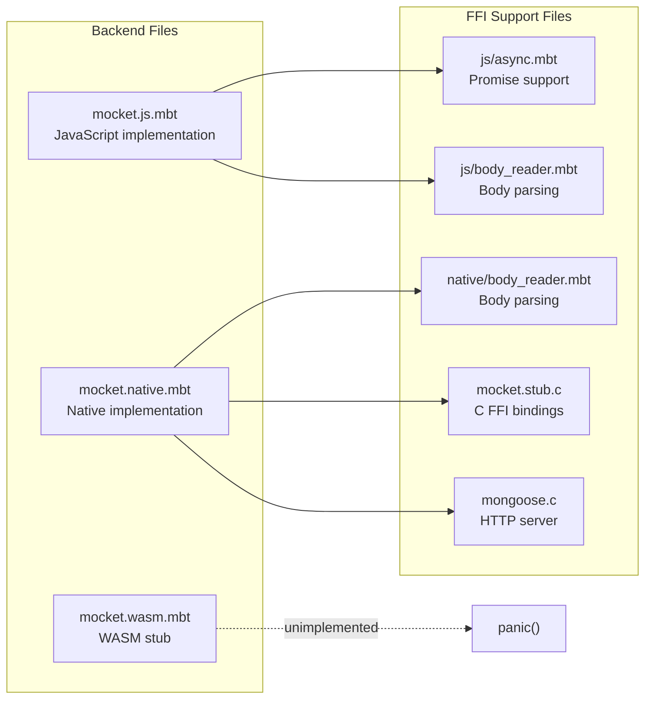
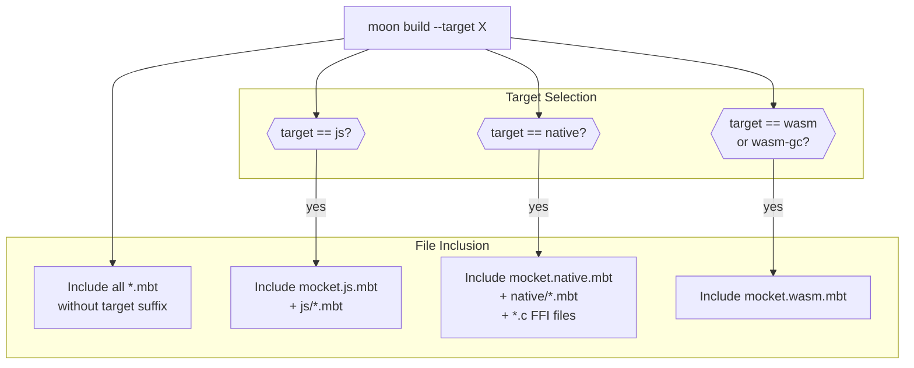
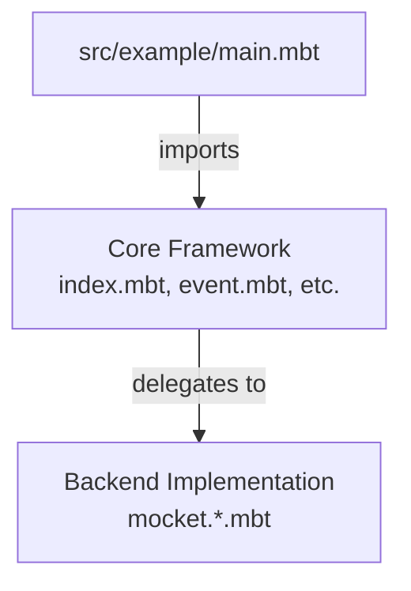

# Project Structure

This page documents the repository layout and package organization of the Mocket web framework. It explains how the codebase is structured to support multiple compilation targets (JavaScript, Native, WASM) while maintaining a clean separation between core framework code and platform-specific implementations.

For information on building and testing the project, see [Building and Testing](#6.2). For deployment considerations, see [Deployment](#6.3).

## Repository Root Structure

The Mocket repository follows a standard MoonBit package layout with target-specific configurations. The root directory contains package metadata, build configuration, and essential project files.



**Key Files:**

| File | Purpose |
|------|---------|
| `moon.mod.json` | Package metadata, versioning, and external dependencies |
| `src/moon.pkg.json` | Build configuration, target specifications, and compiler options |
| `.gitignore` | Excludes `node_modules/`, `target/`, `.mooncakes/`, and OS artifacts |
| `LICENSE` | Apache License 2.0 terms |

Sources: `moon.mod.json:1-20`, .gitignore:1-4, `LICENSE:1-203`

## Package Metadata (moon.mod.json)

The `moon.mod.json` file defines the package identity and external dependencies. This is the entry point for the MoonBit package manager.



**Package Configuration Details:**

| Field | Value | Purpose |
|-------|-------|---------|
| `name` | `oboard/mocket` | Package identifier in registry |
| `version` | `0.5.4` | Current release version |
| `source` | `src` | Source code directory |
| `preferred-target` | `native` | Default compilation target |
| `license` | `Apache-2.0` | Open source license |
| `keywords` | `["http", "server"]` | Package discovery tags |

The dependency list includes four external packages that provide critical functionality not available in the MoonBit standard library. For detailed information on why these dependencies are needed, see [Package Dependencies](#1.2).

Sources: `moon.mod.json:1-20`

## Build Configuration (moon.pkg.json)

The `src/moon.pkg.json` file configures how the package is compiled for different targets. It defines target-specific file mappings, FFI bindings, and compiler options.

### Target-Specific File Mapping

Mocket uses conditional compilation to select the appropriate backend implementation based on the build target. The `targets` field maps specific files to compilation targets:



The `targets` mapping at `src/moon.pkg.json:18-29` ensures that:
- When compiling for `js`, only `mocket.js.mbt` is included
- When compiling for `native`, only `mocket.native.mbt` is included  
- When compiling for `wasm` or `wasm-gc`, only `mocket.wasm.mbt` is included
- Core framework files without target suffixes are included in all builds

### Native FFI Configuration

For the native backend, C source files must be linked with the MoonBit code. The `native-stub` field specifies these files:

| File | Purpose |
|------|---------|
| `mocket.stub.c` | FFI bindings between MoonBit and Mongoose |
| `mongoose.c` | Mongoose embedded HTTP server implementation |

These files are only compiled and linked when building for the `native` target.

### Compiler Options

The build configuration specifies several important settings:

```json
{
  "supported-targets": ["js", "native", "llvm"],
  "warn-list": "-15-29"
}
```

- `supported-targets`: This package can be compiled to JavaScript, native binaries, and LLVM IR
- `warn-list`: Disables specific compiler warnings (codes 15-29)

Sources: `src/moon.pkg.json:1-30`

## Source Code Organization

The `src/` directory contains all framework implementation code, organized by responsibility:

### Core Framework Files

| File Pattern | Purpose |
|--------------|---------|
| `index.mbt` | Main `Mocket` type, route registration API (`get`, `post`, etc.) |
| `event.mbt` | `HttpEvent`, `HttpRequest`, `HttpResponse`, `HttpBody` types |
| `path_match.mbt` | Route matching logic, static vs dynamic route optimization |
| `logger.mbt` | `Logger` trait and logging implementations |

These files contain backend-agnostic code and define the public API of the framework.

### Backend Implementation Files



Each backend file implements the `serve_ffi` function with a platform-specific signature:
- **JavaScript**: Integrates with Node.js HTTP server via `js.Value` FFI types
- **Native**: Integrates with Mongoose C library via `native.CStr` FFI types  
- **WASM**: Currently contains only a stub that panics at `src/mocket.wasm.mbt:2-5`

### Backend-Specific Subdirectories

The `js/` and `native/` subdirectories contain supporting code for their respective backends:

**JavaScript Backend (`src/js/`):**
- `async.mbt` - Promise-based async operations, suspend/resume patterns
- `body_reader.mbt` - Request body parsing for Node.js streams

**Native Backend (`src/native/`):**
- `body_reader.mbt` - Request body parsing for Mongoose C structures

Sources: `src/moon.pkg.json:14-29`, `src/mocket.wasm.mbt:1-5`

## Multi-Target Build System

The following diagram illustrates how the build system selects files based on the compilation target:



This architecture allows the same application code to run on multiple platforms without modification, as the core framework API remains consistent across all targets.

Sources: `src/moon.pkg.json:8-29`

## Build Artifacts and Exclusions

The `.gitignore` file specifies which directories are excluded from version control:

| Directory | Contents |
|-----------|----------|
| `node_modules/` | JavaScript dependencies (for JS backend testing) |
| `target/` | MoonBit compiler output (binaries, intermediate files) |
| `.mooncakes/` | MoonBit package cache |
| `.DS_Store` | macOS filesystem metadata |

These directories are regenerated during the build process and should not be committed to the repository.

Sources: .gitignore:1-4

## Example Application Structure

The `src/example/` directory contains a sample application demonstrating framework usage. This example is referenced in the root `moon.mod.json` and can be built alongside the framework or used as a template for new projects.



The example application demonstrates typical usage patterns including route registration, middleware, and response handling. It serves as both documentation and a test case for the framework's public API.

Sources: `moon.mod.json:18`