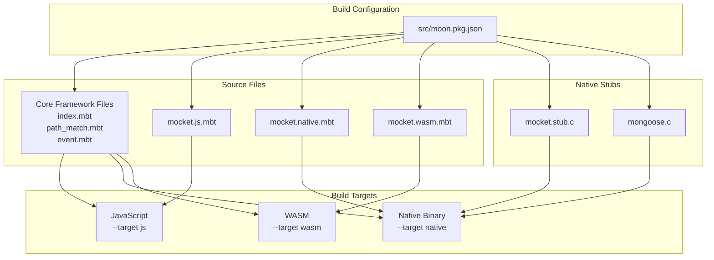
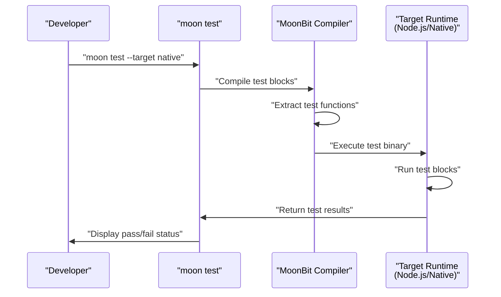
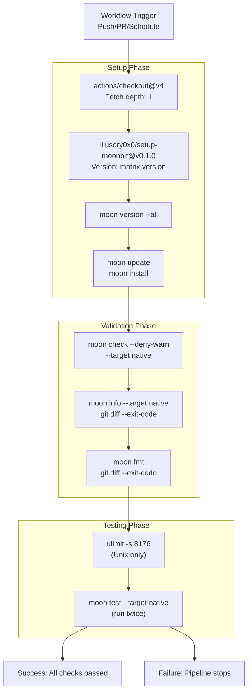
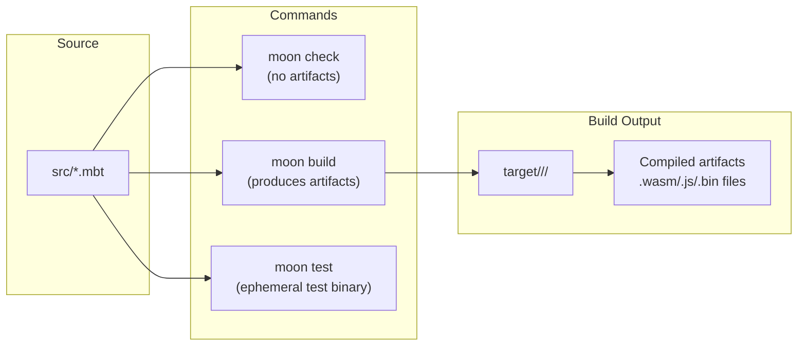

# Building and Testing

This document explains how to build Mocket for different compilation targets, run tests, and understand the continuous integration pipeline. It covers the MoonBit build system configuration, target-specific compilation, and quality assurance workflows.

For information about project structure and organization, see [Project Structure](#6.1). For deployment options after building, see [Deployment](#6.3).

---

## Build Configuration

Mocket uses MoonBit's package configuration system to manage multi-target builds. The build configuration defines which source files compile for which targets, external dependencies, and native FFI stubs.

### Package Configuration Structure

The `src/moon.pkg.json:1-30` file defines the build configuration:

| Configuration Key | Purpose |
|------------------|---------|
| `import` | External package dependencies (regexp, native, uri) |
| `supported-targets` | Compilation targets: `js`, `native`, `llvm` |
| `warn-list` | Warning suppressions: `-15-29` |
| `native-stub` | C FFI files: `mocket.stub.c`, `mongoose.c` |
| `targets` | Maps source files to specific build targets |

The `targets` mapping ensures backend-specific code only compiles for appropriate platforms:
- `mocket.js.mbt` → JavaScript target only
- `mocket.native.mbt` → Native target only
- `mocket.wasm.mbt` → WASM/WASM-GC targets only

**Target-Specific Compilation Diagram**



Sources: `src/moon.pkg.json:1-30`

---

## Building for Different Targets

The MoonBit toolchain (`moon`) provides commands for building, checking, and testing code across multiple compilation targets.

### Build Commands

| Command | Purpose |
|---------|---------|
| `moon check --target <target>` | Type-check code without producing artifacts |
| `moon build --target <target>` | Compile to target platform |
| `moon info --target <target>` | Display dependency graph |
| `moon install` | Install package dependencies |
| `moon update` | Update package dependencies |

### Target-Specific Building

#### JavaScript Target

```bash
# Type-check JavaScript backend
moon check --target js

# Build JavaScript artifacts
moon build --target js
```

The JavaScript target compiles to JavaScript modules compatible with Node.js and browser environments. It includes `src/mocket.js.mbt` and async Promise support from the `oboard/mocket/js` package.

#### Native Target

```bash
# Type-check native backend with FFI
moon check --target native

# Build native binary with Mongoose C library
moon build --target native
```

The native target compiles to platform-specific binaries (Linux ELF, macOS Mach-O, Windows PE). It includes `src/mocket.native.mbt` and links against `src/mocket.stub.c:1-` and `mongoose.c` FFI stubs.

#### WASM Target

```bash
# Type-check WASM backend (stub implementation)
moon check --target wasm
```

The WASM target is currently a stub implementation in `src/mocket.wasm.mbt:1-6`. The `serve_ffi` function panics when called.

Sources: `src/moon.pkg.json:8-29`, `src/mocket.wasm.mbt:1-6`

---

## Testing

Mocket uses MoonBit's built-in testing framework. Tests are embedded in source files using test blocks.

### Running Tests

```bash
# Run tests for native target
moon test --target native

# Run tests for JavaScript target
moon test --target js
```

### Test Execution Flow



The CI pipeline runs tests twice per target to verify deterministic behavior (`.github/workflows/check.yaml:74-76`):

```bash
moon test --target native
moon test --target native
```

Sources: `.github/workflows/check.yaml:73-76`

---

## Continuous Integration Pipeline

The GitHub Actions workflow in `.github/workflows/check.yaml:1-77` runs on every push, pull request, and weekly schedule. It ensures code quality across MoonBit versions.

### CI/CD Workflow Overview

**Workflow Triggers:**
- Push to `main`/`master` branches
- Pull requests
- Weekly schedule (Fridays at 02:30 UTC)
- Manual dispatch

**Matrix Strategy:**

| Dimension | Values |
|-----------|--------|
| MoonBit Version | `stable`, `pre-release` |
| Operating System | `ubuntu-latest` (x86_64-linux-gnu) |
| Failure Strategy | Continue on error: `false` |

### CI Pipeline Stages



Sources: `.github/workflows/check.yaml:1-77`

### Pipeline Stage Details

#### 1. Environment Setup

The workflow installs MoonBit using the `illusory0x0/setup-moonbit` action (`.github/workflows/check.yaml:37-40`):

```yaml
- name: Setup Moon
  uses: illusory0x0/setup-moonbit@v0.1.0
  with: 
    version: ${{ matrix.version }}
```

Dependencies are installed via (`.github/workflows/check.yaml:46-49`):

```bash
moon update
moon install
```

#### 2. Type Checking

The `moon check` command runs with strict warning denial (`.github/workflows/check.yaml:51-52`):

```bash
moon check --deny-warn --target native
```

The `--deny-warn` flag treats all warnings as errors, enforcing zero-warning builds.

#### 3. Format Validation

The pipeline verifies code formatting (`.github/workflows/check.yaml:59-62`):

```bash
moon fmt
git diff --exit-code
```

If `moon fmt` modifies any files, `git diff --exit-code` fails with exit code 1, failing the build.

#### 4. Dependency Graph Check

The `moon info` command generates dependency information and verifies no untracked changes (`.github/workflows/check.yaml:54-57`):

```bash
moon info --target native
git diff --exit-code
```

#### 5. Test Execution

Tests run twice to catch non-deterministic behavior (`.github/workflows/check.yaml:68-76`):

```bash
ulimit -s 8176  # Set stack size on Unix
moon test --target native
moon test --target native
```

The `ulimit -s 8176` increases stack size to prevent stack overflow in native tests.

Sources: `.github/workflows/check.yaml:32-77`

---

## Development Workflow

### Common Development Commands

**Initial Setup:**
```bash
# Clone repository
git clone https://github.com/oboard/mocket
cd mocket

# Install dependencies
moon update
moon install
```

**Development Cycle:**
```bash
# Check types (fast feedback)
moon check --target native

# Format code
moon fmt

# Run tests
moon test --target native

# View dependency graph
moon info --target native
```

**Pre-commit Checklist:**
```bash
# Run all CI checks locally
moon check --deny-warn --target native
moon fmt && git diff --exit-code
moon test --target native
```

### Multi-Version Testing

To test against both stable and pre-release MoonBit versions locally:

```bash
# Install stable version
setup-moonbit stable
moon check --target native
moon test --target native

# Install pre-release version
setup-moonbit pre-release
moon check --target native
moon test --target native
```

**Build Artifact Locations:**



Sources: `.github/workflows/check.yaml:46-76`, `src/moon.pkg.json:8-29`

---

## Troubleshooting Build Issues

### Common Build Errors

| Error Type | Symptom | Solution |
|------------|---------|----------|
| Missing dependencies | `moon check` fails with import errors | Run `moon update && moon install` |
| FFI linking failure | Native build fails to link C stubs | Verify `native-stub` files exist in `src/moon.pkg.json:14-17` |
| Format check failure | CI format step fails | Run `moon fmt` and commit changes |
| Warning as error | Build fails with `-deny-warn` | Fix warnings or update `warn-list` in `src/moon.pkg.json:13` |
| Stack overflow in tests | Native tests crash | Increase stack size: `ulimit -s 8176` |

### Target-Specific Issues

**JavaScript Backend:**
- Ensure Node.js runtime is available for JavaScript target
- The `oboard/mocket/js` package must be installed

**Native Backend:**
- C compiler must be available (GCC/Clang on Unix, MSVC on Windows)
- The `.github/workflows/check.yaml:64-66` shows MSVC setup for Windows
- Mongoose C library compiles as part of native-stub

**WASM Backend:**
- Currently unimplemented (`src/mocket.wasm.mbt:1-6`)
- `serve_ffi` function panics when called

Sources: `.github/workflows/check.yaml:51-76`, `src/moon.pkg.json:13-17`, `src/mocket.wasm.mbt:1-6`

---

## Build Configuration Reference

### moon.pkg.json Schema

```mermaid
graph TB
    subgraph "moon.pkg.json Configuration Keys"
        Import["import<br/>External package dependencies"]
        SupportedTargets["supported-targets<br/>Valid compilation targets"]
        WarnList["warn-list<br/>Warning suppressions"]
        NativeStub["native-stub<br/>C FFI source files"]
        Targets["targets<br/>File-to-target mappings"]
    end
    
    subgraph "Import Dependencies"
        JSPkg["oboard/mocket/js"]
        RegexpPkg["yj-qin/regexp"]
        NativePkg["illusory0x0/native"]
        URIPkg["tonyfettes/uri"]
    end
    
    subgraph "Compilation Targets"
        JST["js"]
        NativeT["native"]
        LLVMT["llvm"]
    end
    
    subgraph "Native FFI Files"
        StubCFile["mocket.stub.c"]
        MongooseCFile["mongoose.c"]
    end
    
    subgraph "Target Mappings"
        JSMapping["mocket.js.mbt → [js]"]
        NativeMapping["mocket.native.mbt → [native]"]
        WASMMapping["mocket.wasm.mbt → [wasm, wasm-gc]"]
    end
    
    Import --> JSPkg
    Import --> RegexpPkg
    Import --> NativePkg
    Import --> URIPkg
    
    SupportedTargets --> JST
    SupportedTargets --> NativeT
    SupportedTargets --> LLVMT
    
    NativeStub --> StubCFile
    NativeStub --> MongooseCFile
    
    Targets --> JSMapping
    Targets --> NativeMapping
    Targets --> WASMMapping
```



Sources: `src/moon.pkg.json:1-30`

---

## Integration with Example Application

The example application in `src/example/main.mbt` can be built and tested using the same commands:

```bash
# Build example for native target
moon build --target native

# Run example server (after building)
./target/native/release/build/example/example.exe
```

The example demonstrates all core Mocket features including routing, middleware, and multi-backend support. It serves as both a functional test and integration documentation.

Sources: `src/moon.pkg.json:1-30`