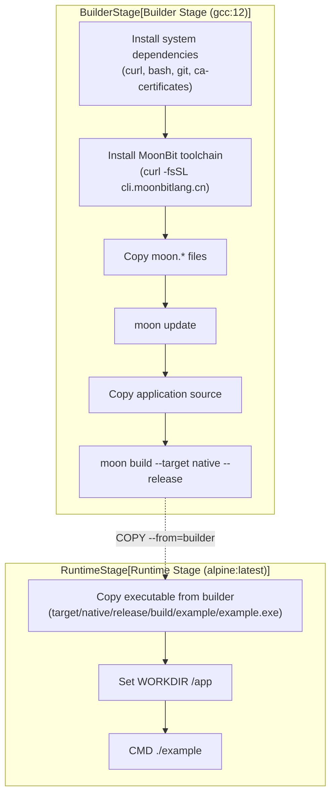
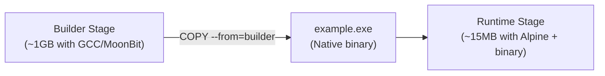
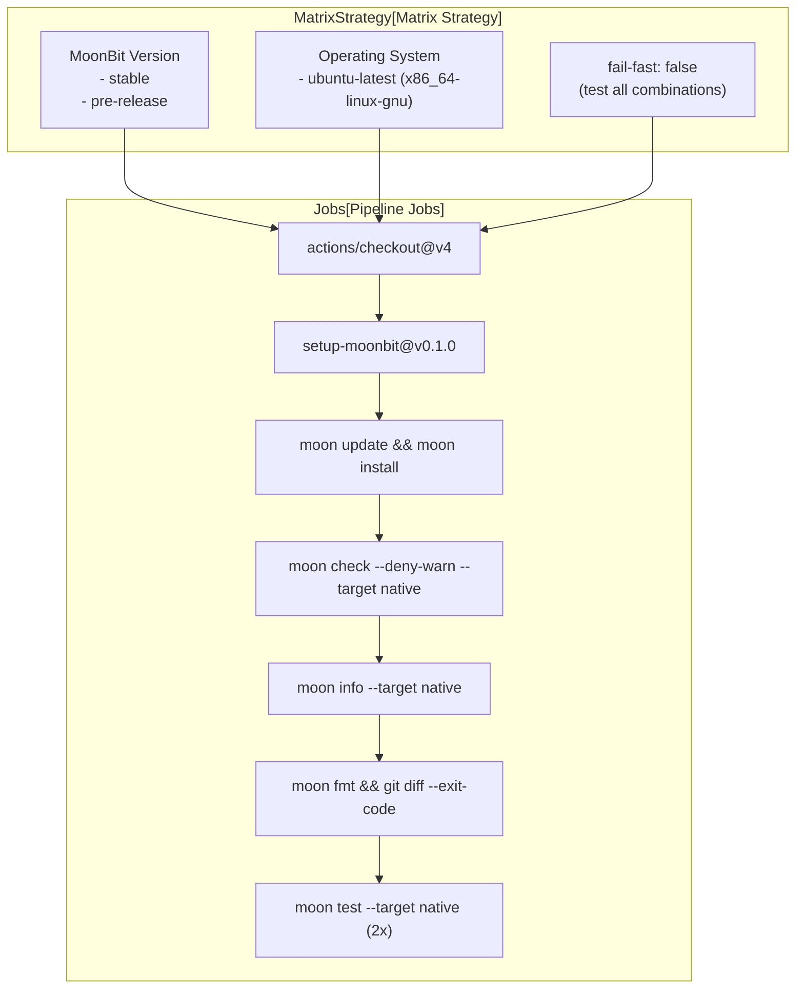
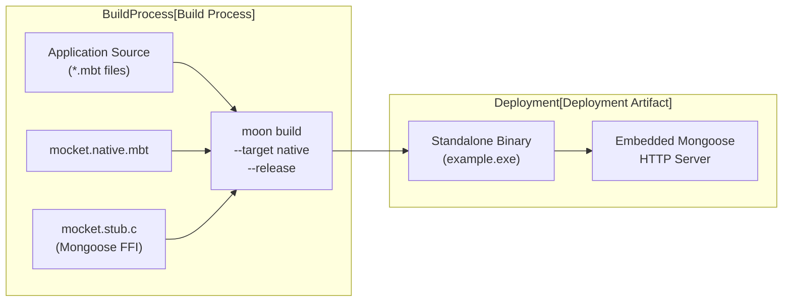
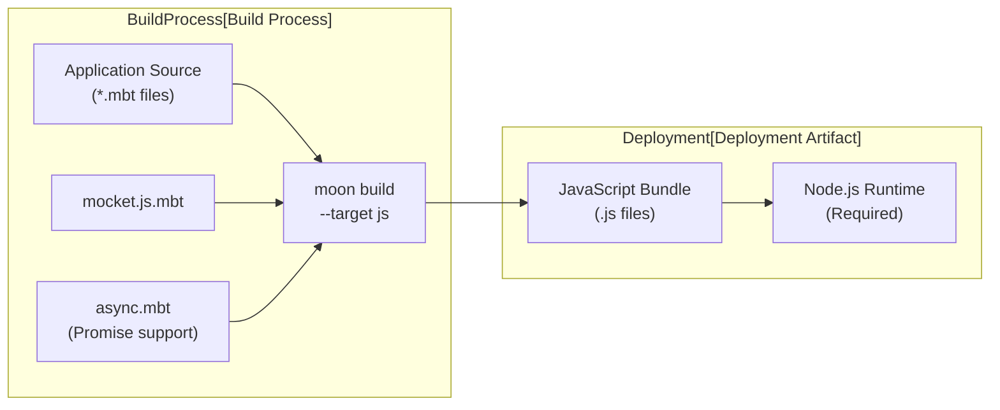

# Deployment

## Purpose and Scope

This document explains deployment strategies for Mocket applications in production environments. It covers Docker containerization, CI/CD pipeline integration, and backend-specific deployment considerations. For information about building and testing during development, see [Building and Testing](#6.2). For server configuration options, see [Server Configuration](#5.2).

---

## Docker Containerization

Mocket provides a production-ready Dockerfile that uses a multi-stage build strategy to create minimal container images. The build process separates compilation from runtime, resulting in significantly smaller deployment artifacts.

### Multi-Stage Build Architecture



**Sources:** `Dockerfile:1-37`

### Builder Stage Configuration

The builder stage uses the `gcc:12` base image, which provides the complete GCC toolchain required for compiling native MoonBit applications. The stage performs the following operations:

| Step | Command | Purpose |
|------|---------|---------|
| System Dependencies | `apt-get install curl bash git ca-certificates` | Tools for downloading MoonBit and Git operations |
| Toolchain Installation | `curl -fsSL https://cli.moonbitlang.cn/install/unix.sh \| bash` | Installs MoonBit compiler and build tools |
| PATH Configuration | `ENV PATH="/root/.moon/bin:$PATH"` | Makes `moon` command available |
| Dependency Caching | `COPY moon.* ./` then `moon update` | Leverages Docker layer caching for dependencies |
| Source Compilation | `moon build --target native --release` | Produces optimized native binary |

The builder stage explicitly uses `--platform=linux/amd64` to ensure consistent builds across different host architectures `Dockerfile:4`.

**Sources:** `Dockerfile:4-25`

### Runtime Stage Configuration

The runtime stage uses Alpine Linux, a minimal distribution that significantly reduces the final image size. The stage only contains the compiled executable and Alpine's base system:



The runtime configuration is minimal:
- Base image: `alpine:latest` `Dockerfile:31`
- Working directory: `/app` `Dockerfile:33`
- Executable location: `/app/example` `Dockerfile:34`
- Entry point: `CMD ["./example"]` `Dockerfile:36`

**Sources:** `Dockerfile:31-37`

### Building and Running the Container

To build and deploy using Docker:

```bash
# Build the image
docker build -t mocket-app .

# Run the container with port mapping
docker run -p 8080:8080 mocket-app
```

The Dockerfile expects the application executable to be located at `target/native/release/build/example/example.exe` after compilation `Dockerfile:34`. Applications with different names or locations should modify the `COPY` instruction accordingly.

**Sources:** `Dockerfile:34`

---

## CI/CD Pipeline

Mocket uses GitHub Actions for continuous integration and deployment validation. The pipeline enforces strict quality gates and tests against multiple MoonBit versions.

### Workflow Trigger Configuration

The workflow executes on multiple events:

| Trigger Type | Configuration | Purpose |
|--------------|---------------|---------|
| `push` | Branches: `master`, `main` | Validate all commits to primary branches |
| `pull_request` | All PRs | Prevent merging of broken code |
| `workflow_dispatch` | Manual trigger | Allow on-demand pipeline execution |
| `schedule` | `30 2 * * 5` (Fridays at 02:30) | Weekly compatibility verification |

**Sources:** `.github/workflows/check.yaml:3-14`

### Build Matrix Strategy

The pipeline uses a matrix strategy to test against multiple configurations:



**Sources:** `.github/workflows/check.yaml:18-31`

### Quality Gates

The pipeline enforces several quality gates that must pass before code can be deployed:

1. **Zero-Warning Compilation**: `moon check --deny-warn --target native` `.github/workflows/check.yaml:52`
   - Fails the build if any warnings are present
   - Ensures code quality standards

2. **Generated File Consistency**: `moon info --target native` followed by `git diff --exit-code` `.github/workflows/check.yaml:55-57`
   - Verifies that generated files are committed
   - Prevents inconsistencies between local and CI builds

3. **Format Compliance**: `moon fmt` followed by `git diff --exit-code` `.github/workflows/check.yaml:60-62`
   - Ensures all code follows consistent formatting
   - Fails if any files would be modified by formatting

4. **Test Execution**: `moon test --target native` (executed twice) `.github/workflows/check.yaml:74-76`
   - Validates functionality through automated tests
   - Runs twice to catch non-deterministic failures

The `fail-fast: false` configuration `.github/workflows/check.yaml:29` ensures that all matrix combinations are tested even if one fails, providing complete visibility into compatibility issues.

**Sources:** `.github/workflows/check.yaml:29,52,55-62,74-76`

### Resource Configuration

The pipeline sets specific resource limits for Unix systems:

```bash
ulimit -s 8176
```

This configures a stack size of 8176 KB before running tests `.github/workflows/check.yaml:68-71`. This limit prevents stack overflow issues during test execution and ensures consistent behavior across environments.

**Sources:** `.github/workflows/check.yaml:68-71`

---

## Backend-Specific Deployment

Mocket supports multiple compilation targets, each with different deployment requirements and characteristics.

### Native Backend Deployment

The native backend compiles to a standalone executable that embeds the Mongoose HTTP server. This is the recommended deployment target for production environments.



**Deployment characteristics:**
- **Artifact**: Single executable binary
- **Dependencies**: None (statically linked)
- **Memory footprint**: ~10-50 MB
- **Startup time**: < 100ms
- **Concurrency**: Event-driven C callbacks

To deploy the native backend:

```bash
# Build for production
moon build --target native --release

# The executable is located at:
# target/native/release/build/<package-name>/<package-name>.exe

# Run directly
./target/native/release/build/example/example.exe
```

**Sources:** `Dockerfile:25`, `.github/workflows/check.yaml:52`

### JavaScript Backend Deployment

The JavaScript backend targets Node.js and uses Promise-based async operations. This target is suitable for environments where Node.js is already deployed or preferred.



**Deployment characteristics:**
- **Artifact**: JavaScript bundle(s)
- **Dependencies**: Node.js runtime (v14+)
- **Memory footprint**: ~50-200 MB (with Node.js)
- **Startup time**: ~500ms
- **Concurrency**: Promise-based async/await

The JavaScript backend is not currently configured in the Dockerfile or CI pipeline, as the native backend is the primary deployment target.

**Sources:** Referenced from architecture diagrams

### WASM Backend Status

The WASM backend (`mocket.wasm.mbt`) is currently a stub implementation and not suitable for production deployment. See [WASM Backend](#3.3) for current status and roadmap.

**Sources:** Referenced from architecture diagrams

---

## Production Considerations

### Release Build Optimization

Always use the `--release` flag when building for production:

```bash
moon build --target native --release
```

The `--release` flag `Dockerfile:25` enables compiler optimizations that significantly improve runtime performance:
- Dead code elimination
- Inlining optimizations
- Reduced binary size
- No debug symbols

**Sources:** `Dockerfile:25`

### Port Configuration

Mocket applications bind to a port specified during server initialization. In containerized environments, ensure proper port mapping:

```dockerfile
# In your Dockerfile, expose the application port
EXPOSE 8080

# When running the container
docker run -p 8080:8080 mocket-app
```

The port number is configured in application code through the `serve` or `serve_ffi` functions. See [Server Configuration](#5.2) for details on port binding configuration.

### Environment Variables

For production deployments, consider externalizing configuration through environment variables:

```dockerfile
# Set environment variables in Dockerfile
ENV MOCKET_PORT=8080
ENV MOCKET_LOG_LEVEL=production

# Or pass at runtime
docker run -e MOCKET_PORT=8080 -e MOCKET_LOG_LEVEL=production mocket-app
```

The logger system supports production vs. debug modes through environment configuration. See [Logging System](#5.1) for details.

### Resource Limits

When deploying native binaries, consider system resource constraints:

| Resource | Recommended Limit | Configuration |
|----------|------------------|---------------|
| Stack size | 8 MB | `ulimit -s 8176` |
| File descriptors | 65536 | `ulimit -n 65536` |
| Memory | Based on workload | Container/systemd limits |

The CI pipeline sets `ulimit -s 8176` `.github/workflows/check.yaml:71` to ensure consistent stack behavior.

**Sources:** `.github/workflows/check.yaml:71`

### Deployment Verification Checklist

Before deploying to production:

1. ✓ Build passes with `--deny-warn` flag `.github/workflows/check.yaml:52`
2. ✓ All tests execute successfully `.github/workflows/check.yaml:74-76`
3. ✓ Code formatting is consistent `.github/workflows/check.yaml:60-62`
4. ✓ Release optimizations are enabled (`--release` flag) `Dockerfile:25`
5. ✓ Port mapping is configured correctly
6. ✓ Resource limits are set appropriately
7. ✓ Logging level is set to production mode

**Sources:** `.github/workflows/check.yaml:52,60-62,74-76`, `Dockerfile:25`

---

## Container Registry and Distribution

While not explicitly configured in the provided files, the deployment pipeline can be extended to publish container images to registries:

```yaml
# Example extension to check.yaml
- name: Build and push Docker image
  if: github.ref == 'refs/heads/main'
  run: |
    docker build -t ghcr.io/${{ github.repository }}:latest .
    docker push ghcr.io/${{ github.repository }}:latest
```

The multi-stage Dockerfile produces images suitable for distribution through:
- GitHub Container Registry (ghcr.io)
- Docker Hub
- Private container registries
- Cloud provider registries (ECR, GCR, ACR)

The minimal Alpine-based runtime stage `Dockerfile:31` ensures that distributed images are small and secure, containing only the compiled binary and essential system libraries.

**Sources:** `Dockerfile:31`