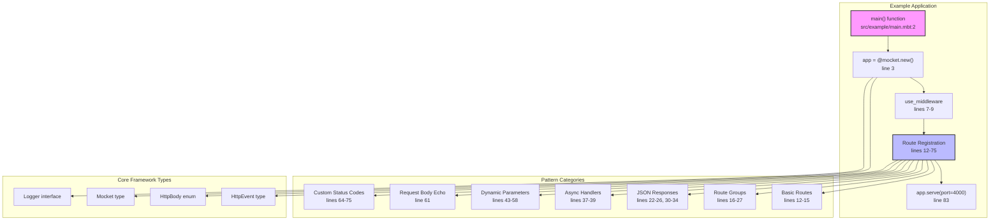
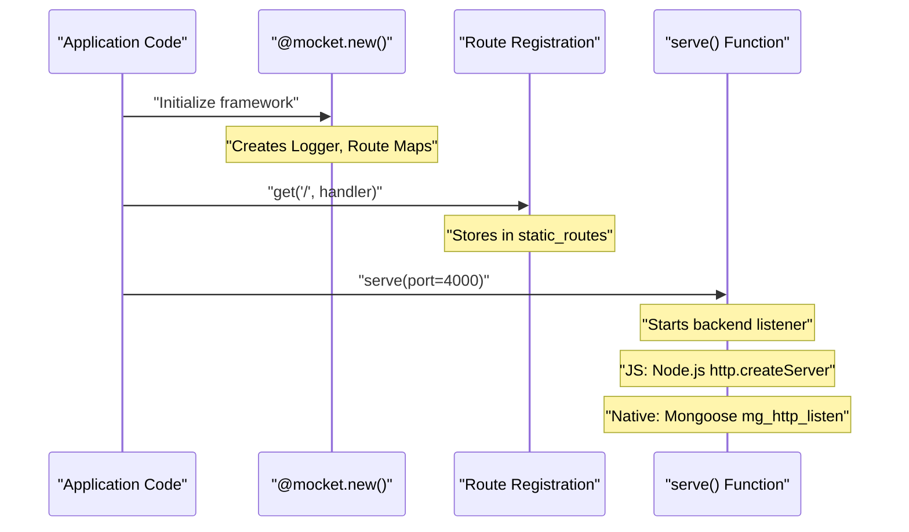
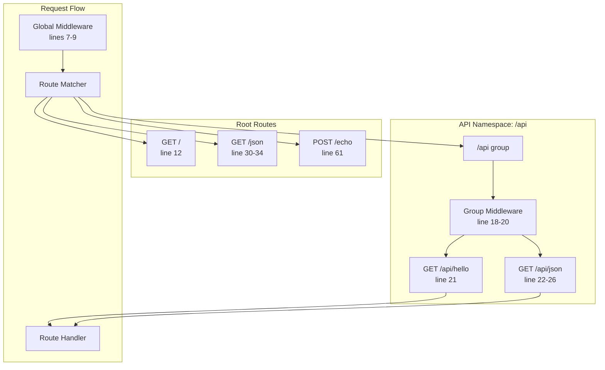
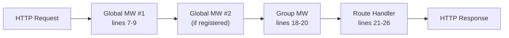
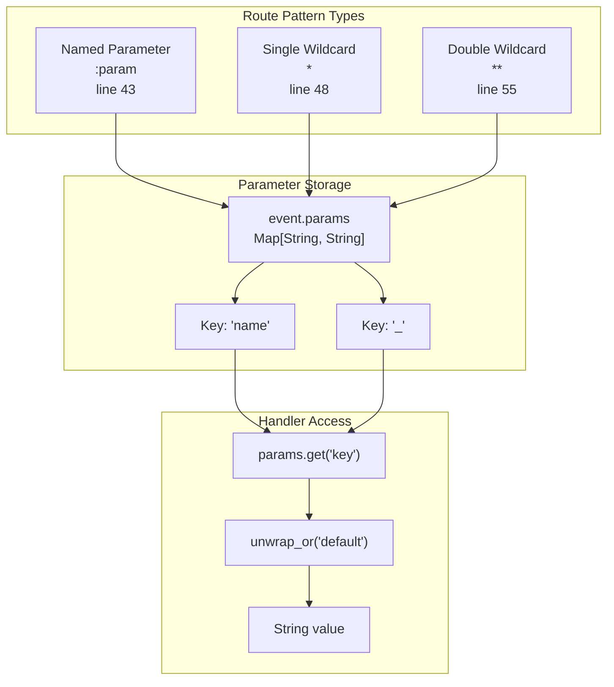
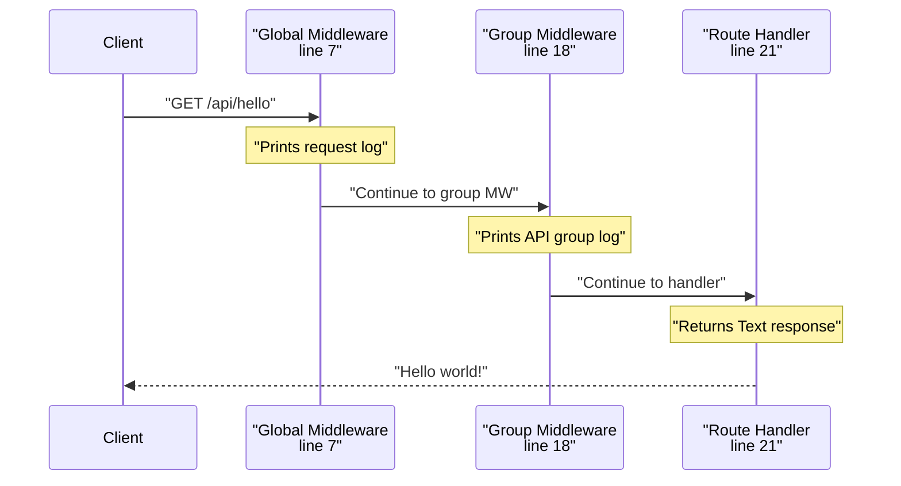
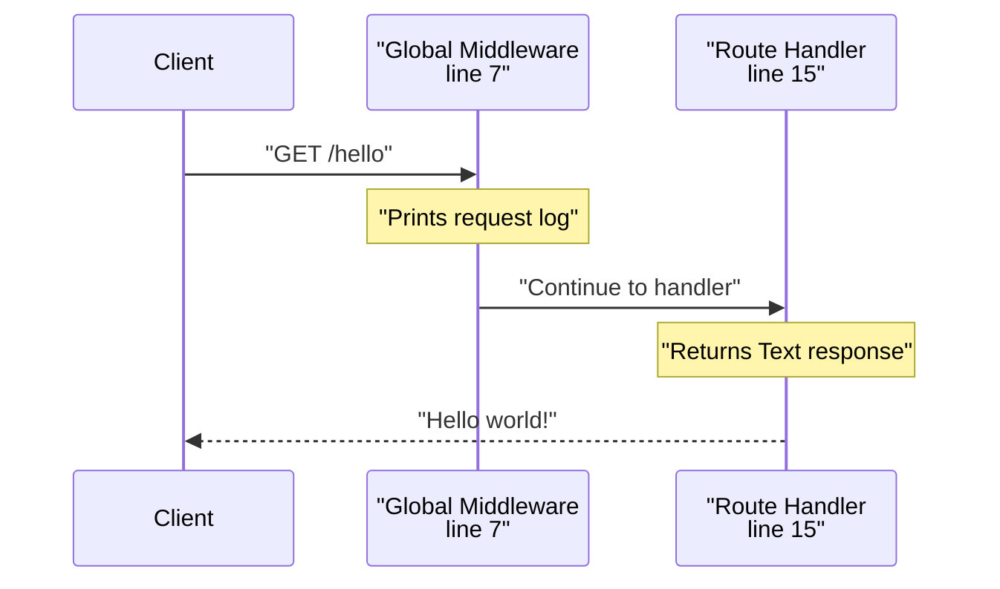
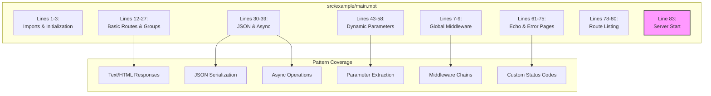

# Examples and Tutorials

This document provides practical, working examples demonstrating common use cases in Mocket. All examples reference actual code in the repository that can be run immediately. These tutorials cover basic HTTP server creation through advanced patterns like middleware composition and route grouping.

For conceptual explanations of routing mechanisms, see [Routing System](#2.1). For middleware theory and execution order, see [Middleware System](#2.2). For backend-specific implementation details, see [Multi-Backend Architecture](#3).

## Overview

Mocket includes a comprehensive example application located at `src/example/main.mbt:1-85` that demonstrates all core features. This example serves as both documentation and a test suite, ensuring patterns shown here remain functional across framework updates.

The following diagram maps example patterns to their implementations:



Sources: `src/example/main.mbt:1-85`, `README.md:111-195`

## Hello World Example

The simplest Mocket application consists of three steps: initialization, route registration, and server start.

### Minimal Application Structure



Sources: `src/example/main.mbt:3`, `src/example/main.mbt:12`, `src/example/main.mbt:83`

### Text Response Pattern

The basic text response pattern uses the `Text()` variant of the `HttpBody` enum:

`src/example/main.mbt:12`
```
..get("/", _event => Text("⚡️ Tadaa!"))
```

This route:
- Binds to `GET /`
- Ignores the event parameter with `_event` 
- Returns `Text(String)` which sets `Content-Type: text/plain`

The `Text` constructor is defined in the `HttpBody` enum alongside `Json`, `HTML`, `Bytes`, and `Empty` variants. See [Response Types](#2.3.1) for all response type options.

Sources: `src/example/main.mbt:12`, `README.md:122`

### Accessing the Event Object

Most handlers need request data, which comes through the `HttpEvent` parameter:

`src/example/main.mbt:15`
```
..on("GET", "/hello", _ => Text("Hello world!"))
```

The `on()` method is the low-level registration function. The convenience methods `get()`, `post()`, etc. delegate to `on()` internally. The handler receives an `HttpEvent` containing:
- `event.req` - `HttpRequest` with method, URL, headers, body
- `event.res` - `HttpResponse` for status codes and headers  
- `event.params` - `Map[String, String]` for path parameters

Sources: `src/example/main.mbt:15`

## REST API Example

REST APIs typically require JSON responses, multiple HTTP methods, and organized route structures.

### JSON Response Pattern

The `Json()` constructor automatically serializes MoonBit values and sets `Content-Type: application/json`:

`src/example/main.mbt:30-34`
```
..get("/json", _event => Json({
  "name": "John Doe",
  "age": 30,
  "city": "New York",
}))
```

The object literal syntax creates a MoonBit struct that gets serialized to JSON. This pattern works with any JSON-serializable MoonBit type.

Sources: `src/example/main.mbt:30-34`, `README.md:141-145`

### Route Organization with Groups

The `group()` method creates prefixed route namespaces with shared middleware:

`src/example/main.mbt:16-27`
```
..group("/api", group => {
  group.use_middleware(event => println(...))
  group.get("/hello", _ => Text("Hello world!"))
  group.get("/json", _ => Json({...}))
})
```

This creates:
- `GET /api/hello` - Text response
- `GET /api/json` - JSON response

Both routes execute the group middleware before their handlers. Groups can nest arbitrarily for hierarchical APIs.

Sources: `src/example/main.mbt:16-27`, `README.md:86-110`

### Complete REST API Structure



Sources: `src/example/main.mbt:7-61`

### Asynchronous Handlers

For I/O operations or async computations, use `async fn` syntax:

`src/example/main.mbt:37-39`
```
..get("/async_data", async fn(_event) noraise {
  Json({ "name": "John Doe", "age": 30, "city": "New York" })
})
```

The `async` keyword enables suspension points in the handler. The `noraise` annotation indicates this handler doesn't throw exceptions. On the JavaScript backend, this compiles to Promise-based code. See [Asynchronous Operations](#3.1.1) for backend-specific async behavior.

Sources: `src/example/main.mbt:37-39`, `README.md:147-150`

### Request Body Echo

The echo pattern demonstrates body passthrough:

`src/example/main.mbt:61`
```
..post("/echo", e => e.req.body)
```

This handler returns the request body directly. The `body` field is already an `HttpBody` enum, so it can be returned as-is. The response inherits the original `Content-Type` header.

Sources: `src/example/main.mbt:61`, `README.md:172`

## Middleware Example

Middleware functions execute before route handlers, enabling cross-cutting concerns like logging, authentication, and header manipulation.

### Middleware Execution Flow



Sources: `src/example/main.mbt:7-9`, `src/example/main.mbt:18-20`

### Global Middleware Registration

Global middleware runs for all routes:

`src/example/main.mbt:7-9`
```
app.use_middleware(event => println(
  "📝 Request: \{event.req.http_method} \{event.req.url}",
))
```

The middleware receives the full `HttpEvent` object with access to:
- `event.req.http_method` - HTTP verb (GET, POST, etc.)
- `event.req.url` - Request URL path
- `event.req.headers` - Request headers map
- `event.req.body` - Parsed request body

Middleware functions run in registration order. Each middleware must complete before the next executes.

Sources: `src/example/main.mbt:7-9`

### Group-Specific Middleware

Group middleware only affects routes within that group:

`src/example/main.mbt:18-20`
```
group.use_middleware(event => println(
  "🔒 API Group Middleware: \{event.req.http_method} \{event.req.url}",
))
```

For a request to `GET /api/hello`:
1. Global middleware runs (line 7)
2. Group middleware runs (line 18)  
3. Route handler runs (line 21)

For a request to `GET /` (outside the group):
1. Global middleware runs (line 7)
2. Route handler runs (line 12)

Sources: `src/example/main.mbt:18-20`, `README.md:91-110`

### Logging Middleware Pattern

The example uses direct `println()` for demonstration, but production code should use the Logger system:

`src/example/main.mbt:3`
```
let app = @mocket.new(logger=@mocket.new_production_logger())
```

Available logger constructors:
- `new_production_logger()` - Zero overhead, logging disabled
- `new_debug_logger()` - Full logging with debug messages
- `new_logger(enabled, level)` - Custom configuration

For detailed logging patterns, see [Logging System](#5.1).

Sources: `src/example/main.mbt:3`, `src/logger.mbt:23-31`

## Dynamic Route Parameters

Dynamic routes extract values from URL paths using named parameters and wildcards.

### Parameter Extraction Patterns



Sources: `src/example/main.mbt:43-58`, `README.md:44-71`

### Named Parameters

Named parameters use `:name` syntax:

`src/example/main.mbt:43-46`
```
..get("/hello/:name", fn(event) {
  let name = event.params.get("name").unwrap_or("World")
  Text("Hello, \{name}!")
})
```

URL matching:
- `/hello/Alice` → `name = "Alice"`
- `/hello/Bob` → `name = "Bob"`
- `/hello/` → No match (parameter required)

Multiple parameters are supported:

| Pattern | URL | Parameters |
|---------|-----|------------|
| `/users/:id/posts/:postId` | `/users/123/posts/456` | `id: "123"`, `postId: "456"` |
| `/api/:version/:resource` | `/api/v1/users` | `version: "v1"`, `resource: "users"` |

Sources: `src/example/main.mbt:43-46`, `README.md:49-53`, `README.md:197-208`

### Single Wildcard Routes

Single wildcards (`*`) match one path segment:

`src/example/main.mbt:48-51`
```
..get("/hello2/*", fn(event) {
  let name = event.params.get("_").unwrap_or("World")
  Text("Hello, \{name}!")
})
```

The wildcard value is stored under the key `"_"`:
- `/hello2/World` → `_: "World"`
- `/hello2/Alice` → `_: "Alice"`
- `/hello2/foo/bar` → No match (only one segment)

Sources: `src/example/main.mbt:48-51`, `README.md:55-64`

### Double Wildcard Routes

Double wildcards (`**`) match multiple path segments:

`src/example/main.mbt:55-58`
```
..get("/hello3/**", fn(event) {
  let name = event.params.get("_").unwrap_or("World")
  Text("Hello, \{name}!")
})
```

The captured path includes all remaining segments:
- `/hello3/World` → `_: "World"`
- `/hello3/foo/bar` → `_: "foo/bar"`
- `/hello3/a/b/c/d` → `_: "a/b/c/d"`

Sources: `src/example/main.mbt:55-58`, `README.md:66-71`

## Custom Status Codes and HTML

HTTP status codes and HTML responses require accessing the response object.

### Setting Status Codes

`src/example/main.mbt:64-75`
```
..get("/404", e => {
  e.res.status_code = 404
  HTML((
    #|<html>
    #|<body>
    #|  <h1>404</h1>
    #|</body>
    #|</html>
  ))
})
```

The response object `e.res` allows setting:
- `status_code` - HTTP status code (200, 404, 500, etc.)
- Headers via backend-specific methods

The `HTML()` constructor sets `Content-Type: text/html` and returns the string content. The `#|` syntax is MoonBit's multiline string literal.

Sources: `src/example/main.mbt:64-75`, `README.md:174-186`

## Running the Examples

### JavaScript Backend

```bash
moon run src/example --target js
```

The JavaScript backend uses Node.js's `http.createServer()` with Promise-based async support. See [JavaScript Backend](#3.1) for implementation details.

Sources: `README.md:22-24`, `README.md:16-24`

### Native Backend

```bash
moon run src/example --target native
```

The native backend uses the Mongoose embedded web server via C FFI. Performance characteristics differ from the JavaScript backend. See [Native Backend](#3.2) for implementation details.

Sources: `README.md:32-34`, `README.md:26-36`

### Accessing the Server

After starting either backend, the server listens on `http://localhost:4000`. The example application prints all registered routes:

`src/example/main.mbt:78-80`
```
for path in app.mappings.keys() {
  println("\{path.0} http://localhost:4000\{path.1}")
}
```

This outputs a list like:
```
GET http://localhost:4000/
GET http://localhost:4000/hello
GET http://localhost:4000/api/hello
...
```

Sources: `src/example/main.mbt:78-80`, `README.md:36`

## Route Matching Reference

The following table summarizes route pattern matching from the example application:

| Route Pattern | Example URL | Parameters Extracted | Handler Location |
|--------------|-------------|---------------------|------------------|
| `/` | `/` | None | line 12 |
| `/hello` | `/hello` | None | line 15 |
| `/api/hello` | `/api/hello` | None | line 21 |
| `/json` | `/json` | None | line 30 |
| `/async_data` | `/async_data` | None | line 37 |
| `/hello/:name` | `/hello/Alice` | `name: "Alice"` | line 43 |
| `/hello2/*` | `/hello2/Bob` | `_: "Bob"` | line 48 |
| `/hello3/**` | `/hello3/a/b/c` | `_: "a/b/c"` | line 55 |
| `/echo` (POST) | `/echo` | None | line 61 |
| `/404` | `/404` | None | line 64 |

Sources: `src/example/main.mbt:12-75`, `README.md:197-208`

## Middleware Execution Order

For the example application with a request to `GET /api/hello`:



For a request to `GET /hello` (not in a group):



Sources: `src/example/main.mbt:7-27`

## Additional Examples

### Minimum External Example

For a minimal standalone example outside the main repository, see the separate example repository:

`README.md:40`
```
Minimum Example: https://github.com/oboard/mocket_example
```

This repository demonstrates:
- Minimal `moon.mod.json` configuration
- Single-file application structure
- Deployment setup

Sources: `README.md:38-40`

### Example Code Structure Summary



Sources: `src/example/main.mbt:1-85`