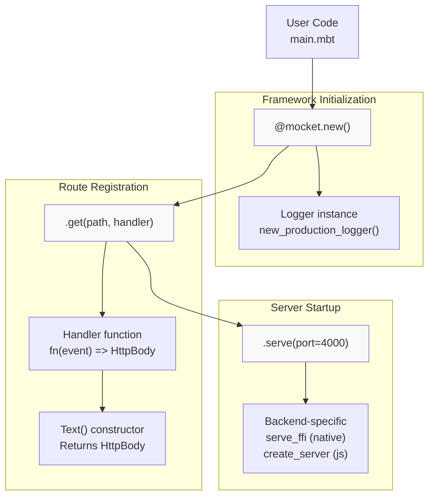
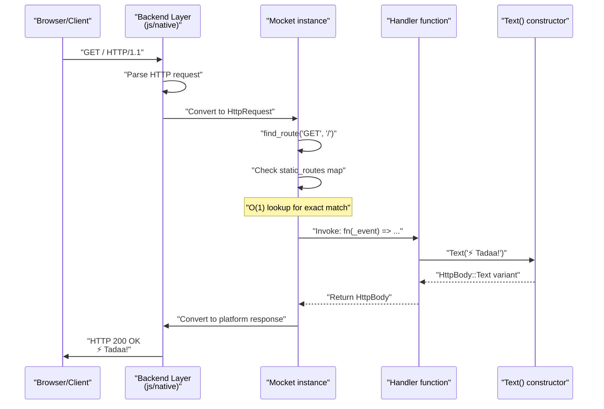
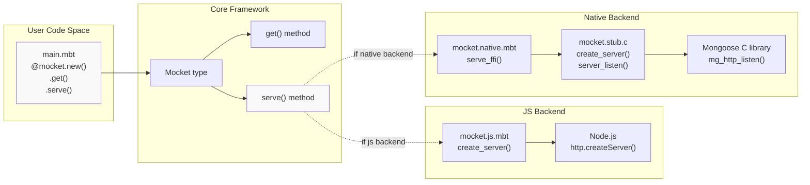

# Hello World Example

This document provides a walkthrough of the simplest possible Mocket application. It demonstrates the minimal code required to create a working HTTP server that responds with "Hello World" to incoming requests.

For more complex routing patterns with parameters and wildcards, see [Dynamic Routes and Parameters](#2.1.2). For working with JSON responses and multiple routes, see [REST API Example](#7.2). For adding middleware, see [Middleware Example](#7.3).

## Minimal Application Structure

The most basic Mocket application requires three components: creating a Mocket instance, registering at least one route handler, and starting the server. The following example from [src/example/main.mbt:3-15]() demonstrates this pattern:

```moonbit
let app = @mocket.new(logger=@mocket.new_production_logger())

app
  ..get("/", _event => Text("⚡️ Tadaa!"))
  ..serve(port=4000)
```

This creates a server listening on port 4000 that responds with "⚡️ Tadaa!" to GET requests at the root path `/`.

**Sources:** [src/example/main.mbt:3-15](), [README.md:112-125]()

## Code Components Breakdown



**Diagram: Minimal Application Component Flow**

### Component 1: Mocket Instance Creation

The `@mocket.new()` function creates a new Mocket application instance. The `logger` parameter accepts a `Logger` instance that controls diagnostic output during development and production.

**Logger Options:**
- `new_production_logger()` - Disabled logging for zero-overhead production use [src/logger.mbt:24-26]()
- `new_debug_logger()` - Enabled logging with debug-level output [src/logger.mbt:30-32]()
- `new_logger(enabled?, level?)` - Custom configuration [src/logger.mbt:18-20]()

### Component 2: Route Registration

The `.get()` method registers a handler function for GET requests at a specific path. The method signature is:

```
get(path: String, handler: (HttpEvent) -> HttpBody) -> Mocket
```

The handler function receives an `HttpEvent` parameter containing the request details and must return an `HttpBody` enum variant. The underscore prefix `_event` indicates the parameter is intentionally unused in simple handlers.

### Component 3: Response Construction

The `Text()` constructor creates an `HttpBody::Text` variant containing the string response. Other available response types include:
- `Json(value)` - JSON response
- `HTML(content)` - HTML response  
- `Bytes(data)` - Binary response
- `Empty` - Empty response body

For details on all response types, see [Response Types](#2.3.1).

### Component 4: Server Startup

The `.serve(port)` method starts the HTTP server on the specified port. This call blocks indefinitely, processing incoming requests. The actual implementation differs by backend:
- **Native backend**: Calls `serve_ffi()` which uses Mongoose C library [src/mocket.stub.c:270-285]()
- **JavaScript backend**: Calls Node.js `createServer()` API

**Sources:** [src/example/main.mbt:3-15](), [src/logger.mbt:24-32](), [README.md:112-125]()

## Running the Application

### JavaScript Backend

Set the MoonBit backend to `js` and run:

```bash
moon run src/example --target js
```

This compiles the MoonBit code to JavaScript and executes it using Node.js runtime.

### Native Backend  

Set the MoonBit backend to `native` and run:

```bash
moon run src/example --target native
```

This compiles to a native binary using the C/Mongoose integration through FFI.

### Accessing the Server

After starting either backend, visit `http://localhost:4000` in a browser or use curl:

```bash
curl http://localhost:4000
```

Expected response:
```
⚡️ Tadaa!
```

**Sources:** [README.md:14-37]()

## Request Processing Flow



**Diagram: Hello World Request Flow with Function Names**

The request processing follows these steps:

1. **Request Reception**: Backend receives raw HTTP request on port 4000
2. **Type Conversion**: Backend converts platform-specific request to `HttpRequest` type
3. **Route Lookup**: `find_route()` performs O(1) static route lookup in `static_routes` map
4. **Handler Invocation**: Registered handler function executes with `HttpEvent` parameter
5. **Response Construction**: `Text()` constructs `HttpBody::Text` variant
6. **Response Conversion**: `HttpBody` converts to platform-specific HTTP response
7. **Response Transmission**: Backend sends HTTP 200 response to client

For details on the routing algorithm, see [Routing System](#2.1). For middleware execution in this flow, see [Middleware System](#2.2).

**Sources:** [README.md:112-125](), Architecture Diagram 2 from context

## Expanding the Example

### Adding Multiple Routes

The fluent API allows chaining multiple route registrations:

```moonbit
app
  ..get("/", _ => Text("Home"))
  ..get("/hello", _ => Text("Hello world!"))
  ..serve(port=4000)
```

This pattern is demonstrated in [src/example/main.mbt:12-15]().

### Adding Request Logging

Insert middleware to log each request:

```moonbit
app
  ..use_middleware(event => println(
    "Request: \{event.req.http_method} \{event.req.url}"
  ))
  ..get("/", _ => Text("Hello"))
  ..serve(port=4000)
```

The middleware executes before the route handler for every request. This pattern appears in [src/example/main.mbt:6-9]().

### Using Different Response Types

Replace `Text()` with other `HttpBody` variants:

| Constructor | Response Type | Example |
|-------------|---------------|---------|
| `Text(string)` | Plain text | `Text("Hello")` |
| `HTML(string)` | HTML document | `HTML("<h1>Hello</h1>")` |
| `Json(value)` | JSON object | `Json({"key": "value"})` |
| `Bytes(array)` | Binary data | `Bytes([0x48, 0x69])` |
| `Empty` | No body | `Empty` |

For comprehensive response type documentation, see [Response Types](#2.3.1).

**Sources:** [src/example/main.mbt:12-34](), [README.md:112-125]()

## Backend Architecture Mapping



**Diagram: Hello World Backend Implementation Mapping**

The same user code (`@mocket.new().get("/", ...).serve(port)`) compiles to different backend implementations:

- **JavaScript Backend**: Uses Node.js `http.createServer()` API through MoonBit's JavaScript interop
- **Native Backend**: Uses Mongoose embedded web server through C FFI bindings [src/mocket.stub.c:260-285]()

The core framework provides a unified API that abstracts these platform differences. The actual backend selection happens at compile time based on the `--target` flag.

For detailed backend architecture, see [Multi-Backend Architecture](#3). For JavaScript-specific details, see [JavaScript Backend](#3.1). For native implementation details, see [Native Backend](#3.2).

**Sources:** [README.md:14-37](), [src/mocket.stub.c:260-285](), Architecture Diagram 1 from context

## Common Patterns

### Pattern: Single Route Application

**Use case:** Simple status endpoint, health check, or landing page

```moonbit
@mocket.new(logger=@mocket.new_production_logger())
  .get("/status", _ => Text("OK"))
  .serve(port=8080)
```

### Pattern: Root and 404

**Use case:** Handle main route plus fallback for unknown paths

```moonbit
app
  ..get("/", _ => Text("Home"))
  ..get("/**", e => {
    e.res.status_code = 404
    Text("Not Found")
  })
```

The double wildcard `/**` matches all remaining paths. For wildcard route details, see [Dynamic Routes and Parameters](#2.1.2).

### Pattern: Multiple Content Types

**Use case:** Different routes returning different content formats

```moonbit
app
  ..get("/", _ => HTML("<h1>Welcome</h1>"))
  ..get("/api/status", _ => Json({"status": "ok"}))
  ..get("/health", _ => Text("healthy"))
```

**Sources:** [src/example/main.mbt:12-75](), [README.md:43-72]()

## Next Steps

- **Dynamic Routes**: Learn to extract parameters from URLs in [Dynamic Routes and Parameters](#2.1.2)
- **REST API**: Build a complete JSON API in [REST API Example](#7.2)  
- **Middleware**: Add logging, authentication, and CORS in [Middleware Example](#7.3)
- **Route Groups**: Organize related routes under common prefixes in [Route Groups](#2.1.3)
- **Request Handling**: Access request headers and body data in [Request and Response Handling](#2.3)

**Sources:** [README.md:1-219](), [src/example/main.mbt:1-85]()