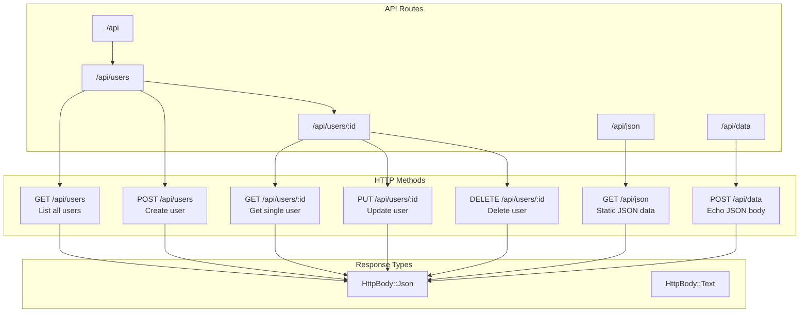
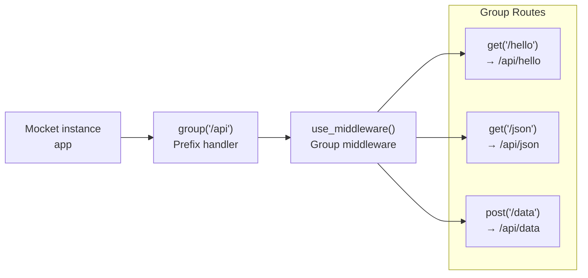

# REST API Example

## Purpose and Scope

This page demonstrates how to build a complete REST API using Mocket with JSON request/response handling, multiple HTTP methods, and proper route organization. The example covers a typical CRUD (Create, Read, Update, Delete) API structure for managing user resources.

For basic application setup, see [Hello World Example](#7.1). For middleware patterns like authentication and logging, see [Middleware Example](#7.3). For JSON response type details, see [Response Types](#2.3.1).

## REST API Structure Overview

A typical REST API in Mocket follows RESTful conventions with routes organized under a common prefix (e.g., `/api`) and uses HTTP methods to indicate operations.

**API Endpoint Structure Diagram**



Sources: `README.md:38-195`, `src/example/main.mbt:1-85`

## Application Initialization

The REST API starts with creating a `Mocket` instance and configuring global middleware for request logging.

The core setup follows this pattern from the example application:

| Component | Code Reference | Purpose |
|-----------|---------------|---------|
| `@mocket.new()` | `src/example/main.mbt:3` | Creates framework instance |
| `logger` parameter | `src/example/main.mbt:3` | Configures logging behavior |
| `use_middleware()` | `src/example/main.mbt:7-9` | Adds global request interceptors |
| `serve()` | `src/example/main.mbt:83` | Starts HTTP server |

The example uses `@mocket.new_production_logger()` for production deployments, which disables debug logging for performance.

Sources: `src/example/main.mbt:3-9`, `src/logger.mbt:24-26`

## Route Group Organization

REST APIs benefit from organizing related endpoints under a common prefix using the `group()` method. This provides namespace isolation and allows group-specific middleware.

**Route Group Structure**



The group pattern is implemented in `src/example/main.mbt:16-27`:
- Line 16: `app.group("/api", group => { ... })` creates the group
- Lines 18-20: Group middleware applies to all routes in the group
- Lines 21-26: Individual routes are registered on the `group` object

All routes registered within the group callback automatically receive the `/api` prefix and execute the group middleware before their handlers.

Sources: `src/example/main.mbt:16-27`, `README.md:86-109`

## CRUD Endpoint Implementation

### GET Endpoints - Reading Data

GET endpoints return JSON data representing resources. Static data endpoints return fixed responses, while dynamic endpoints use route parameters.

**Static JSON Response Pattern:**

`src/example/main.mbt:22-26` demonstrates returning a JSON object:
- The handler returns `Json({ ... })` wrapping a MoonBit struct
- The framework serializes the struct to JSON automatically
- Content-Type header is set to `application/json`

**Dynamic Parameter Extraction:**

`src/example/main.mbt:43-46` shows parameter access:
- Route pattern: `/hello/:name` defines a parameter placeholder
- `event.params.get("name")` extracts the parameter value
- `unwrap_or("World")` provides a default if missing

| Route Pattern | URL Example | Parameter Access |
|---------------|-------------|------------------|
| `/users/:id` | `/users/123` | `event.params.get("id")` → `"123"` |
| `/users/:id/posts/:postId` | `/users/5/posts/42` | `event.params.get("id")` → `"5"`<br/>`event.params.get("postId")` → `"42"` |
| `/api/**` | `/api/v1/users` | `event.params.get("_")` → `"v1/users"` |

Sources: `src/example/main.mbt:22-26`, `src/example/main.mbt:43-46`, `README.md:44-71`, `README.md:197-207`

### POST Endpoints - Creating Resources

POST endpoints receive JSON request bodies and return JSON responses. The request body is automatically parsed based on the Content-Type header.

**Echo Server Pattern:**

`src/example/main.mbt:61` demonstrates the simplest POST handler:
```
..post("/echo", e => e.req.body)
```

This handler:
1. Receives the `HttpEvent` parameter `e`
2. Accesses `e.req.body` which contains the parsed `HttpBody`
3. Returns the body directly, echoing it back to the client

The body parsing happens automatically in the framework based on the Content-Type header. For `application/json`, the body is parsed into `HttpBody::Json` with the JSON object accessible.

Sources: `src/example/main.mbt:61`, `README.md:172`

### PUT/DELETE Endpoints - Updates and Deletion

PUT and DELETE endpoints follow the same pattern as GET/POST, typically using route parameters to identify the resource.

**Typical Patterns:**

| Method | Route Pattern | Handler Access Pattern |
|--------|---------------|------------------------|
| PUT | `/users/:id` | `event.params.get("id")` + `event.req.body` |
| PATCH | `/users/:id` | `event.params.get("id")` + `event.req.body` |
| DELETE | `/users/:id` | `event.params.get("id")` |

The framework provides method-specific registration functions referenced in `README.md:197-207`:
- `app.put("/users/:id", handler)` - Full replacement
- `app.patch("/users/:id", handler)` - Partial update  
- `app.delete("/users/:id", handler)` - Resource deletion

Sources: `README.md:197-207`

## JSON Request/Response Flow

The complete flow from JSON request to JSON response involves multiple framework components working together.

**Request Processing Sequence**

```mermaid
sequenceDiagram
    participant Client
    participant Backend["Backend Layer<br/>(mocket.js.mbt or<br/>mocket.native.mbt)"]
    participant Core["Core Framework<br/>(index.mbt)"]
    participant BodyParser["body_reader.mbt<br/>parse_body()"]
    participant Handler["Route Handler<br/>(user code)"]
    
    Client->>Backend: "POST /api/users<br/>Content-Type: application/json<br/>{\"name\": \"Alice\"}"
    Backend->>Core: "Convert to HttpRequest"
    Core->>BodyParser: "parse_body(body_bytes,<br/>content_type)"
    BodyParser->>BodyParser: "Match 'application/json'"
    BodyParser->>BodyParser: "@json.parse()"
    BodyParser-->>Core: "HttpBody::Json(object)"
    Core->>Handler: "handler(event)<br/>event.req.body = Json(...)"
    Handler->>Handler: "Process request<br/>Create response"
    Handler-->>Core: "Json({\"id\": 123,<br/>\"name\": \"Alice\"})"
    Core->>Backend: "Convert HttpBody to<br/>platform response"
    Backend->>Client: "HTTP 200<br/>Content-Type: application/json<br/>{\"id\": 123, \"name\": \"Alice\"}"
```

Sources: `README.md:38-195`, `src/example/main.mbt:1-85`

## Complete REST API Example Structure

The following table maps a complete user management API to the code patterns in the example:

| Endpoint | Method | Handler Pattern | Example Reference |
|----------|--------|----------------|-------------------|
| `/api/users` | GET | `group.get("/users", _ => Json({ "users": [...] }))` | `src/example/main.mbt:22-26` pattern |
| `/api/users` | POST | `group.post("/users", e => Json({ "id": ..., ...e.req.body }))` | `src/example/main.mbt:61` pattern |
| `/api/users/:id` | GET | `group.get("/users/:id", e => Json({ "id": e.params.get("id") }))` | `src/example/main.mbt:43-46` pattern |
| `/api/users/:id` | PUT | `group.put("/users/:id", e => { /* update */ Json(...) })` | Method from `README.md:197-207` |
| `/api/users/:id` | DELETE | `group.delete("/users/:id", e => { /* delete */ Text("OK") })` | Method from `README.md:197-207` |

All endpoints within the `/api` group would:
1. Execute the group middleware from `src/example/main.mbt:18-20`
2. Execute any global middleware from `src/example/main.mbt:7-9`
3. Execute the route-specific handler
4. Return responses that are automatically serialized by the framework

Sources: `src/example/main.mbt:16-27`, `README.md:197-207`

## Async JSON Endpoints

Mocket supports asynchronous handlers for I/O operations or long-running computations that return JSON responses.

The async pattern is demonstrated in `src/example/main.mbt:37-39`:
```
..get("/async_data", async fn(_event) noraise {
  Json({ "name": "John Doe", "age": 30, "city": "New York" })
})
```

Key characteristics:
- Handler is declared with `async fn` keyword
- Can use `await` for asynchronous operations (see [Asynchronous Operations](#3.1.1))
- Returns `HttpBody` type just like synchronous handlers
- `noraise` annotation indicates error handling strategy

This pattern works identically for POST, PUT, and other HTTP methods, enabling async database queries, external API calls, or file operations.

Sources: `src/example/main.mbt:37-39`, `README.md:73-84`

## HTTP Method Registration

The framework provides convenience methods for all standard HTTP methods that delegate to the core `on()` method:

| Method Function | HTTP Verb | Example Usage |
|-----------------|-----------|---------------|
| `app.get()` | GET | `app.get("/users", handler)` |
| `app.post()` | POST | `app.post("/users", handler)` |
| `app.put()` | PUT | `app.put("/users/:id", handler)` |
| `app.patch()` | PATCH | `app.patch("/users/:id", handler)` |
| `app.delete()` | DELETE | `app.delete("/users/:id", handler)` |
| `app.on()` | Any | `app.on("OPTIONS", "/users", handler)` |

The same methods are available on route groups:
- `group.get()`, `group.post()`, etc.
- Example: `src/example/main.mbt:21-26`

For custom HTTP methods not covered by convenience functions, use `app.on(method, path, handler)` as shown in `src/example/main.mbt:15`.

Sources: `src/example/main.mbt:12-27`, `README.md:86-109`

## Testing the API

After starting the server with `app.serve(port=4000)` from `src/example/main.mbt:83`, the API can be tested with standard HTTP clients:

**Example curl Commands:**

```bash
# GET request
curl http://localhost:4000/api/json

# POST request with JSON body
curl -X POST http://localhost:4000/api/data \
  -H "Content-Type: application/json" \
  -d '{"name":"Alice","age":30}'

# GET with route parameter
curl http://localhost:4000/hello/World

# Echo endpoint
curl -X POST http://localhost:4000/echo \
  -H "Content-Type: application/json" \
  -d '{"message":"test"}'
```

The example application prints all registered routes at startup (`src/example/main.mbt:78-80`), making it easy to see all available endpoints.

Sources: `src/example/main.mbt:78-83`, `README.md:36`