# Middleware Example

## Purpose and Scope

This page demonstrates practical middleware patterns in Mocket through concrete examples. Middleware are functions that process requests before they reach route handlers or modify responses before they're sent to clients. For conceptual information about how the middleware system works, see [Middleware System](#2.2). For basic framework usage, see [Quick Start Guide](#1.1).

Sources: [README.md:86-110]()

## Overview

Middleware in Mocket are registered using the `use_middleware` method and execute in a specific order: global middleware first, then group-specific middleware, and finally the route handler. The middleware signature is `(HttpEvent) -> Unit`, allowing inspection and modification of both request and response objects.

The framework supports two middleware scopes:
- **Global middleware**: Applies to all routes registered on the `Mocket` instance
- **Group middleware**: Applies only to routes within a specific route group

Sources: [README.md:86-110](), [src/example/main.mbt:1-85]()

## Middleware Execution Pipeline

```mermaid
sequenceDiagram
    participant Client
    participant Server as "Mocket Server"
    participant GM as "Global Middleware"
    participant GroupM as "Group Middleware"
    participant Handler as "Route Handler"
    
    Client->>Server: "HTTP Request"
    Server->>GM: "execute(event)"
    Note over GM: "Logging, CORS, etc."
    GM->>GroupM: "next → execute(event)"
    Note over GroupM: "Auth, validation, etc."
    GroupM->>Handler: "next → handler(event)"
    Handler->>GroupM: "HttpBody"
    GroupM->>GM: "HttpBody"
    GM->>Server: "HttpBody"
    Server->>Client: "HTTP Response"
```

**Execution Order**: Global middleware executes first for all requests, followed by group middleware (if the route is within a group), and finally the route handler. Each middleware can inspect or modify the `HttpEvent` before passing control to the next layer.

Sources: [README.md:86-110]()

## Global Middleware Examples

### Logging Middleware

The most common middleware pattern logs incoming requests for debugging and monitoring:

**Implementation Reference**: [src/example/main.mbt:6-9]() demonstrates global logging middleware that prints request method and URL for every request. The pattern uses `event.req.http_method` and `event.req.url` to extract request details.

**Usage Pattern**:
| Code Entity | Purpose | Accessed Properties |
|-------------|---------|---------------------|
| `app.use_middleware()` | Register global middleware | - |
| `event.req.http_method` | HTTP method (GET, POST, etc.) | String |
| `event.req.url` | Request path | String |

Sources: [src/example/main.mbt:6-9](), [README.md:116-120]()

### Response Header Middleware

Middleware can modify response headers for all routes:

**Common Headers Set**:
- `Content-Type`: Specify response content type
- `Access-Control-Allow-Origin`: CORS configuration
- `X-Content-Type-Options`: Security headers
- `Cache-Control`: Caching behavior

The `HttpResponse` object accessible via `event.res` provides methods to set headers before the response is sent.

Sources: [README.md:116-120](), [src/example/main.mbt:6-9]()

## Group Middleware Examples

### API Authentication Middleware

Group middleware applies only to routes within a specific prefix:

**Implementation Reference**: [src/example/main.mbt:16-27]() shows a group with middleware that logs API-specific information. The pattern uses `app.group("/api", group => {...})` to create a group and `group.use_middleware()` to register group-level middleware.

**Key Characteristics**:
- Executes after global middleware
- Only applies to routes within the group
- Can access all `HttpEvent` properties
- Multiple groups can have different middleware

Sources: [src/example/main.mbt:16-27](), [README.md:86-110]()

## Complete Middleware Flow Example

**Concrete Example from Codebase**:

| Request Path | Global Middleware | Group Middleware | Handler |
|-------------|-------------------|------------------|---------|
| `POST /api/data` | Logs: `📝 Request: POST /api/data` | Logs: `🔒 API Group Middleware: POST /api/data` | Returns `event.req.body` |
| `GET /` | Logs: `📝 Request: GET /` | None | Returns `Text("⚡️ Tadaa!")` |
| `GET /api/hello` | Logs: `📝 Request: GET /api/hello` | Logs: `🔒 API Group Middleware: GET /api/hello` | Returns `Text("Hello world!")` |

Sources: [src/example/main.mbt:6-27](), [README.md:113-138]()

## Common Middleware Patterns

### Request Logging with Logger System

The framework includes a `Logger` type for structured logging:

**Logger Integration**:
- Create logger with `new_production_logger()` or `new_debug_logger()`
- Production logger has `enabled: false` for zero overhead
- Debug logger provides detailed route tracking
- Use `logger.route_found()`, `logger.route_not_found()` for route-specific logs

Sources: [logger.mbt:1-148](), [src/example/main.mbt:3]()

### Performance Timing Middleware

Track request processing time:

**Conceptual Pattern**:
1. Record start time when middleware executes
2. Allow request to continue through pipeline
3. Calculate duration after handler completes
4. Log or store timing information

**Access Points**:
- `event.req`: Contains request data (method, URL, headers, body)
- `event.res`: Response object for setting status and headers
- `event.params`: Route parameters extracted from dynamic routes

Sources: [README.md:113-138]()

### Error Handling Middleware

Catch and format errors uniformly:

**Pattern**:
- Wrap handler execution in error handling logic
- Set appropriate status codes on `event.res.status_code`
- Return standardized error responses
- Log errors using the logger system

Sources: [src/example/main.mbt:64-75]()

## Middleware Registration Patterns

### Single Middleware Registration

**Code Pattern**: Method chaining allows multiple middleware registrations using the fluent API pattern demonstrated in [src/example/main.mbt:6-9](). Each `use_middleware` call returns the `Mocket` instance for chaining.

Sources: [src/example/main.mbt:6-84]()

### Group Middleware Registration

**Code Pattern**: Inside the group callback function, call `group.use_middleware()` before registering routes. Example at [src/example/main.mbt:16-27]() shows group middleware registration followed by route definitions using `group.get()` and `group.post()`.

Sources: [src/example/main.mbt:16-27](), [README.md:86-110]()

## Accessing Request and Response in Middleware

### HttpEvent Structure

**Middleware Access Patterns**:
- `event.req.http_method`: GET, POST, PUT, DELETE, etc.
- `event.req.url`: Request path (e.g., "/api/users")
- `event.req.headers`: Request headers as Map
- `event.req.body`: Request body as `HttpBody` enum
- `event.res.status_code`: Set response status (200, 404, etc.)
- `event.params`: Route parameters from dynamic routes

Sources: [src/example/main.mbt:1-85](), [README.md:43-71]()

## Backend-Specific Considerations

Both JavaScript and native backends support middleware identically from the application code perspective:

**JavaScript Backend**: Middleware executes in the Node.js event loop, supporting async operations transparently.

**Native Backend**: Middleware executes in C/Mongoose callback handlers, with synchronous execution model.

The unified `HttpEvent` abstraction ensures middleware written once works across all backends without modification.

Sources: [README.md:14-36]()