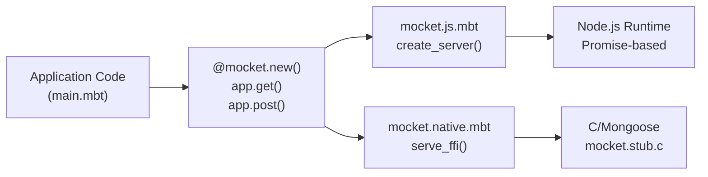
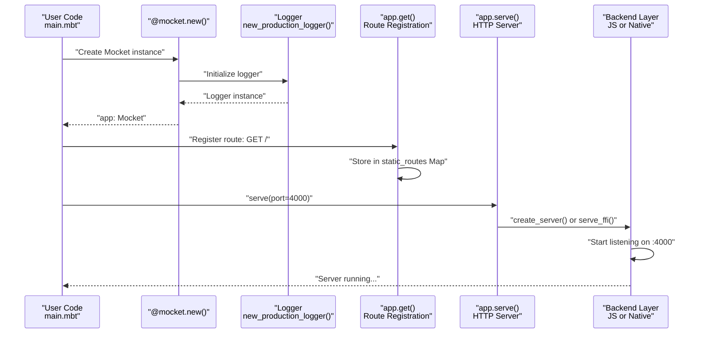
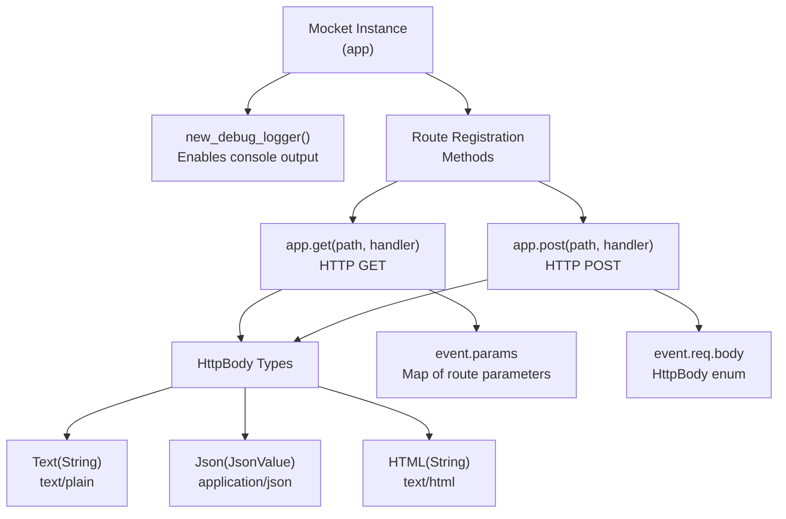
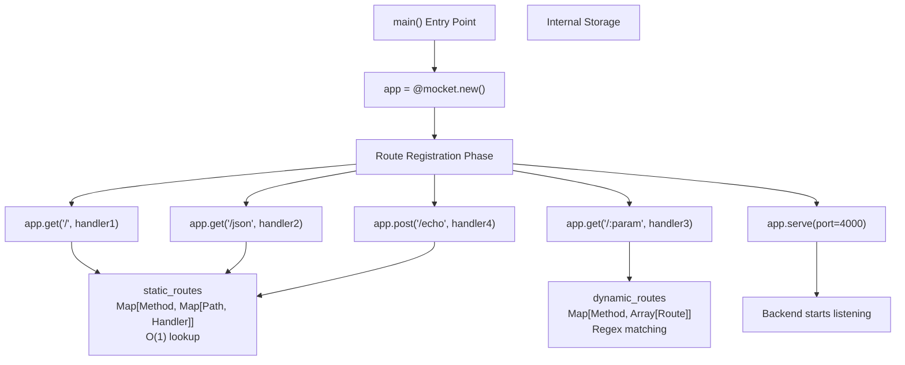

# Quick Start Guide

This guide provides step-by-step instructions for installing Mocket and creating your first HTTP server application. It covers installation, minimal example setup, and running your application on both JavaScript and Native backends. For comprehensive routing features and middleware patterns, see [Routing System](#2.1) and [Middleware System](#2.2). For production deployment considerations, see [Deployment](#6.3).

## Installation

Mocket is distributed as a MoonBit package. Add it to your project dependencies in `moon.mod.json`:

```json
{
  "name": "your-project",
  "deps": {
    "oboard/mocket": "*"
  }
}
```

The framework requires MoonBit's package manager to resolve four external dependencies automatically:
- `yj-qin/regexp` - Pattern matching for dynamic routes
- `illusory0x0/native` - Native backend FFI support
- `tonyfettes/uri` - URI parsing utilities
- `moonbitlang/x` - Standard library extensions

Sources: `README.md:1-11`

## Backend Selection

Mocket supports two primary compilation targets: JavaScript (Node.js) and Native (C/Mongoose). Select your target backend in Visual Studio Code:

**Command**: `MoonBit: Select Backend`
- Choose `js` for JavaScript/Node.js runtime
- Choose `native` for compiled binary with Mongoose HTTP server

The backend selection determines which platform-specific implementation is used, but your application code remains identical across both targets.



Sources: `README.md:14-34`, Diagram 1: Multi-Target Framework Architecture

## Minimal Example

Create a file `main.mbt` with the following minimal HTTP server:

```moonbit
fn main {
  let app = @mocket.new(logger=@mocket.new_production_logger())
  
  app.get("/", _event => Text("Hello, Mocket!"))
  
  app.serve(port=4000)
}
```

### Code Breakdown

| Component | Type | Purpose |
|-----------|------|---------|
| `@mocket.new()` | Function | Creates `Mocket` server instance |
| `new_production_logger()` | Function | Zero-overhead logger for production |
| `app.get()` | Method | Registers GET route handler |
| `Text()` | HttpBody Constructor | Returns plain text response |
| `app.serve()` | Method | Starts HTTP server on specified port |

The `_event` parameter provides access to `HttpEvent` containing request details and response configuration. For this minimal example, it's unused and prefixed with underscore.

Sources: `src/example/main.mbt:1-15`, `README.md:112-124`

## Running Your Application

### JavaScript Backend

Execute the following command from your project root:

```bash
moon run src/example --target js
```

The server starts on port 4000 using Node.js. The JavaScript backend provides Promise-based async operations and integrates with Node.js request/response objects.

### Native Backend

Execute the following command:

```bash
moon run src/example --target native
```

The server compiles to a native binary using the Mongoose embedded HTTP server. This backend provides higher performance through direct C integration.

### Verification

Visit `http://localhost:4000` in your browser or use curl:

```bash
curl http://localhost:4000
# Output: Hello, Mocket!
```

Sources: `README.md:16-36`

## Application Structure Flow



Sources: `src/example/main.mbt:1-15`, Diagram 2: Request Processing Pipeline

## Expanded Example

A more realistic application demonstrating multiple routes and response types:

```moonbit
fn main {
  let app = @mocket.new(logger=@mocket.new_debug_logger())
  
  // Text response
  app.get("/", _event => Text("⚡️ Tadaa!"))
  
  // JSON response
  app.get("/json", _event => Json({
    "name": "John Doe",
    "age": 30,
    "city": "New York"
  }))
  
  // Dynamic route with parameter
  app.get("/hello/:name", fn(event) {
    let name = event.params.get("name").unwrap_or("World")
    Text("Hello, \{name}!")
  })
  
  // HTML response
  app.get("/page", _event => HTML("<h1>Welcome</h1>"))
  
  // Echo POST endpoint
  app.post("/echo", e => e.req.body)
  
  app.serve(port=4000)
}
```

### Key Concepts Introduced



Sources: `src/example/main.mbt:1-84`, `README.md:112-195`

## Core Types Reference

| Type | Location | Purpose |
|------|----------|---------|
| `Mocket` | `index.mbt` | Main server instance with routing methods |
| `HttpEvent` | `event.mbt` | Request/response container passed to handlers |
| `HttpRequest` | `event.mbt` | Request data (method, URL, headers, body) |
| `HttpResponse` | `event.mbt` | Response configuration (status, headers) |
| `HttpBody` | `event.mbt` | Response body enum: `Text`, `Json`, `HTML`, `Bytes`, `Empty` |
| `Logger` | `logger.mbt` | Logging interface with debug/info/warn/error levels |

### Handler Function Signature

All route handlers follow this signature:

```moonbit
fn(event : HttpEvent) -> HttpBody
```

The `HttpEvent` parameter provides:
- `event.req` - `HttpRequest` with method, URL, headers, body
- `event.res` - `HttpResponse` for setting status codes and headers
- `event.params` - `Map[String, String]` of extracted route parameters

Sources: `src/example/main.mbt:12-74`, `README.md:38-195`

## Logger Configuration

Mocket provides two logger presets optimized for different environments:

### Production Logger

```moonbit
let app = @mocket.new(logger=@mocket.new_production_logger())
```

- Completely disables logging for zero runtime overhead
- Set to `Error` level only
- Compiler optimizes out all log statements
- Use for deployed applications

### Debug Logger

```moonbit
let app = @mocket.new(logger=@mocket.new_debug_logger())
```

- Enables all logging output
- Set to `Debug` level
- Prints route registration, request handling, and error details
- Use during development

The logger is passed during initialization and affects all framework operations including route registration, request processing, and error handling.

Sources: `src/logger.mbt:17-32`, `src/example/main.mbt:3`

## Route Parameter Extraction

Dynamic routes use `:param` syntax to capture URL segments:

```moonbit
app.get("/hello/:name", fn(event) {
  let name = event.params.get("name").unwrap_or("World")
  Text("Hello, \{name}!")
})
```

**URL Matching Examples:**

| Route Pattern | URL | `event.params` |
|--------------|-----|----------------|
| `/hello/:name` | `/hello/Alice` | `{ "name": "Alice" }` |
| `/users/:id/posts/:postId` | `/users/42/posts/99` | `{ "id": "42", "postId": "99" }` |

The `params` field is a `Map[String, String]` containing all extracted parameters. Use `.get()` with `.unwrap_or()` to provide default values for missing parameters.

Sources: `README.md:43-56`, `src/example/main.mbt:43-46`

## Building Routes Programmatically



Sources: `src/example/main.mbt:1-84`, Diagram 4: Routing System Architecture

## Next Steps

After completing this quick start guide, explore:

- **[Routing System](#2.1)** - Static routes, dynamic parameters, wildcards, and route groups
- **[Middleware System](#2.2)** - Request/response interception, authentication, logging
- **[Request and Response Handling](#2.3)** - Working with headers, body parsing, and response types
- **[JavaScript Backend](#3.1)** - Promise-based async operations and Node.js integration
- **[Native Backend](#3.2)** - C/Mongoose FFI and performance characteristics
- **[Examples and Tutorials](#7)** - Complete examples for REST APIs and common patterns

For a minimal working repository, see the example project at: https://github.com/oboard/mocket_example

Sources: `README.md:38-41`