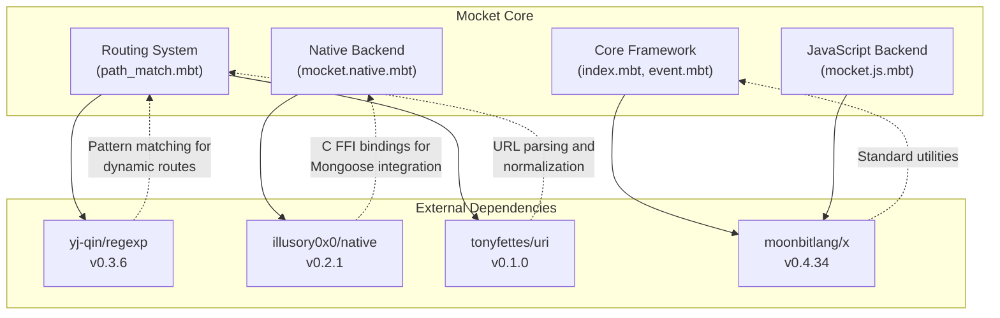
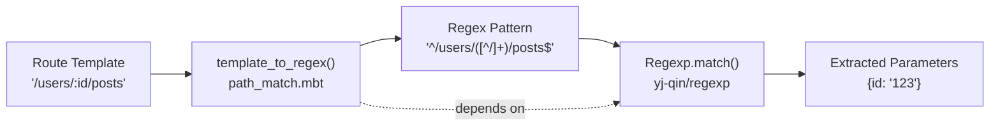
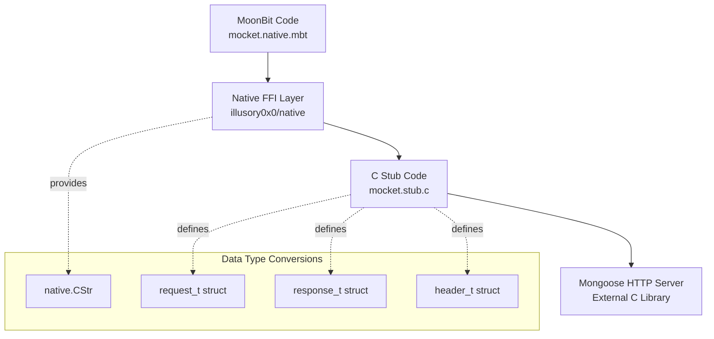
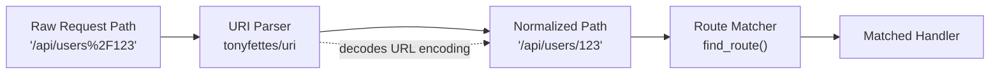
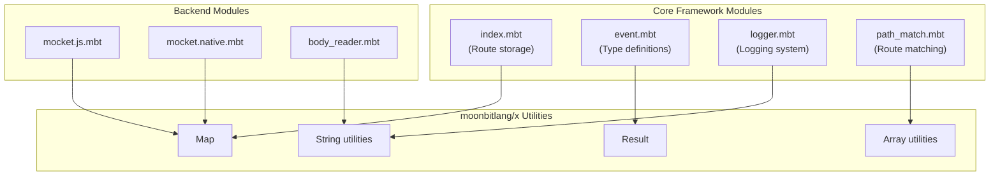
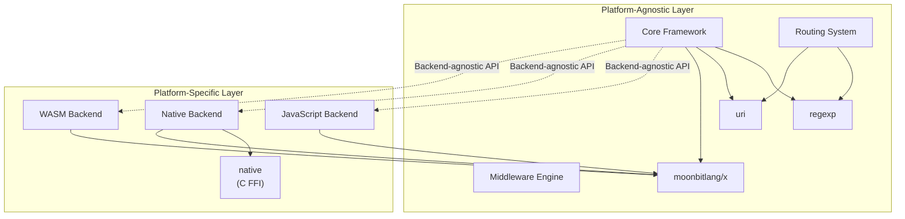

# Package Dependencies

## Purpose and Scope

This document explains the external dependencies required by the Mocket framework, their purposes, and how they integrate into the codebase. Each dependency serves a specific architectural need in Mocket's multi-backend design.

For information about the overall framework architecture, see [Overview](#1). For details on how dependencies are configured during development, see [Project Structure](#6.1).

## Dependency Overview

Mocket declares four external package dependencies in its module manifest. These dependencies provide critical functionality that would be impractical to reimplement: regular expression matching, native FFI capabilities, URI parsing, and standard library utilities.

**Dependency Declaration Structure**

The dependency manifest is located at `moon.mod.json:4-9` and uses semantic versioning for all external packages. The framework specifies exact version numbers to ensure reproducible builds across different environments.

Sources: `moon.mod.json:1-20`

## Dependency Details

### yj-qin/regexp (v0.3.6)

The `regexp` package provides regular expression pattern matching capabilities, which are essential for Mocket's dynamic routing system. This dependency enables parameterized route patterns such as `/users/:id` and wildcard routes like `/files/*`.

**Primary Usage Locations:**

The routing system converts route templates into regular expressions for runtime matching. When a static route lookup fails, the framework falls back to regex-based pattern matching on dynamic routes stored in `dynamic_routes` arrays.

The regex package is invoked during:
1. **Route Registration**: Converting parameterized paths to regex patterns
2. **Route Matching**: Testing incoming request paths against dynamic route patterns
3. **Parameter Extraction**: Capturing named groups from matched patterns

**Integration Pattern:**

Dynamic route matching follows a two-phase approach where static routes are checked first (O(1) lookup), and only if no static match is found does the system iterate through regex patterns. This design choice minimizes the performance impact of regex operations on the common case of static routes.

Sources: `moon.mod.json:5`, High-level architecture Diagram 4

### illusory0x0/native (v0.2.1)

The `native` package provides Foreign Function Interface (FFI) bindings for interacting with C code, specifically enabling the native backend's integration with the Mongoose embedded web server. This dependency is only utilized when compiling to the native target.

**Primary Usage Locations:**

The native backend (`mocket.native.mbt`) uses this package to:
- Convert MoonBit strings to C strings (`CStr` type)
- Marshal data structures between MoonBit and C representations
- Interface with C callback mechanisms from Mongoose

**Integration Pattern:**

The native backend defines internal types (`HttpRequestInternal`, `HttpResponseInternal`) that wrap C structures. The `native` package's `CStr` type bridges string representations between the MoonBit runtime and C null-terminated strings, which are required by Mongoose's API.

The FFI boundary is carefully managed to minimize unsafe operations. The native backend converts C structures to Mocket's platform-agnostic types (`HttpRequest`, `HttpResponse`) as early as possible, isolating FFI concerns to the backend implementation layer.

Sources: `moon.mod.json:6`, High-level architecture Diagrams 1, 3, and 5

### tonyfettes/uri (v0.1.0)

The `uri` package provides URI parsing and manipulation functionality. This dependency handles URL decoding, query string parsing, and path normalization in the routing system.

**Primary Usage Locations:**

The routing system uses URI parsing to:
- Normalize incoming request paths before route matching
- Extract and decode query parameters
- Handle URL-encoded path segments

**Integration Pattern:**

URI parsing occurs early in the request processing pipeline, before route matching begins. This ensures that route patterns can be written with normalized paths and that parameter extraction works correctly with URL-encoded values.

The package is particularly important for handling special characters in URLs, ensuring that routes like `/search?q=hello+world` are correctly interpreted and that path parameters containing reserved characters are properly decoded.

Sources: `moon.mod.json:8`, High-level architecture Diagram 4

### moonbitlang/x (v0.4.34)

The `moonbitlang/x` package is MoonBit's extended standard library, providing common utilities and data structures that aren't part of the core language. This is the most widely-used dependency across the Mocket codebase.

**Primary Usage Locations:**

This dependency provides foundational data structures and utilities used throughout Mocket:
- Collection types (Map, Array utilities)
- String manipulation functions
- Option/Result type utilities
- I/O abstractions

**Integration Pattern:**

The standard library dependency is pervasive and used for fundamental operations. For example:
- The `static_routes` field uses nested `Map` structures for O(1) route lookups
- The `dynamic_routes` field uses `Array` for sequential pattern matching
- Error types leverage `Result` for error propagation
- Header manipulation uses `Map` for key-value storage

Unlike the other three dependencies which serve specific architectural purposes, `moonbitlang/x` provides the basic building blocks for implementing the framework itself.

Sources: `moon.mod.json:7`, High-level architecture Diagrams 1 and 6

## Dependency Usage Matrix

The following table summarizes which components depend on each external package:

| Component | regexp | native | uri | moonbitlang/x |
|-----------|--------|--------|-----|---------------|
| Core Framework (`index.mbt`) | ✓ | — | ✓ | ✓ |
| Routing System (`path_match.mbt`) | ✓ | — | ✓ | ✓ |
| JavaScript Backend (`mocket.js.mbt`) | — | — | — | ✓ |
| Native Backend (`mocket.native.mbt`) | — | ✓ | — | ✓ |
| WASM Backend (`mocket.wasm.mbt`) | — | — | — | ✓ |
| Event Types (`event.mbt`) | — | — | — | ✓ |
| Logger (`logger.mbt`) | — | — | — | ✓ |
| Body Reader (`body_reader.mbt`) | — | — | — | ✓ |

**Key Observations:**

- `moonbitlang/x` is universally required across all modules
- `regexp` and `uri` are isolated to the routing subsystem
- `native` is exclusively used by the native backend implementation
- The JavaScript and WASM backends have no specialized dependencies beyond the standard library

Sources: `moon.mod.json:4-9`

## Dependency Isolation and Backend Portability

Mocket's architecture carefully isolates platform-specific dependencies to maintain cross-platform portability. The core framework and routing system depend only on pure MoonBit code plus the regex and URI parsing libraries, which are themselves platform-agnostic.

This isolation enables:
1. **Selective Compilation**: Native FFI code is only compiled when targeting the native backend
2. **Backend Substitution**: New backends can be added without modifying core framework code
3. **Testing Flexibility**: Core routing logic can be tested independently of backend implementations

The dependency graph demonstrates Mocket's adherence to the **Dependency Inversion Principle**, where high-level modules (core framework) do not depend on low-level modules (backend implementations), and both depend on abstractions.

Sources: `moon.mod.json:4-9`, High-level architecture Diagrams 1 and 3

## Version Management

All dependencies use semantic versioning and are pinned to specific versions in `moon.mod.json:4-9`. This ensures:

- **Reproducible Builds**: Identical builds across different machines and CI environments
- **Stability**: Protection against breaking changes in dependency updates
- **Compatibility**: Version constraints prevent incompatible dependency combinations

**Current Version Constraints:**

- `yj-qin/regexp@0.3.6`: Stable regex engine with MoonBit 0.4+ compatibility
- `illusory0x0/native@0.2.1`: Mature FFI bindings for C interop
- `moonbitlang/x@0.4.34`: Standard library matching MoonBit language version
- `tonyfettes/uri@0.1.0`: Early-stage URI parser (consider monitoring for updates)

**Dependency Update Strategy:**

When updating dependencies, consider:
1. Testing route matching behavior after `regexp` updates
2. Verifying native backend compilation after `native` or `moonbitlang/x` updates
3. Checking URI parsing edge cases after `uri` updates
4. Running the full test suite defined in the CI/CD pipeline (see [Building and Testing](#6.2))

Sources: `moon.mod.json:4-9`