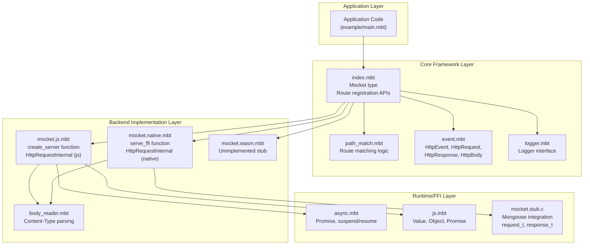
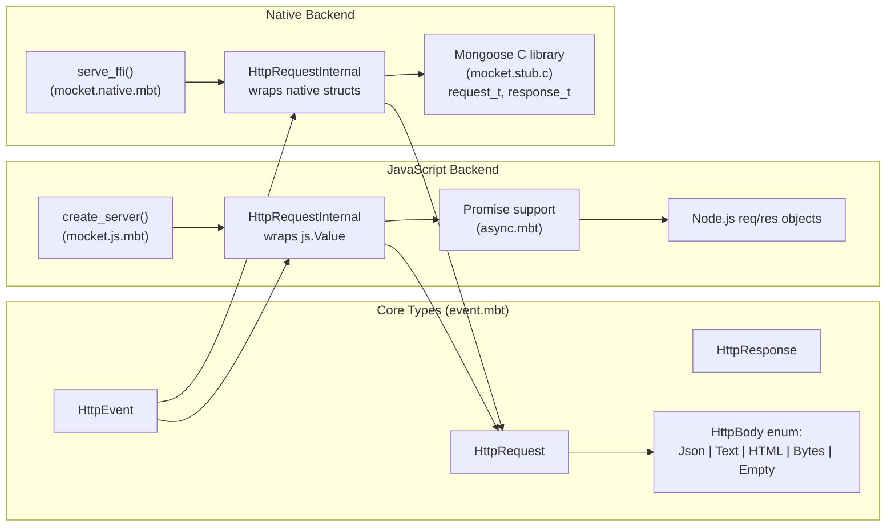
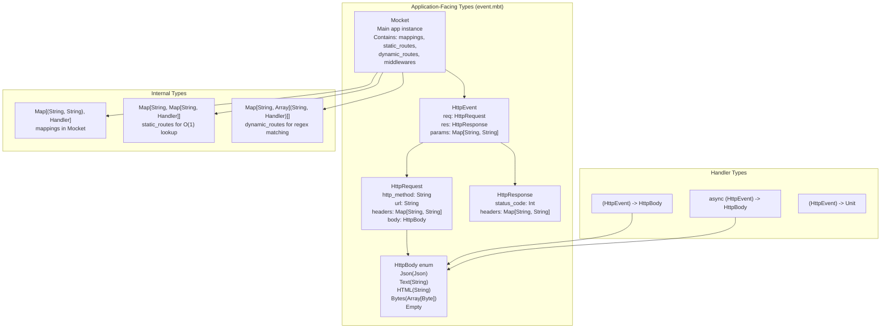
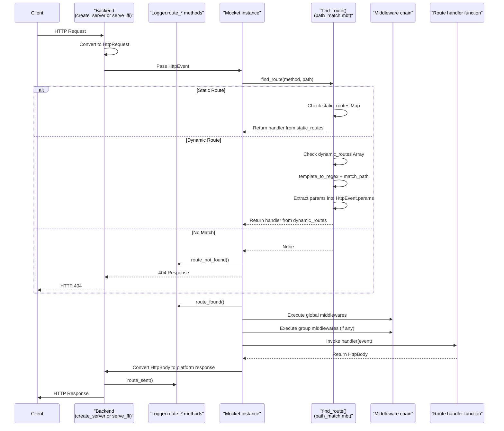

# Overview

This document provides a high-level introduction to Mocket, a multi-target HTTP server framework for MoonBit. It covers the framework's architecture, design principles, and core components. For specific implementation details, refer to the topic-specific pages: routing system ([2.1](#2.1)), middleware ([2.2](#2.2)), backend implementations ([3](#3)), and type system ([4](#4)).

## Purpose and Design

Mocket is a web framework that enables developers to write HTTP server applications in MoonBit that compile to multiple target platforms. The framework provides a unified API that works consistently across JavaScript (Node.js), native (C/Mongoose), and WASM backends.

The framework follows these design principles:

- **Backend-agnostic core**: Application code interacts only with platform-independent types and APIs
- **Zero-cost abstractions**: Static routes use O(1) lookup; dynamic routes use optimized regex matching
- **Type safety**: Comprehensive type system for requests, responses, and errors across FFI boundaries
- **Express.js-like ergonomics**: Familiar routing patterns with `get`, `post`, middleware chains, and route groups

**Sources:** [moon.mod.json:1-20](), [README.md:1-19]()

## Framework Architecture

Mocket's architecture consists of four distinct layers that maintain clear separation of concerns:



### Layer Responsibilities

| Layer | Components | Responsibilities |
|-------|-----------|------------------|
| **Application** | User code | Defines routes, handlers, middleware using core API |
| **Core Framework** | `index.mbt`, `path_match.mbt`, `event.mbt`, `logger.mbt` | Route registration, pattern matching, type definitions |
| **Backend Implementation** | `mocket.js.mbt`, `mocket.native.mbt`, `mocket.wasm.mbt` | Platform-specific server creation, request/response conversion |
| **Runtime/FFI** | `async.mbt`, `js.mbt`, `mocket.stub.c` | Platform interop, async operations, native bindings |

**Sources:** [moon.mod.json:18-19](), [README.md:14-34]()

## Multi-Backend Design

The framework achieves platform portability through a compile-time backend selection mechanism. Each backend implementation provides the same `serve` function signature but uses platform-specific internals:



### Backend Comparison

| Aspect | JavaScript Backend | Native Backend | WASM Backend |
|--------|-------------------|----------------|--------------|
| **Entry Point** | `create_server` in `mocket.js.mbt` | `serve_ffi` in `mocket.native.mbt` | Stub in `mocket.wasm.mbt` |
| **Async Model** | Promise-based (`async.mbt`) | Callback-based | Not implemented |
| **HTTP Server** | Node.js built-in | Mongoose C library | N/A |
| **FFI Types** | `js.Value`, `js.Promise` | `native.CStr`, C structs | N/A |
| **Status** | Full support | Full support | Planned |

Both JavaScript and native backends convert platform-specific request/response objects to the framework's unified `HttpEvent` type, enabling the core routing and middleware systems to remain platform-agnostic.

**Sources:** [README.md:14-34](), [moon.mod.json:19]()

## Core Type System

The framework's type system establishes a strict abstraction boundary between application code and platform-specific implementations:



### Key Type Definitions

- **`Mocket`**: The main framework instance containing route registrations, middleware chains, and the logger
- **`HttpEvent`**: Request context passed to handlers, containing `req`, `res`, and extracted `params`
- **`HttpRequest`**: Immutable request data including method, URL, headers, and parsed body
- **`HttpResponse`**: Mutable response object for setting status codes and headers
- **`HttpBody`**: Tagged union representing different response body types
- **`Handler`**: Function type `(HttpEvent) -> HttpBody` for route handlers

**Sources:** [README.md:114-195]()

## Request Processing Pipeline

The following diagram shows the complete lifecycle of an HTTP request through the framework, using actual function and type names from the codebase:



### Pipeline Stages

1. **Backend Reception**: Platform-specific server (`create_server` or `serve_ffi`) receives raw HTTP request
2. **Type Conversion**: Backend converts to `HttpRequest` and creates `HttpEvent` wrapper
3. **Route Matching**: `find_route()` in `path_match.mbt` performs two-tier lookup:
   - First checks `static_routes` Map for O(1) exact match
   - Falls back to `dynamic_routes` Array for regex pattern matching
4. **Parameter Extraction**: Dynamic routes extract `:param` and `*`/`**` wildcards into `HttpEvent.params`
5. **Middleware Execution**: Sequential execution of global and group-specific middleware
6. **Handler Invocation**: Route handler receives `HttpEvent`, returns `HttpBody`
7. **Response Conversion**: Backend converts `HttpBody` to platform-specific response format
8. **Logging**: `Logger` tracks `route_found`, `route_not_found`, and `route_sent` events

**Sources:** [README.md:114-195]()

## Package Structure

The framework's file organization reflects its layered architecture:

```
src/
├── index.mbt              # Core Mocket type, route registration API
├── event.mbt              # HttpEvent, HttpRequest, HttpResponse, HttpBody
├── path_match.mbt         # Route matching: find_route, template_to_regex
├── logger.mbt             # Logger interface and implementations
├── body_reader.mbt        # Content-Type based body parsing
│
├── mocket.js.mbt          # JavaScript/Node.js backend
├── mocket.native.mbt      # Native/Mongoose backend  
├── mocket.wasm.mbt        # WASM stub (unimplemented)
├── mocket.stub.c          # C FFI bindings for Mongoose
│
├── async.mbt              # Promise wrapper for JavaScript async
├── js.mbt                 # JavaScript interop types (Value, Promise, etc.)
│
├── moon.pkg.json          # Package configuration
└── example/
    └── main.mbt           # Example application
```

### File Responsibilities

| File | Purpose | Key Exports |
|------|---------|-------------|
| `index.mbt` | Core API surface | `Mocket` type, `new()`, `get()`, `post()`, `group()`, `serve()` |
| `event.mbt` | Type definitions | `HttpEvent`, `HttpRequest`, `HttpResponse`, `HttpBody` |
| `path_match.mbt` | Routing logic | `find_route()`, `template_to_regex()`, `match_path()` |
| `logger.mbt` | Logging abstraction | `Logger` trait, `new_debug_logger()`, `new_production_logger()` |
| `mocket.js.mbt` | JS backend | `create_server()`, JS-specific `HttpRequestInternal` |
| `mocket.native.mbt` | Native backend | `serve_ffi()`, native-specific `HttpRequestInternal` |
| `mocket.stub.c` | C FFI | `request_t`, `response_t`, `header_t` structs |
| `async.mbt` | Async support | `Promise` wrapper, `suspend`/`resume` helpers |

**Sources:** [moon.mod.json:18]()

## External Dependencies

Mocket relies on four external packages declared in `moon.mod.json`:

| Dependency | Version | Purpose |
|------------|---------|---------|
| `yj-qin/regexp` | 0.3.6 | Regular expression matching for dynamic routes (`:param`, `*`, `**`) |
| `illusory0x0/native` | 0.2.1 | Native FFI utilities (`CStr` conversions) for the native backend |
| `moonbitlang/x` | 0.4.34 | Standard library extensions (JSON handling, collections) |
| `tonyfettes/uri` | 0.1.0 | URI parsing and manipulation |

These dependencies enable core features: `regexp` powers the dynamic routing system ([2.1.2](#2.1.2)), `native` facilitates C interop for the Mongoose backend ([3.2](#3.2)), and `moonbitlang/x` provides essential data structure support.

**Sources:** [moon.mod.json:4-9]()

## Usage Example

A minimal Mocket application demonstrating the core API:

```moonbit
// From example/main.mbt
let app = @mocket.new(logger=@mocket.new_debug_logger())

app
  .use_middleware(event => println("Request: \{event.req.http_method} \{event.req.url}"))
  .get("/", _ => Text("Hello, Mocket!"))
  .get("/user/:id", event => {
    let id = event.params.get("id").unwrap_or("unknown")
    Json({ "user_id": id })
  })
  .group("/api", group => {
    group.get("/status", _ => Json({ "status": "ok" }))
  })
  .serve(port=4000)
```

This example shows:
- Creating a `Mocket` instance with a logger
- Registering global middleware via `use_middleware()`
- Static routes with `get()`
- Dynamic routes with `:param` syntax
- Route grouping with `group()`
- Server initialization with `serve()`

For complete examples, see [7](#7). For detailed API documentation, see [4](#4).

**Sources:** [README.md:113-195]()