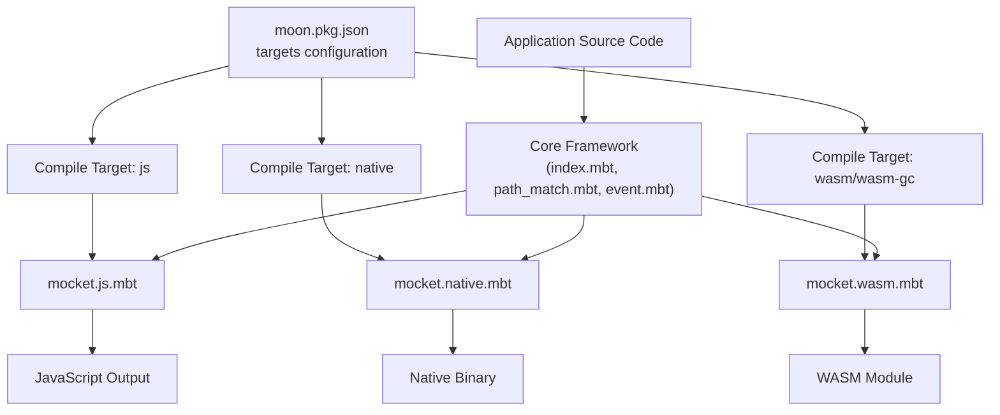
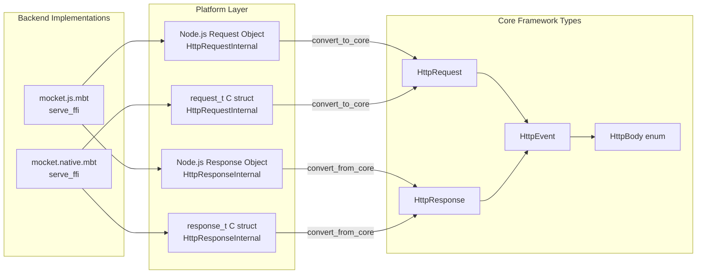
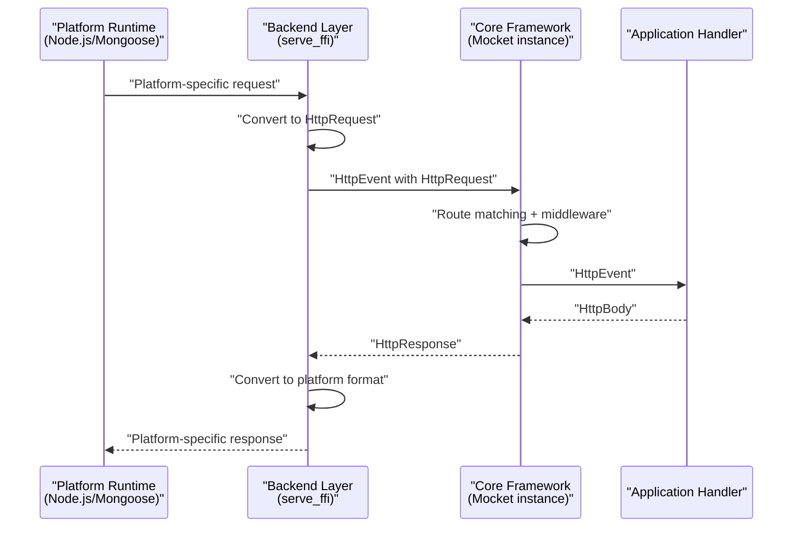

# Multi-Backend Architecture

## Purpose and Scope

This document explains Mocket's multi-target compilation strategy, which enables the same application code to run on multiple runtime platforms (JavaScript/Node.js, native C, and WebAssembly) without modification. This section covers the architecture that enables backend abstraction, the compile-time backend selection mechanism, and the type conversion boundaries between platform-specific implementations and the core framework.

For detailed implementation specifics of each backend, see [JavaScript Backend](#3.1), [Native Backend](#3.2), and [WASM Backend](#3.3). For information on how to write application code that works across all backends, see [Core Concepts](#2).

---

## Multi-Target Compilation Strategy

Mocket uses MoonBit's conditional compilation feature to provide different backend implementations while maintaining a single, unified API for application developers. Application code written against the core framework types (`HttpRequest`, `HttpResponse`, `HttpEvent`) can be compiled to any supported target without changes.

The framework achieves this through:

1. **Core framework layer** - Backend-agnostic routing, middleware, and request/response types
2. **Backend implementation layer** - Platform-specific entry points that convert between native platform types and core types
3. **Compile-time target selection** - Build system determines which backend file to include based on compilation target

### Backend Selection Configuration

The build configuration in [src/moon.pkg.json:18-29]() defines which source files are compiled for each target:

```json
"targets": {
  "mocket.js.mbt": ["js"],
  "mocket.native.mbt": ["native"],
  "mocket.wasm.mbt": ["wasm", "wasm-gc"]
}
```

This mapping ensures that:
- When compiling to JavaScript, only `mocket.js.mbt` is included
- When compiling to native, only `mocket.native.mbt` is included  
- When compiling to WASM/WASM-GC, only `mocket.wasm.mbt` is included

**Diagram: Build-Time Backend Selection**



Sources: [src/moon.pkg.json:18-29]()

---

## Core Abstraction Boundary

The key to Mocket's multi-backend architecture is a well-defined abstraction boundary. All backends must implement the same entry point signature and convert platform-specific types to the core framework's unified types.

### Unified Entry Point Signature

All backend implementations must provide a `serve_ffi` function with this signature:

```moonbit
pub fn serve_ffi(mocket : Mocket, port~ : Int) -> Unit
```

This function:
- Takes a `Mocket` instance containing all registered routes and middleware
- Binds to the specified `port`
- Starts the HTTP server using platform-specific mechanisms
- Converts incoming requests to `HttpRequest` and outgoing responses from `HttpResponse`

### Core Type System

The core framework defines backend-agnostic types that all backends must work with:

| Core Type | Purpose | Defined In |
|-----------|---------|------------|
| `Mocket` | Main application instance containing routes and middleware | `index.mbt` |
| `HttpRequest` | Unified request representation with method, path, headers, body | `event.mbt` |
| `HttpResponse` | Unified response representation with status, headers, body | `event.mbt` |
| `HttpEvent` | Request/response pair passed to handlers and middleware | `event.mbt` |
| `HttpBody` | Enumeration of response body types (Json, Text, HTML, Bytes, Empty) | `event.mbt` |

**Diagram: Type Conversion Architecture**



Sources: [src/moon.pkg.json:18-29](), [src/mocket.wasm.mbt:1-5]()

---

## Backend Comparison

Each backend provides the same functionality through different implementation strategies:

| Aspect | JavaScript Backend | Native Backend | WASM Backend |
|--------|-------------------|----------------|--------------|
| **Entry File** | `mocket.js.mbt` | `mocket.native.mbt` | `mocket.wasm.mbt` |
| **Runtime** | Node.js / Browser | C runtime via Mongoose | WebAssembly runtime |
| **HTTP Server** | Node.js `http` module | Mongoose embedded server | Not implemented (stub) |
| **Async Model** | Promise-based with suspend/resume | Callback-based | N/A |
| **FFI Layer** | JavaScript Value/Object/Promise types | C structs via native FFI | N/A |
| **Native Dependencies** | None | `mongoose.c` (vendored) | None |
| **Compilation Target** | `js` | `native` | `wasm`, `wasm-gc` |
| **Status** | Fully implemented | Fully implemented | Stub only |

### JavaScript Backend Architecture

The JavaScript backend uses Node.js's native HTTP server and provides Promise-based async operations. It defines internal wrapper types (`HttpRequestInternal`, `HttpResponseInternal`) that wrap JavaScript objects and implement conversion to core types.

**Key characteristics:**
- Integrates with Node.js event loop
- Supports async body parsing with Promises
- Uses `js.Value`, `js.Promise`, and `js.Object` for FFI

See [JavaScript Backend](#3.1) for detailed implementation.

### Native Backend Architecture

The Native backend uses the Mongoose embedded web server library, interfacing through C FFI. It uses callback-based request handling and defines C struct representations for requests and responses.

**Key characteristics:**
- Embeds Mongoose C library ([src/moon.pkg.json:14-16]())
- Uses staged processing with callbacks
- Provides zero-copy performance characteristics
- Requires native compilation toolchain

See [Native Backend](#3.2) for detailed implementation.

### WASM Backend Architecture

The WASM backend is currently a stub implementation that panics when called:

```moonbit
pub fn serve_ffi(mocket : Mocket, port~ : Int) -> Unit {
  // Unimplemented
  panic()
}
```

This backend is defined to support the `wasm` and `wasm-gc` compilation targets ([src/moon.pkg.json:25-27]()), but does not yet have a functional HTTP server implementation.

Sources: [src/mocket.wasm.mbt:1-5]()

---

## Backend Implementation Requirements

When implementing a new backend or understanding existing ones, each backend must:

1. **Implement `serve_ffi`** - Accept a `Mocket` instance and port number
2. **Start HTTP server** - Bind to the specified port using platform-specific APIs
3. **Convert incoming requests** - Transform platform HTTP request objects to `HttpRequest`
4. **Invoke routing system** - Call the core framework's route matching and handler execution
5. **Convert outgoing responses** - Transform `HttpResponse` back to platform-specific format
6. **Handle errors** - Convert framework errors to appropriate HTTP error responses

**Diagram: Request Processing Flow Across Backends**



Sources: [src/moon.pkg.json:18-29](), [src/mocket.wasm.mbt:1-5]()

---

## Design Benefits

This multi-backend architecture provides several advantages:

**Portability**: Application code is written once and runs on multiple platforms. Developers don't need to learn different APIs for different deployment targets.

**Performance Optimization**: Each backend can use platform-specific optimizations while maintaining API compatibility. The native backend can use zero-copy operations, while the JavaScript backend leverages Node.js's async I/O.

**Testing Flexibility**: Applications can be tested in the JavaScript backend during development for fast iteration, then compiled to native for production deployment.

**Gradual Migration**: The WASM backend stub ([src/mocket.wasm.mbt:1-5]()) demonstrates how new backends can be added incrementally. The stub allows code to compile for WASM targets today while the implementation is developed.

**Clear Responsibilities**: The separation between core framework logic and platform integration makes the codebase easier to maintain and extend. Changes to routing or middleware don't require modifying backend implementations.

Sources: [moon.mod.json:1-20](), [src/moon.pkg.json:1-29]()