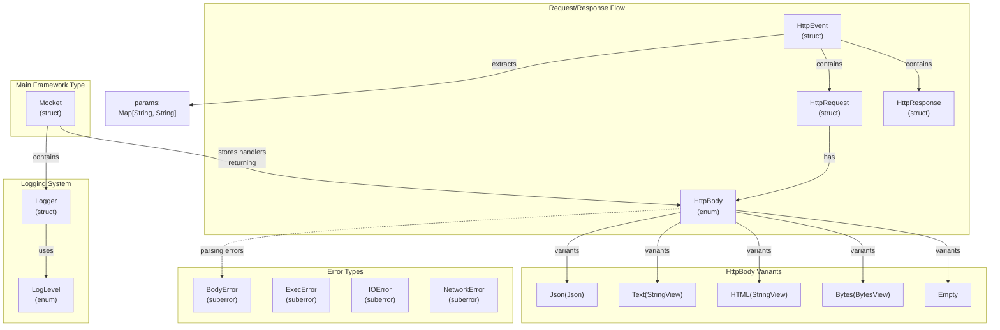
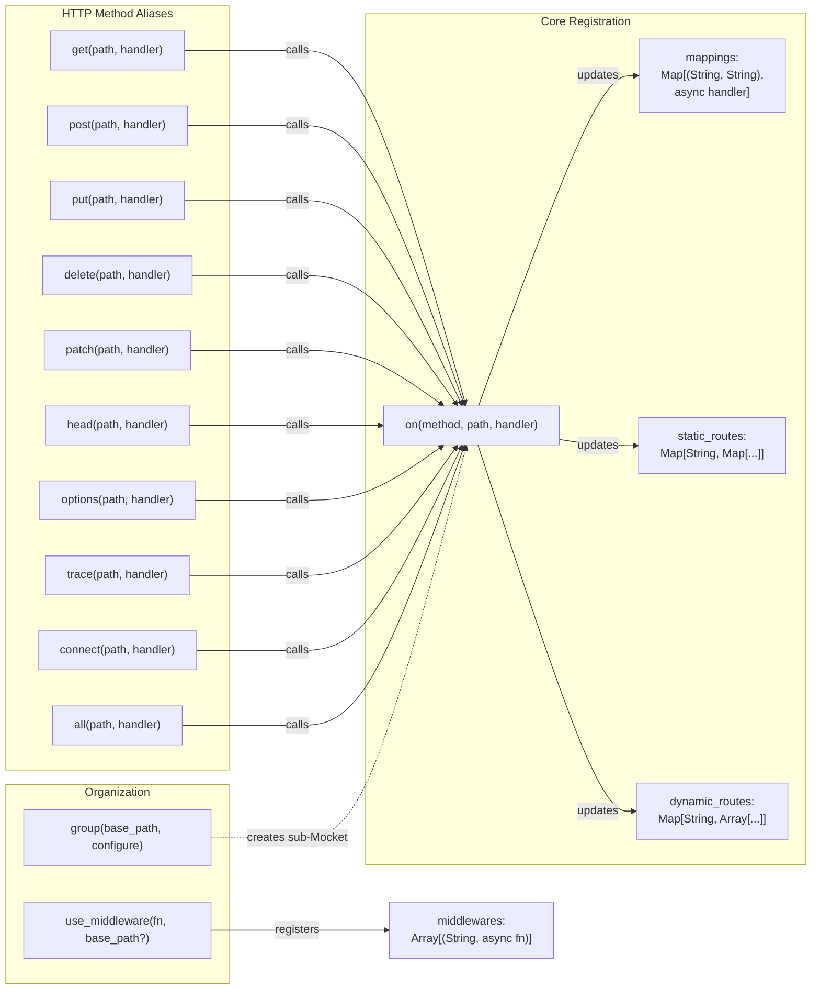
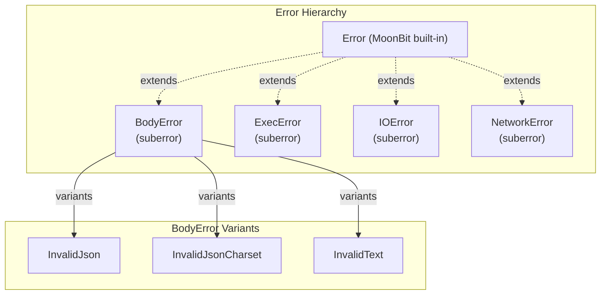

# Type System and API Reference

This page provides a comprehensive reference for all public types, functions, and their signatures in the Mocket framework. It documents the core type system that forms the foundation of request/response handling, the complete route registration API, error types, and logging utilities.

For detailed explanations of how these types are used in practice, see [Core Concepts](#2). For backend-specific type conversions and FFI details, see [Multi-Backend Architecture](#3).

## Overview

The Mocket type system is designed around a few core principles:
- **Backend-agnostic core types**: `HttpEvent`, `HttpRequest`, `HttpResponse`, and `HttpBody` provide a unified interface across all backends
- **Async-first design**: All route handlers use MoonBit's `async`/`noraise` function types
- **Strong error typing**: Explicit error types for different failure modes
- **Type-safe routing**: Route parameters are extracted into a typed `Map[String, String]`

## Core Type System Architecture

The following diagram shows the relationships between the primary types in Mocket's public API:



**Sources:** `src/pkg.generated.mbti:1-141`, `src/index.mbt:1-256`

## Type Definitions

### Mocket

The main framework struct that holds route mappings, middleware, and configuration.

```moonbit
pub(all) struct Mocket {
  base_path : String
  mappings : Map[(String, String), async (HttpEvent) -> HttpBody noraise]
  middlewares : Array[(String, async (HttpEvent) -> Unit noraise)]
  static_routes : Map[String, Map[String, async (HttpEvent) -> HttpBody noraise]]
  dynamic_routes : Map[String, Array[(String, async (HttpEvent) -> HttpBody noraise)]]
  logger : Logger
}
```

**Field Descriptions:**

| Field | Type | Purpose |
|-------|------|---------|
| `base_path` | `String` | Path prefix for all routes registered on this instance |
| `mappings` | `Map[(String, String), async (HttpEvent) -> HttpBody noraise]` | Complete registry of all routes, keyed by `(http_method, path)` |
| `middlewares` | `Array[(String, async (HttpEvent) -> Unit noraise)]` | Ordered list of middleware functions with their base paths |
| `static_routes` | `Map[String, Map[String, async (HttpEvent) -> HttpBody noraise]]` | Optimized O(1) lookup cache for exact-match routes |
| `dynamic_routes` | `Map[String, Array[(String, async (HttpEvent) -> HttpBody noraise)]]` | Routes with parameters (`:param`) or wildcards (`*`, `**`) |
| `logger` | `Logger` | Logger instance for framework diagnostics |

**Sources:** `src/index.mbt:11-27`, `src/pkg.generated.mbti:113-120`

### HttpEvent

The event object passed to route handlers and middleware, containing the request, response, and extracted route parameters.

```moonbit
pub(all) struct HttpEvent {
  req : HttpRequest
  res : HttpResponse
  params : Map[String, String]
}
```

**Field Descriptions:**

| Field | Type | Purpose |
|-------|------|---------|
| `req` | `HttpRequest` | Incoming HTTP request data |
| `res` | `HttpResponse` | Response object for setting status and headers |
| `params` | `Map[String, String]` | Route parameters extracted from dynamic routes (e.g., `:id` → `"123"`) |

**Sources:** `src/pkg.generated.mbti:57-61`

### HttpRequest

Represents an incoming HTTP request with method, URL, headers, and body.

```moonbit
pub(all) struct HttpRequest {
  http_method : String
  url : String
  headers : Map[String, String]
  mut body : HttpBody
}
```

**Field Descriptions:**

| Field | Type | Purpose |
|-------|------|---------|
| `http_method` | `String` | HTTP method (GET, POST, PUT, DELETE, etc.) |
| `url` | `String` | Request URL path (e.g., `/api/users/123`) |
| `headers` | `Map[String, String]` | HTTP request headers |
| `body` | `mut HttpBody` | Parsed request body (mutable to support lazy parsing) |

**Sources:** `src/index.mbt:48-53`, `src/pkg.generated.mbti:63-68`

### HttpResponse

Represents the HTTP response being built, allowing status code and header manipulation.

```moonbit
pub(all) struct HttpResponse {
  mut status_code : Int
  headers : Map[StringView, StringView]
}
```

**Field Descriptions:**

| Field | Type | Purpose |
|-------|------|---------|
| `status_code` | `mut Int` | HTTP status code (default: 200, mutable to allow handlers to set errors) |
| `headers` | `Map[StringView, StringView]` | Response headers to send to client |

**Sources:** `src/index.mbt:56-60`, `src/pkg.generated.mbti:75-78`

### HttpBody

An enum representing different body content types. Route handlers return this type, and request bodies are parsed into this type.

```moonbit
pub(all) enum HttpBody {
  Json(Json)
  Text(StringView)
  HTML(StringView)
  Bytes(BytesView)
  Empty
}
```

**Variant Descriptions:**

| Variant | Payload Type | Usage |
|---------|-------------|--------|
| `Json(Json)` | `Json` | JSON data structures (for API responses) |
| `Text(StringView)` | `StringView` | Plain text content |
| `HTML(StringView)` | `StringView` | HTML content (sets `Content-Type: text/html`) |
| `Bytes(BytesView)` | `BytesView` | Binary data (images, files, etc.) |
| `Empty` | (none) | No response body (e.g., 204 No Content) |

**Sources:** `src/index.mbt:2-8`, `src/pkg.generated.mbti:49-55`

## Route Registration API

The following diagram maps the public route registration functions to their underlying implementation:



**Sources:** `src/index.mbt:89-255`, `src/pkg.generated.mbti:121-134`

### Core Route Registration

#### `on(method: String, path: String, handler: async (HttpEvent) -> HttpBody noraise) -> Unit`

The fundamental route registration function. All HTTP method aliases delegate to this function.

**Parameters:**
- `method`: HTTP method string (e.g., "GET", "POST") or "*" for all methods
- `path`: Route path template (supports `:param`, `*`, and `**` patterns)
- `handler`: Async function that processes the request and returns a body

**Behavior:**
1. Prepends `self.base_path` to the provided path
2. Stores the handler in `mappings`
3. If the path contains no dynamic segments (`:`, `*`), stores in `static_routes` for O(1) lookup
4. Otherwise, stores in `dynamic_routes` for regex-based matching

**Sources:** `src/index.mbt:89-128`, `src/pkg.generated.mbti:127`

### HTTP Method Convenience Functions

All of these functions have the signature: `(self: Mocket, path: String, handler: async (HttpEvent) -> HttpBody noraise) -> Unit`

| Function | HTTP Method | Common Use Cases |
|----------|-------------|------------------|
| `get(path, handler)` | GET | Retrieve resources, list endpoints |
| `post(path, handler)` | POST | Create resources, submit forms |
| `put(path, handler)` | PUT | Update/replace entire resources |
| `patch(path, handler)` | PATCH | Partial resource updates |
| `delete(path, handler)` | DELETE | Remove resources |
| `head(path, handler)` | HEAD | Check resource existence without body |
| `options(path, handler)` | OPTIONS | CORS preflight, capability discovery |
| `trace(path, handler)` | TRACE | Diagnostic echoing |
| `connect(path, handler)` | CONNECT | Establish tunnels (rarely used) |
| `all(path, handler)` | * | Catch-all for any method |

**Sources:** `src/index.mbt:131-218`, `src/pkg.generated.mbti:121-133`

### Route Organization Functions

#### `group(base_path: String, configure: (Mocket) -> Unit) -> Unit`

Creates a route group with a common path prefix. Routes registered within the `configure` callback are automatically prefixed.

**Parameters:**
- `base_path`: Path prefix to prepend to all routes in the group
- `configure`: Callback function that receives a new `Mocket` instance for registration

**Behavior:**
1. Creates a new `Mocket` with `base_path = self.base_path + base_path`
2. Invokes `configure` callback with the new instance
3. Merges the group's `mappings`, `static_routes`, `dynamic_routes`, and `middlewares` into the parent

**Example Usage Pattern:**
```moonbit
app.group("/api", fn(api) {
  api.get("/users", handler)    // Registers /api/users
  api.post("/users", handler)   // Registers /api/users
})
```

**Sources:** `src/index.mbt:222-255`, `src/pkg.generated.mbti:125`

#### `use_middleware(middleware: async (HttpEvent) -> Unit noraise, base_path?: String) -> Unit`

Registers middleware that executes before route handlers. Middleware can modify the `HttpEvent` or perform side effects.

**Parameters:**
- `middleware`: Async function that processes the event (does not return a body)
- `base_path`: Optional path prefix; middleware only applies to routes starting with this path

**Behavior:**
- Adds the middleware to `self.middlewares` array
- Middleware executes in registration order before the matched route handler

**Sources:** `src/pkg.generated.mbti:134`

## Logger System

```mermaid
graph TB
    subgraph "Logger Configuration"
        LoggerStruct["Logger struct"]
        Enabled["enabled: Bool"]
        Level["level: LogLevel"]
    end
    
    subgraph "LogLevel enum"
        Debug["Debug"]
        Info["Info"]
        Warn["Warn"]
        Error["Error"]
    end
    
    subgraph "General Logging Methods"
        DebugFn["debug(fn() -> String)"]
        DebugStrFn["debug_str(String)"]
        InfoFn["info(fn() -> String)"]
        WarnFn["warn(fn() -> String)"]
        ErrorFn["error(fn() -> String)"]
    end
    
    subgraph "Route-Specific Methods"
        RouteRegister["route_register(method, path)"]
        RouteStatic["route_static(method, path)"]
        RouteDynamic["route_dynamic(method, path)"]
        RouteFound["route_found(method, path)"]
        RouteNotFound["route_not_found(path)"]
        RouteLookup["route_lookup(method, path)"]
        RouteAdded["route_added(path)"]
        RouteCreated["route_created(path)"]
        RouteMergeEx["route_merge_existing(method)"]
        RouteMergeNew["route_merge_new(method)"]
        RoutesAvail["routes_available(Array[String])"]
    end
    
    LoggerStruct -->|has field| Enabled
    LoggerStruct -->|has field| Level
    Level -->|variants| Debug
    Level -->|variants| Info
    Level -->|variants| Warn
    Level -->|variants| Error
    
    LoggerStruct -->|methods| DebugFn
    LoggerStruct -->|methods| InfoFn
    LoggerStruct -->|methods| WarnFn
    LoggerStruct -->|methods| ErrorFn
    LoggerStruct -->|methods| RouteRegister
```



**Sources:** `src/pkg.generated.mbti:85-111`

### Logger Type

```moonbit
pub struct Logger {
  enabled : Bool
  level : LogLevel
}

pub enum LogLevel {
  Debug
  Info
  Warn
  Error
}
```

**Logger Creation Functions:**

| Function | Signature | Purpose |
|----------|-----------|---------|
| `new_logger` | `(enabled?: Bool, level?: LogLevel) -> Logger` | Create custom logger with specific level |
| `new_production_logger` | `() -> Logger` | Create production logger (typically warnings/errors only) |
| `new_debug_logger` | `() -> Logger` | Create debug logger (all messages enabled) |

**Sources:** `src/pkg.generated.mbti:14-18`, `src/pkg.generated.mbti:85-95`

### Logger Methods Reference

#### General Logging Methods

| Method | Signature | Description |
|--------|-----------|-------------|
| `debug` | `(fn() -> String) -> Unit` | Log debug message (lazy evaluation) |
| `debug_str` | `(String) -> Unit` | Log debug message (eager evaluation) |
| `info` | `(fn() -> String) -> Unit` | Log info message |
| `warn` | `(fn() -> String) -> Unit` | Log warning message |
| `error` | `(fn() -> String) -> Unit` | Log error message |

#### Route-Specific Logging Methods

These specialized methods are used internally by the framework to track routing behavior:

| Method | Signature | When Called |
|--------|-----------|-------------|
| `route_register` | `(String, String) -> Unit` | When a route is registered via `on()` |
| `route_static` | `(String, String) -> Unit` | When a static route is added to cache |
| `route_dynamic` | `(String, String) -> Unit` | When a dynamic route is added |
| `route_found` | `(String, String) -> Unit` | When route matching succeeds |
| `route_not_found` | `(String) -> Unit` | When no route matches a request |
| `route_lookup` | `(String, String) -> Unit` | At the start of route lookup |
| `route_added` | `(String) -> Unit` | When a route is added to existing method map |
| `route_created` | `(String) -> Unit` | When a new method map is created |
| `route_merge_existing` | `(String) -> Unit` | When merging into existing routes |
| `route_merge_new` | `(String) -> Unit` | When creating new route map |
| `routes_available` | `(Array[String]) -> Unit` | Lists all available routes |

**Sources:** `src/pkg.generated.mbti:96-111`

## Error Types

Mocket defines several `suberror` types for different failure categories:



**Sources:** `src/pkg.generated.mbti:27-46`

### BodyError

Errors related to parsing request body content.

```moonbit
pub suberror BodyError {
  InvalidJsonCharset
  InvalidJson
  InvalidText
}
```

**Variants:**
- `InvalidJsonCharset`: JSON content has incorrect character encoding
- `InvalidJson`: JSON parsing failed (malformed JSON)
- `InvalidText`: Text content parsing failed

**Sources:** `src/pkg.generated.mbti:27-31`

### ExecError

Errors related to execution or process management (native backend).

```moonbit
pub suberror ExecError
```

Implements `Show` trait with `output()` and `to_string()` methods.

**Sources:** `src/pkg.generated.mbti:33-36`

### IOError

Errors related to I/O operations (file system, network I/O).

```moonbit
pub suberror IOError
```

Implements `Show` trait with `output()` and `to_string()` methods.

**Sources:** `src/pkg.generated.mbti:38-41`

### NetworkError

Errors related to network operations (connection failures, timeouts).

```moonbit
pub suberror NetworkError
```

Implements `Show` trait with `output()` and `to_string()` methods.

**Sources:** `src/pkg.generated.mbti:43-46`

## FFI Boundary Types

These types are used internally by backends to interface with platform-specific code. Application developers typically don't interact with these directly.

### HttpRequestInternal

An external type representing the platform-specific request object.

```moonbit
#external
pub type HttpRequestInternal

fn HttpRequestInternal::req_method(Self) -> String
fn HttpRequestInternal::url(Self) -> String
```

**Backend Implementations:**
- **JavaScript**: Wraps Node.js `IncomingMessage` object
- **Native**: Wraps C `request_t` struct from Mongoose

**Sources:** `src/pkg.generated.mbti:70-73`

### HttpResponseInternal

An external type representing the platform-specific response object.

```moonbit
#external
pub type HttpResponseInternal

fn HttpResponseInternal::end(Self, @js.Value) -> Unit
fn HttpResponseInternal::url(Self) -> String
```

**Backend Implementations:**
- **JavaScript**: Wraps Node.js `ServerResponse` object
- **Native**: Wraps C `response_t` struct from Mongoose

**Sources:** `src/pkg.generated.mbti:80-83`

## Server Lifecycle Functions

| Function | Signature | Purpose |
|----------|-----------|---------|
| `new` | `(base_path?: String, logger?: Logger) -> Mocket` | Create new Mocket instance |
| `serve` | `(self: Mocket, port~: Int) -> Unit` | Start server (JS backend) |
| `serve_ffi` | `(Mocket, port~: Int) -> Unit` | Start server (native backend) |
| `create_server` | `((HttpRequestInternal, HttpResponseInternal, () -> Unit) -> Unit, Int) -> Unit` | Low-level JS server creation |

**Sources:** `src/pkg.generated.mbti:10-22`, `src/pkg.generated.mbti:132`

## Type Alias

For convenience, `Mocket` is aliased as `T`:

```moonbit
pub typealias Mocket as T
```

This allows users to import the package and use `T` as a shorthand for the main type.

**Sources:** `src/pkg.generated.mbti:137`, `src/index.mbt:30`

## Summary Table: All Public Functions

| Category | Function | Parameters | Return Type |
|----------|----------|------------|-------------|
| **Initialization** | `new` | `base_path?: String, logger?: Logger` | `Mocket` |
| **HTTP Methods** | `get` | `path: String, handler: async (HttpEvent) -> HttpBody noraise` | `Unit` |
| | `post` | `path: String, handler: async (HttpEvent) -> HttpBody noraise` | `Unit` |
| | `put` | `path: String, handler: async (HttpEvent) -> HttpBody noraise` | `Unit` |
| | `patch` | `path: String, handler: async (HttpEvent) -> HttpBody noraise` | `Unit` |
| | `delete` | `path: String, handler: async (HttpEvent) -> HttpBody noraise` | `Unit` |
| | `head` | `path: String, handler: async (HttpEvent) -> HttpBody noraise` | `Unit` |
| | `options` | `path: String, handler: async (HttpEvent) -> HttpBody noraise` | `Unit` |
| | `trace` | `path: String, handler: async (HttpEvent) -> HttpBody noraise` | `Unit` |
| | `connect` | `path: String, handler: async (HttpEvent) -> HttpBody noraise` | `Unit` |
| | `all` | `path: String, handler: async (HttpEvent) -> HttpBody noraise` | `Unit` |
| **Core Registration** | `on` | `method: String, path: String, handler: async (HttpEvent) -> HttpBody noraise` | `Unit` |
| **Organization** | `group` | `base_path: String, configure: (Mocket) -> Unit` | `Unit` |
| | `use_middleware` | `middleware: async (HttpEvent) -> Unit noraise, base_path?: String` | `Unit` |
| **Server** | `serve` | `port~: Int` | `Unit` |
| | `serve_ffi` | `port~: Int` | `Unit` |
| **Logger Creation** | `new_logger` | `enabled?: Bool, level?: LogLevel` | `Logger` |
| | `new_production_logger` | `()` | `Logger` |
| | `new_debug_logger` | `()` | `Logger` |

**Sources:** `src/pkg.generated.mbti:1-141`